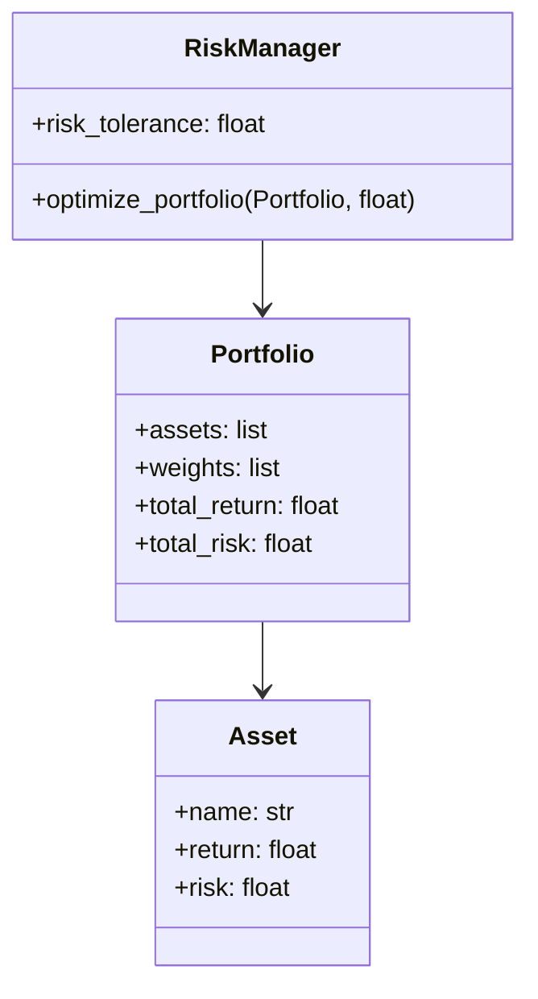
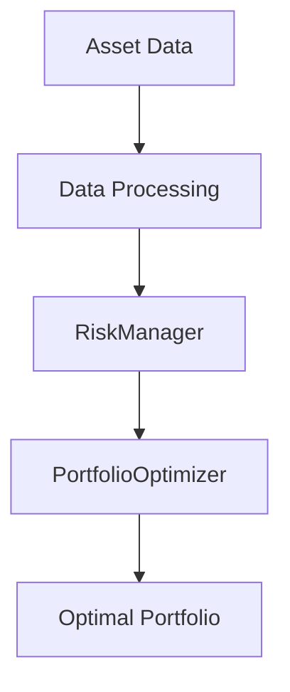

                 


# 全球资产配置：分散化投资的重要性

> 关键词：全球资产配置，分散化投资，风险管理，投资组合优化，资产类别选择

> 摘要：本文深入探讨了全球资产配置的重要性，分析了分散化投资的原理与实践。通过结合现代投资组合理论（MPT）和实际案例，本文详细阐述了如何通过科学的资产配置策略来优化投资组合，降低风险，实现长期收益最大化。文章还讨论了全球化背景下的资产配置策略，包括不同资产类别、地域和经济周期的影响，为投资者提供了实用的指导和建议。

---

## 第一章：全球资产配置的背景与重要性

### 1.1 资产配置的核心概念

#### 1.1.1 资产配置的定义
资产配置是指将资金分配到不同资产类别（如股票、债券、房地产等）中，以实现投资目标的过程。其核心在于通过多样化投资来分散风险，提高收益稳定性。

#### 1.1.2 分散化投资的原理
分散化投资是通过将资金分配到多种不同资产或资产类别中，来降低特定资产或市场的波动性风险。这种策略基于“不要将所有鸡蛋放在一个篮子里”的理念。

#### 1.1.3 全球化视角下的资产配置
在全球化背景下，投资者可以跨越国界进行资产配置，利用不同国家和地区的市场差异来优化投资组合。例如，美国市场的波动可能与新兴市场不同，通过跨国配置可以有效分散风险。

### 1.2 资产配置的重要性

#### 1.2.1 风险管理的核心工具
分散化投资是降低风险的有效手段。通过将资金分配到相关性较低的资产，投资者可以在市场波动时减少损失。

#### 1.2.2 收益优化的策略
资产配置不仅能够降低风险，还可以通过合理分配资金比例，最大化投资收益。例如，在经济增长期配置更多股票，在经济衰退期增加债券配置。

#### 1.2.3 全球化带来的机会
随着全球经济一体化的深入，投资者可以通过配置全球资产来捕捉不同市场的增长机会。例如，新兴市场的高增长潜力可以通过配置新兴市场股票来实现。

---

## 第二章：现代投资组合理论（MPT）与资产配置

### 2.1 MPT的核心原理

#### 2.1.1 风险与收益的权衡
MPT认为，投资组合的收益可以通过资产的期望收益率和方差来衡量，而优化目标是找到在相同风险下收益最高的组合，或在相同收益下风险最小的组合。

#### 2.1.2 有效前沿的概念
有效前沿是指在给定风险水平下，能够提供最高预期收益的所有投资组合的集合。通过优化算法，投资者可以找到位于有效前沿上的最佳组合。

#### 2.1.3 数学公式与实现
以下是MPT的核心公式：

$$\text{投资组合的方差} = \sum_{i=1}^{n} \sum_{j=1}^{n} w_i w_j \sigma_i \sigma_j \rho_{ij}$$

其中，\( w_i \) 和 \( w_j \) 是资产i和资产j的投资比例，\( \sigma_i \) 和 \( \sigma_j \) 是资产i和资产j的波动率，\( \rho_{ij} \) 是资产i和资产j的相关系数。

### 2.2 资产类别与相关性分析

#### 2.2.1 主要资产类别
- 股票：高风险高收益，通常与经济周期相关。
- 债券：相对稳定，与股票的相关性较低。
- 房地产：实物资产，与股票和债券的相关性较低。
- 商品：如黄金、原油等，通常在市场波动时充当避险资产。

#### 2.2.2 相关性矩阵的构建
以下是几种资产之间的相关性矩阵示例：

| 资产类型 | 股票 | 债券 | 房地产 | 商品 |
|----------|------|------|--------|------|
| 股票     | 1.0  | 0.2  | 0.3    | 0.1  |
| 债券     | 0.2  | 1.0  | 0.2    | 0.5  |
| 房地产   | 0.3  | 0.2  | 1.0    | 0.4  |
| 商品     | 0.1  | 0.5  | 0.4    | 1.0  |

### 2.3 投资组合优化的步骤

#### 2.3.1 确定投资目标
- 风险承受能力
- 收益目标
- 投资期限

#### 2.3.2 构建资产池
- 选择相关性较低的资产
- 考虑资产的流动性、税收等因素

#### 2.3.3 应用优化算法
使用均值-方差优化算法，计算出最优的资产配置比例。

#### 2.3.4 实际操作中的挑战
- 市场波动的不确定性
- 资产回报率的预测误差
- 交易成本和税收的影响

---

## 第三章：全球化视角下的资产配置策略

### 3.1 全球主要市场的风险与收益

#### 3.1.1 美国市场
- 经济发达，市场流动性高
- 股市长期表现稳定，但波动较大
- 美元资产是全球投资者的避险选择

#### 3.1.2 欧洲市场
- 经济一体化程度高
- 市场波动性较低，但债务问题较多
- 欧元区的货币政策对资产配置有重要影响

#### 3.1.3 亚洲市场
- 新兴市场增长潜力大
- 中国市场波动性较高，但长期增长趋势明显
- 日本市场老龄化问题严重，但股市估值较低

### 3.2 地缘政治与资产配置

#### 3.2.1 地缘政治风险的影响
- 贸易摩擦、政治冲突等事件会影响特定市场的表现
- 例如，中美贸易摩擦对全球供应链的影响

#### 3.2.2 如何应对地缘政治风险
- 分散投资于不同地区
- 关注多元化货币资产
- 通过ETF等方式间接投资于特定市场

### 3.3 经济周期与资产配置

#### 3.3.1 经济周期的定义
- 扩张期：经济增长，股市表现良好
- 衰退期：经济增长放缓，债券和黄金表现较好

#### 3.3.2 不同周期下的资产配置策略
- 扩张期：增加股票和房地产配置
- 衰退期：增加债券和现金配置

---

## 第四章：分散化投资的数学模型与算法实现

### 4.1 投资组合优化的数学模型

#### 4.1.1 均值-方差优化模型
$$\text{目标函数：最小化方差}$$
$$\sum_{i=1}^{n} \sum_{j=1}^{n} w_i w_j \sigma_i \sigma_j \rho_{ij}$$
$$\text{约束条件：收益目标}$$
$$\sum_{i=1}^{n} w_i r_i = R$$
$$\sum_{i=1}^{n} w_i = 1$$
其中，\( r_i \) 是资产i的期望收益率，\( R \) 是目标收益。

#### 4.1.2 风险平价策略
风险平价策略是将投资组合中的资产配置比例与其风险贡献相等化。公式如下：

$$w_i = \frac{v_i}{\sum_{j=1}^{n} v_j}$$
其中，\( v_i = \frac{\sigma_i}{\sum_{j=1}^{n} \rho_{ij} \sigma_j} \) 是资产i的风险权重。

### 4.2 算法实现

#### 4.2.1 Python代码实现
以下是使用Python实现投资组合优化的示例代码：

```python
import numpy as np
import pandas as pd
from scipy.optimize import minimize

def portfolio_variance(weights, covariance_matrix):
    return np.dot(weights.T, np.dot(covariance_matrix, weights))

def optimize_portfolio(weights, return_vector, covariance_matrix, target_return):
    def objective(weights):
        return portfolio_variance(weights, covariance_matrix)
    
    constraint = {'type': 'eq', 'fun': lambda w: np.sum(w) - 1.0}
    return minimize(objective, weights, method='SLSQP', constraints=[constraint], bounds=[(0,1)]*len(weights))

# 示例数据
returns = np.array([0.05, 0.06, 0.04])
covariance = np.array([[0.04, 0.02, 0.01],
                        [0.02, 0.06, 0.03],
                        [0.01, 0.03, 0.05]])

initial_weights = np.array([1/3, 1/3, 1/3])
result = optimize_portfolio(initial_weights, returns, covariance, target_return=0.05)

print("Optimal weights:", result.x)
```

#### 4.2.2 算法优化的注意事项
- 数据的获取与处理
- 模型假设的合理性
- 优化算法的收敛性

---

## 第五章：系统分析与架构设计

### 5.1 系统目标与功能模块

#### 5.1.1 系统目标
- 提供全球资产配置建议
- 风险评估与优化
- 实时市场数据监控

#### 5.1.2 功能模块
- 数据采集与处理
- 资产配置模型
- 风险管理模块
- 投资组合优化模块

### 5.2 系统架构设计

#### 5.2.1 类图设计


#### 5.2.2 系统架构图


---

## 第六章：项目实战与案例分析

### 6.1 项目背景

#### 6.1.1 项目目标
构建一个基于MPT的全球资产配置系统，为投资者提供分散化投资建议。

#### 6.1.2 数据来源
- 全球主要市场的指数数据
- 市场回报率与波动率

### 6.2 核心实现

#### 6.2.1 环境安装
- Python 3.8+
- NumPy, Pandas, Scipy

#### 6.2.2 核心代码实现
```python
import numpy as np

def compute_efficient_frontier(returns, covariance, num_portfolios=100):
    n = len(returns)
    frontier = []
    for _ in range(num_portfolios):
        w = np.random.dirichlet(np.ones(n), 1).flatten()
        risk = np.dot(w.T, np.dot(covariance, w))
        return_ = np.dot(w, returns)
        frontier.append((return_, risk))
    return frontier

# 示例数据
returns = np.array([0.05, 0.06, 0.04])
covariance = np.array([[0.04, 0.02, 0.01],
                        [0.02, 0.06, 0.03],
                        [0.01, 0.03, 0.05]])

frontier = compute_efficient_frontier(returns, covariance)
print(frontier)
```

#### 6.2.3 应用解读
- 通过随机生成权重，计算每个组合的收益和风险
- 绘制有效前沿曲线，帮助投资者选择最优组合

### 6.3 案例分析

#### 6.3.1 成功案例
- 某投资者通过配置股票、债券和房地产，成功在经济波动中保持稳定收益。

#### 6.3.2 失败案例
- 某投资者集中投资于科技股，导致在市场调整时损失惨重。

---

## 第七章：风险管理与最佳实践

### 7.1 风险管理的核心原则

#### 7.1.1 定期再平衡
- 根据市场变化和个人财务状况，定期调整资产配置比例。

#### 7.1.2 长期投资与耐心
- 分散化投资的效果在长期表现更为明显，短期波动不必过度关注。

### 7.2 最佳实践建议

#### 7.2.1 避免过度分散
- 过度分散可能导致收益下降，应选择相关性较低的资产。

#### 7.2.2 关注税务优化
- 合理利用税收优惠，降低投资成本。

#### 7.2.3 定期审视投资组合
- 随着市场变化和个人目标的调整，及时优化资产配置。

### 7.3 未来趋势与注意事项

#### 7.3.1 ESG投资
- 环境、社会和公司治理因素越来越受重视，ESG投资可能成为未来的重要方向。

#### 7.3.2 数字化转型
- 大数据和人工智能技术将为资产配置提供更精准的工具和方法。

---

## 第八章：总结与展望

### 8.1 全球资产配置的核心价值
- 通过分散化投资降低风险，实现长期收益最大化。

### 8.2 未来发展的方向
- 更多的科技手段应用于资产配置
- 全球市场的进一步整合与分化

---

## 附录：参考文献与工具推荐

### 附录A：参考文献
- 现代投资组合理论的相关文献
- 全球资产配置的经典书籍

### 附录B：工具推荐
- Python的Pandas和NumPy库
- 财务分析工具如Excel和Power BI
- 在线投资组合优化工具

---

## 作者：AI天才研究院/AI Genius Institute & 禅与计算机程序设计艺术 /Zen And The Art of Computer Programming

