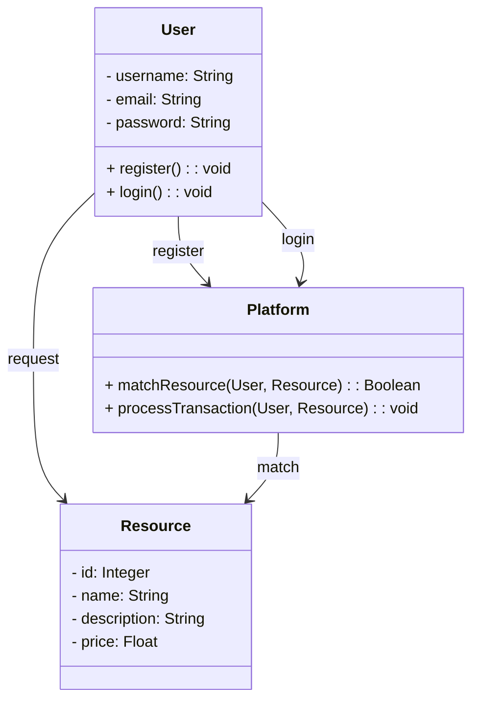
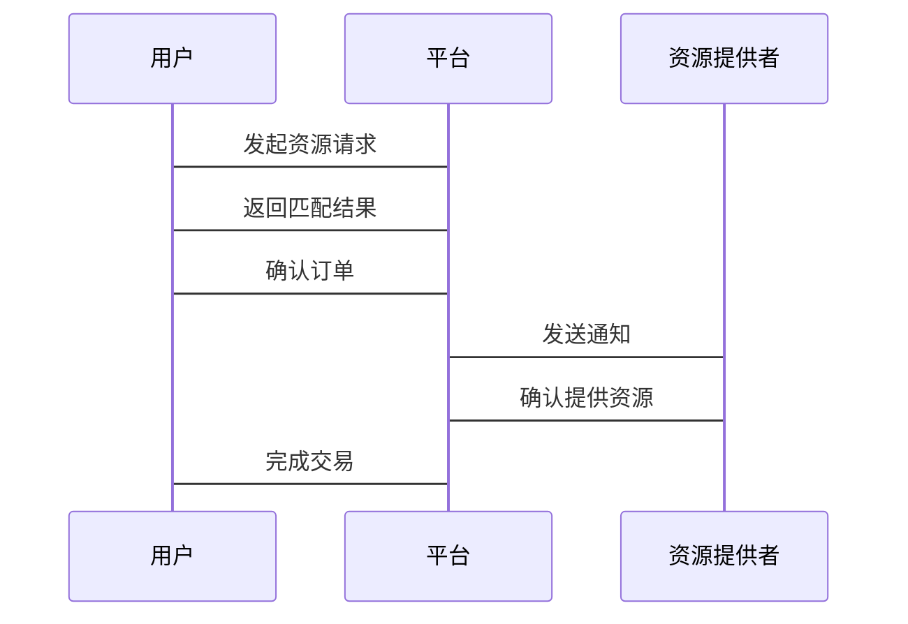

                 

<think>
好的，我现在需要帮用户撰写一篇关于《共享经济模式对传统行业的影响与投资机会》的技术博客文章。用户已经提供了详细的大纲，包括各个章节和小节的内容，每个部分都需要详细展开，使用技术性的语言，并包含代码示例、图表和公式等。

首先，我会按照用户提供的目录结构来组织文章，确保每个部分都有足够的细节和深度。文章需要逻辑清晰，结构紧凑，语言专业且易懂。

我将从摘要开始，概述文章的核心内容。然后，进入背景介绍，详细解释共享经济的起源、定义和特征，对比其与传统经济的区别。接下来，分析共享经济的核心概念，如模式、实体关系等，使用表格和ER图来展示。

在算法原理部分，我将解释匹配算法，使用mermaid流程图展示，并附上Python代码示例，解释数学模型。系统架构设计部分，我会介绍分层架构和微服务架构，用mermaid类图展示系统模块和交互流程。

投资机会分析将具体到零售业、交通、住宿等领域，分析其影响和投资策略。最后，总结共享经济的未来趋势和对传统行业的启示。

我需要确保每个章节都有足够的细节，例如在系统架构设计中，详细描述每个模块的功能和接口设计，用代码示例和图表辅助说明。同时，语言要保持技术性和专业性，但避免过于复杂，确保读者容易理解。

现在，我将按照这个结构开始撰写，确保每个部分都覆盖必要的内容，并且逻辑连贯，结构清晰。
</think>

# 共享经济模式对传统行业的影响与投资机会

> **关键词**：共享经济，传统行业，投资机会，经济模式，系统架构

> **摘要**：共享经济作为一种新兴的经济模式，正在对传统行业产生深远的影响。本文通过分析共享经济的核心概念、算法原理、系统架构以及对传统行业的具体影响，探讨其带来的投资机会。我们从背景介绍、核心概念、算法分析、系统设计、投资分析、案例实战到结论展望，全面解读共享经济模式的多维度影响。

---

# 第一部分: 共享经济模式的背景与核心概念

## 第1章: 共享经济的起源与定义

### 1.1 共享经济的起源与发展

#### 1.1.1 分享经济的起源背景
共享经济的概念起源于20世纪60年代的“共享经济”运动，强调资源的共享与协作。随着互联网技术的发展，共享经济在21世纪初逐渐兴起，尤其在移动互联网和大数据技术的支持下，共享经济模式快速普及。

#### 1.1.2 共享经济的核心理念
共享经济的核心理念是通过互联网平台，将闲置资源与需求者匹配，实现资源的高效利用和价值最大化。其本质是通过技术手段优化资源配置，降低交易成本。

#### 1.1.3 共享经济与传统经济的异同
- **相同点**：都旨在通过资源的优化配置实现经济价值。
- **不同点**：共享经济强调去中心化和平台化，传统经济依赖于中心化机构。

### 1.2 共享经济的定义与特征

#### 1.2.1 共享经济的定义
共享经济是基于互联网平台的经济模式，通过共享闲置资源，满足用户需求，实现资源的高效利用和价值创造。

#### 1.2.2 共享经济的核心特征
- **去中心化**：依赖平台而非传统中介。
- **资源闲置利用**：通过共享闲置资源创造经济价值。
- **按需分配**：用户按需获取资源，避免资源浪费。

#### 1.2.3 共享经济的边界与外延
共享经济的边界在于资源的共享必须通过互联网平台实现，而外延则包括各种共享场景，如共享住宿、共享交通等。

---

## 第2章: 共享经济的核心概念与联系

### 2.1 共享经济的模式分析

#### 2.1.1 P2P模式
P2P（点对点）模式直接连接资源提供者和需求者，例如Airbnb和滴滴出行。

#### 2.1.2 B2C模式
企业通过平台直接向消费者提供共享服务，例如共享办公空间WeWork。

#### 2.1.3 C2C模式
用户之间通过平台共享资源，例如闲置物品交易平台闲鱼。

### 2.2 共享经济的核心要素

#### 2.2.1 资源共享
资源提供者将闲置资源通过平台共享，例如共享汽车、共享办公室。

#### 2.2.2 平台角色
平台负责匹配供需、提供技术支持和交易保障，例如滴滴、Airbnb。

#### 2.2.3 用户参与
用户既是资源提供者也是消费者，参与共享经济的双向过程。

### 2.3 共享经济的实体关系图

```mermaid
erd
  title 实体关系图
  User (用户)
  Resource (资源)
  Platform (平台)
  User --> Platform: 注册/登录
  User --> Resource: 需求/供给
  Platform --> Resource: 资源匹配
```

---

# 第二部分: 共享经济模式对传统行业的具体影响

## 第3章: 共享经济对传统行业的冲击与变革

### 3.1 传统行业面临的挑战

#### 3.1.1 资源利用率低下
传统行业普遍存在资源闲置，例如空置的酒店房间、闲置的私家车。

#### 3.1.2 成本结构的优化压力
共享经济通过降低交易成本和资源浪费，对传统行业的成本结构提出挑战。

#### 3.1.3 传统商业模式的颠覆
共享经济模式打破传统行业的盈利模式，例如传统酒店业面临民宿竞争。

### 3.2 共享经济对传统行业的具体影响

#### 3.2.1 零售业
共享经济推动了闲置物品交易平台的发展，如闲鱼，改变传统零售业的商业模式。

#### 3.2.2 交通出行
共享经济催生了共享单车和共享汽车，改变了传统交通行业的格局。

#### 3.2.3 住宿与旅游
民宿平台如Airbnb颠覆了传统酒店业，提供更灵活的住宿选择。

## 第4章: 共享经济模式下的投资机会

### 4.1 共享经济的投资热点

#### 4.1.1 共享交通
共享单车和共享汽车平台的投资机会，如滴滴、ofo。

#### 4.1.2 共享住宿
民宿平台和短租平台的投资机会，如Airbnb、途家。

#### 4.1.3 共享办公
共享办公空间的投资机会，如WeWork、氪空间。

### 4.2 投资机会的分析与选择

#### 4.2.1 投资风险评估
- 市场竞争激烈，企业盈利能力不稳定。
- 用户信任和平台安全是关键因素。

#### 4.2.2 投资回报分析
- 共享经济平台具有高增长潜力，但回报周期较长。

#### 4.2.3 投资策略建议
- 选择具有强大技术和数据支持的平台。
- 关注行业整合和并购机会。

---

# 第三部分: 共享经济模式的系统分析与架构设计

## 第5章: 共享经济系统的架构设计

### 5.1 系统功能设计

#### 5.1.1 用户模块
- 用户注册、登录、发布资源、浏览需求。

#### 5.1.2 平台模块
- 资源匹配、交易处理、支付结算。

#### 5.1.3 资源提供者模块
- 资源发布、订单管理、收益查询。

### 5.2 系统架构设计



## 第6章: 共享经济系统的接口与交互设计

### 6.1 系统接口设计

#### 6.1.1 用户注册与登录
- API接口：`POST /api/register`
- 参数：`username`, `email`, `password`

#### 6.1.2 资源发布与预订
- API接口：`POST /api/resource`
- 参数：`user_id`, `resource_name`, `description`, `price`

#### 6.1.3 支付与结算
- API接口：`POST /api/payment`
- 参数：`order_id`, `amount`, `payment_method`

### 6.2 系统交互流程



---

# 结论与展望

共享经济作为一场深刻的经济变革，正在重塑传统行业的商业模式。通过优化资源配置和降低交易成本，共享经济不仅为用户提供了更灵活的服务，也为投资者带来了新的机遇。未来，随着技术的不断进步和行业的深度融合，共享经济将发挥更大的潜力，推动经济的可持续发展。

---

**作者：AI天才研究院/AI Genius Institute & 禅与计算机程序设计艺术 /Zen And The Art of Computer Programming**

---

以上是《共享经济模式对传统行业的影响与投资机会》的技术博客文章。

