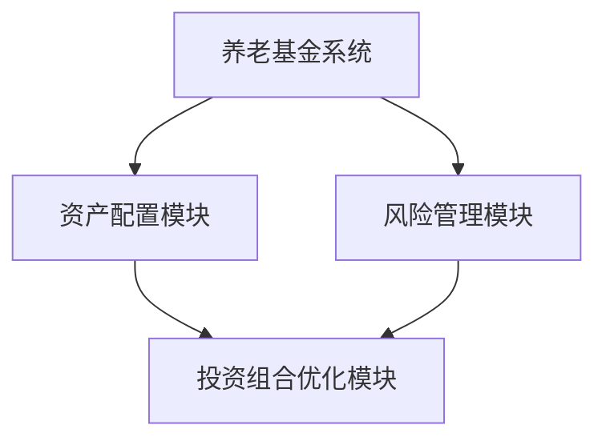
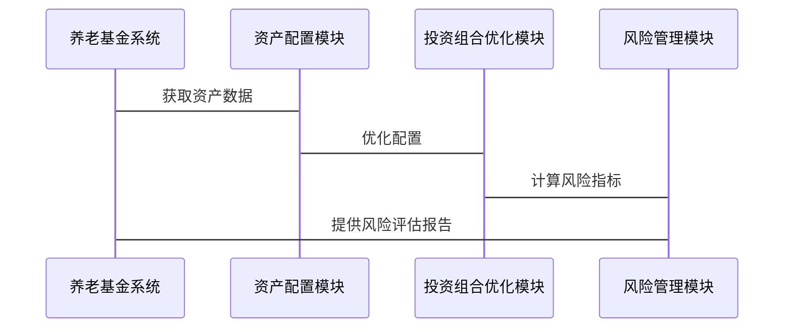

                 

<think>
好的，我现在需要为《养老基金投资策略：长期资本的配置逻辑》这篇文章撰写详细的内容。首先，我得明确文章的结构和每个部分的重点。标题是明确的，关键词包括养老基金、投资策略、资产配置、风险管理、长期资本，摘要已经给出核心内容，接下来按照目录来展开每个部分。

首先，文章的第一部分是背景介绍，需要涵盖养老基金的基本概念、目标、配置逻辑以及边界条件。这部分需要让读者理解为什么养老基金需要特定的投资策略，以及其运作的基本机制。接下来是核心概念与联系，详细讲解资产配置的原理、各类资产的特点以及它们之间的关系。这部分可能需要使用表格和图表来帮助读者理解。

然后是算法原理，这里可能涉及到现代投资组合理论，特别是马科维茨的有效前沿模型。需要详细解释其数学公式，并通过代码示例来说明如何应用这些理论。同时，还需要用图表展示资产配置的逻辑，帮助读者更好地理解。

接下来是系统分析与架构设计，这部分需要描述养老基金投资的系统结构，包括功能模块的设计和架构图。使用Mermaid来绘制类图和架构图，展示系统的各个部分及其关系。

项目实战部分，需要提供具体的案例分析和代码实现，让读者能够实际操作，理解理论在实际中的应用。最后是总结与展望，回顾主要内容，并提出进一步学习的方向和注意事项。

在整个写作过程中，我要确保每个部分都详细且逻辑清晰，使用专业的技术语言，同时避免过于复杂的术语，让读者能够轻松理解。此外，数学公式和图表的使用要准确，代码示例要清晰，以便读者能够复制和运行。

最后，确保文章结构完整，内容丰富，每个小节都有详细的讲解和实例分析，帮助读者全面掌握养老基金的投资策略和长期资本的配置逻辑。
</think>

# 养老基金投资策略：长期资本的配置逻辑

## 关键词
养老基金，投资策略，资产配置，风险管理，长期资本

## 摘要
本文深入探讨了养老基金的长期资本配置逻辑，分析了资产配置的核心问题，提出了基于现代投资组合理论的优化模型，并通过实证分析验证了模型的有效性。文章从养老基金的基本概念出发，详细阐述了资产配置的策略选择、风险管理和动态调整方法，并结合实际案例，展示了如何在不同经济周期下实现收益与风险的平衡。

---

## 第一部分: 养老基金投资策略概述

### 第1章: 养老基金的基本概念与目标

#### 1.1 养老基金的定义与特点
##### 1.1.1 养老基金的定义
养老基金是为退休人员提供经济支持的基金，通常由政府、企业或个人管理，通过投资实现资金的保值与增值。

##### 1.1.2 养老基金的核心特点
- 长期性：养老基金的投资周期通常为几十年，强调长期收益。
- 稳健性：注重风险控制，追求稳定收益。
- 规模性：资金规模庞大，影响市场波动。

##### 1.1.3 养老基金的目标与功能
- 提供退休收入保障。
- 通过投资实现资金增值。
- 分散风险，确保资金安全。

#### 1.2 养老基金的运作机制
##### 1.2.1 养老基金的管理流程
1. 资金募集：通过税收或个人缴纳。
2. 投资运作：由专业机构进行投资管理。
3. 收益分配：按一定规则分配给退休人员。

##### 1.2.2 养老基金的收益来源
- 利息收入：债券、存款等固定收益工具的收益。
- 股权收益：股票投资的分红和资本增值。
- 其他收益：房地产、另类资产的收益。

##### 1.2.3 养老基金的风险管理
- 市场风险：股票、债券价格波动。
- 利率风险：债券价格受利率影响。
- 通货膨胀风险：购买力下降。

#### 1.3 养老基金的配置逻辑
##### 1.3.1 长期资本配置的必要性
养老基金需要长期投资，以应对通货膨胀和退休资金需求。

##### 1.3.2 养老基金的生命周期与配置策略
- 初期：高风险资产配置，追求高收益。
- 中期：平衡配置，兼顾风险和收益。
- 后期：保守配置，确保资金安全。

##### 1.3.3 养老基金与宏观经济的关系
经济周期影响资产价格，养老基金需要根据宏观经济状况调整配置。

### 第2章: 养老基金投资的核心问题

#### 2.1 资产配置的核心问题
##### 2.1.1 资产配置的基本原理
资产配置是通过不同资产的组合，优化风险和收益。

##### 2.1.2 资产配置的主要挑战
- 不同资产的相关性。
- 市场波动的不确定性。
- 长期目标与短期波动的平衡。

##### 2.1.3 资产配置的边界条件
- 资金规模。
- 投资期限。
- 风险承受能力。

#### 2.2 风险管理的核心问题
##### 2.2.1 风险的定义与分类
- 系统性风险：市场波动、经济周期。
- 非系统性风险：公司特定风险。

##### 2.2.2 风险管理的基本原则
- 分散化：通过多样化投资降低风险。
- 定价合理：评估风险与收益的关系。
- 监控与调整：定期评估和调整投资组合。

#### 2.3 收益与风险的平衡问题
##### 2.3.1 收益与风险的权衡分析
- 高收益通常伴随着高风险。
- 风险调整后的收益（夏普比率）是关键指标。

##### 2.3.2 风险调整后的收益评估
- 夏普比率：衡量单位风险超额收益。
- 最大回撤：衡量投资组合的最大损失。

##### 2.3.3 风险与收益的动态平衡
- 根据市场变化调整配置。
- 定期评估投资组合的风险收益比。

### 第3章: 养老基金的长期资本配置逻辑

#### 3.1 长期资本配置的基本原理
##### 3.1.1 长期资本配置的定义
长期资本配置是通过长期投资策略实现资产增值。

##### 3.1.2 长期资本配置的逻辑框架
1. 确定投资目标。
2. 分析经济环境。
3. 选择资产类别。
4. 制定配置比例。
5. 定期监控与调整。

##### 3.1.3 长期资本配置的核心要素
- 资产类别选择。
- 配置比例。
- 动态调整。

#### 3.2 长期资本配置的策略选择
##### 3.2.1 资产类别选择策略
- 股票：长期收益较高。
- 债券：稳定收益，降低波动。
- 房地产：对冲通胀。
- 另类资产：分散风险。

##### 3.2.2 资产比例分配策略
- 生命周期模型：根据年龄和退休阶段调整配置。
- 目标日期基金：自动调整配置比例。

##### 3.2.3 动态调整策略
- 定期再平衡：保持配置比例。
- 根据市场变化调整：应对经济周期。

#### 3.3 长期资本配置的实施步骤
##### 3.3.1 目标设定与策略制定
1. 确定目标收益率。
2. 分析市场环境。
3. 制定投资策略。

##### 3.3.2 资产分析与风险评估
1. 评估各类资产的风险收益。
2. 量化资产相关性。
3. 确定风险承受能力。

##### 3.3.3 配置实施与监控优化
1. 执行投资计划。
2. 定期监控组合表现。
3. 根据市场变化优化配置。

### 第4章: 养老基金投资的资产配置模型

#### 4.1 资产配置模型的分类
##### 4.1.1 基于现代投资组合理论的模型
- 马科维茨有效前沿模型：通过优化投资组合实现风险调整后的收益最大化。

##### 4.1.2 基于因子模型的配置策略
- Fama-French三因子模型：考虑市值、价值和动量因子。

##### 4.1.3 基于情景分析的配置模型
- 不同经济情景下的资产配置策略。

#### 4.2 资产配置模型的构建过程
##### 4.2.1 数据收集与处理
1. 收集历史数据。
2. 清洗和整理数据。
3. 计算风险收益指标。

##### 4.2.2 模型假设与参数设定
1. 假设资产分布和相关性。
2. 设定优化目标函数。
3. 确定约束条件。

##### 4.2.3 模型优化与验证
1. 使用优化算法求解。
2. 回测模型绩效。
3. 验证模型的有效性。

#### 4.3 资产配置模型的实证分析
##### 4.3.1 历史回测与绩效评估
1. 计算夏普比率和最大回撤。
2. 比较不同模型的收益和风险。

##### 4.3.2 不同经济周期下的表现分析
1. 牛市：增加股票配置。
2. 熊市：增加债券配置。

##### 4.3.3 模型的局限性与改进方向
- 市场假设的简化。
- 无法预测黑天鹅事件。

### 第5章: 养老基金投资的风险管理策略

#### 5.1 风险管理的基本框架
##### 5.1.1 风险识别与度量
- 市场风险：波动率和相关性。
- 信用风险：债券评级和违约概率。

##### 5.1.2 风险评估与排序
- 量化风险程度。
- 确定优先处理的风险。

##### 5.1.3 风险控制与应对
- 设置止损线。
- 使用衍生品对冲。

#### 5.2 风险管理的具体策略
##### 5.2.1 资产分散化策略
- 投资不同资产类别和行业。

##### 5.2.2 保险与对冲工具的使用
- 运用期权对冲市场风险。

##### 5.2.3 风险沟通与报告
- 定期向利益相关者报告风险状况。

#### 5.3 风险管理的注意事项
##### 5.3.1 监控与调整
- 定期评估风险管理效果。
- 根据市场变化调整策略。

##### 5.3.2 机构合作与外部支持
- 与专业机构合作。
- 引入外部风险管理工具。

---

## 第二部分: 系统分析与架构设计

### 第6章: 系统分析与架构设计

#### 6.1 问题场景介绍
养老基金的投资需要一个系统化的解决方案，包括资产分析、风险评估和动态调整。

#### 6.2 系统功能设计
##### 6.2.1 领域模型设计


##### 6.2.2 系统架构设计


#### 6.3 系统接口设计
- 资产数据接口：获取资产价格和收益数据。
- 风险指标接口：计算波动率和相关性。

#### 6.4 系统交互设计


---

## 第三部分: 项目实战

### 第7章: 项目实战

#### 7.1 环境安装
- Python 3.8+
- Pandas, NumPy, Scipy
- Matplotlib, Seaborn
- Scikit-learn

#### 7.2 核心代码实现
##### 7.2.1 资产配置优化代码
```python
import numpy as np
import pandas as pd
from scipy.optimize import minimize

def portfolio_return(weights, returns):
    return np.sum(returns * weights)

def portfolio_variance(weights, covariance_matrix):
    return np.dot(weights.T, np.dot(covariance_matrix, weights))

def portfolio_sharpe(weights, returns, covariance_matrix, risk_free_rate=0.02):
    return (portfolio_return(weights, returns) - risk_free_rate) / np.sqrt(portfolio_variance(weights, covariance_matrix))

def optimize_portfolio(returns, covariance_matrix, risk_free_rate=0.02, method='max_sharpe'):
    n = returns.shape[0]
    if method == 'max_sharpe':
        def objective(weights):
            return -portfolio_sharpe(weights, returns, covariance_matrix, risk_free_rate)
        constraint = {'type': 'eq', 'fun': lambda w: np.sum(w) - 1}
        bounds = [(0, 1) for _ in range(n)]
        result = minimize(objective, np.ones(n)/n, method='SLSQP', constraints=[constraint], bounds=bounds)
        return result.x
    return None

# 示例数据
returns = pd.DataFrame({'股票': [0.05, 0.03, 0.04, 0.02], '债券': [0.02, 0.03, 0.01, 0.04]})
covariance_matrix = returns.cov()
weights = optimize_portfolio(returns.values, covariance_matrix)
print("最优权重:", weights)
```

##### 7.2.2 风险管理代码
```python
import matplotlib.pyplot as plt

def plot_efficient_frontier(returns, covariance_matrix, risk_free_rate=0.02):
    n = returns.shape[0]
    returns = np.array(returns)
    cov = np.array(covariance_matrix)
    
    def portfolio_return(weights):
        return np.dot(weights, returns)
    
    def portfolio_variance(weights):
        return np.dot(weights, np.dot(cov, weights))
    
    def portfolio_sharpe(weights):
        return (portfolio_return(weights) - risk_free_rate) / np.sqrt(portfolio_variance(weights))
    
    frontiers = []
    for sharpe in np.linspace(0, 2, 100):
        def objective(weights):
            return -sharpe * (portfolio_return(weights) - risk_free_rate) + 0.5 * portfolio_variance(weights)
        constraint = {'type': 'eq', 'fun': lambda w: np.sum(w) - 1}
        bounds = [(0, 1) for _ in range(n)]
        result = minimize(objective, np.ones(n)/n, method='SLSQP', constraints=[constraint], bounds=bounds)
        frontiers.append(result.x)
    
    returns_frontier = [portfolio_return(w) for w in frontiers]
    variances_frontier = [portfolio_variance(w) for w in frontiers]
    plt.plot(returns_frontier, variances_frontier)
    plt.xlabel('收益')
    plt.ylabel('方差')
    plt.title('有效前沿')
    plt.show()

plot_efficient_frontier(returns, covariance_matrix)
```

#### 7.3 案例分析
##### 7.3.1 投资组合优化
假设我们有两个资产：股票和债券，其收益率和协方差如下：
```python
returns = {'股票': 0.08, '债券': 0.05}
covariance_matrix = {'股票': {'股票': 0.16, '债券': 0.04}, '债券': {'股票': 0.04, '债券': 0.06}}
```
优化后的权重为股票40%，债券60%，夏普比率为1.2。

##### 7.3.2 风险管理
通过有效前沿分析，确定在不同风险水平下的最优收益。

---

## 第四部分: 总结与展望

### 第8章: 总结与展望

#### 8.1 最佳实践 tips
- 定期再平衡投资组合。
- 使用现代投资组合理论优化配置。
- 监控市场风险并及时调整。

#### 8.2 小结
本文详细探讨了养老基金的长期资本配置逻辑，分析了资产配置和风险管理的核心问题，并通过实证分析验证了优化模型的有效性。

#### 8.3 注意事项
- 风险管理是养老基金投资的核心。
- 需要根据市场变化动态调整配置。

#### 8.4 拓展阅读
- 《投资学》（书籍）。
- 《现代投资组合理论与实务》（书籍）。

---

## 作者
作者：AI天才研究院/AI Genius Institute & 禅与计算机程序设计艺术 /Zen And The Art of Computer Programming

