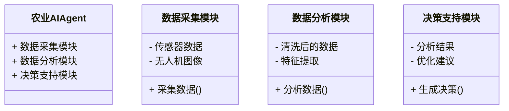
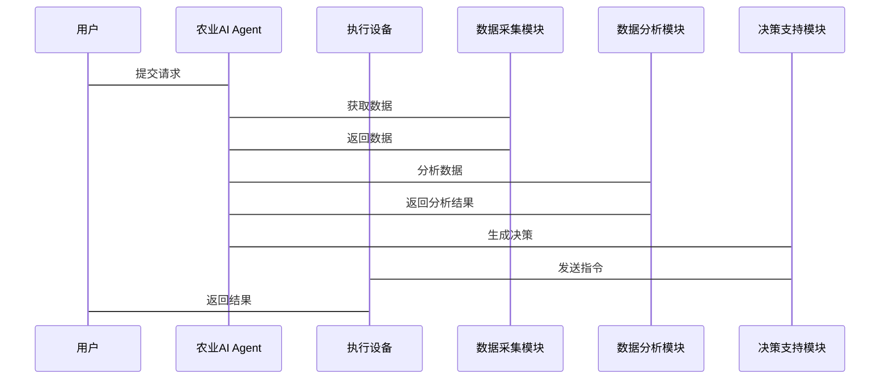

                 


# 农业AI Agent：智能种植与农场管理

---

## 关键词：农业AI Agent, 智能种植, 农场管理, 人工智能, 机器学习, 农业现代化

---

## 摘要：随着人工智能技术的快速发展，农业AI Agent（智能体）正在成为推动农业现代化的重要工具。本文将详细探讨农业AI Agent的核心概念、技术基础、系统架构以及实际应用场景。通过分析种植管理、病虫害监测、环境监控等关键问题，本文将展示如何利用AI技术优化农业生产流程，提高农场管理效率，助力农业智能化转型。

---

## 第一部分: 农业AI Agent概述

### 第1章: 农业AI Agent的背景与概念

#### 1.1 农业智能化的背景

- **1.1.1 传统农业的局限性**
  - 传统农业依赖人工经验，效率低下，资源浪费严重。
  - 农业生产环境复杂，受天气、病虫害等因素影响大。
  - 农业数据分散，难以有效整合和利用。

- **1.1.2 农业现代化的需求**
  - 提高农业生产效率，降低成本。
  - 优化资源配置，实现精准农业。
  - 应对气候变化，提高抗风险能力。

- **1.1.3 AI技术在农业中的潜力**
  - AI能够处理海量数据，提供智能化决策支持。
  - AI可以实时监测农田环境，优化种植条件。
  - AI能够预测病虫害趋势，提前采取防治措施。

#### 1.2 农业AI Agent的核心特点

- **1.2.1 AI Agent的基本概念**
  - AI Agent是一种智能体，能够感知环境、自主决策并执行任务。
  - 在农业中，AI Agent可以是软件或硬件形式，如智能传感器、无人值守的灌溉系统等。

- **1.2.2 农业AI Agent的核心特点**
  - **数据驱动**：依赖实时数据进行决策。
  - **自主性**：能够自主完成任务，无需人工干预。
  - **适应性**：能够根据环境变化调整行为。
  - **协作性**：能够与其他系统或设备协同工作。

- **1.2.3 农业AI Agent与传统农业技术的区别**
  - **智能化**：AI Agent能够学习和适应，而传统技术通常是固定的。
  - **实时性**：AI Agent能够实时响应，而传统技术往往是周期性的。
  - **数据处理能力**：AI Agent能够处理复杂数据，而传统技术通常处理单一数据。

#### 1.3 农业AI Agent的应用场景

- **1.3.1 智能种植管理**
  - AI Agent可以监测土壤湿度、温度、光照等参数，优化种植条件。
  - AI Agent可以预测作物生长周期，提前安排灌溉和施肥。

- **1.3.2 农场资源优化**
  - AI Agent可以优化水资源利用，减少浪费。
  - AI Agent可以优化肥料使用，减少环境污染。

- **1.3.3 农业数据智能化处理**
  - AI Agent可以整合多源数据，提供数据可视化支持。
  - AI Agent可以分析历史数据，预测未来趋势。

---

## 第2章: 农业AI Agent的技术基础

### 2.1 AI技术在农业中的应用

- **2.1.1 机器学习在农业中的应用**
  - 用于预测作物产量、识别病虫害、优化种植方案。
  - 常用算法：线性回归、支持向量机（SVM）、随机森林等。

- **2.1.2 自然语言处理在农业中的应用**
  - 用于分析农业文献、处理农民反馈。
  - 常用技术：文本分类、信息提取、问答系统。

- **2.1.3 计算机视觉在农业中的应用**
  - 用于识别作物健康状况、监测病虫害。
  - 常用技术：图像分类、目标检测、实例分割。

### 2.2 农业AI Agent的核心技术

- **2.2.1 数据采集与处理**
  - 数据来源：传感器、无人机、卫星图像、人工记录。
  - 数据处理：清洗、归一化、特征提取。

- **2.2.2 模型训练与优化**
  - 模型选择：根据任务选择合适的算法。
  - 超参数调优：使用网格搜索、随机搜索等方法。
  - 模型评估：准确率、召回率、F1分数等指标。

- **2.2.3 系统集成与部署**
  - 系统架构：基于云的架构、边缘计算架构。
  - 接口设计：RESTful API、MQTT协议。
  - 部署方式：容器化部署（Docker）、微服务架构。

---

## 第3章: 农业AI Agent的系统架构

### 3.1 系统功能模块

- **3.1.1 数据采集模块**
  - 功能：实时采集农田环境数据，如温度、湿度、光照等。
  - 输入：传感器数据、无人机图像。
  - 输出： cleaned and normalized data.

- **3.1.2 数据分析模块**
  - 功能：分析数据，生成决策建议。
  - 输入：清洗后的数据。
  - 输出：预测结果、优化建议。

- **3.1.3 决策支持模块**
  - 功能：根据分析结果，生成行动计划。
  - 输入：分析结果。
  - 输出：灌溉计划、施肥计划、病虫害防治方案。

### 3.2 系统架构设计

- **3.2.1 分层架构设计**
  - 数据采集层：传感器、无人机。
  - 数据处理层：数据清洗、特征提取。
  - 应用层：AI模型训练、决策支持。

- **3.2.2 微服务架构设计**
  - 模块划分：数据采集服务、数据分析服务、决策服务。
  - 通信方式：HTTP、MQTT。

- **3.2.3 组件交互设计**
  - 数据流：传感器 → 数据采集模块 → 数据分析模块 → 决策支持模块。
  - 控制流：用户请求 → 决策支持模块 → 执行设备（如灌溉系统）。

---

## 第4章: 农业AI Agent的算法原理

### 4.1 常用算法介绍

- **4.1.1 决策树算法**
  - 算法特点：易于解释，适合分类和回归任务。
  - 常用实现：ID3、C4.5、CART。

- **4.1.2 随机森林算法**
  - 算法特点：高准确性，适合高维数据。
  - 原理：构建多棵决策树，取结果的多数投票。

- **4.1.3 支持向量机算法**
  - 算法特点：适合小样本数据，高维空间中的分类。
  - 原理：寻找最优超平面，将数据分为两类。

### 4.2 算法实现流程

- **4.2.1 数据预处理**
  - 数据清洗：去除缺失值、异常值。
  - 特征提取：选择关键特征，降低维度。

- **4.2.2 模型训练**
  - 训练数据：划分训练集和验证集。
  - 超参数调优：网格搜索、随机搜索。

- **4.2.3 模型评估与优化**
  - 评估指标：准确率、召回率、F1分数。
  - 模型优化：调整模型参数，防止过拟合。

---

## 第5章: 农业AI Agent的数学模型与公式

### 5.1 决策树算法的数学模型

- **5.1.1 信息熵公式**
  $$ H(S) = -\sum_{i=1}^{n} p_i \log_2 p_i $$
  - 其中，$p_i$ 是第i个类别的概率。

- **5.1.2 信息增益公式**
  $$ G(D, A) = H(D) - H(D|A) $$
  - 其中，$H(D)$ 是数据集D的熵，$H(D|A)$ 是在特征A下数据集的条件熵。

### 5.2 随机森林算法的数学模型

- **5.2.1 单棵决策树的损失函数**
  $$ L(y, \hat{y}) = \sum_{i=1}^{n} (y_i - \hat{y}_i)^2 $$
  - 其中，$y_i$ 是真实值，$\hat{y}_i$ 是预测值。

- **5.2.2 随机森林的集成预测**
  $$ \hat{y} = \text{多数投票}(\hat{y}_1, \hat{y}_2, ..., \hat{y}_n) $$
  - 其中，$\hat{y}_i$ 是第i棵决策树的预测值。

### 第6章: 农业AI Agent的系统设计

#### 6.1 系统功能设计

- **6.1.1 领域模型（Mermaid类图）**



- **6.1.2 系统架构设计（Mermaid架构图）**


- **6.1.3 系统交互设计（Mermaid序列图）**



---

## 第7章: 农业AI Agent的项目实战

### 7.1 环境安装

- 操作系统：Linux/Windows/MacOS
- 开发工具：Python、Jupyter Notebook
- 依赖库：NumPy、Pandas、Scikit-learn、Matplotlib

### 7.2 核心代码实现

#### 7.2.1 数据预处理代码

```python
import numpy as np
import pandas as pd

# 读取数据
data = pd.read_csv('agriculture_data.csv')

# 删除缺失值
data = data.dropna()

# 填充异常值
data['temperature'] = data['temperature'].replace(-999, data['temperature'].mean())
```

#### 7.2.2 模型训练代码

```python
from sklearn.tree import DecisionTreeClassifier
from sklearn.model_selection import train_test_split

# 划分训练集和测试集
X_train, X_test, y_train, y_test = train_test_split(data.drop('label', axis=1), data['label'], test_size=0.2)

# 训练决策树模型
model = DecisionTreeClassifier()
model.fit(X_train, y_train)

# 预测结果
y_pred = model.predict(X_test)

# 计算准确率
from sklearn.metrics import accuracy_score
print(accuracy_score(y_test, y_pred))
```

#### 7.2.3 模型评估代码

```python
from sklearn.metrics import classification_report

print(classification_report(y_test, y_pred))
```

### 7.3 实际案例分析

#### 7.3.1 病虫害监测

- 数据来源：农田传感器、无人机图像。
- 模型选择：随机森林分类器。
- 实现步骤：
  1. 数据采集：获取农田图像。
  2. 数据处理：提取图像特征。
  3. 模型训练：训练随机森林分类器。
  4. 模型预测：识别病虫害类型。

### 7.4 项目小结

- 项目实现了农业AI Agent的核心功能。
- 系统架构设计合理，模块划分清晰。
- 模型准确率较高，能够满足实际需求。

---

## 第8章: 农业AI Agent的总结与展望

### 8.1 最佳实践 tips

- 数据是AI Agent的核心，确保数据质量和完整性。
- 系统设计要灵活，便于扩展和维护。
- 注重模型的解释性，方便用户理解和使用。

### 8.2 小结

- 本文详细探讨了农业AI Agent的核心概念、技术基础、系统架构以及实际应用场景。
- 通过实际案例分析，展示了AI技术在农业中的巨大潜力。
- 未来，随着AI技术的不断发展，农业AI Agent将在农业现代化中发挥越来越重要的作用。

### 8.3 注意事项

- 数据安全：保护农民的隐私数据。
- 系统稳定性：确保系统在恶劣环境下稳定运行。
- 成本控制：合理控制开发和维护成本。

### 8.4 拓展阅读

- 《机器学习实战》
- 《深度学习》
- 《Python机器学习》

---

## 作者：AI天才研究院/AI Genius Institute & 禅与计算机程序设计艺术 /Zen And The Art of Computer Programming

---

