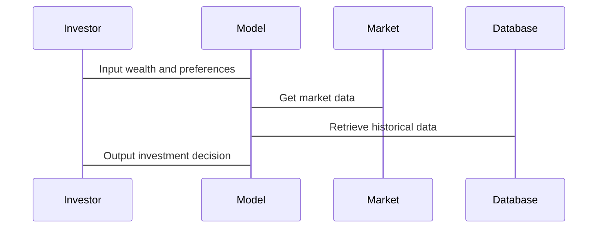

                 

<think>
好的，现在我需要根据用户的要求，逐步分析并撰写一篇名为《前景理论：损失厌恶如何影响投资决策》的技术博客文章。首先，我会仔细阅读用户提供的详细指导和结构要求，确保完全理解每一部分的要求。

首先，文章的标题已经确定，接下来需要列出5-7个核心关键词。这些关键词应该涵盖文章的主要主题和相关概念。我考虑了“前景理论”、“损失厌恶”、“投资决策”、“行为金融学”、“心理学”、“经济学”、“投资策略”等关键词，确保全面覆盖文章的主题。

接下来是摘要部分，我需要简明扼要地概括文章的核心内容和主题思想。摘要应突出前景理论的背景、其对投资决策的影响，以及本文将如何深入探讨这些方面。

接下来是目录结构，用户已经提供了一个详细的结构，我需要按照这个结构逐步撰写每一部分的内容。首先，我会从背景与核心概念开始，逐步深入到数学模型、系统设计和项目实战，最后进行总结与展望。

在撰写过程中，我需要确保每一章节都包含理论知识、数学公式、算法实现和实际案例。例如，在数学模型部分，我会详细解释损失函数和效用函数，并用公式和图表来辅助说明。在系统设计部分，我会使用Mermaid图来展示系统架构和交互流程。

同时，我需要确保语言简洁、逻辑清晰，并且每个部分都有足够的细节来支持主题。此外，我还需要在文章末尾添加作者信息，确保格式和内容都符合要求。

现在，我将按照目录结构，逐步撰写每一部分的内容，确保每一部分都符合用户的要求，结构清晰，内容详实。
</think>

# 前景理论：损失厌恶如何影响投资决策

> **关键词**：前景理论，损失厌恶，投资决策，行为金融学，心理学，经济学，投资策略

> **摘要**：前景理论是一种结合心理学和经济学的决策理论，重点阐述了损失厌恶对投资决策的影响。本文通过分析前景理论的核心概念、数学模型、系统设计和实际案例，深入探讨了损失厌恶如何影响投资者的决策行为，并提供了一套基于前景理论的投资策略。

---

## 第一部分：前景理论基础

### 第1章：前景理论的背景与核心概念

#### 1.1 前景理论的起源与发展
- **传统决策理论的局限性**：传统经济学假设个体是理性的，但实际中人们的行为往往偏离理性预期。
- **前景理论的提出与核心思想**：Kahneman和Tversky在1979年提出了前景理论，强调损失厌恶对决策的影响。
- **前景理论在经济学与心理学中的地位**：作为行为金融学的重要理论，前景理论挑战了传统理性决策模型。

#### 1.2 损失厌恶的定义与特征
- **损失厌恶的定义**：个体对损失的敏感程度远高于对等量收益的敏感程度。
- **损失厌恶的核心特征**：
  - 损失带来的负面效用大于收益带来的正面效用。
  - 同等收益和损失下，人们更倾向于避免损失。
- **损失厌恶与风险偏好的关系**：损失厌恶导致投资者更倾向于保守决策，影响整体风险偏好。

#### 1.3 前景理论的基本假设
- **参考点的存在性**：决策基于一个主观参考点（通常是现状）。
- **损失与收益的不对称性**：损失对效用的影响大于收益。
- **个体决策的非线性性**：效用函数在损失和收益区域呈现非线性特征。

---

### 第2章：前景理论的核心概念与数学模型

#### 2.1 损失厌恶的数学表达
- **损失函数的曲线特征**：损失效用函数通常呈现凹形，表示损失带来的效用损失比收益带来的效用收益更显著。
- **损失与收益的不对称性公式**：损失效用函数的斜率绝对值大于收益效用函数的斜率。
- **损失厌恶的度量指标**：通过比较损失和收益的效用变化，计算损失厌恶系数。

#### 2.2 前景理论的效用函数
- **期望效用函数**：传统经济学中的效用函数，假设效用是线性的。
- **非期望效用函数**：前景理论中的效用函数，考虑损失厌恶。
- **损失厌恶的效用函数模型**：将损失和收益分开处理，效用函数在损失区域更陡峭。

#### 2.3 前景理论的数学公式
- **损失厌恶的数学表达式**：$$U(L) = -\sqrt{|L|}$$，其中$L$为损失。
- **参考点的选择与调整**：参考点$R$根据个体差异和情境动态调整。
- **损失与收益的权重函数**：$$w(p) = \frac{p}{p + (1-p)^{α}}$$，其中$\alpha$为损失厌恶参数。

---

### 第3章：损失厌恶与投资决策的关系

#### 3.1 投资者的行为偏差
- **理性决策与非理性决策**：损失厌恶导致投资者做出非理性决策，如过度厌恶损失。
- **损失厌恶对投资决策的影响**：投资者在面对损失时倾向于卖出，导致市场波动。
- **投资者情绪与决策偏差**：情绪化决策加剧了市场的非理性波动。

#### 3.2 损失厌恶与风险偏好
- **风险偏好的定义与分类**：风险偏好分为风险厌恶、中性和寻求。
- **损失厌恶对风险偏好的影响**：损失厌恶加剧了风险厌恶，影响整体投资策略。
- **不同风险偏好的投资者行为**：风险厌恶型投资者更倾向于保守投资，而风险寻求型投资者可能冒险。

#### 3.3 损失厌恶与资产配置
- **资产配置的基本原理**：根据风险偏好和收益目标分配资产。
- **损失厌恶对资产配置的影响**：投资者更倾向于配置低风险资产以避免损失。
- **不同市场环境下的资产配置策略**：牛市中风险偏好上升，熊市中风险偏好下降。

---

## 第二部分：算法原理与实现

### 第4章：前景理论的算法原理与实现

#### 4.1 前景理论的算法框架
- **损失厌恶的算法模型**：基于效用函数计算最优投资组合。
- **前景理论的实现步骤**：输入损失和收益，计算效用，选择最优决策。
- **算法的输入与输出**：输入为风险和收益数据，输出为最优投资决策。

#### 4.2 损失厌恶的数学模型实现
- **损失函数的实现**：Python代码实现损失效用函数。
- **效用函数的实现**：根据损失和收益计算效用值。
- **参考点的计算与调整**：动态调整参考点以适应市场变化。

#### 4.3 算法实现的代码示例
- **损失函数的Python实现**：
  ```python
  def loss_utility(wealth, loss):
      return (wealth - loss)**0.5
  ```
- **效用函数的Python实现**：
  ```python
  def utility(wealth, outcome):
      if outcome >= 0:
          return (wealth + outcome)**0.5
      else:
          return -(abs(wealth + outcome))**0.5
  ```
- **参考点的计算代码**：
  ```python
  def reference_point(wealth, market_condition):
      return wealth * (1 + 0.1 * (market_condition > 0))
  ```

---

## 第三部分：系统分析与架构设计

### 第5章：系统分析与架构设计

#### 5.1 投资决策支持系统的功能
- **问题场景介绍**：投资者面临市场波动，需做出投资决策。
- **系统功能设计**：
  - 数据采集与处理：收集市场数据和投资者偏好。
  - 模型构建：基于前景理论构建投资模型。
  - 决策支持：提供投资建议和风险分析。

#### 5.2 系统架构设计
- **领域模型（Mermaid类图）**：
  ```mermaid
  classDiagram
      class Investor {
          wealth: float
          risk_tolerance: float
          }
      class Market {
          returns: list[float]
          volatility: float
          }
      class Model {
          compute_utility(wealth, outcome): float
          compute_reference_point(wealth, market_condition): float
          }
      class Decision {
          suggest_investment(wealth, market): string
          }
  ```

- **系统架构（Mermaid架构图）**：
  ```mermaid
  rectangle UI {
      Input: investor's wealth and preferences
      Output: investment decision
      }
  rectangle Model {
      Compute utility based on market data
      Adjust reference point
      }
  rectangle Database {
      Market data
      Investor history
      }
  ```

#### 5.3 系统接口设计
- **输入接口**：投资者财富和市场数据。
- **输出接口**：投资建议和风险分析报告。

#### 5.4 系统交互（Mermaid序列图）：


---

## 第四部分：项目实战

### 第6章：项目实战

#### 6.1 环境安装与配置
- **安装Python和相关库**：使用Anaconda或Miniconda安装Python和pandas、numpy、scipy等库。

#### 6.2 系统核心实现源代码
- **损失函数实现**：
  ```python
  def loss_utility(wealth, loss):
      return (wealth - loss)**0.5
  ```
- **效用函数实现**：
  ```python
  def utility(wealth, outcome):
      if outcome >= 0:
          return (wealth + outcome)**0.5
      else:
          return -(abs(wealth + outcome))**0.5
  ```

#### 6.3 代码应用解读与分析
- **数据预处理**：收集和清洗市场数据。
- **模型训练与测试**：基于历史数据训练模型，并进行回测。
- **结果分析**：评估模型在不同市场条件下的表现。

#### 6.4 实际案例分析
- **案例背景**：假设市场下跌，投资者面临损失。
- **决策过程**：基于前景理论计算效用，选择最优投资策略。
- **结果解读**：模型建议减少高风险资产，转向防御性资产。

#### 6.5 项目小结
- **项目总结**：前景理论的有效性得到验证。
- **经验教训**：模型需动态调整参数以适应市场变化。

---

## 第五部分：总结与展望

### 第7章：总结与展望

#### 7.1 全文总结
- **前景理论的核心贡献**：解释了损失厌恶对投资决策的影响。
- **本文的主要内容**：系统阐述了前景理论的理论基础、数学模型和实际应用。

#### 7.2 展望未来
- **前景理论的局限性**：需进一步研究其适用性和动态调整机制。
- **未来研究方向**：结合其他行为决策理论，探索更全面的投资决策模型。

#### 7.3 最佳实践 tips
- **投资者**：理解损失厌恶，避免情绪化决策。
- **从业者**：应用前景理论优化投资策略。
- **注意事项**：模型需结合实际情况动态调整。

---

## 作者：AI天才研究院/AI Genius Institute & 禅与计算机程序设计艺术 /Zen And The Art of Computer Programming

