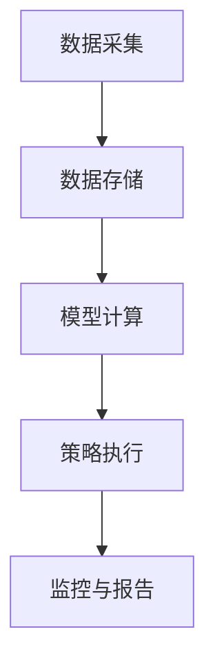

                 

<think>
好，我现在需要根据用户的任务来撰写一篇关于动态资产配置的博客文章，标题是《动态资产配置：根据市场环境调整投资策略》。用户已经提供了目录大纲，现在我需要按照这个大纲来展开每一部分的内容，确保逻辑清晰、结构紧凑、语言专业且简单易懂。

首先，我要明确文章的结构：

1. **引言**：介绍动态资产配置的基本概念、重要性及其在投资管理中的作用。
2. **市场环境分析**：分析宏观经济、行业和市场情绪对资产配置的影响。
3. **策略模型**：讲解均值-方差模型、Black-Litterman模型和风险平价模型。
4. **策略实施**：讨论动态调整、再平衡和交易执行的具体方法。
5. **系统架构与实现**：介绍动态资产配置系统的数据源、算法实现和系统架构。
6. **项目实战**：通过案例分析展示策略的实际应用。
7. **最佳实践与总结**：总结全书内容，并提供实用建议。

接下来，我需要为每个部分添加详细的内容，确保覆盖所有必要的知识点，并使用用户指定的格式，如Mermaid图和Latex公式。

**第一步：撰写引言部分**

在引言中，我需要定义动态资产配置，解释其重要性，并概述文章结构。这部分需要简洁明了，帮助读者理解为什么要关注动态资产配置。

**第二步：市场环境分析**

分析宏观经济指标、行业趋势和市场情绪对投资决策的影响。这部分需要结合实际例子，说明如何根据市场变化调整资产配置。

**第三步：策略模型**

详细介绍三种主要的资产配置模型：均值-方差模型、Black-Litterman模型和风险平价模型。每个模型都需要解释其数学公式，并通过表格对比它们的优缺点。

**第四步：策略实施**

讨论如何在实际操作中进行动态调整，包括再平衡机制和交易执行策略。这部分需要提供具体的步骤和方法，使读者能够应用这些策略。

**第五步：系统架构与实现**

展示如何构建一个动态资产配置系统，包括数据源、算法实现和系统架构。使用Mermaid图来展示系统架构和算法流程，使内容更直观。

**第六步：项目实战**

通过一个实际案例分析，展示如何应用动态资产配置策略，并解释代码实现和结果。这将帮助读者更好地理解和应用所学知识。

**第七步：最佳实践与总结**

总结全书内容，提供实用的建议和注意事项，并建议进一步的阅读资料。这部分要简洁有力，帮助读者巩固所学知识。

在撰写过程中，我需要确保每个部分都详细且有条理，同时使用正确的格式，如Latex公式和Mermaid图。这将使文章更具专业性和可读性。

现在，我将按照上述结构开始撰写每一部分的内容，确保覆盖所有必要的细节，并满足用户的格式要求。
</think>

# 动态资产配置：根据市场环境调整投资策略

**关键词**：动态资产配置、市场环境、投资策略、资产调整、风险管理

**摘要**：本文详细探讨了动态资产配置的核心概念、策略模型、系统架构及其在实际投资中的应用。通过分析宏观经济环境、行业趋势和市场情绪，本文为投资者提供了根据市场变化调整投资策略的有效方法。文章还介绍了多种资产配置模型，并通过实际案例展示了如何构建和优化动态资产配置系统。

---

## 第一部分: 动态资产配置引论

### 第1章: 动态资产配置概述

#### 1.1 动态资产配置的定义与特点
动态资产配置是一种投资策略，通过定期调整投资组合中的资产比例，以适应市场环境的变化，优化风险和收益。其特点包括灵活性、数据驱动和动态性。

#### 1.2 动态资产配置的重要性
在市场波动加剧的情况下，动态资产配置能够帮助投资者及时调整策略，降低风险，抓住投资机会。

#### 1.3 动态资产配置的应用场景
适用于不同市场周期和投资者需求，特别适合风险厌恶型投资者和长期投资者。

---

## 第二部分: 市场环境分析

### 第2章: 宏观经济环境分析

#### 2.1 宏观经济指标对资产配置的影响
- **GDP增长率**：高增长通常伴随股市上涨，低增长可能导致债券需求增加。
- **利率水平**：低利率环境下，债券收益率下降，可能转向股票或其他风险资产。
- **通货膨胀率**：高通胀可能推高商品和房地产价格，需调整投资组合。

#### 2.2 行业分析与市场趋势
- **行业周期分析**：周期性行业（如制造业）在经济扩张期表现较好，防御性行业（如公用事业）在衰退期更具稳定性。
- **市场趋势预测**：利用技术分析和基本面分析预测行业趋势。

#### 2.3 市场情绪与投资者行为分析
- **投资者情绪**：贪婪和恐惧影响市场波动，情绪指标（如VIX指数）可用于辅助决策。
- **行为金融学**：解释投资者行为偏差，帮助制定更理性的资产配置策略。

---

## 第三部分: 策略模型

### 第3章: 动态资产配置模型

#### 3.1 均值-方差模型
- **数学公式**：目标是最小化方差，公式为：$$ \min_w w^T \Sigma w $$
  其中，Σ是协方差矩阵，w是权重向量。
- **优点**：简单有效，适用于风险厌恶型投资者。
- **缺点**：假设资产收益为正态分布，实际可能不成立。

#### 3.2 Black-Litterman模型
- **数学公式**：通过整合投资者观点和市场均衡状态，构建最优组合。
- **优点**：结合市场观点和风险偏好，提供更灵活的解决方案。
- **缺点**：计算复杂，需要专业知识。

#### 3.3 风险平价模型
- **数学公式**：调整资产权重，使各资产的风险贡献相等。
- **优点**：分散风险，减少尾部风险影响。
- **缺点**：对风险管理的要求较高。

#### 3.4 模型对比
| 模型             | 优点                       | 缺点                       |
|------------------|----------------------------|---------------------------|
| 均值-方差        | 简单有效                   | 假设正态分布               |
| Black-Litterman  | 结合市场观点               | 计算复杂                   |
| 风险平价         | 分散风险                   | 需要专业风险管理            |

---

## 第四部分: 策略实施

### 第4章: 动态资产配置的实施步骤

#### 4.1 资产配置的动态调整
- **步骤**：分析市场变化，调整资产权重，监控效果。

#### 4.2 资产再平衡
- **方法**：定期检查，调整偏离目标比例的资产，通常每季度或半年进行一次。

#### 4.3 交易执行策略
- **策略**：利用算法交易减少市场冲击，优化执行成本。

---

## 第五部分: 系统架构与实现

### 第5章: 动态资产配置系统的构建

#### 5.1 系统架构设计
- **模块**：数据采集、模型计算、策略执行、监控与报告。
- **架构图**：


#### 5.2 数据源与接口
- **数据源**：金融市场数据API，如Yahoo Finance或Alpha Vantage。
- **接口设计**：API调用，数据清洗与预处理。

---

## 第六部分: 项目实战

### 第6章: 动态资产配置案例分析

#### 6.1 案例分析：2020年新冠疫情市场
- **背景**：疫情导致市场剧烈波动，投资者需调整资产配置。
- **策略实施**：增加现金比例，减少股票持仓，转向防御性资产如债券和黄金。

#### 6.2 代码实现
```python
import numpy as np
import pandas as pd
from optimization import mean_variance_optimization

# 数据加载
returns = pd.read_csv('market_returns.csv')

# 优化模型
weights = mean_variance_optimization(returns, risk_aversion=0.05)

# 输出结果
print("最优权重:", weights)
print("预期收益:", np.sum(weights * returns.mean()))
print("风险:", np.sqrt(weights.T @ returns.cov() @ weights))
```

#### 6.3 结果分析
- **结果**：通过优化模型，调整后的投资组合在疫情期间表现出更低的波动性和稳定的收益。

---

## 第七部分: 最佳实践与总结

### 第7章: 总结与建议

#### 7.1 本章小结
动态资产配置是一种有效的投资策略，能够帮助投资者应对市场变化，优化投资回报。

#### 7.2 最佳实践
- **定期审查**：定期评估投资组合，根据市场变化进行调整。
- **风险管理**：使用适当的风险管理工具，如风险平价模型。
- **专业工具**：利用金融软件和API进行数据处理和模型计算。

#### 7.3 注意事项
- **市场预测的不确定性**：避免过度依赖市场预测，保持灵活性。
- **费用与流动性**：考虑交易费用和资产流动性对投资组合的影响。

#### 7.4 拓展阅读
推荐书籍和文章，深入学习动态资产配置和投资组合管理。

---

**作者：AI天才研究院 & 禅与计算机程序设计艺术**

---

这篇文章系统地介绍了动态资产配置的理论与实践，通过详细的内容和实际案例，帮助投资者掌握根据市场环境调整投资策略的方法。

