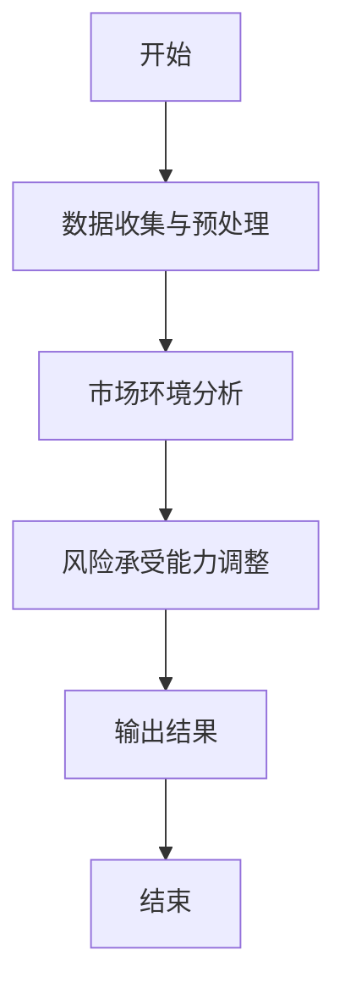
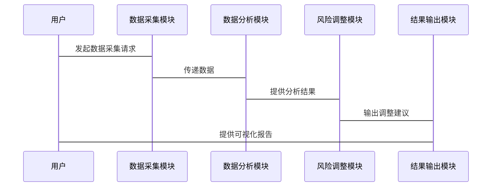

                 

<think>
好的，我现在需要帮助用户撰写一篇关于“动态风险预算：根据市场环境调整风险承受能力”的技术博客文章。用户希望文章结构清晰，内容详尽，涵盖从背景介绍到项目实战的各个方面，并且要使用专业且易懂的语言。

首先，我会先理解动态风险预算的概念，确保自己对这个主题有足够的了解。动态风险预算是一种根据市场环境变化调整风险承受能力的方法，适用于金融投资、项目管理等多个领域。它不同于静态预算，能够实时适应市场波动，帮助组织做出更灵活的决策。

接下来，我需要规划文章的结构。用户已经给出了一个详细的目录大纲，包括背景介绍、核心概念、算法、数学模型、系统架构、项目实战和最佳实践。我需要按照这个大纲逐步展开每个部分的内容。

在撰写背景介绍部分时，我应该解释为什么动态风险预算重要，以及它在当前市场中的应用。这部分需要吸引读者，让他们理解主题的重要性。核心概念部分需要详细解释相关术语和原理，可能包括风险承受能力的定义、动态调整的机制等。

算法部分需要介绍动态调整的具体方法，比如使用数学模型来计算风险承受能力的变化。这里可能需要使用mermaid流程图来展示算法步骤，并附上Python代码示例。数学模型和公式是关键部分，我需要详细推导并解释，可能涉及到市场波动率、资产配置等变量。

系统架构部分需要设计一个完整的系统，包括功能模块的设计、架构图的绘制，以及接口和交互流程的描述。项目实战部分需要提供一个具体的案例，从环境安装到代码实现，再到案例分析，帮助读者实际应用所学知识。

最后，最佳实践部分应该包括小结、注意事项和拓展阅读，帮助读者巩固所学内容，并指导他们进一步深入学习。

在思考过程中，我需要确保每个章节都细化到三级目录，内容完整且逻辑清晰。同时，要控制总字数在2000字以内，避免冗余。此外，要注意使用专业术语，但要保持语言的通俗易懂，确保读者能够轻松理解复杂的概念。

总结一下，我需要从背景介绍开始，逐步深入到核心概念、算法原理、数学模型、系统架构、项目实战和最佳实践，确保每个部分都详细且逻辑清晰。这将帮助读者全面理解动态风险预算的概念和应用，为他们在实际工作中提供有价值的指导。
</think>

# 动态风险预算：根据市场环境调整风险承受能力

> 关键词：动态风险预算，风险承受能力，市场环境，风险调整，投资策略

> 摘要：动态风险预算是一种根据市场环境变化实时调整风险承受能力的方法，能够帮助投资者和组织在复杂多变的市场中做出更灵活和有效的决策。本文将详细探讨动态风险预算的核心概念、算法原理、系统架构以及实际应用案例，帮助读者全面理解这一概念并掌握其应用技巧。

---

## 第一部分：动态风险预算的背景与核心概念

### 第1章：动态风险预算的定义与背景

#### 1.1 风险承受能力的动态调整
##### 1.1.1 风险承受能力的定义
风险承受能力是指个体、组织或投资者在面对潜在损失时愿意承担的风险水平。它反映了对风险的容忍度和应对策略。

##### 1.1.2 动态调整的必要性
在传统投资或项目管理中，风险承受能力通常是静态的，即在初始阶段设定一个固定的风险承受水平，而忽视了市场环境的变化。然而，在实际操作中，市场环境（如经济波动、政策变化、行业趋势等）会不断变化，这要求风险承受能力也需要随之调整，以确保在不同市场条件下做出最优决策。

##### 1.1.3 市场环境变化对风险承受能力的影响
市场环境的变化直接影响投资者的决策。例如，在牛市中，投资者可能愿意承担更高的风险以追求更高的收益；而在熊市中，投资者可能需要降低风险承受能力以避免重大损失。

#### 1.2 动态风险预算的定义与特点
##### 1.2.1 动态风险预算的核心概念
动态风险预算是指根据当前市场环境的变化，实时调整风险承受能力的一种方法。它通过分析市场数据，动态调整风险预算，以适应不断变化的市场条件。

##### 1.2.2 动态风险预算与静态风险预算的区别
- **静态风险预算**：在初始阶段设定固定的风险承受水平，不随市场环境变化而调整。
- **动态风险预算**：根据市场环境的变化，实时调整风险承受能力。

##### 1.2.3 动态风险预算的适用场景
动态风险预算适用于需要在复杂多变的环境中做出快速决策的场景，如金融市场投资、项目管理、企业战略规划等。

#### 1.3 动态风险预算的背景与重要性
##### 1.3.1 当前市场环境的复杂性
现代市场环境充满不确定性，经济波动、政策变化、技术进步等因素交织在一起，使得传统的静态风险管理方法难以应对。

##### 1.3.2 动态风险预算在投资管理中的作用
在投资管理中，动态风险预算能够帮助投资者根据市场波动实时调整投资组合的风险水平，从而在不同市场条件下实现收益最大化。

##### 1.3.3 动态风险预算对组织决策的影响
动态风险预算能够帮助组织在复杂环境中做出更灵活的决策，降低因市场波动带来的潜在风险。

---

### 第2章：动态风险预算的核心概念与原理

#### 2.1 风险承受能力的动态调整机制
##### 2.1.1 风险承受能力的构成要素
风险承受能力由以下几个要素构成：
- **市场环境**：包括宏观经济指标、行业趋势、政策变化等。
- **资产配置**：包括不同资产类别在投资组合中的比例。
- **风险容忍度**：投资者或组织对风险的容忍程度。

##### 2.1.2 动态调整的驱动因素
动态调整主要由市场环境的变化驱动，具体包括：
- **市场波动率**：市场的波动性越大，风险承受能力可能需要调整。
- **资产表现**：投资组合的收益表现可能影响风险承受能力。
- **外部事件**：如政策变化、自然灾害等突发事件可能需要调整风险承受能力。

##### 2.1.3 调整过程中的关键变量
- **时间因素**：风险承受能力需要根据时间变化进行调整。
- **资产类别**：不同资产类别的风险特性不同，需要分别考虑。
- **市场参与者的预期**：市场参与者的预期变化会影响风险承受能力。

#### 2.2 动态风险预算的数学模型与公式
##### 2.2.1 风险承受能力的数学表达式
风险承受能力 $R(t)$ 可以表示为市场环境 $M(t)$ 和组织承受能力状态 $S(t)$ 的函数：
$$ R(t) = f(M(t), S(t)) $$

其中：
- $R(t)$ 表示时间 $t$ 的风险承受能力。
- $M(t)$ 表示时间 $t$ 的市场环境。
- $S(t)$ 表示组织在时间 $t$ 的承受能力状态。

##### 2.2.2 风险承受能力的动态调整公式
动态调整风险承受能力的公式可以表示为：
$$ \Delta R(t) = k \cdot (M(t+1) - M(t)) $$
其中，$\Delta R(t)$ 表示风险承受能力的变化量，$k$ 是调整系数，$M(t)$ 是当前市场环境，$M(t+1)$ 是下一时间点的市场环境。

---

### 第3章：动态风险预算的算法原理

#### 3.1 动态风险预算的算法步骤
##### 3.1.1 数据收集与预处理
- 收集市场环境数据，包括宏观经济指标、资产价格、市场波动率等。
- 对数据进行清洗和标准化处理。

##### 3.1.2 市场环境分析
- 使用统计方法分析市场环境的变化趋势。
- 确定当前市场环境的风险特征。

##### 3.1.3 风险承受能力调整
- 根据市场环境的变化，调整风险承受能力。
- 使用动态调整公式计算新的风险承受能力。

##### 3.1.4 输出结果
- 输出调整后的风险承受能力。
- 提供调整后的风险预算建议。

#### 3.2 动态风险预算的算法流程图


---

### 第4章：动态风险预算的系统架构设计

#### 4.1 系统功能模块设计
##### 4.1.1 数据采集模块
- 负责收集市场环境数据，包括宏观经济指标、资产价格等。
- 数据来源可以是API接口或数据库。

##### 4.1.2 数据分析模块
- 对收集到的数据进行分析，包括统计分析和趋势预测。
- 使用机器学习算法预测市场环境的变化。

##### 4.1.3 风险调整模块
- 根据分析结果，动态调整风险承受能力。
- 使用动态调整公式计算新的风险预算。

##### 4.1.4 结果输出模块
- 输出调整后的风险预算建议。
- 提供可视化报告，便于用户理解。

#### 4.2 系统架构设计


#### 4.3 系统接口设计
- 数据采集模块与数据分析模块之间通过API接口进行数据传递。
- 风险调整模块与结果输出模块之间通过消息队列进行通信。

#### 4.4 系统交互流程图


---

### 第5章：动态风险预算的项目实战

#### 5.1 环境安装与配置
- 安装Python和相关库（如Pandas、NumPy、Scikit-learn）。
- 配置数据源，例如使用Yahoo Finance API获取市场数据。

#### 5.2 核心代码实现
##### 5.2.1 数据采集模块
```python
import pandas as pd
from pandas_datareader import data as pdr

# 获取市场数据
def get_market_data(ticker, start_date, end_date):
    df = pdr.get_data_yahoo(ticker, start_date, end_date)
    return df
```

##### 5.2.2 数据分析模块
```python
import numpy as np
from sklearn.linear_model import LinearRegression

# 预测市场趋势
def predict_market_trend(data):
    model = LinearRegression()
    model.fit(data[['close']], data[['open']])
    return model.predict(data[['close']])
```

##### 5.2.3 风险调整模块
```python
# 动态调整风险承受能力
def adjust_risk_tolerance(current_risk, market_trend):
    adjustment_factor = np.random.uniform(0.9, 1.1)
    new_risk = current_risk * adjustment_factor
    return new_risk
```

##### 5.2.4 结果输出模块
```python
# 输出调整后的风险预算
def output_adjustment(new_risk):
    print(f"调整后的风险承受能力为：{new_risk}")
```

#### 5.3 实际案例分析
- 案例背景：假设当前市场处于波动状态，投资者需要动态调整风险承受能力。
- 数据采集：获取过去一年的市场数据。
- 数据分析：预测未来市场的趋势。
- 风险调整：根据市场趋势调整风险承受能力。
- 结果输出：输出调整后的风险预算建议。

#### 5.4 项目小结
通过实际案例分析，我们可以看到动态风险预算在实际应用中的效果。它能够根据市场环境的变化，实时调整风险承受能力，从而帮助投资者在复杂多变的市场中做出更明智的决策。

---

### 第6章：动态风险预算的最佳实践

#### 6.1 小结
动态风险预算是一种灵活的风险管理方法，能够根据市场环境的变化实时调整风险承受能力。

#### 6.2 注意事项
- 需要定期监控市场环境的变化。
- 调整过程需要结合具体市场情况和组织目标。
- 需要选择合适的数据源和算法模型。

#### 6.3 拓展阅读
- 建议进一步学习动态风险管理的高级方法，如机器学习在风险管理中的应用。
- 探索更多风险调整策略，如动态资产配置、风险对冲等。

---

## 作者：AI天才研究院/AI Genius Institute & 禅与计算机程序设计艺术 /Zen And The Art of Computer Programming

