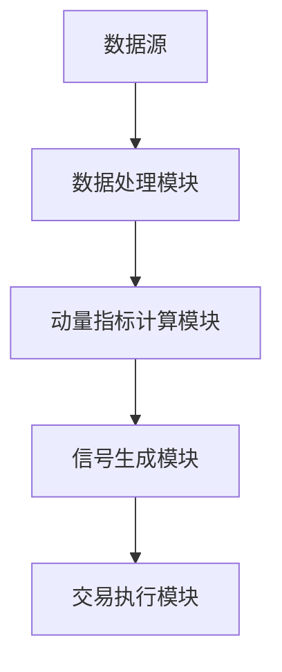

                 


# 动量投资策略：利用价格趋势获取收益

> 关键词：动量策略、价格趋势、投资策略、量化交易、趋势跟踪、动量效应

> 摘要：本文深入探讨了动量投资策略的理论基础、数学模型、实现方法及其在金融市场的应用。通过分析动量效应的定义、特征、分类及其优势与局限性，结合实际案例和系统实现，为读者提供了一个全面了解和应用动量投资策略的框架。

---

# 第一部分：动量投资策略概述

## 第1章：动量投资策略的基本概念

### 1.1 动量效应的定义与特征

#### 1.1.1 动量效应的定义
动量效应（Momentum Effect）是指在金融市场中，价格趋势会延续一段时间的现象。具体而言，如果一只股票的价格在过去一段时间内持续上涨，那么它在未来短期内继续上涨的概率会更大。这种现象为动量投资策略提供了理论基础。

#### 1.1.2 动量效应的特征
动量效应具有以下特征：
1. **延续性**：价格趋势的延续性是动量效应的核心特征。股票、商品或指数的价格走势往往会延续一段时间。
2. **短期性**：动量效应通常在较短的时间内表现较为明显，例如1周到1个月的时间跨度。
3. **市场参与者行为驱动**：动量效应与市场参与者的心理和行为密切相关，例如投资者的追涨杀跌行为。

#### 1.1.3 动量效应的适用场景
动量效应在以下场景中表现尤为显著：
- **高波动性市场**：价格波动剧烈的市场中，动量效应更容易被捕捉。
- **成熟市场**：在成熟的金融市场中，动量效应更为稳定。
- **趋势性较强的资产类别**：例如股票、商品期货等。

### 1.2 动量投资策略的背景与历史发展

#### 1.2.1 动量投资的起源
动量投资策略的起源可以追溯到20世纪70年代，当时的行为金融学研究发现，投资者的心理偏差会导致价格偏离其内在价值，从而为动量策略提供了理论基础。

#### 1.2.2 动量投资的发展历程
- **早期研究**：20世纪70年代，Fama和French在研究股票收益时发现，过去收益较高的股票在未来短期内可能会继续表现较好。
- **系统化研究**：20世纪90年代，研究者开始系统化地研究动量效应，并提出了动量投资策略的具体实现方法。
- **现代应用**：随着量化交易的兴起，动量策略逐渐成为机构投资者的重要工具之一。

#### 1.2.3 动量投资在现代金融中的地位
动量投资策略是量化投资的重要组成部分，尤其在高频交易和算法交易中得到了广泛应用。

### 1.3 动量投资的理论基础

#### 1.3.1 动量效应的市场微观结构解释
动量效应的微观结构解释包括：
- **市场参与者的有限理性**：投资者无法完全消化所有信息，导致价格延续趋势。
- **交易成本**：交易成本的存在使得价格趋势得以延续。

#### 1.3.2 行为金融学视角下的动量效应
行为金融学认为，动量效应源于投资者的心理偏差，例如过度自信和从众心理。

#### 1.3.3 动量效应与市场参与者的心理因素
动量效应与投资者的追涨杀跌行为密切相关，这种行为导致价格趋势的延续。

---

## 第2章：动量投资策略的数学模型与算法

### 2.1 动量指标的计算方法

#### 2.1.1 动量指标的定义
动量指标是衡量价格趋势延续性的指标，通常通过计算一定时间内的相对价格变化来实现。

#### 2.1.2 动量指标的计算公式
$$
\text{动量指标} = \frac{p_t}{p_{t-n}}
$$
其中，$p_t$ 表示当前价格，$p_{t-n}$ 表示 $n$ 个时间单位前的价格。

#### 2.1.3 动量指标的标准化处理
为了方便比较，通常将动量指标标准化为0到1之间的值：
$$
\text{标准化动量指标} = \frac{\text{动量指标} - 1}{1 - 0}
$$

### 2.2 动量策略的信号生成算法

#### 2.2.1 动量策略的信号生成逻辑
动量策略通过比较当前动量指标与阈值来生成买入或卖出信号。

#### 2.2.2 动量策略的信号强度计算
信号强度可以通过动量指标的大小来衡量，例如：
- 信号强度 = 动量指标 - 1

#### 2.2.3 动量策略的多空信号划分
- 如果动量指标 > 阈值，则生成买入信号。
- 如果动量指标 < 阈值，则生成卖出信号。

### 2.3 动量策略的交易规则设计

#### 2.3.1 动量策略的交易信号触发条件
- 买入信号：动量指标 > 阈值
- 卖出信号：动量指标 < 阈值

#### 2.3.2 动量策略的交易仓位控制
- 仓位控制可以通过动量指标的强度来实现，例如：
  - 强度 > 0.5：全仓买入
  - 强度 < -0.5：全仓卖出
  - 其他情况：空仓或减仓

#### 2.3.3 动量策略的交易成本与滑点处理
- 交易成本可以通过减少交易频率或优化执行策略来降低。
- 滑点处理可以通过使用最优执行算法来实现。

---

## 第3章：动量投资策略的分类与选择

### 3.1 动量策略的分类

#### 3.1.1 短期动量策略
短期动量策略通常基于1周到1个月的价格趋势，适用于高频交易。

#### 3.1.2 中期动量策略
中期动量策略基于1个月到3个月的价格趋势，适用于中频交易。

#### 3.1.3 长期动量策略
长期动量策略基于3个月到1年的价格趋势，适用于低频交易。

### 3.2 动量策略的适用场景

#### 3.2.1 高波动性市场中的动量策略
在高波动性市场中，动量策略表现较好，因为价格趋势容易被捕捉。

#### 3.2.2 低波动性市场中的动量策略
在低波动性市场中，动量策略表现较差，因为价格趋势难以延续。

#### 3.2.3 不同资产类别中的动量策略
- 股票：动量策略在成长股中表现较好。
- 商品期货：动量策略在金属和能源期货中表现较好。
- 汇率：动量策略在外汇市场中表现较好。

### 3.3 动量策略的选择与优化

#### 3.3.1 动量策略的参数选择
- 时间窗口长度（$n$）：通常选择1周到1个月。
- 阈值：通常选择0.9到1.1之间的值。

#### 3.3.2 动量策略的回测与优化
- 回测：通过历史数据验证策略的有效性。
- 优化：通过调整参数和组合策略来提高收益。

#### 3.3.3 动量策略的风险调整收益分析
- 风险调整收益可以通过夏普比率或索提诺比率来衡量。

---

## 第4章：动量投资策略的优势与局限性

### 4.1 动量策略的优势

#### 4.1.1 简单易懂的策略逻辑
动量策略的逻辑简单明了，易于理解和实现。

#### 4.1.2 无需复杂的基本面分析
动量策略仅依赖于价格趋势，无需分析公司的基本面。

#### 4.1.3 适合程序化交易的特点
动量策略非常适合程序化交易，可以通过算法自动执行交易。

### 4.2 动量策略的局限性

#### 4.2.1 动量策略的过拟合风险
如果参数选择不当，动量策略可能在回测中表现较好，但在实际交易中表现较差。

#### 4.2.2 动量策略的市场周期依赖性
动量策略的表现依赖于市场周期，可能在某些市场环境下表现不佳。

#### 4.2.3 动量策略的市场流动性依赖性
动量策略在流动性较低的市场中表现较差，因为难以快速买卖资产。

---

## 第5章：动量投资策略的系统实现

### 5.1 动量策略的系统架构

#### 5.1.1 系统架构设计


#### 5.1.2 数据获取与预处理
- 数据获取：通过API获取历史价格数据。
- 数据预处理：清洗数据，处理缺失值和异常值。

#### 5.1.3 动量指标的计算与信号生成
- 计算动量指标。
- 生成买入或卖出信号。

#### 5.1.4 交易执行与风险管理
- 根据信号执行交易。
- 实施风险管理策略，例如止损和止盈。

### 5.2 动量策略的实现代码

#### 5.2.1 Python代码实现
```python
import pandas as pd
import numpy as np

def calculate_momentum(close_prices, n=20):
    return close_prices / close_prices.shift(n)

def generate_signals(momentum, threshold=0.95):
    signals = pd.DataFrame(index=momentum.index)
    signals['signal'] = 0
    signals['signal'] = np.where(momentum > threshold, 1, -1)
    return signals

# 示例数据
data = pd.read_csv('stock_data.csv')
close_prices = data['close']
n = 20
threshold = 0.95

momentum = calculate_momentum(close_prices, n)
signals = generate_signals(momentum, threshold)
```

#### 5.2.2 代码解读
- `calculate_momentum` 函数计算动量指标。
- `generate_signals` 函数生成交易信号。
- 示例数据读取和处理。

---

## 第6章：动量投资策略的优化与改进

### 6.1 动量策略的优化方法

#### 6.1.1 参数优化
- 选择最佳的时间窗口长度和阈值。

#### 6.1.2 多因子动量策略
- 结合其他动量因子，例如相对强弱指数（RSI）和平均趋向指数（ATR）。

#### 6.1.3 动态调整策略
- 根据市场环境动态调整策略参数。

### 6.2 动量策略的改进方向

#### 6.2.1 机器学习模型的应用
- 使用机器学习模型预测动量指标。

#### 6.2.2 多市场动量策略
- 在多个市场或资产类别中同时应用动量策略。

#### 6.2.3 风险控制的优化
- 结合其他风险管理方法，例如凯利公式。

---

## 第7章：动量投资策略的风险管理

### 7.1 动量策略的风险来源

#### 7.1.1 市场风险
- 市场波动性可能导致动量策略亏损。

#### 7.1.2 流动性风险
- 在流动性较低的市场中，动量策略可能难以执行交易。

#### 7.1.3 模型风险
- 动量策略可能因参数选择不当或模型过拟合而失效。

### 7.2 动量策略的风险控制方法

#### 7.2.1 仓位控制
- 根据动量指标的强度动态调整仓位。

#### 7.2.2 交易成本控制
- 通过优化执行策略降低交易成本。

#### 7.2.3 事后风险评估
- 定期评估策略的风险暴露情况。

---

## 第8章：动量投资策略的实战应用

### 8.1 动量策略的实际案例分析

#### 8.1.1 案例1：股票动量策略
- 数据来源：某股票的历史价格数据。
- 策略实现：计算20天动量指标，设置阈值为0.95。
- 结果分析：策略在测试期间表现较好。

#### 8.1.2 案例2：商品期货动量策略
- 数据来源：某商品期货的历史价格数据。
- 策略实现：计算10天动量指标，设置阈值为1.05。
- 结果分析：策略在测试期间表现较好。

### 8.2 动量策略的优化与改进

#### 8.2.1 策略优化
- 通过回测分析优化策略参数。
- 结合其他动量因子提高策略收益。

#### 8.2.2 策略改进
- 引入机器学习模型预测动量指标。
- 实施动态调整策略参数。

---

## 第9章：总结与展望

### 9.1 总结
动量投资策略是一种简单有效的量化投资策略，通过捕捉价格趋势的延续性来获取收益。本文详细探讨了动量策略的理论基础、数学模型、实现方法及其在金融市场的应用。

### 9.2 展望
随着人工智能和大数据技术的发展，动量策略将得到进一步优化和改进。未来的研究方向包括：
- 更复杂的动量因子组合。
- 更高效的动量策略执行算法。
- 更精准的动量策略风险控制方法。

---

## 作者信息

作者：AI天才研究院/AI Genius Institute & 禅与计算机程序设计艺术 /Zen And The Art of Computer Programming

