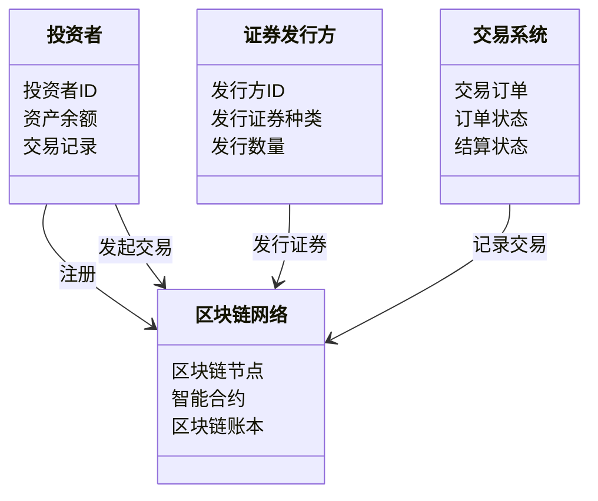
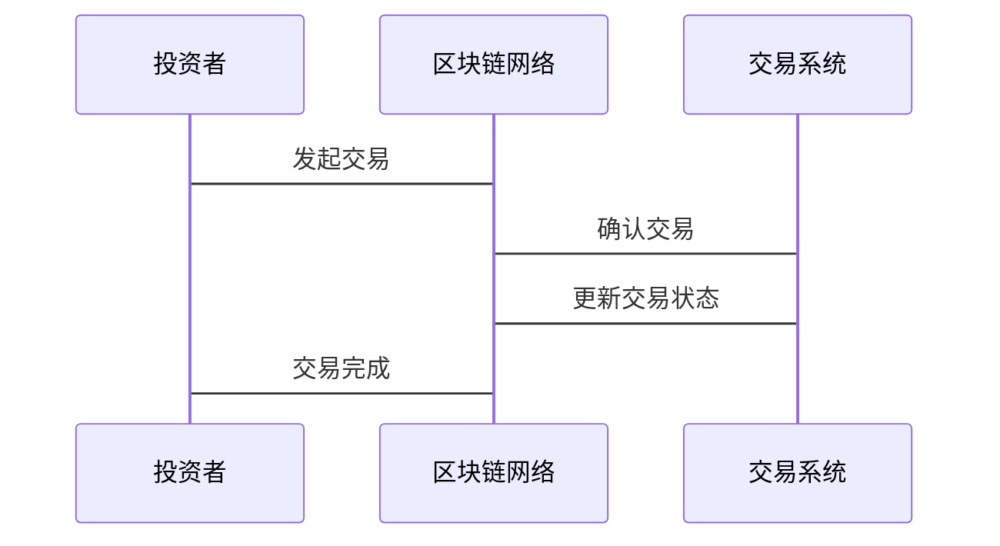

                 

# 区块链技术对投资行业的潜在影响

## 关键词：区块链技术、投资行业、金融创新、去中心化、智能合约、风险管理

## 摘要：区块链技术作为一种革命性的分布式账本技术，正在逐步改变投资行业的运作方式。本文从区块链的基本概念出发，深入分析其在投资行业的应用场景，探讨其对投资效率、透明度和风险管理的潜在影响。通过具体案例和系统设计，揭示区块链技术如何优化投资流程，降低交易成本，并推动投资行业向更加智能化、去中心化的方向发展。

---

# 第1章: 区块链技术概述

## 1.1 区块链的基本概念

### 1.1.1 分布式账本与去中心化
区块链是一种分布式账本技术，通过去中心化的网络实现数据的安全存储和传输。与传统的中心化账本相比，区块链通过多个节点共同维护数据的一致性，确保数据的不可篡改性和可追溯性。

### 1.1.2 智能合约的定义与特点
智能合约是区块链上的自动执行程序，能够在满足特定条件时自动触发相应的操作。智能合约的特点包括去信任化、自动执行和不可篡改。

### 1.1.3 区块链的核心属性：去信任化与安全性
区块链通过密码学和共识算法确保数据的安全性和可靠性。去信任化意味着参与者不需要依赖中心化机构，即可完成信任的建立和数据的验证。

---

## 1.2 区块链的分类与应用场景

### 1.2.1 公有链、私有链与联盟链的对比
- **公有链**：开放、去中心化，适合广泛应用，如比特币。
- **私有链**：仅限于特定组织内部使用，适合企业内部数据管理。
- **联盟链**：介于公有链和私有链之间，适合特定行业或组织联盟使用。

### 1.2.2 区块链在金融行业的潜在应用
区块链在金融行业的应用包括跨境支付、证券交易、智能合约等。

### 1.2.3 区块链在投资行业中的独特价值
区块链通过提高透明度、降低交易成本和增强安全性，为投资行业带来新的发展机遇。

---

## 1.3 区块链技术对投资行业的潜在影响

### 1.3.1 投资行业中的痛点分析
传统投资行业存在以下痛点：
- **低效率**：交易流程繁琐，清算时间长。
- **高成本**：中介费用高昂。
- **低透明度**：信息不对称严重。

### 1.3.2 区块链如何解决投资行业的问题
区块链通过去中心化和自动化技术，解决投资行业中的信任和效率问题。

### 1.3.3 区块链技术对投资行业未来发展的预测
区块链将推动投资行业向智能化、自动化和去中心化方向发展，降低交易成本，提高透明度。

---

## 1.4 本章小结
区块链技术作为一种去中心化的分布式账本技术，通过智能合约和共识算法，为投资行业带来了新的解决方案。区块链的应用将显著提高投资行业的效率和透明度，降低交易成本和风险。

---

# 第2章: 区块链技术的核心原理

## 2.1 区块链的共识机制

### 2.1.1 工作量证明（PoW）
工作量证明是一种通过计算哈希值来证明工作量的机制，常用于比特币等公有链。

### 2.1.2 权益证明（PoS）
权益证明通过持有代币的数量来决定记账权，相比PoW更节能。

### 2.1.3 其他共识机制的对比
包括实用拜占庭容错（PBFT）、RAFT等，适用于不同场景。

---

## 2.2 区块链的哈希函数与加密算法

### 2.2.1 哈希函数的基本原理
哈希函数将任意长度的数据映射为固定长度的哈希值，确保数据的唯一性和完整性。

### 2.2.2 加密算法在区块链中的应用
包括RSA、椭圆曲线加密等，用于保护数据隐私和安全。

### 2.2.3 数字签名的实现机制
数字签名通过公私钥对实现数据的签名和验证，确保数据的完整性和真实性。

---

## 2.3 区块链的区块结构与链式结构

### 2.3.1 区块的组成与数据结构
区块包含头和主体，头包含区块高度、时间戳、哈希值等信息，主体包含交易记录。

### 2.3.2 区块链的链式结构特点
区块通过哈希指针连接成链式结构，确保数据的不可篡改性。

### 2.3.3 区块链的不可篡改性
通过链式结构和加密算法，区块链确保数据一旦写入，无法被篡改。

---

## 2.4 本章小结
区块链的核心原理包括共识机制、哈希函数和区块结构。这些技术共同确保了区块链的安全性和可靠性，为投资行业的信任和效率问题提供了技术基础。

---

# 第3章: 区块链在投资行业中的应用场景

## 3.1 证券发行与交易的区块链化

### 3.1.1 传统证券发行与交易的流程
传统证券发行需要经过多个中介机构，流程繁琐，时间长。

### 3.1.2 区块链在证券发行中的应用
通过智能合约实现自动化的证券发行和交易，减少中介环节，提高效率。

### 3.1.3 区块链如何优化证券交易流程
区块链可以实现实时结算（DvP），降低结算时间和成本。

---

## 3.2 投资组合管理与风险控制

### 3.2.1 投资组合管理的传统方式
依赖人工操作和中介机构，存在信息不对称和风险控制不力的问题。

### 3.2.2 区块链在投资组合管理中的应用
通过区块链实现投资组合的实时监控和风险预警，提高透明度和风险管理能力。

### 3.2.3 区块链如何降低投资风险
区块链通过去中心化和智能合约，减少人为干预，降低操作风险。

---

## 3.3 资产托管与清算的区块链解决方案

### 3.3.1 资产托管的传统模式
依赖银行等中介机构，存在信任和效率问题。

### 3.3.2 区块链在资产托管中的应用
通过区块链实现资产的智能托管和自动清算，提高效率和透明度。

### 3.3.3 区块链如何优化清算流程
区块链实现自动化的清算和结算，减少人工操作，降低错误率。

---

## 3.4 本章小结
区块链在投资行业中的应用场景广泛，包括证券发行、投资组合管理、资产托管和清算等。区块链技术的应用将显著提高投资行业的效率和透明度，降低交易成本和风险。

---

# 第4章: 区块链技术对投资行业的影响分析

## 4.1 区块链对投资效率的提升

### 4.1.1 交易速度的提升
区块链实现秒级交易确认，显著提高交易效率。

### 4.1.2 交易成本的降低
通过去中介化，区块链大幅降低交易费用。

### 4.1.3 交易透明度的增强
区块链实现数据的公开透明，消除信息不对称。

---

## 4.2 区块链对投资风险的控制

### 4.2.1 通过区块链实现去中心化信任
区块链通过去中心化和智能合约，减少人为干预，降低操作风险。

### 4.2.2 区块链如何防止欺诈行为
区块链的不可篡改性和透明性，有效防止欺诈行为。

### 4.2.3 区块链在风险管理中的应用
通过区块链实现风险的实时监控和预警，提高风险管理能力。

---

## 4.3 区块链对投资行业生态的影响

### 4.3.1 中介机构的角色变化
区块链的应用将改变传统中介机构的角色和地位。

### 4.3.2 投资者与机构的关系变化
区块链实现投资者与机构的直接对接，减少中介环节。

### 4.3.3 投资行业的新机遇与挑战
区块链为投资行业带来新的发展机遇，但也面临技术、法规和市场接受度等挑战。

---

## 4.4 本章小结
区块链技术对投资行业的影响深远，不仅提高了投资效率，还降低了风险。然而，区块链的应用也面临诸多挑战，需要各方共同努力。

---

# 第5章: 区块链技术在投资行业中的系统设计

## 5.1 系统功能设计

### 5.1.1 系统需求分析
基于区块链的投资管理系统需要实现证券发行、交易、清算等功能。

### 5.1.2 领域模型设计
通过类图展示系统的功能模块和交互关系。

### 5.1.3 系统架构设计
通过架构图展示系统的整体架构，包括前端、后端、区块链节点和数据库。

### 5.1.4 系统接口设计
通过接口描述文档，定义系统之间的交互接口和数据格式。

### 5.1.5 系统交互设计
通过序列图展示系统的主要交互流程。

---

## 5.2 项目实战

### 5.2.1 环境安装
安装必要的开发工具和区块链框架，例如以太坊开发环境。

### 5.2.2 核心代码实现
实现区块链投资管理系统的核心功能，包括智能合约的编写和交易处理逻辑。

### 5.2.3 项目小结
总结项目实现的经验和教训，提出改进建议。

---

## 5.3 本章小结
通过系统设计和项目实战，展示了区块链技术在投资行业中的具体应用，验证了区块链技术的可行性和有效性。

---

# 第6章: 区块链技术对投资行业的未来展望

## 6.1 未来发展趋势

### 6.1.1 投资行业进一步去中心化
区块链技术将推动投资行业的去中心化，减少对传统中介的依赖。

### 6.1.2 区块链与人工智能的结合
区块链与人工智能的结合将为投资行业带来新的智能化解决方案。

### 6.1.3 区块链技术的合规性挑战
随着区块链技术的广泛应用，相关法规和合规性问题将成为行业关注的焦点。

---

## 6.2 挑战与应对措施

### 6.2.1 技术挑战
包括性能优化、安全性提升等技术问题。

### 6.2.2 法规与合规性挑战
区块链技术的应用需要符合各国的法律法规。

### 6.2.3 市场接受度挑战
投资者和机构对区块链技术的接受度和信任度需要逐步提升。

---

## 6.3 本章小结
区块链技术对投资行业的未来影响深远，但也面临诸多挑战。需要技术、法规和市场等多方共同努力，推动区块链技术的广泛应用和发展。

---

# 作者信息

作者：AI天才研究院/AI Genius Institute & 禅与计算机程序设计艺术 /Zen And The Art of Computer Programming

---

通过以上思考，我系统地梳理了区块链技术对投资行业的潜在影响，从背景、技术原理、应用场景、系统设计到未来展望，逐步展开分析，确保文章内容全面且逻辑清晰。

