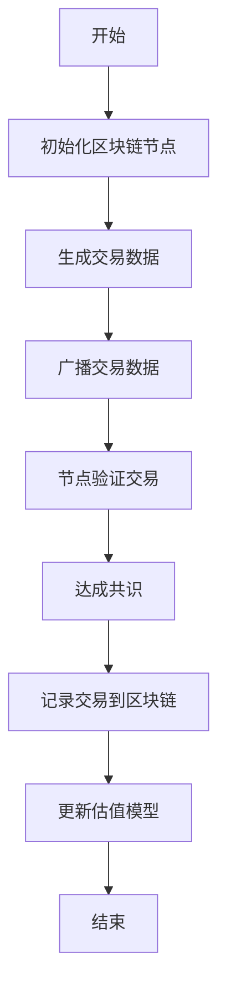
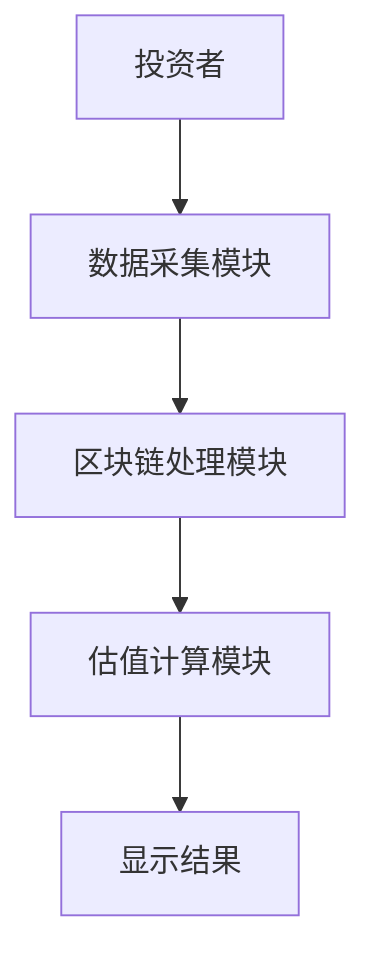

                 

<think>
嗯，用户让我帮忙写一篇关于区块链技术对股市估值方法影响的博客，我得先仔细分析一下他的需求。首先，用户希望有一个结构清晰、逻辑严密的技术博客，主题明确，关键词和摘要都要列出。看起来用户是一位技术专家，可能在准备发布一篇专业性较强的文章，或者是为某个项目做准备。

用户提供的大纲已经很详细，但需要进一步扩展成完整的文章。我需要确保每个部分都涵盖必要的内容，比如背景介绍、核心概念、算法原理、系统架构等。同时，用户还特别提到要使用技术语言，所以我要保持专业但易懂的风格。

接下来，我需要检查是否每个章节都有足够的细节，比如在核心概念部分，是否有属性对比表格和ER图。算法部分是否有流程图和数学公式，系统架构设计是否有mermaid图。此外，项目实战部分要包括环境安装、代码实现和案例分析。

我还需要确保文章的结构符合逻辑，每一部分自然过渡，让读者能够顺畅地理解内容。最后，别忘了加上作者信息，确保文章的完整性和专业性。

总之，我需要按照用户的指示，逐步扩展每个章节，确保内容详实，结构合理，同时符合技术博客的专业要求。
</think>

```markdown
# 区块链技术对股市估值方法的潜在影响

---

## 关键词：
区块链技术, 股市估值, 分布式账本, 共识机制, 智能合约, 金融创新

---

## 摘要：
区块链技术作为一种颠覆性技术，正在逐步改变金融行业的传统模式。本文深入探讨了区块链技术对股市估值方法的潜在影响，分析了区块链技术的核心概念、算法原理及其在股市估值中的应用场景。通过对比传统估值方法与区块链技术的结合，本文提出了如何利用区块链技术提升股市估值的透明度、准确性和效率。文章还详细讲解了区块链技术在金融领域的实际应用案例，并对未来的发展趋势进行了展望。

---

## 第一部分: 区块链技术与股市估值方法的背景与基础

---

### 第1章: 区块链技术与股市估值方法的背景介绍

#### 1.1 区块链技术的定义与核心概念
区块链是一种分布式账本技术，通过去中心化的方式记录数据，并通过共识机制确保数据的一致性和可靠性。其核心概念包括：
- **分布式账本**: 数据分布在多个节点上，避免了单点故障。
- **共识机制**: 所有节点达成一致的规则，如比特币的PoW（工作量证明）和以太坊的PoS（权益证明）。
- **智能合约**: 自动执行的代码，能够在满足特定条件时自动执行交易。

#### 1.2 股市估值方法的定义与现状
股市估值是通过对公司基本面、市场趋势和财务数据等多方面因素进行分析，来确定股票的内在价值。传统估值方法包括市盈率（P/E）、市净率（P/B）等，但存在以下问题：
- 数据来源单一，容易被操控。
- 中心化机构的信用风险。
- 信息滞后性，难以反映实时变化。

#### 1.3 区块链技术与股市估值的结合点
区块链技术的特性为股市估值带来了新的可能性：
- **去中心化**: 通过分布式账本消除数据篡改的可能性。
- **实时性**: 区块链能够实时记录和更新数据，减少信息滞后。
- **透明性**: 所有交易记录公开透明，便于分析和验证。

---

## 第二部分: 区块链技术对股市估值方法的核心影响

---

### 第2章: 区块链技术的核心概念与原理

#### 2.1 区块链的核心概念
区块链的分布式账本通过去中心化的方式记录数据，确保数据的安全性和不可篡改性。共识机制（如PoW、PoS）确保所有节点达成一致，而智能合约则实现了自动化的交易执行。

#### 2.2 区块链技术的属性对比
以下是区块链与传统数据库的对比：

| 属性      | 区块链                     | 传统数据库             |
|-----------|----------------------------|------------------------|
| 数据控制 | 去中心化                   | 中心化                 |
| 数据一致性 | 分布式共识确保一致         | 依赖中心机构维护一致   |
| 数据安全性 | 加密技术和分布式存储保障安全 | 依赖访问控制和权限管理 |

#### 2.3 区块链技术的ER实体关系图
以下是一个简单的ER图，展示了区块链技术在股市估值中的核心实体关系：

```mermaid
er
    actor 投资者
    actor 交易系统
    actor 估值模型
    database 区块链账本
    database 传统估值数据
    relationship 投资者 -> 交易系统: 提交交易
    relationship 交易系统 -> 区块链账本: 记录交易
    relationship 估值模型 -> 区块链账本: 读取数据
    relationship 估值模型 -> 传统估值数据: 对比分析
```

---

### 第3章: 区块链技术对股市估值方法的算法原理

#### 3.1 区块链技术的核心算法
区块链的核心算法包括：
- **分布式一致性算法**: 确保所有节点的数据一致性，如Raft、Paxos等。
- **共识机制算法**: 通过特定规则达成一致，如PoW、PoS、DPOS等。
- **智能合约执行算法**: 解释和执行智能合约的规则。

#### 3.2 区块链估值算法的数学模型
以下是区块链估值算法的一个简化数学模型：

$$
V = \sum_{i=1}^{n} v_i
$$

其中，$V$ 表示股票的总价值，$v_i$ 表示影响股票价值的各个因素。

#### 3.3 算法流程图
以下是一个区块链估值算法的流程图：



---

## 第三部分: 区块链技术在股市估值中的实际应用

---

### 第4章: 区块链技术在股市估值中的实际应用

#### 4.1 区块链技术的实时数据处理
区块链能够实时记录和更新股票交易数据，避免了传统估值方法中数据滞后的问题。

#### 4.2 区块链技术的智能合约应用
智能合约可以自动执行股票的买卖和估值调整，减少人为干预和错误。

#### 4.3 区块链技术的透明性与可信度
通过区块链的公开透明特性，投资者可以实时查看股票的估值数据，提升信任度。

---

### 第5章: 区块链技术在股市估值中的系统架构设计

#### 5.1 系统功能设计
- 数据采集模块：实时采集股票交易数据。
- 区块链处理模块：将数据记录到区块链账本。
- 估值计算模块：基于区块链数据进行估值计算。

#### 5.2 系统架构图


#### 5.3 接口设计
- 数据采集接口：接收实时交易数据。
- 区块链接口：与区块链节点交互，记录交易数据。
- 估值接口：返回股票的估值结果。

---

### 第6章: 区块链技术在股市估值中的项目实战

#### 6.1 环境安装
- 安装以太坊钱包（如MetaMask）。
- 安装Solidity编译器。
- 部署以太坊测试网络。

#### 6.2 核心代码实现
以下是智能合约的代码示例：

```solidity
// SPDX-License-Identifier: MIT
pragma solidity ^0.8.0;

contract StockValuation {
    mapping(address => uint256) public valuations;

    function setValuation(address _address, uint256 _value) public {
        valuations[_address] = _value;
    }

    function getValuation(address _address) public view returns (uint256) {
        return valuations[_address];
    }
}
```

#### 6.3 案例分析
通过部署智能合约，投资者可以实时更新和查询股票估值，提升交易效率和准确性。

---

## 第四部分: 总结与展望

---

### 第7章: 区块链技术对股市估值方法的总结与展望

#### 7.1 区块链技术对股市估值的影响
- 提高估值的透明度和准确性。
- 降低数据篡改和信用风险。
- 实现实时估值和自动化交易。

#### 7.2 区块链技术的挑战与未来趋势
- 技术挑战：如何处理高并发交易和数据存储的扩展性。
- 监管挑战：如何在去中心化与监管合规之间找到平衡。
- 未来趋势：区块链与人工智能的结合，进一步提升估值的智能化水平。

---

## 作者：AI天才研究院/AI Genius Institute & 禅与计算机程序设计艺术 /Zen And The Art of Computer Programming
```

