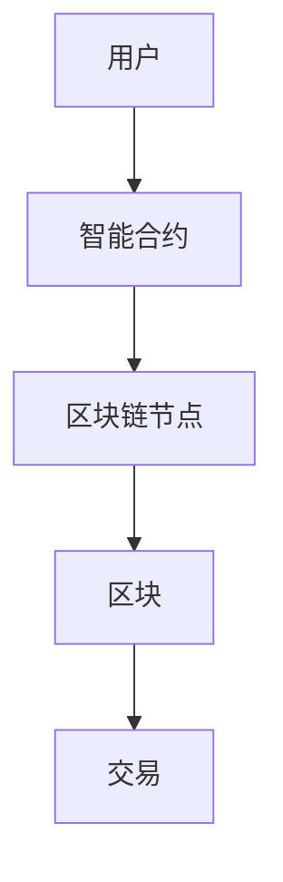
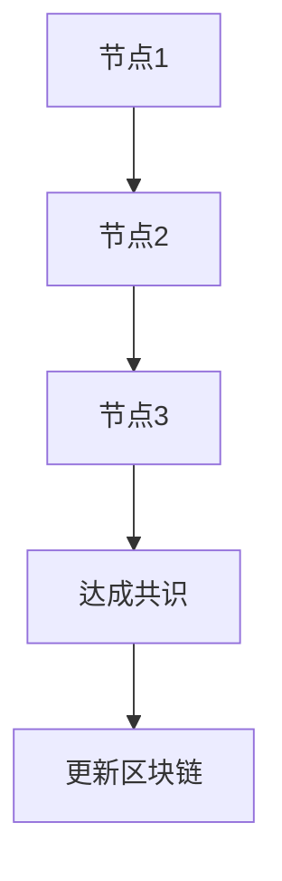
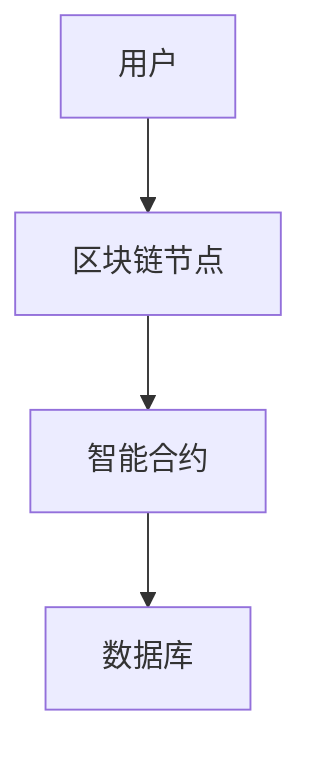

                 

<think>
好的，用户希望我以《区块链技术：金融创新与投资机会》为标题撰写一篇技术博客，要求内容详实，结构清晰，涵盖区块链技术基础、系统架构设计、共识机制、金融创新案例、投资机会等部分。

首先，我需要明确文章的关键词和摘要。关键词包括区块链技术、金融创新、DeFi、数字资产、投资机会等。摘要部分需要简明扼要地概括文章的核心内容，指出区块链在金融领域的应用潜力和投资机会。

接下来，我需要设计文章的目录结构，确保覆盖技术基础、核心概念、算法原理、系统设计、项目实战、投资机会和风险管理等部分。每章的内容需要详细展开，包括定义、原理、对比分析、流程图、数学模型、系统架构图等。

在撰写过程中，我需要确保内容逻辑严谨，技术术语准确，并使用图表辅助说明。同时，要注意文章的结构，每章下设多个小节，每小节包含具体的内容，如概念解释、原理分析、代码示例等。

最后，我需要在文章末尾添加作者信息，确保文章的完整性和专业性。整个过程中，我需要一步步分析和推理，确保内容详尽且易于理解。
</think>

# 区块链技术：金融创新与投资机会

> 关键词：区块链技术，金融创新，数字资产，DeFi，投资机会，风险管理

> 摘要：区块链技术正在深刻改变金融行业，通过去中心化、智能合约和分布式账本等技术手段，为金融创新提供了新的可能性。本文将深入探讨区块链技术的基本原理、其在金融领域的应用，以及相关的投资机会和风险管理策略。通过分析具体的金融场景和项目案例，本文旨在为读者提供一个全面的视角，帮助其理解区块链技术的潜力及其在投资中的机会与挑战。

---

## 第1章：区块链技术概述

### 1.1 区块链的基本概念

#### 1.1.1 区块链的定义与核心特点
区块链是一种去中心化的分布式账本技术，通过密码学和分布式共识机制确保数据的安全性和一致性。其核心特点包括去中心化、不可篡改、透明性和抗审查性。

#### 1.1.2 区块链的技术架构与组成
区块链由多个节点组成，每个节点都存储完整的账本副本。数据以区块形式链式相连，通过哈希指针确保数据的完整性和不可篡改性。

#### 1.1.3 区块链与传统金融系统的区别
传统的金融系统依赖于中心化机构（如银行、交易所）进行交易 clearing 和结算，而区块链通过去中心化的方式实现价值转移，降低了信任成本和中介依赖。

### 1.2 区块链的核心技术原理

#### 1.2.1 分布式账本技术
分布式账本技术（DLT）通过在多个节点上同步记录交易数据，确保数据的可靠性和一致性。每个节点都维护一份完整的账本副本，通过共识机制达成一致。

#### 1.2.2 哈希函数与数据完整性
哈希函数用于将数据转换为固定长度的哈希值，确保数据的完整性和唯一性。例如，SHA-256 是比特币和以太坊中常用的哈希函数。

#### 1.2.3 共识机制（PoW, PoS, BFT等）
共识机制是区块链的核心技术之一，用于确保所有节点达成一致。常见的共识机制包括工作量证明（PoW）、权益证明（PoS）和拜占庭容错（BFT）等。

### 1.3 区块链的分类与应用场景

#### 1.3.1 公有链、私有链与联盟链
公有链（Public Chain）：完全去中心化的区块链，任何人都可以参与，如比特币和以太坊。
私有链（Private Chain）：仅限特定参与者访问的区块链，常用于企业内部应用。
联盟链（ Consortium Chain）：由多个机构共同维护的区块链，适用于行业联盟或特定组织。

#### 1.3.2 DeFi、NFT与数字资产
去中心化金融（DeFi）：基于区块链的金融应用，提供去中心化的借贷、交易和融资服务。
非同质化代币（NFT）：区块链上的唯一数字资产，用于表示艺术品、收藏品等。
数字资产：包括比特币、以太坊等加密货币，以及各种代币。

#### 1.3.3 区块链在金融领域的具体应用
区块链在金融领域的应用包括跨境支付、证券发行与交易、信用评估、风险管理等。例如，摩根大通和渣打银行等金融机构已经在探索区块链技术在贸易融资和支付结算中的应用。

---

## 第2章：区块链的核心概念与联系

### 2.1 区块链核心概念原理

#### 2.1.1 区块链的去中心化特性
去中心化是区块链的核心特征之一，通过分布式节点的协作，避免了单点故障和中心化机构的依赖。

#### 2.1.2 智能合约的工作原理
智能合约是运行在区块链上的自动执行程序，用于自动执行和管理协议。例如，以太坊上的智能合约可以实现复杂的金融交易逻辑。

#### 2.1.3 区块链的安全性与隐私保护
区块链通过加密算法和访问控制机制保护数据隐私，同时通过共识机制确保网络安全。零知识证明和同态加密等技术进一步提升了隐私保护能力。

### 2.2 核心概念属性对比表格

| 概念         | 特性                |
|--------------|--------------------|
| 去中心化     | 分布式、无单点依赖 |
| 共识机制     | 各节点达成一致      |
| 智能合约     | 自动执行的协议      |
| 区块链账本   | 公开、透明、不可篡改 |

### 2.3 ER实体关系图架构



---

## 第3章：区块链共识机制的算法原理

### 3.1 共识机制的数学模型

#### 3.1.1 工作量证明（PoW）
工作量证明通过计算哈希值来验证节点的工作量。例如，比特币的挖矿过程就是通过计算特定的哈希值来寻找 nonce 值。

$$ H = hash(Header + nonce) $$
其中，$H$ 是哈希值，$Header$ 是区块头，$nonce$ 是随机数。

#### 3.1.2 权益证明（PoS）
权益证明通过持有代币的数量来决定节点的记账权。例如，以太坊 2.0 采用 PoS 机制，节点通过质押 ETH 来获得记账权。

### 3.2 共识机制的流程图



---

## 第4章：区块链在金融领域的系统分析与架构设计

### 4.1 金融支付系统场景介绍

#### 4.1.1 传统支付系统的痛点
传统支付系统存在交易确认时间长、跨境支付成本高、中心化机构依赖等问题。

#### 4.1.2 区块链支付的优势
区块链支付可以实现点对点价值转移，降低交易成本，提高交易效率。

### 4.2 系统功能设计

#### 4.2.1 用户模块
用户模块负责管理用户的账户信息，包括注册、登录和余额查询。

#### 4.2.2 账户管理模块
账户管理模块负责处理用户的账户创建、资产转移和交易确认。

#### 4.2.3 交易处理模块
交易处理模块负责验证交易请求，通过智能合约实现交易的自动执行。

### 4.3 系统架构设计



---

## 第5章：区块链项目实战

### 5.1 环境安装与配置

#### 5.1.1 安装以太坊钱包
安装以太坊钱包（如 MetaMask），并连接到以太坊测试网络（如 Rinkeby 或 Kovan）。

#### 5.1.2 配置Solidity开发环境
安装 Solidity 编译器和以太坊节点（如 Geth 或ereum）。

### 5.2 核心代码实现

#### 5.2.1 智能合约开发
以下是实现一个简单支付合约的 Solidity 代码：

```solidity
pragma solidity ^0.8.0;

contract SimplePayment {
    mapping(address => uint256) public balances;

    function deposit() public payable {
        balances[msg.sender] += msg.value;
    }

    function transfer(address recipient) public {
        require(balances[msg.sender] > 0, "Insufficient balance");
        balances[recipient] += balances[msg.sender];
        balances[msg.sender] = 0;
    }
}
```

#### 5.2.2 智能合约部署与测试
使用以太坊钱包部署智能合约，并在测试环境中进行转账和余额查询测试。

### 5.3 项目实战小结
通过实际开发和部署智能合约，可以深入理解区块链技术在金融支付中的应用。同时，也需要关注智能合约的安全性，避免因代码错误导致的漏洞。

---

## 第6章：区块链技术的投资机会与风险管理

### 6.1 区块链技术的投资机会

#### 6.1.1 DeFi领域的投资机会
DeFi 是区块链技术的重要应用领域，包括去中心化交易所、借贷平台和合成资产发行等。

#### 6.1.2 NFT市场的投资机会
NFT（非同质化代币）在艺术、游戏和虚拟资产等领域具有广泛的应用场景，市场潜力巨大。

### 6.2 区块链技术的风险管理

#### 6.2.1 技术风险
包括智能合约漏洞、共识机制的安全性问题以及节点的去中心化程度。

#### 6.2.2 市场风险
包括加密货币的价格波动、政策监管风险以及市场泡沫风险。

#### 6.2.3 法律风险
包括各国对加密货币的监管政策不一，可能引发合规风险。

### 6.3 投资策略与风险管理

#### 6.3.1 项目评估
投资者需要从技术、团队、市场和商业模式等多个维度评估项目。

#### 6.3.2 投资组合优化
通过分散投资、风险对冲等策略降低投资风险。

#### 6.3.3 长期价值投资
区块链技术的长期价值在于其技术创新和应用潜力，投资者需要关注技术发展和行业趋势。

---

## 第7章：总结与展望

### 7.1 总结
区块链技术正在深刻改变金融行业，通过去中心化、智能合约和分布式账本等技术手段，为金融创新提供了新的可能性。本文详细介绍了区块链技术的基本原理、应用场景、投资机会和风险管理策略。

### 7.2 展望
未来，随着技术的成熟和应用的拓展，区块链将在金融领域发挥更大的作用。DeFi、NFT 和数字资产等领域的创新发展将推动区块链技术的进一步普及和应用。

---

## 作者：AI天才研究院/AI Genius Institute & 禅与计算机程序设计艺术 /Zen And The Art of Computer Programming

