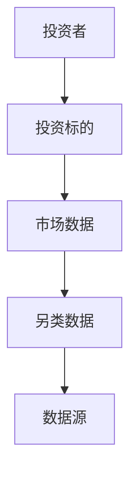

                 


# 《另类数据在投资分析中的应用》

## 关键词：另类数据、投资分析、数据挖掘、机器学习、NLP、系统架构

## 摘要：  
随着金融市场的日益复杂化，传统金融数据的局限性逐渐显现，另类数据的引入为投资分析提供了新的视角和可能性。本文系统地探讨了另类数据的定义、特点、获取方式、分析方法及其在投资分析中的实际应用。通过结合具体的项目案例，深入分析了基于自然语言处理和机器学习的另类数据分析算法，并展示了如何构建一个完整的另类数据驱动的投资分析系统。文章最后总结了当前的研究成果，并展望了未来的发展方向。

---

# 第1章: 另类数据的定义与背景

## 1.1 传统金融数据的局限性  
- 传统金融数据的定义与特点  
- 传统金融数据的局限性：信息滞后性、单一性  
- 传统金融数据与另类数据的对比分析  

## 1.2 另类数据的核心概念  
- 另类数据的定义与分类  
- 另类数据的多维度特征：文本、图像、供应链数据等  
- 另类数据在投资分析中的重要性：补充信息、捕捉市场情绪、预测潜在风险  

## 1.3 另类数据的获取渠道  
- 公开数据来源：社交媒体、新闻网站、政府报告  
- 半结构化数据来源：供应链数据、物流信息  
- 非结构化数据来源：社交媒体情感数据、卫星图像  

## 1.4 本章小结  
- 本章介绍了另类数据的定义、分类及其在投资分析中的重要性，为后续内容奠定了基础。

---

# 第2章: 另类数据的核心概念与联系

## 2.1 另类数据的核心概念  
- 数据的多维度特征：文本、图像、数值的混合性  
- 数据的实时性与延后性：社交媒体数据的实时性与市场数据的延后性  
- 数据的可解释性与不可预测性：非结构化数据的分析难度  

## 2.2 另类数据的属性特征对比  
- 数据类型的对比分析：文本、图像、供应链数据的特征对比  
- 数据质量的对比分析：完整性、准确性、及时性  
- 数据来源的对比分析：公开性、隐私性  

## 2.3 另类数据的ER实体关系图  


## 2.4 本章小结  
- 本章通过对比分析和实体关系图，阐述了另类数据的核心概念及其与传统数据的联系。

---

# 第3章: 另类数据的算法原理

## 3.1 另类数据的预处理方法  
- 数据清洗与标准化：去除噪声、数据归一化  
- 数据增强与特征提取：文本分词、图像特征提取  
- 数据降维与聚类：主成分分析、K-means聚类  

## 3.2 另类数据的分析算法  
- 基于NLP的情感分析算法：  
  ```mermaid
  graph LR
      A[数据输入] --> B[分词处理]
      B --> C[情感分析]
      C --> D[结果输出]
  ```
- 基于机器学习的预测模型：随机森林、支持向量机、深度学习模型  

## 3.3 算法实现与数学模型  
- 情感分析的数学模型：  
  $$\text{情感极性} = f(\text{文本特征})$$  
  其中，$f$ 是基于词袋模型或词嵌入模型的函数。  
- 预测模型的训练流程：  
  ```python
  # 示例代码：情感分析模型训练
  from sklearn.feature_extraction.text import TfidfVectorizer
  from sklearn.svm import SVC
  vectorizer = TfidfVectorizer()
  X = vectorizer.fit_transform(texts)
  model = SVC()
  model.fit(X, labels)
  ```

## 3.4 本章小结  
- 本章详细介绍了另类数据的预处理方法及分析算法，并通过具体代码示例展示了算法实现过程。

---

# 第4章: 另类数据的系统架构设计

## 4.1 问题场景介绍  
- 投资分析系统的需求分析：实时数据获取、多维度数据处理、预测模型部署  

## 4.2 系统功能设计  
- 领域模型设计：  
  ```mermaid
  classDiagram
      class 投资者 {
          ID: int
          账户: string
          }
      class 投资标的 {
          ID: int
          名称: string
          }
      class 市场数据 {
          时间: datetime
          价格: float
          }
      class 另类数据 {
          时间: datetime
          类型: string
          内容: string
          }
  ```

- 系统架构设计：  
  ```mermaid
  contextDiagram
      participant 投资者
      participant 投资标的
      participant 市场数据
      participant 另类数据
      participant 系统
  ```

## 4.3 接口设计与交互流程  
- 数据接口设计：API调用、数据格式转换  
- 系统交互流程：  
  ```mermaid
  sequenceDiagram
      投资者 -> 系统: 提交投资需求
      系统 -> 市场数据: 获取市场数据
      系统 -> 另类数据: 获取另类数据
      系统 -> 系统: 数据处理与模型预测
      系统 -> 投资者: 返回分析结果
  ```

## 4.4 本章小结  
- 本章通过系统架构设计，展示了如何将另类数据应用于实际投资分析系统中。

---

# 第5章: 另类数据投资分析的项目实战

## 5.1 项目背景与目标  
- 项目目标：构建一个基于另类数据的投资分析系统  
- 数据来源：社交媒体、新闻网站、供应链数据  

## 5.2 系统核心实现  
- 环境安装：Python、机器学习库、NLP库  
- 核心代码实现：  
  ```python
  # 示例代码：数据预处理
  import pandas as pd
  data = pd.read_csv('alternative_data.csv')
  processed_data = data.dropna().astype('float')
  ```
  ```python
  # 示例代码：模型训练
  from sklearn.model_selection import train_test_split
  from sklearn.ensemble import RandomForestClassifier
  X_train, X_test, y_train, y_test = train_test_split(X, y, test_size=0.2)
  model = RandomForestClassifier()
  model.fit(X_train, y_train)
  ```

## 5.3 项目案例分析  
- 数据分析结果：情感极性分析、预测结果展示  
- 案例解读：如何通过社交媒体数据预测市场波动  

## 5.4 项目小结  
- 本章通过一个具体项目，展示了另类数据在投资分析中的实际应用。

---

# 第6章: 另类数据投资分析的总结与展望

## 6.1 研究总结  
- 本文的主要研究成果  
- 本文的核心创新点  

## 6.2 未来展望  
- 另类数据的未来发展趋势  
- 技术挑战与解决方案  

## 6.3 最佳实践 tips  
- 数据获取的注意事项  
- 算法选择的建议  
- 系统设计的优化建议  

## 6.4 本章小结  
- 本章总结了研究成果，并展望了未来的发展方向。

---

# 作者：AI天才研究院/AI Genius Institute & 禅与计算机程序设计艺术 /Zen And The Art of Computer Programming

