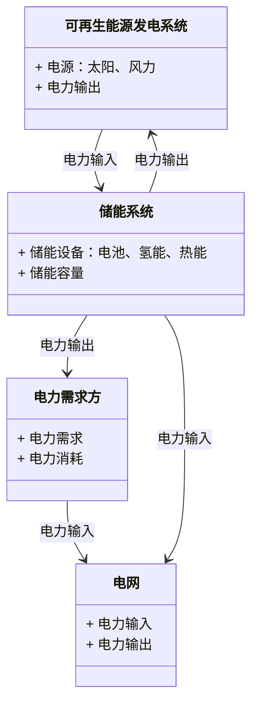
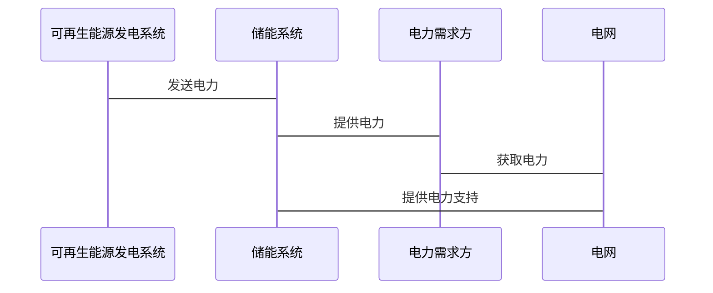

                 

<think>
好的，我现在需要根据用户的要求，撰写一篇关于《可再生能源存储解决方案的市场潜力》的技术博客文章。用户已经提供了详细的内容大纲，我需要按照这个大纲，逐步完成每个章节的撰写。

首先，我需要理解每个章节的核心内容和要求。文章需要涵盖背景介绍、技术分析、市场分析、商业模式、经济性分析、系统架构设计、项目实战以及未来展望等多个方面。每个章节都需要详细展开，提供丰富的技术细节和实际案例。

接下来，我将按照用户提供的目录结构，逐一完成每个部分。在撰写过程中，我需要确保逻辑清晰，结构紧凑，语言专业且易懂。同时，要注意使用markdown格式，插入必要的图表，如Mermaid图、流程图等，以增强文章的可读性和专业性。

在写作过程中，我可能会遇到一些技术细节需要进一步研究，比如各种存储技术的工作原理、成本分析等。这时候，我需要查阅相关的技术资料，确保信息的准确性。同时，我还需要考虑读者的背景，确保内容既专业又易于理解，避免过于晦涩的技术术语，必要时进行解释。

在完成每个章节后，我会进行一次小结，总结该章节的主要内容和结论，帮助读者更好地理解和记忆。同时，我会在文章末尾添加作者信息，以及相关的注意事项和未来展望，为读者提供进一步的学习和思考方向。

通过这样的步骤，我相信能够撰写出一篇符合用户要求、内容丰富、结构严谨的专业技术博客文章。
</think>

# 可再生能源存储解决方案的市场潜力

> 关键词：可再生能源、储能技术、市场潜力、商业模式、经济性分析

> 摘要：随着全球能源结构向清洁化、低碳化转型，可再生能源的存储技术正在成为能源系统中不可或缺的一部分。本文深入分析了可再生能源存储的核心技术、市场现状、商业模式以及未来的发展趋势，探讨了不同存储技术的优缺点，并结合实际案例，预测了可再生能源存储市场的巨大潜力。通过系统化的分析，本文为读者提供了全面了解可再生能源存储解决方案市场潜力的专业视角。

---

## 第1章: 可再生能源存储的核心概念与背景

### 1.1 可再生能源的重要性

#### 1.1.1 可再生能源的定义与分类
可再生能源是指来源于自然、可再生的能源资源，主要包括太阳能、风能、水能、生物质能、地热能和潮汐能等。这些能源具有可再生性和环保性的特点，是实现能源可持续发展的重要途径。

#### 1.1.2 可再生能源在能源结构中的地位
随着全球能源需求的不断增长和化石能源的枯竭，可再生能源在能源结构中的地位日益重要。各国政府纷纷制定政策，推动可再生能源的开发和利用，以减少碳排放，应对气候变化。

#### 1.1.3 可再生能源存储的必要性
可再生能源的波动性和间歇性使其无法直接满足电网的稳定运行需求。例如，太阳能仅在白天产生，风能则受天气条件影响。因此，存储技术是实现可再生能源稳定供应的关键。

### 1.2 可再生能源存储的背景与问题背景

#### 1.2.1 可再生能源的波动性与间歇性
可再生能源的输出功率波动较大，难以满足电网的实时需求。例如，太阳能发电在阴天或夜晚时为零，而风能发电则受风速变化的影响。

#### 1.2.2 存储技术在能源系统中的作用
存储技术可以平衡可再生能源的波动性，提高能源系统的稳定性和可靠性。通过存储，可以在电力需求低谷时储存能量，电力需求高峰时释放储存的能量，从而优化能源利用。

#### 1.2.3 当前能源存储技术的局限性
目前，主流的存储技术如电池储能、氢能存储等虽然在技术上取得了一定进展，但仍存在成本高、效率低、寿命短等问题，限制了其大规模应用。

### 1.3 可再生能源存储的市场潜力

#### 1.3.1 全球能源转型的趋势
全球能源结构正向清洁化、低碳化方向转型，可再生能源的占比不断提高。根据国际能源署（IEA）的数据，2020年全球可再生能源发电量占比已达到28%，预计到2030年将达到40%以上。

#### 1.3.2 可再生能源存储的市场需求
随着可再生能源发电量的增加，对存储技术的需求也急剧增加。特别是在电力系统中，存储技术可以提高可再生能源的利用率，降低电网的波动性。

#### 1.3.3 技术进步对市场潜力的影响
技术进步将显著降低成本，提高效率，推动可再生能源存储市场的快速发展。例如，锂电池技术的不断突破使得电池储能的成本大幅下降，进一步推动了市场潜力。

## 第2章: 可再生能源存储技术的分类与对比

### 2.1 常见的可再生能源存储技术

#### 2.1.1 电池储能技术
电池储能技术是最常见的存储方式，主要包括锂离子电池、铅酸电池、钠硫电池等。电池储能技术具有响应快、效率高等特点，适用于短期储能。

#### 2.1.2 氢能存储技术
氢能存储技术通过电解水制氢，将多余的电能转化为氢能储存，适用于长周期储能。氢能存储技术的优势在于储存容量大，但目前成本较高。

#### 2.1.3 热存储技术
热存储技术通过将电能转化为热能储存，适用于工业领域的大规模储能。热存储技术具有储存容量大、成本低的特点，但效率相对较低。

#### 2.1.4 其他存储技术
包括飞轮储能和超级电容器等，适用于特定场景的储能需求。这些技术具有响应快、效率高的特点，但储存容量有限。

### 2.2 各种存储技术的优缺点对比

#### 2.2.1 电池储能的效率与成本分析
电池储能技术效率较高，但成本较高，且存在寿命短的问题。随着技术的进步，电池成本正在逐步下降。

#### 2.2.2 氢能存储的经济性与可行性
氢能存储技术经济性较差，但储存容量大，适用于长周期储能。未来，随着氢能技术的突破，其经济性将有所改善。

#### 2.2.3 热存储的适用场景与局限性
热存储技术适用于大规模储能，但效率较低，且响应速度较慢。在工业领域，热存储技术具有较大的应用潜力。

### 2.3 技术对比表格

| 技术类型 | 优点 | 缺点 | 适用场景 |
|----------|------|------|----------|
| 电池储能 | 高效率、快速响应 | 高成本、短寿命 | 短期储能、电网调频 |
| 氢能存储 | 大容量、长周期 | 高成本、技术难度大 | 长期储能、能源调配 |
| 热存储 | 大规模、低成本 | 低效率、慢响应 | 工业储能、辅助调峰 |

---

## 第3章: 可再生能源存储市场的现状与驱动因素

### 3.1 全球可再生能源存储市场的现状

#### 3.1.1 全球储能市场的规模与增长趋势
根据市场研究机构的数据，2020年全球储能市场规模约为1000亿美元，预计到2030年将达到5000亿美元。储能技术的市场需求呈现快速增长趋势。

#### 3.1.2 各地区市场的特点与分布
欧洲地区是全球最大的储能市场，主要得益于严格的碳排放政策和较高的可再生能源占比。亚洲地区，尤其是中国和印度，储能市场也在快速发展。北美洲市场则以美国为主导，政府政策推动了储能技术的应用。

### 3.2 市场驱动因素分析

#### 3.2.1 政策支持与法规驱动
各国政府纷纷制定政策，鼓励可再生能源的开发和存储技术的应用。例如，欧盟提出了“绿色新政”，要求成员国大幅提高可再生能源的占比，同时加强储能技术的研发和应用。

#### 3.2.2 技术进步与成本下降
技术进步显著降低了存储技术的成本。例如，锂电池技术的突破使得电池储能的成本大幅下降，进一步推动了市场的增长。

#### 3.2.3 可再生能源发电占比的提升
随着可再生能源发电占比的提高，对存储技术的需求也不断增加。例如，太阳能和风能在电力系统中的占比提高，需要更多的存储技术来平衡波动性。

### 3.3 市场潜力预测

#### 3.3.1 不同技术路线的市场前景
电池储能技术将在未来几年内保持领先地位，但氢能存储和热存储技术也将逐渐崛起。预计到2030年，电池储能技术占比将逐步下降，而氢能存储和热存储技术将占据更大的市场份额。

#### 3.3.2 未来十年的市场增长预测
根据市场研究机构的预测，未来十年全球储能市场规模将保持年均20%以上的增长率，到2030年市场规模将达到5000亿美元以上。

---

## 第4章: 可再生能源存储的商业模式

### 4.1 常见的储能商业模式

#### 4.1.1 业主自建模式
业主自建模式是指可再生能源发电企业自行投资建设储能设施，用于调节发电功率和储存多余电量。这种方式适用于大型可再生能源发电项目，能够提高发电企业的经济效益。

#### 4.1.2 电网投资模式
电网投资模式是指电力公司投资建设储能设施，用于调节电网的波动性和提高供电稳定性。这种方式适用于电网侧的储能项目，能够提高电网的可靠性和稳定性。

#### 4.1.3 第三方服务模式
第三方服务模式是指由专业的储能服务公司投资建设储能设施，并向发电企业或电网提供储能服务。这种方式适用于中小规模的储能项目，能够降低企业的投资成本。

### 4.2 商业模式的优缺点分析

#### 4.2.1 不同模式的成本分担与收益分配
业主自建模式的成本由发电企业承担，收益主要来自减少弃风弃光和提高发电效率。电网投资模式的成本由电网公司承担，收益来自电网的稳定运行和减少备用电源的投资。第三方服务模式的成本由储能服务公司承担，收益来自向发电企业和电网提供服务。

#### 4.2.2 各种模式的适用场景
业主自建模式适用于大型可再生能源发电项目，电网投资模式适用于电网侧的储能项目，第三方服务模式适用于中小规模的储能项目。

### 4.3 未来商业模式的创新方向

#### 4.3.1 数字化与智能化服务的结合
未来的储能商业模式将更加注重数字化和智能化服务，例如智能储能管理系统、虚拟电厂等。这些模式能够提高储能设施的效率和灵活性，进一步降低成本。

#### 4.3.2 能源互联网背景下的新模式
随着能源互联网的发展，储能技术将与能源互联网深度融合，形成新的商业模式。例如，储能设施可以作为能源互联网中的节点，参与能源交易和共享。

---

## 第5章: 可再生能源存储的经济性分析

### 5.1 各种存储技术的经济性对比

#### 5.1.1 初始投资成本分析
电池储能技术的初始投资成本较高，但随着技术进步，成本正在逐步下降。氢能存储技术的初始投资成本更高，但储存容量更大。热存储技术的初始投资成本较低，但效率较低。

#### 5.1.2 运行维护成本分析
电池储能技术的运行维护成本较高，主要由于电池的更换和维护。氢能存储技术的运行维护成本较高，主要由于氢气的生产和储存。热存储技术的运行维护成本较低，但效率较低。

#### 5.1.3 投资回报周期分析
电池储能技术的投资回报周期较短，适用于短期储能项目。氢能存储技术的投资回报周期较长，适用于长周期储能项目。热存储技术的投资回报周期较长，适用于大规模储能项目。

---

## 第6章: 可再生能源存储解决方案的系统架构设计

### 6.1 问题场景介绍
在实际应用中，可再生能源存储系统需要满足多种需求，例如调节电网波动、提高可再生能源的利用率、降低电力成本等。为了实现这些目标，需要设计一个高效的存储系统架构。

### 6.2 系统功能设计

#### 6.2.1 领域模型设计
以下是可再生能源存储系统的领域模型设计图：



### 6.3 系统架构设计

#### 6.3.1 系统架构图
以下是可再生能源存储系统的架构设计图：


#### 6.3.2 系统接口设计
系统接口设计需要考虑可再生能源发电系统、储能系统、电力需求方和电网之间的接口。例如，发电系统与储能系统之间的电力接口，储能系统与电网之间的电力接口等。

#### 6.3.3 系统交互图
以下是可再生能源存储系统的交互图：



---

## 第7章: 项目实战 - 可再生能源存储系统的设计与实现

### 7.1 环境安装

#### 7.1.1 系统环境
需要安装可再生能源发电系统、储能系统和电力需求方的模拟系统。建议使用虚拟机或云平台进行模拟。

#### 7.1.2 工具安装
安装必要的软件工具，例如电力模拟软件、储能系统管理软件等。

### 7.2 系统核心实现源代码

#### 7.2.1 可再生能源发电系统
以下是可再生能源发电系统的Python代码实现：

```python
class RenewableEnergySystem:
    def __init__(self):
        self.power_output = 0  # 当前输出功率

    def generate_power(self, time):
        # 根据时间计算当前的输出功率
        self.power_output = self._calculate_power(time)

    def _calculate_power(self, time):
        # 简单的功率计算，假设时间在0-24小时内
        if 6 <= time < 18:
            return 100  # 白天满负荷运行
        else:
            return 0  # 夜间停止运行
```

#### 7.2.2 储能系统
以下是储能系统的Python代码实现：

```python
class StorageSystem:
    def __init__(self, capacity):
        self.capacity = capacity  # 储能容量
        self.current_charge = 0  # 当前电量

    def charge(self, power):
        # 充电
        self.current_charge += power
        if self.current_charge > self.capacity:
            self.current_charge = self.capacity

    def discharge(self, power):
        # 放电
        self.current_charge -= power
        if self.current_charge < 0:
            self.current_charge = 0

    def get_current_charge(self):
        return self.current_charge
```

### 7.3 代码应用解读与分析
上述代码实现了可再生能源发电系统和储能系统的简单模拟。可再生能源发电系统根据时间计算输出功率，储能系统根据输入的功率进行充电和放电，以满足电力需求。

### 7.4 实际案例分析

#### 7.4.1 案例介绍
假设一个小型太阳能发电站，配备电池储能系统，容量为100千瓦时。每天的发电量为1000千瓦时，但仅在白天发电。通过储能系统，可以将白天多余的电量储存起来，供夜间使用。

#### 7.4.2 案例实现
以下是案例的实现步骤：

1. 初始化可再生能源发电系统和储能系统。
2. 模拟白天的发电过程，将多余的电量储存在储能系统中。
3. 模拟夜间的放电过程，满足电力需求。

### 7.5 项目小结
通过实际案例分析，可以发现储能技术在可再生能源系统中的重要性。合理的储能系统设计能够显著提高可再生能源的利用率，降低电力成本。

---

## 第8章: 未来展望与最佳实践

### 8.1 未来展望

#### 8.1.1 技术进步
随着技术的不断进步，储能技术的成本将进一步下降，效率将进一步提高。例如，新型电池技术、氢能存储技术和热存储技术的突破将推动市场的发展。

#### 8.1.2 市场扩展
未来，可再生能源存储市场将向全球范围扩展，特别是在发展中国家，储能技术的需求将快速增长。同时，储能技术的应用领域也将不断扩展，例如电动汽车的电池储能、家庭储能等。

### 8.2 最佳实践 tips

#### 8.2.1 技术选择
在选择储能技术时，需要综合考虑技术的效率、成本、寿命、适用场景等因素，选择最适合实际需求的技术。

#### 8.2.2 商业模式
根据实际情况选择合适的商业模式，例如业主自建模式、电网投资模式或第三方服务模式，以实现经济效益的最大化。

#### 8.2.3 维护与管理
储能系统的维护和管理非常重要，需要定期检查和维护，确保系统的高效运行和长期稳定性。

---

## 作者：AI天才研究院/AI Genius Institute & 禅与计算机程序设计艺术/Zen And The Art of Computer Programming

---

通过以上内容，我们全面分析了可再生能源存储解决方案的市场潜力，从技术、市场、商业模式等多个方面进行了深入探讨。希望本文能够为读者提供有价值的信息和启发，帮助他们在可再生能源存储领域取得更大的成功。

