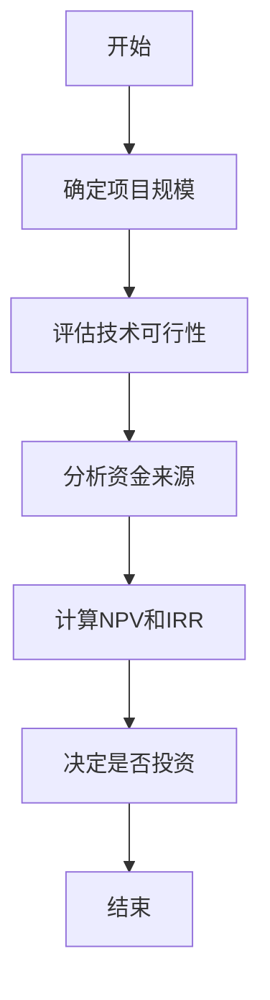
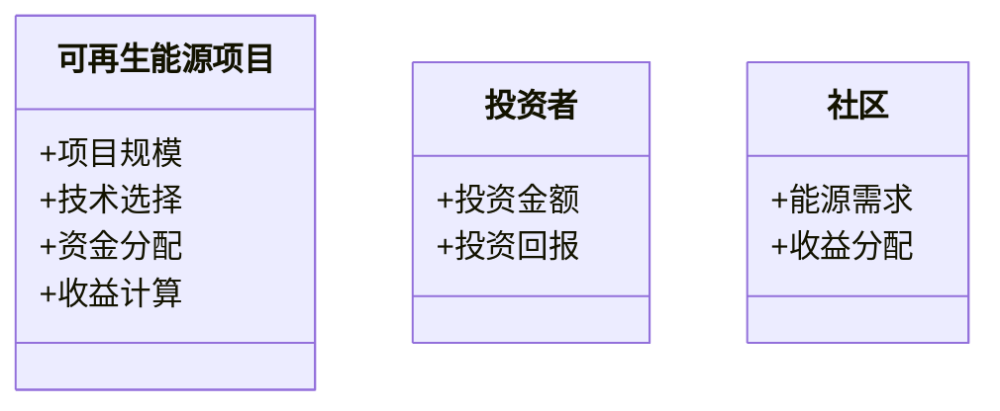
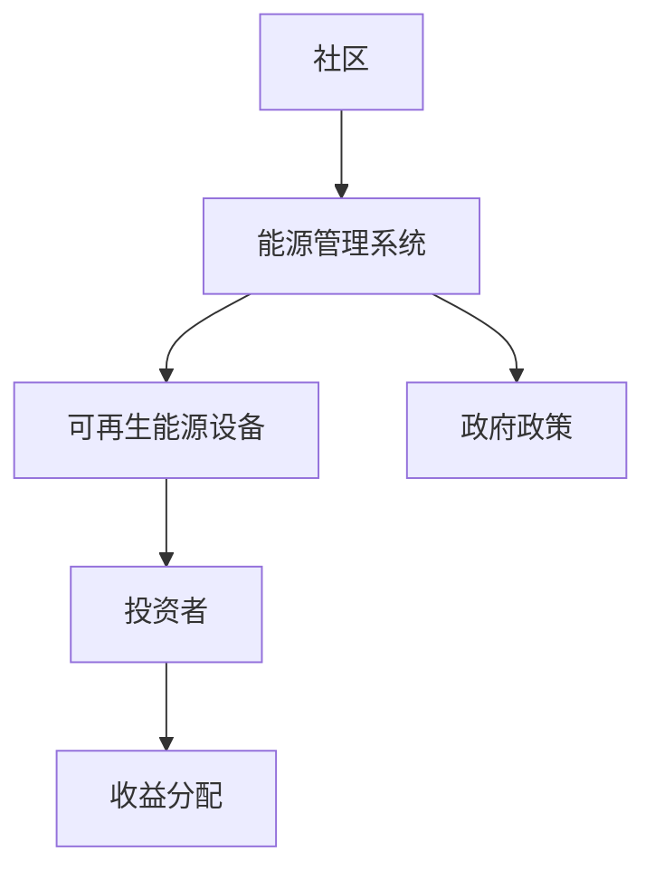

                 


# 可再生能源社区项目的投资模式研究

> **关键词**: 可再生能源, 投资模式, 社区项目, 能源可持续性, 技术经济分析

> **摘要**: 本文深入研究了可再生能源社区项目的投资模式，探讨了其背景、核心概念、技术原理、系统架构以及实际应用。通过分析可再生能源技术与投资模式的结合，本文提出了优化投资回报的策略，并通过实际案例展示了如何在社区项目中实现可持续的能源管理。

---

# 第一部分：可再生能源社区项目投资模式的背景与概念

## 第1章：可再生能源与社区项目概述

### 1.1 可再生能源的基本概念

#### 1.1.1 可再生能源的定义与分类
- 可再生能源是指来源于自然界的能源，能够持续再生的资源。
- 分类：太阳能、风能、水能、生物质能、地热能等。

#### 1.1.2 可再生能源的技术特点
- 清洁性：减少碳排放。
- 分布广：资源分布广泛，适合社区使用。
- 可持续性：资源利用不会枯竭。

#### 1.1.3 可再生能源在社区项目中的应用
- 屋顶太阳能板。
- 社区级储能系统。
- 分布式发电系统。

### 1.2 社区项目的特点与优势

#### 1.2.1 社区项目的定义与范围
- 小型分布式能源系统。
- 通常服务于特定社区或区域。

#### 1.2.2 社区项目的优势与挑战
- 优势：能源自给自足，减少传输损耗。
- 挑战：初期投资高，维护复杂。

#### 1.2.3 可再生能源与社区项目结合的意义
- 推动能源转型。
- 提高能源利用效率。
- 促进社区可持续发展。

### 1.3 可再生能源社区项目的背景与意义

#### 1.3.1 全球能源结构转型的背景
- 减少化石能源依赖。
- 应对气候变化。

#### 1.3.2 可再生能源社区项目的发展趋势
- 技术进步推动成本下降。
- 政策支持促进项目发展。

#### 1.3.3 社区项目对能源可持续性的影响
- 提高能源利用效率。
- 减少能源浪费。

## 第2章：可再生能源社区项目投资模式的背景

### 2.1 投资模式的基本概念

#### 2.1.1 投资模式的定义
- 投资模式是资金流向和分配的方式。

#### 2.1.2 投资模式的分类
- 项目融资。
- 股权投资。
- 债权投资。

#### 2.1.3 投资模式的核心要素
- 投资主体。
- 资金来源。
- 投资期限。
- 投资回报。

### 2.2 可再生能源投资模式的特点

#### 2.2.1 投资周期长
- 从建设到回收周期较长。

#### 2.2.2 投资风险高
- 受政策、技术和市场影响大。

#### 2.2.3 投资回报的不确定性
- 受能源价格波动影响。

### 2.3 可再生能源社区项目投资模式的背景

#### 2.3.1 社区能源自治的需求
- 提高能源使用效率。
- 减少对外部能源的依赖。

#### 2.3.2 政策支持与市场驱动
- 政府补贴。
- 绿色金融政策。

#### 2.3.3 技术进步与成本下降
- 太阳能板成本下降。
- 储能技术进步。

---

# 第二部分：可再生能源社区项目投资模式的核心概念与联系

## 第3章：可再生能源社区项目投资模式的核心概念

### 3.1 可再生能源技术与投资模式的关联

#### 3.1.1 技术成熟度对投资的影响
- 成熟技术风险低。
- 初期投资高，回报稳定。

#### 3.1.2 技术成本对投资回报的决定作用
- 成本下降提升投资吸引力。
- 技术复杂度影响维护成本。

#### 3.1.3 技术创新对投资模式的推动
- 新技术降低投资成本。
- 创新模式（如共享投资）降低门槛。

### 3.2 投资模式与社区利益的平衡

#### 3.2.1 社区利益最大化的原则
- 投资应优先考虑社区收益。
- 项目收益分配公平。

#### 3.2.2 投资者回报与社区收益的平衡
- 确保投资者获得合理回报。
- 项目收益用于社区发展。

#### 3.2.3 社区参与与决策的影响
- 社区参与降低风险。
- 共同决策提高项目成功率。

### 3.3 可再生能源社区项目的核心要素

#### 3.3.1 项目规模与选址
- 合适的规模确保效率。
- 合理的选址减少成本。

#### 3.3.2 资金来源与分配
- 多元化资金来源。
- 合理分配资金确保公平。

#### 3.3.3 运营与维护模式
- 专业团队运营。
- 分散化维护降低风险。

## 第4章：可再生能源社区项目投资模式的原理与联系

### 4.1 投资模式的原理分析

#### 4.1.1 资金流动的逻辑
- 资金流入：投资者提供资金。
- 资金流出：用于项目建设和运营。
- 回报：通过电价收入或政府补贴。

#### 4.1.2 投资回报的计算
- 净现值（NPV）计算。
- 内部收益率（IRR）分析。

#### 4.1.3 风险分担与利益分配
- 投资者分担风险。
- 利益分配公平。

### 4.2 核心概念的属性特征对比

| **概念**       | **属性**             |
|-----------------|----------------------|
| 可再生能源      | 可持续性、清洁性      |
| 投资模式        | 风险、回报、周期      |

---

# 第三部分：可再生能源社区项目投资模式的算法原理

## 第5章：可再生能源社区项目投资模式的算法原理

### 5.1 算法原理的数学模型

#### 5.1.1 净现值（NPV）计算
$$ NPV = \sum_{t=0}^{n} \frac{CF_t}{(1 + r)^t} $$
其中：
- \( CF_t \) 是第 \( t \) 年的现金流。
- \( r \) 是折现率。

#### 5.1.2 内部收益率（IRR）计算
$$ IRR = r \) 使得 NPV = 0。

### 5.2 算法流程图



---

# 第四部分：可再生能源社区项目投资模式的系统分析与架构设计

## 第6章：可再生能源社区项目投资模式的系统分析

### 6.1 问题场景介绍

#### 6.1.1 社区能源需求分析
- 确定能源需求量。
- 选择合适的能源技术。

#### 6.1.2 项目可行性评估
- 技术可行性。
- 经济可行性。
- 政策支持。

### 6.2 系统功能设计

#### 6.2.1 领域模型


### 6.3 系统架构设计

#### 6.3.1 系统架构图


---

# 第五部分：可再生能源社区项目投资模式的项目实战

## 第7章：可再生能源社区项目投资模式的项目实战

### 7.1 环境安装

#### 7.1.1 系统环境
- 操作系统：Linux。
- 开发工具：Python、Jupyter Notebook。
- 数据库：MySQL。

### 7.2 系统核心实现源代码

#### 7.2.1 净现值计算代码
```python
def calculate_npv(cash_flows, discount_rate):
    return sum(flow / (1 + discount_rate)**t for t, flow in enumerate(cash_flows))
```

#### 7.2.2 内部收益率计算代码
```python
import numpy as np

def calculate_irr(cash_flows):
    return np.irr(cash_flows)
```

### 7.3 项目实战案例分析

#### 7.3.1 案例背景
- 社区规模：100户。
- 项目类型：屋顶太阳能板。
- 资金来源：政府补贴、社区集资。

#### 7.3.2 投资回报分析
- NPV为正，IRR高于基准收益率。

### 7.4 项目小结

#### 7.4.1 成功经验
- 合理的技术选择。
- 多元化的资金来源。

#### 7.4.2 改进建议
- 提高社区参与度。
- 加强政策支持。

---

# 第六部分：总结与展望

## 第8章：总结与展望

### 8.1 最佳实践 tips
- 技术与经济分析并重。
- 社区参与是关键。

### 8.2 小结
- 可再生能源社区项目投资模式具有重要意义。
- 技术进步和政策支持是成功的关键。

### 8.3 注意事项
- 风险评估不可忽视。
- 投资回报需合理预期。

### 8.4 拓展阅读
- 参考文献：《可再生能源投资指南》。
- 推荐书籍：《能源经济分析》。

---

作者：AI天才研究院/AI Genius Institute & 禅与计算机程序设计艺术 /Zen And The Art of Computer Programming

