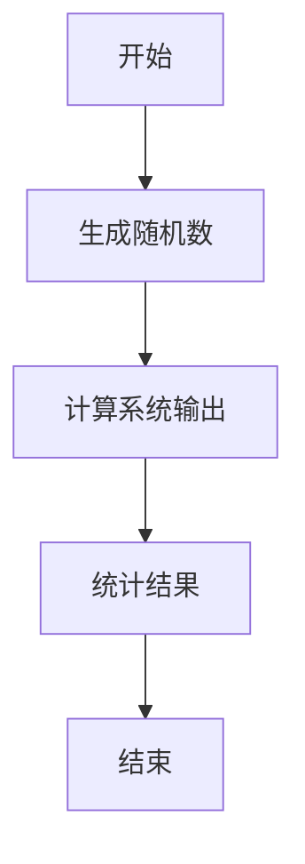

                 


# 可再生能源项目的投资风险评估

> 关键词：可再生能源，投资风险，风险评估，风险模型，风险分析

> 摘要：本文详细探讨了可再生能源项目投资风险评估的核心概念、数学模型、系统架构及实际应用。通过分析技术、市场、政策等多方面的风险因素，结合实际案例，提出了一套完整的风险评估方法，并给出了具体的实现方案和最佳实践建议。

---

## 第1章: 可再生能源项目投资风险评估的背景与意义

### 1.1 可再生能源的基本概念与特点

#### 1.1.1 可再生能源的定义与分类
可再生能源是指来源于自然、能够持续再生的能源资源。主要包括以下几类：
- **太阳能**: 通过太阳能电池板将太阳辐射能转化为电能。
- **风能**: 利用风力发电机组将风能转化为电能。
- **水能**: 包括水力发电和潮汐能等。
- **生物质能**: 利用有机物分解产生的能量，如农作物残余、林业残余等。
- **地热能**: 利用地球内部的热量进行发电或供暖。

#### 1.1.2 可再生能源发展的现状与趋势
近年来，全球能源结构正逐步向低碳化、清洁化方向转型，可再生能源在能源消费中的占比逐年提升。根据国际能源署（IEA）的报告，2022年全球可再生能源装机容量达到3,372GW，占总装机容量的66.7%。预计到2030年，这一比例将超过75%。

#### 1.1.3 可再生能源项目的特点与优势
- **环保性**: 几乎零排放，减少了对环境的污染。
- **可持续性**: 可再生能源资源是无限的，能够持续利用。
- **技术进步快**: 新技术不断涌现，提高了能源转化效率。
- **政策支持**: 各国政府纷纷出台政策支持可再生能源的发展。

---

### 1.2 投资风险评估的定义与重要性

#### 1.2.1 投资风险的定义
投资风险是指在投资过程中，由于各种不确定性因素导致投资收益低于预期甚至出现损失的可能性。在可再生能源项目中，投资风险主要来源于技术、市场、政策、财务和自然环境等多个方面。

#### 1.2.2 可再生能源项目投资风险的特点
- **复杂性**: 风险来源多样，涉及技术、政策、市场等多个领域。
- **动态性**: 随着技术进步和政策变化，风险因素不断变化。
- **区域性**: 不同地区的资源条件和政策环境差异较大，导致风险具有区域性。

#### 1.2.3 投资风险评估在项目决策中的作用
- **优化决策**: 通过风险评估，投资者可以更好地识别潜在风险，制定应对策略。
- **降低损失**: 风险评估可以帮助投资者提前制定风险管理计划，降低投资损失。
- **提高信心**: 通过科学的风险评估，投资者可以更加信心十足地进行投资。

---

### 1.3 可再生能源项目投资风险的背景与挑战

#### 1.3.1 行业政策与市场环境的影响
- **政策不确定性**: 各国政府政策的变化可能对可再生能源项目产生重大影响。
- **市场竞争**: 可再生能源行业的竞争日益激烈，市场价格波动较大。

#### 1.3.2 技术与经济不确定性
- **技术风险**: 新技术的不确定性可能导致项目失败。
- **经济风险**: 项目投资大、回收周期长，经济波动可能影响项目的盈利能力。

#### 1.3.3 自然与社会风险因素
- **自然灾害**: 如台风、洪水等可能对项目造成破坏。
- **社会因素**: 社会抗议、社区关系等也可能影响项目的实施。

---

## 第2章: 可再生能源项目投资风险评估的核心概念

### 2.1 风险评估的基本原理

#### 2.1.1 风险的构成要素
风险由三个要素构成：风险事件、风险概率和风险影响。公式表示为：
$$ \text{风险值} = \text{风险概率} \times \text{风险影响} $$

#### 2.1.2 风险评估的方法论
风险评估通常包括以下几个步骤：
1. **识别风险因素**: 确定所有可能影响项目的风险因素。
2. **评估风险概率**: 量化每个风险发生的可能性。
3. **评估风险影响**: 量化每个风险对项目的影响程度。
4. **综合风险评估**: 根据概率和影响，对风险进行排序和优先级划分。

#### 2.1.3 风险评估的流程与步骤
1. **数据收集**: 收集与项目相关的所有数据。
2. **风险识别**: 确定可能的风险因素。
3. **风险分析**: 量化每个风险的概率和影响。
4. **风险排序**: 根据综合评分对风险进行排序。
5. **风险应对**: 制定应对策略，降低高优先级风险。

---

### 2.2 可再生能源项目风险的分类

#### 2.2.1 技术风险
技术风险主要来源于技术创新的不确定性，例如新技术的不成熟或技术瓶颈的突破难度。

#### 2.2.2 市场风险
市场风险包括市场需求波动、价格竞争激烈等。

#### 2.2.3 政策风险
政策风险主要来源于政府政策的变化，例如税收政策、补贴政策的变化。

#### 2.2.4 财务风险
财务风险包括资金链断裂、融资成本上升等。

#### 2.2.5 自然环境风险
自然环境风险包括自然灾害、气候变化等对项目的影响。

---

### 2.3 风险评估的核心指标与模型

#### 2.3.1 风险概率与影响程度的评估指标
- **风险概率**: 0（不可能）到1（必然）之间的概率值。
- **风险影响**: 0（无影响）到1（重大影响）之间的影响值。

#### 2.3.2 风险矩阵模型
通过将风险概率和影响程度进行矩阵化，可以将风险分为不同类别。例如：

```mermaid
matrix title 风险矩阵
    row 常见风险
    row 中等风险
    row 罕见风险
    row 极少风险
    column 低影响
    column 中等影响
    column 高影响
    cell 少, 少, 极少风险
    cell 中, 少, 中等风险
    cell 高, 少, 高等风险
    cell 少, 中, 少等风险
    cell 中, 中, 中等风险
    cell 高, 中, 高等风险
    cell 少, 高, 少等风险
    cell 中, 高, 中等风险
    cell 高, 高, 高等风险
```

#### 2.3.3 综合风险评分模型
综合风险评分模型可以表示为：
$$ \text{综合风险评分} = \sum (\text{风险概率}_i \times \text{风险影响}_i) $$

---

## 第3章: 可再生能源项目投资风险评估的数学模型与算法

### 3.1 风险评估的数学模型

#### 3.1.1 风险概率计算模型
风险概率可以通过历史数据和统计方法进行计算。例如，使用贝叶斯定理：
$$ P(A|B) = \frac{P(B|A) \cdot P(A)}{P(B)} $$

#### 3.1.2 风险影响程度评估模型
风险影响程度可以通过模糊综合评价法进行评估，例如：
$$ \text{综合影响程度} = \sum (\text{权重}_i \times \text{影响程度}_i) $$

#### 3.1.3 综合风险评分模型
综合风险评分模型可以表示为：
$$ \text{综合风险评分} = \sum (\text{风险概率}_i \times \text{风险影响}_i) $$

---

### 3.2 常用的风险评估算法

#### 3.2.1 蒙特卡洛模拟算法
蒙特卡洛模拟是一种通过随机采样来估计系统行为的数值方法。其流程如下：



#### 3.2.2 模糊综合评价法
模糊综合评价法通过构建模糊评价矩阵，计算模糊权重，最终得出综合评价结果。

#### 3.2.3 层次分析法（AHP）
层次分析法通过构建层次结构，计算各因素的权重，进行综合评价。

---

### 3.3 算法实现与案例分析

#### 3.3.1 蒙特卡洛模拟的实现步骤
1. **确定输入参数**: 如概率分布、随机变量等。
2. **生成随机数**: 使用随机数生成器生成样本。
3. **计算系统输出**: 根据随机数计算系统输出。
4. **统计结果**: 统计输出结果，计算期望值、方差等。

#### 3.3.2 模糊综合评价法的数学公式
模糊综合评价法的公式为：
$$ \text{综合评价} = \sum (\text{权重}_i \times \text{评价}_i) $$

#### 3.3.3 层次分析法的权重计算与应用
层次分析法通过构建判断矩阵，计算特征向量和最大特征值，得到各因素的权重。

---

## 第4章: 可再生能源项目投资风险评估的系统分析与架构设计

### 4.1 项目风险评估系统的功能需求

#### 4.1.1 系统目标与范围
系统目标是实现可再生能源项目风险的全面评估，范围包括技术、市场、政策等多方面。

#### 4.1.2 系统功能模块划分
- **数据采集模块**: 收集项目相关数据。
- **风险评估模块**: 计算风险概率和影响程度。
- **风险报告模块**: 生成风险评估报告。

#### 4.1.3 系统输入输出分析
- **输入**: 项目数据、历史数据等。
- **输出**: 风险评估报告、风险评分等。

---

### 4.2 系统架构设计

#### 4.2.1 分层架构设计
系统架构采用分层设计，包括数据层、业务逻辑层和表现层。

#### 4.2.2 模块化设计
系统功能模块化设计，包括数据采集、风险评估、报告生成等模块。

#### 4.2.3 数据流与控制流设计
数据流从输入到输出，经过数据处理和计算，最终生成风险评估报告。

---

### 4.3 系统接口与交互设计

#### 4.3.1 用户界面设计
用户界面简洁直观，方便用户输入数据和查看报告。

#### 4.3.2 系统接口定义
系统接口包括数据接口、计算接口和报告生成接口。

#### 4.3.3 交互流程设计
用户输入数据 -> 系统处理数据 -> 生成风险报告 -> 用户查看报告。

---

## 第5章: 可再生能源项目投资风险评估的项目实战

### 5.1 项目环境与工具安装

#### 5.1.1 开发环境搭建
安装Python、Java等编程语言和相关开发工具。

#### 5.1.2 数据收集与处理工具安装
安装数据采集工具和数据分析工具，如爬虫工具和数据分析库。

#### 5.1.3 风险评估工具安装
安装蒙特卡洛模拟工具和模糊综合评价法工具。

---

### 5.2 系统核心实现源代码

#### 5.2.1 风险概率计算代码
```python
import random

def calculate_probability(n):
    count = 0
    for _ in range(n):
        if random.random() < 0.3:
            count += 1
    return count / n
```

#### 5.2.2 风险影响评估代码
```python
def calculate_impact(data):
    return sum(data) / len(data)
```

#### 5.2.3 综合风险评分代码
```python
def calculate_total_risk(probability, impact):
    return probability * impact
```

---

### 5.3 代码应用解读与分析

#### 5.3.1 代码功能解读
上述代码分别实现了风险概率计算、风险影响评估和综合风险评分。

#### 5.3.2 代码实现细节
代码使用Python语言实现，通过随机数生成和数据处理，计算风险概率和影响程度。

---

### 5.4 案例分析

#### 5.4.1 案例背景
某太阳能项目，计划投资10亿元，建设周期为3年。

#### 5.4.2 数据采集与处理
采集历史数据，包括政策变化、市场价格、技术瓶颈等。

#### 5.4.3 风险评估与应对
通过风险评估模型，识别出政策风险和市场风险为高优先级风险，并制定应对策略。

---

### 5.5 项目小结

通过实际案例分析，验证了风险评估模型的有效性，为后续项目提供了宝贵的经验。

---

## 作者：AI天才研究院/AI Genius Institute & 禅与计算机程序设计艺术 /Zen And The Art of Computer Programming

