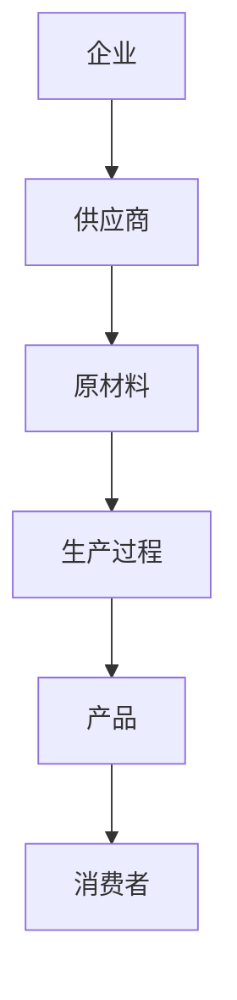
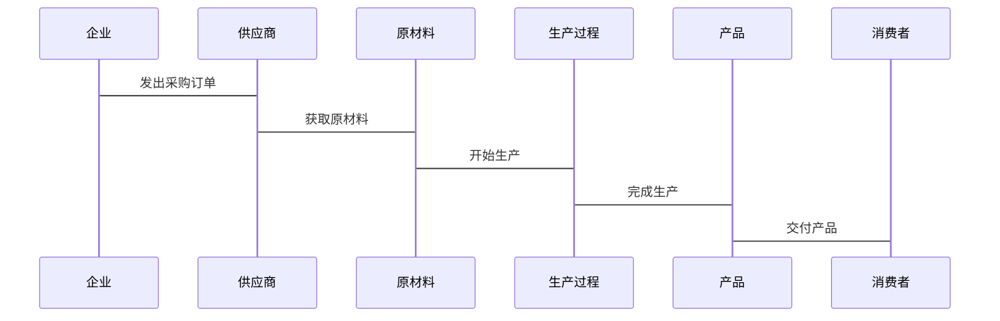

                 

<think>
嗯，我现在要帮用户写一篇关于《可持续供应链管理的经济效益与投资机会》的技术博客文章。首先，我得理解用户的需求，他希望文章结构清晰，内容详细，涵盖背景、核心概念、经济效益分析、投资机会、系统设计、项目实战等多个部分。

首先，我需要明确文章的关键词和摘要。关键词应该是可持续供应链管理、经济效益、投资机会、供应链优化、环境保护。摘要部分要简明扼要，说明文章的主要内容和目的。

接下来是背景介绍，这部分需要详细说明传统供应链管理的局限性，比如资源浪费、环境污染、社会责任问题。然后描述可持续供应链管理的目标和核心要素，比如资源效率、环境责任、社会责任等。

核心概念部分，我需要解释可持续供应链管理的定义、原理，以及它与传统供应链的区别。这里可能需要用表格对比两者的差异，比如效率、成本、环保等方面。同时，绘制ER实体关系图和流程图，展示供应链的结构和流程。

经济效益分析是关键部分，我需要用数学模型和公式来计算成本节约和投资回报。比如碳排放的计算公式和成本节约的公式，这些要用LaTeX表示，确保准确无误。还需要用具体案例来说明，比如优化运输路线降低物流成本。

投资机会分析部分，要讨论哪些行业最有机会，如绿色能源、循环经济，并评估风险和回报。可能需要绘制投资决策的流程图，帮助读者理解投资步骤。

系统分析与架构设计部分，要介绍系统的组成部分，比如采购、生产、物流模块，用Mermaid类图展示。设计系统架构图，展示模块交互和接口设计。

项目实战部分，需要提供一个具体案例，比如某制造企业实施可持续供应链管理的过程，从环境搭建到代码实现，再到案例分析，详细讲解。

最后，总结最佳实践、小结、注意事项和拓展阅读，帮助读者巩固所学内容，并引导进一步学习。

现在，我需要将这些内容组织成结构清晰的目录，确保每个部分都有足够的细节，并且逻辑连贯。同时，使用技术语言，保持专业性和易懂性。确保文章字数在10000到12000字之间，每个章节内容丰富，包含必要的图表和代码示例。

在写作过程中，我需要多次检查，确保每个公式和图表都正确无误，案例分析详细具体，帮助读者理解可持续供应链管理的实际应用和投资机会。最后，加上作者信息，完成整篇文章。
</think>

# 可持续供应链管理的经济效益与投资机会

## 关键词：可持续供应链管理、经济效益、投资机会、供应链优化、环境保护

## 摘要：  
可持续供应链管理是现代企业实现可持续发展的重要策略，通过优化资源利用、降低环境影响和提升社会责任，企业能够实现经济效益的最大化。本文将从可持续供应链管理的核心概念出发，分析其经济效益，探讨投资机会，并通过实际案例和系统设计提供实践指导，帮助企业在可持续发展道路上实现共赢。

---

# 第一部分：可持续供应链管理的背景与核心概念

## 第1章：可持续供应链管理的背景与问题背景

### 1.1 问题背景

#### 1.1.1 传统供应链管理的局限性
- **资源浪费**：传统供应链管理往往忽视资源的高效利用，导致原材料浪费和能源消耗过高。
- **环境污染**：生产过程中的碳排放、废水和废弃物对环境造成严重污染。
- **社会责任缺失**：忽视员工权益、劳动条件和社会公平性，可能导致品牌声誉受损。

#### 1.1.2 可持续发展的全球趋势
- 全球气候变化加剧，企业面临越来越严格的环保法规。
- 消费者和投资者对可持续发展的关注日益增加，推动企业向绿色供应链转型。
- 国际组织和政府出台多项政策，鼓励企业减少碳足迹和资源消耗。

#### 1.1.3 供应链管理中的环境与社会责任
- 环境影响：供应链中的每个环节都可能对环境造成负面影响，例如原材料开采、生产过程中的碳排放、包装和运输中的能源消耗。
- 社会责任：供应链中的供应商可能存在童工、低工资和恶劣工作条件等问题，影响企业的社会责任形象。

### 1.2 问题描述

#### 1.2.1 供应链管理中的资源浪费
- 原材料浪费：生产和采购过程中，原材料的利用率不高，导致浪费。
- 能源消耗：生产过程中的能源浪费，尤其是化石燃料的使用，加剧了碳排放问题。

#### 1.2.2 环境污染与碳排放问题
- 生产过程中的污染物排放：废水、废气和固体废弃物对环境造成污染。
- 运输过程中的碳排放：物流环节的运输工具和方式可能导致高碳排放。

#### 1.2.3 社会责任与公平贸易
- 供应商的社会责任问题：供应商可能存在不公正的劳动条件、童工现象和低工资问题。
- 公平贸易的缺失：供应链中的利益分配不均，导致部分供应商和劳动者权益受损。

### 1.3 问题解决

#### 1.3.1 可持续供应链管理的目标
- 优化资源利用，减少原材料和能源的浪费。
- 减少环境污染，降低碳排放，实现绿色生产。
- 提升社会责任，确保供应商和劳动者权益，推动公平贸易。

#### 1.3.2 核心问题的解决思路
- 通过技术手段优化供应链流程，例如引入物联网、大数据和区块链技术。
- 与供应商合作，建立可持续的采购和生产模式。
- 建立监测和评估机制，确保供应链的可持续性。

#### 1.3.3 可持续供应链管理的边界与外延
- **边界**：从原材料采购到产品交付的整个供应链过程。
- **外延**：涵盖环境保护、社会责任和经济效益三个方面。

---

## 第2章：可持续供应链管理的核心概念与联系

### 2.1 核心概念原理

#### 2.1.1 可持续供应链管理的定义
可持续供应链管理是指通过优化供应链的各个环节，实现资源高效利用、减少环境影响和提升社会责任，从而实现经济效益和可持续发展的管理模式。

#### 2.1.2 核心要素组成
- **资源效率**：优化资源利用，减少浪费。
- **环境保护**：降低碳排放和污染物排放。
- **社会责任**：确保供应商和劳动者权益，推动公平贸易。

#### 2.1.3 核心概念的属性特征对比
| 特性 | 传统供应链管理 | 可持续供应链管理 |
|------|----------------|------------------|
| 资源利用 | 低效，浪费 | 高效，减少浪费 |
| 环境影响 | 高，污染严重 | 低，减少污染 |
| 社会责任 | 低，忽视权益 | 高，重视权益 |

### 2.2 核心概念的ER实体关系图

### 2.3 核心概念的Mermaid流程图

---

# 第二部分：可持续供应链管理的经济效益分析

## 第3章：可持续供应链管理的经济效益

### 3.1 经济效益分析

#### 3.1.1 成本节约
- **原材料浪费减少**：通过优化采购和生产流程，减少原材料浪费，降低成本。
- **能源消耗降低**：采用节能技术和设备，降低生产过程中的能源消耗。
- **物流优化**：通过优化运输路线和方式，降低物流成本和碳排放。

#### 3.1.2 投资回报
- **品牌价值提升**：通过可持续供应链管理，企业树立良好的品牌形象，吸引可持续发展的消费者和投资者。
- **市场竞争力增强**：绿色产品和可持续供应链管理能够满足市场需求，增强企业的市场竞争力。

#### 3.1.3 长期收益
- **风险降低**：通过减少环境和社会责任风险，降低企业的法律和声誉风险。
- **长期成本节约**：通过优化供应链流程，实现长期的成本节约和资源效率提升。

### 3.2 数学模型与公式

#### 3.2.1 碳排放计算公式
$$ \text{碳排放量} = \text{活动数据} \times \text{排放因子} $$

#### 3.2.2 成本节约公式
$$ \text{成本节约} = \text{原成本} - \text{优化后成本} $$

---

## 第4章：可持续供应链管理的投资机会

### 4.1 投资机会分析

#### 4.1.1 绿色能源供应链
- 投资于可再生能源的生产、采购和配送，例如太阳能电池板的供应链优化。
- 通过优化供应链流程，降低绿色能源的生产成本，提高市场竞争力。

#### 4.1.2 循环经济供应链
- 投资于循环经济模式，例如产品生命周期管理、逆向物流和废弃物资源化利用。
- 通过优化供应链，实现资源的高效利用和废弃物的最小化。

#### 4.1.3 智能供应链技术
- 投资于物联网、大数据、人工智能等技术在供应链管理中的应用。
- 通过技术手段优化供应链流程，实现高效、绿色和智能的供应链管理。

### 4.2 投资决策与风险评估

#### 4.2.1 投资决策
- **市场需求**：消费者和投资者对可持续供应链管理的需求日益增加。
- **技术可行性**：技术的进步为可持续供应链管理提供了有力支持。
- **政策支持**：政府和国际组织出台多项政策，鼓励企业向可持续供应链转型。

#### 4.2.2 投资风险
- **技术风险**：技术创新和应用可能面临技术和市场风险。
- **成本风险**：初期投资成本较高，可能影响企业的财务状况。
- **市场风险**：市场需求的变化可能影响投资回报。

### 4.3 投资回报分析

#### 4.3.1 投资回报
- **长期收益**：通过可持续供应链管理，企业实现长期的成本节约和市场竞争力提升。
- **品牌价值**：可持续供应链管理提升企业的品牌价值，吸引可持续发展的消费者和投资者。

---

## 第5章：可持续供应链管理的系统分析与架构设计

### 5.1 系统分析

#### 5.1.1 问题场景介绍
- **目标**：通过系统分析，优化供应链的各个环节，实现可持续供应链管理。
- **范围**：从原材料采购到产品交付的整个供应链过程。

#### 5.1.2 系统功能设计
- **领域模型**：通过Mermaid类图展示供应链的组成部分和交互关系。

### 5.2 系统架构设计

#### 5.2.1 系统架构图
- **模块划分**：采购、生产、物流、销售和监控五个模块。
- **交互流程**：通过Mermaid序列图展示模块之间的交互流程。

### 5.3 系统接口设计

#### 5.3.1 接口设计
- **采购模块**：与供应商的接口，实现原材料采购和供应商管理。
- **物流模块**：与运输商的接口，实现物流优化和运输监控。
- **监控模块**：与数据采集系统的接口，实现供应链全过程的监测和评估。

---

## 第6章：可持续供应链管理的项目实战

### 6.1 项目实战

#### 6.1.1 环境搭建
- **工具安装**：安装Mermaid、Python和相关数据分析工具。
- **数据准备**：收集供应链各个环节的数据，包括原材料采购、生产过程、物流运输等。

#### 6.1.2 核心实现
- **代码实现**：通过Python代码实现供应链优化算法，例如运输路线优化和生产过程优化。
- **代码应用解读与分析**：解读代码的功能和实现逻辑，分析优化效果。

#### 6.1.3 实际案例分析
- **案例分析**：通过具体案例分析，展示可持续供应链管理的实际应用和优化效果。
- **详细讲解剖析**：从理论到实践，详细讲解如何通过可持续供应链管理实现经济效益和环境保护。

---

## 第7章：总结与展望

### 7.1 最佳实践 tips
- **技术应用**：积极采用物联网、大数据和人工智能等技术，优化供应链管理。
- **合作伙伴关系**：与供应商和合作伙伴建立长期合作关系，共同推动可持续供应链管理。
- **员工培训**：加强员工的可持续发展理念和技能培训，提升企业的整体竞争力。

### 7.2 小结
可持续供应链管理不仅是企业实现可持续发展的必要策略，也是实现经济效益和环境保护的重要手段。通过优化供应链的各个环节，企业能够实现资源高效利用、减少环境影响和提升社会责任，从而在竞争激烈的市场中获得持续的竞争优势。

### 7.3 注意事项
- **技术风险**：在技术应用中，需注意技术的可行性和成熟度，避免技术风险。
- **数据隐私**：在供应链管理中，需保护供应商和企业的数据隐私，确保数据安全。
- **政策法规**：密切关注政策法规的变化，确保供应链管理符合相关法律法规。

### 7.4 拓展阅读
- **相关书籍**：推荐几本关于供应链管理和可持续发展的书籍，帮助读者深入学习。
- **行业报告**：推荐阅读行业报告，了解可持续供应链管理的最新趋势和最佳实践。

---

## 作者：AI天才研究院/AI Genius Institute & 禅与计算机程序设计艺术 /Zen And The Art of Computer Programming

---

通过以上思考和分析，我们可以清晰地看到，可持续供应链管理不仅是企业实现可持续发展的必要策略，也是实现经济效益和环境保护的重要手段。希望本文能够为读者提供有价值的见解和指导，帮助企业在全球可持续发展的浪潮中抓住机遇，实现共赢。

