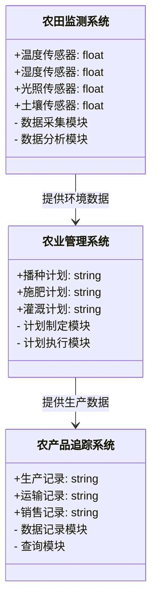

                 


# 可持续农业实践与相关产业链投资

> 关键词：可持续农业，精准农业，农业物联网，农业区块链，农业投资，产业链分析，系统架构

> 摘要：本文深入探讨了可持续农业的实践与相关产业链投资的策略。从可持续农业的定义、现状和技术应用入手，结合精准农业、物联网和区块链等技术的实践，分析了农业产业链的上游、中游和下游环节。通过系统架构设计和投资策略的讨论，本文为读者提供了全面的视角，帮助其理解可持续农业的技术创新和投资机会。

---

## 第一部分: 可持续农业的背景与概念

### 第1章: 可持续农业的定义与特点

#### 1.1 可持续农业的定义
可持续农业是一种旨在在满足当前农业需求的同时，不损害后代满足其自身需求能力的农业生产方式。其核心在于实现农业生产的高效性、资源利用的可持续性以及生态环境的保护。

**核心概念术语说明：**
- **可持续性**：指在不耗尽资源的前提下，长期维持农业生产的稳定性。
- **高效性**：通过技术创新和管理优化，提高农业生产效率。
- **生态友好**：减少对环境的负面影响，保护生态系统。

**问题背景与描述：**
传统农业模式往往依赖化肥、农药和过度耕作，导致土壤退化、水资源污染和生物多样性减少等问题。这些问题不仅威胁到农业的长期发展，也对人类健康和生态环境造成了严重的影响。

**问题解决：**
可持续农业通过采用环保技术、资源循环利用和生态友好型管理，解决传统农业面临的资源枯竭、环境污染和生态失衡问题。

**边界与外延：**
可持续农业的边界包括农业生产、资源利用和环境保护，外延则涉及技术创新、政策支持和社会参与。

**核心要素组成：**
1. 农业生产方式的优化
2. 资源（土地、水、能源）的高效利用
3. 生态系统的保护与恢复

---

#### 1.2 可持续农业的现状与挑战

**挑战分析：**
- **资源约束**：水资源短缺、土地退化等问题限制了传统农业的发展。
- **环境污染**：化肥和农药的过度使用导致土壤和水体污染。
- **气候变化**：极端天气事件频发，影响农业生产和稳定性。

**发展趋势：**
- **技术创新**：精准农业、物联网和区块链等技术的应用推动农业向智能化、数据化方向发展。
- **政策支持**：各国政府通过补贴、税收优惠等政策鼓励可持续农业实践。
- **消费者需求**：消费者对绿色、有机农产品的需求增加，推动了可持续农业的发展。

**全球实践案例：**
- **欧盟**：推广有机农业和生态种植。
- **中国**：实施土地流转和农业合作社模式，推动规模化和集约化生产。

---

#### 1.3 可持续农业的技术应用

**精准农业技术：**
- **定义**：通过GPS、遥感和传感器等技术，实现农田精准管理。
- **特点**：提高资源利用效率，减少浪费。
- **应用场景**：土壤监测、作物病虫害监测、精准施肥。

**农业物联网技术：**
- **定义**：通过传感器和网络设备，实时监测和管理农业生产过程。
- **特点**：数据驱动，实时反馈。
- **应用场景**：温室环境监测、智能灌溉、农产品追溯。

**农业区块链技术：**
- **定义**：利用区块链技术实现农产品供应链的透明化和可追溯性。
- **特点**：防篡改、可追溯。
- **应用场景**：农产品溯源、供应链管理、信任机制建立。

---

## 第二部分: 可持续农业的技术与实践

### 第2章: 精准农业技术的应用

#### 2.1 精准农业的定义与特点

**定义：**
精准农业是一种基于地理位置和环境条件，优化农业生产过程的技术体系。

**特点：**
- **精准性**：根据具体环境数据调整农业生产策略。
- **高效性**：通过数据驱动决策，提高农业生产效率。
- **可持续性**：减少资源浪费，保护生态环境。

---

#### 2.2 农业物联网技术的实现

**传感器数据采集：**
- **温度传感器**：监测农田温度。
- **湿度传感器**：监测土壤湿度。
- **光照传感器**：监测光照强度。

**数据传输与处理：**
- **无线传感器网络**：将数据传输到云端。
- **数据存储与分析**：利用大数据技术进行分析和预测。

**智能决策支持：**
- **精准灌溉**：根据土壤湿度数据自动启动灌溉系统。
- **病虫害预警**：通过数据分析提前发现病虫害风险。

---

#### 2.3 农业区块链技术的应用

**农产品溯源系统：**
- **区块链记录**：从生产到销售的每个环节都记录在区块链上。
- **消费者查询**：消费者可以通过区块链查询农产品的来源和生产过程。

**供应链管理：**
- **透明化**：区块链确保供应链中的每个环节都可追溯。
- **信任机制**：区块链技术建立的信任机制减少了供应链中的欺诈行为。

---

### 第3章: 可持续农业的环境与经济模型

#### 3.1 可持续农业的环境影响评估

**环境影响的量化方法：**
- **生命周期评估（LCA）**：从生产到废弃的全生命周期评估农产品的环境影响。
- **碳足迹计算**：计算农业生产过程中的碳排放量。

**环境影响的优化策略：**
- **减少化肥使用**：采用有机肥料和精准施肥技术。
- **水资源管理**：推广滴灌和智能灌溉系统，减少水浪费。

---

#### 3.2 可持续农业的经济模型

**经济效益的分析：**
- **投入与产出分析**：计算可持续农业模式下的投入成本和产出收益。
- **长期收益**：通过提高资源利用效率和产品质量，获得长期收益。

**经济模型的构建：**
- **成本收益分析**：比较传统农业和可持续农业的经济效益。
- **投资回报周期**：评估可持续农业技术的投资回报周期。

---

## 第三部分: 可持续农业的产业链分析

### 第3章: 农业产业链的上游环节

#### 3.1 农业生产资料的供应

**种子与农资供应：**
- **优质种子**：选择高产、抗病虫害的作物品种。
- **农资供应**：提供有机肥料、生物农药等环保农资。

**技术创新与支持：**
- **农业技术推广**：政府和企业合作推广可持续农业技术。
- **农业科技研发**：加大对农业技术创新的投入。

---

### 第3.2 农业生产过程中的技术创新

**精准农业技术的应用：**
- **土壤监测**：通过传感器实时监测土壤湿度和养分含量。
- **精准施肥**：根据土壤测试结果进行变量施肥。

**农业物联网的应用：**
- **智能灌溉**：根据天气和土壤湿度自动启动灌溉系统。
- **病虫害监测**：通过无人机和传感器实时监测作物健康状况。

---

### 第3.3 农业产业链的下游环节

#### 3.1 农产品加工与销售

**绿色加工技术：**
- **有机加工**：采用环保加工工艺，减少对环境的污染。
- **包装与物流**：使用可降解包装材料，优化物流路径，减少碳排放。

**市场与品牌建设：**
- **绿色认证**：通过有机认证和可持续认证提升产品竞争力。
- **品牌营销**：通过品牌建设提高消费者对绿色农产品的认知和信任。

---

## 第四部分: 可持续农业的投资策略

### 第4章: 可持续农业的投资机会

#### 4.1 精准农业技术的投资

**市场分析：**
- **需求增长**：随着技术进步和消费者需求变化，精准农业市场潜力巨大。
- **技术驱动**：精准农业技术的不断创新为投资者提供了丰富的投资机会。

**投资策略：**
- **技术创新**：投资于具有创新性的精准农业技术。
- **市场拓展**：通过市场调研和渠道建设扩大市场份额。

---

### 第4.2 农业区块链技术的投资

**投资价值：**
- **信任机制**：区块链技术能够提升农产品供应链的透明度和信任度。
- **市场潜力**：随着消费者对绿色食品需求的增加，区块链技术在农业中的应用前景广阔。

**投资策略：**
- **技术整合**：将区块链技术与其他农业技术（如物联网）结合，形成完整的解决方案。
- **生态合作**：与农业产业链上下游企业合作，构建完整的生态系统。

---

## 第五部分: 可持续农业的系统架构与设计

### 第5章: 可持续农业的系统架构

#### 5.1 系统功能设计

**领域模型（Mermaid类图）：**



---

#### 5.2 系统架构设计

**系统架构图（Mermaid架构图）：**

```mermaid
archiecture {
    客户端 <-- call --> 中间件
    中间件 <-- connect --> 数据库
    数据库 <-- call --> 后台服务
    后台服务 <-- call --> 第三方服务
}
```

---

#### 5.3 系统接口设计

**系统接口设计：**
- **农田监测接口**：提供环境数据采集和传输功能。
- **农业生产管理接口**：实现播种、施肥和灌溉计划的制定与执行。
- **农产品追踪接口**：提供农产品的生产、运输和销售信息查询功能。

---

## 第六部分: 可持续农业的项目实战

### 第6章: 项目实战

#### 6.1 环境安装与配置

**环境要求：**
- **操作系统**：Linux/Windows/MacOS
- **编程语言**：Python 3.8+
- **开发工具**：PyCharm/VS Code
- **第三方库**：numpy, pandas, matplotlib, scikit-learn

**安装命令：**
```bash
pip install numpy pandas matplotlib scikit-learn
```

---

#### 6.2 核心代码实现

**传感器数据采集与分析代码：**

```python
import numpy as np
import pandas as pd
import matplotlib.pyplot as plt
from sklearn import linear_model

# 读取传感器数据
data = pd.read_csv('sensor_data.csv')

# 数据预处理
data['timestamp'] = pd.to_datetime(data['timestamp'])
data.set_index('timestamp', inplace=True)

# 绘制温度变化曲线
plt.figure(figsize=(10,6))
data['temperature'].plot(label='温度')
plt.title('温度变化曲线')
plt.xlabel('时间')
plt.ylabel('温度（℃）')
plt.legend()
plt.show()

# 线性回归预测
X = data.index.values.reshape(-1,1)
y = data['temperature'].values

# 训练模型
model = linear_model.LinearRegression()
model.fit(X, y)

# 预测未来温度
future_dates = pd.date_range('2023-10-01', periods=7).values.reshape(-1,1)
future_temp = model.predict(future_dates)

# 可视化预测结果
plt.figure(figsize=(12,6))
data['temperature'].plot(label='历史温度')
plt.scatter(future_dates, future_temp, color='red', label='预测温度')
plt.title('温度变化及预测')
plt.xlabel('时间')
plt.ylabel('温度（℃）')
plt.legend()
plt.show()
```

---

## 第七部分: 综合分析与总结

### 第7章: 综合分析

#### 7.1 政策与伦理分析

**政策支持：**
- **政府补贴**：许多国家提供可持续农业技术的补贴。
- **法规支持**：通过法规鼓励有机农业和绿色农业的发展。

**伦理与社会责任：**
- **社会责任**：企业应承担起保护环境和促进可持续发展的责任。
- **消费者教育**：提高消费者对可持续农业的认知和参与。

---

#### 7.2 未来趋势与投资影响

**未来趋势：**
- **技术创新**：人工智能、物联网和区块链等技术将进一步深度融合。
- **绿色金融**：可持续农业项目将获得更多绿色金融支持。

**投资影响：**
- **长期回报**：可持续农业投资具有较高的长期回报潜力。
- **风险降低**：通过技术创新和政策支持，降低投资风险。

---

## 作者：AI天才研究院/AI Genius Institute & 禅与计算机程序设计艺术 /Zen And The Art of Computer Programming

---

以上是《可持续农业实践与相关产业链投资》的技术博客文章的详细内容，涵盖了从背景分析到技术实践、系统设计再到投资策略的各个方面。希望本文能为读者提供关于可持续农业的深入理解和投资机会的全面洞察。

