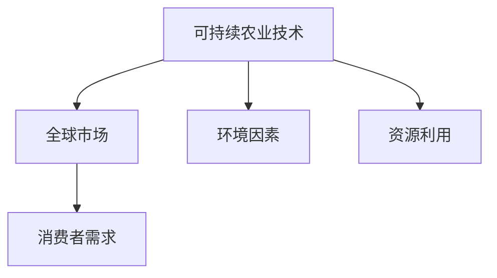
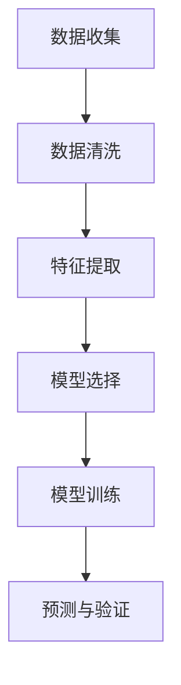
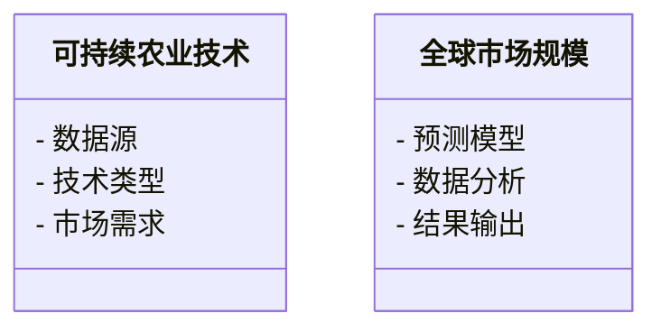
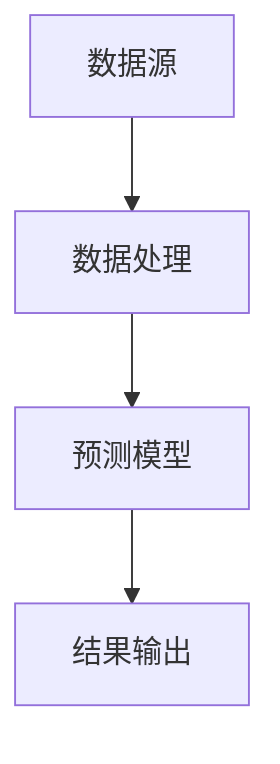

                 

<think>
嗯，用户让我以《可持续农业技术的全球市场规模预测》为标题写一篇技术博客，还提供了一个详细的目录大纲。看起来用户是想深入了解这个领域的市场规模预测，包括背景、方法、系统分析和实战等内容。我需要按照目录一步步详细展开每个部分，确保内容全面且有深度。

首先，我应该先写摘要部分，简明扼要地介绍文章的核心内容。然后是关键词，列出5-7个相关词汇，方便读者查找。接下来是第一章，介绍可持续农业技术的背景，包括问题背景、定义、现状和核心概念，使用表格和实体关系图来说明。第二章讲市场规模预测的方法，包括算法、数学模型和流程图。第三章系统分析与架构设计，用类图和架构图展示。第四章项目实战，包括环境安装、代码实现和案例分析。最后是小结、最佳实践和注意事项。

在写每个部分时，我要确保使用专业的技术术语，同时保持语言清晰易懂。数学公式和图表要准确嵌入，帮助读者更好地理解。整个思考过程需要逻辑严谨，结构紧凑，确保文章达到专业深度和可读性。
</think>

# 可持续农业技术的全球市场规模预测

> 关键词：可持续农业技术、全球市场规模预测、时间序列分析、机器学习模型、农业数字化转型

> 摘要：  
本文探讨了可持续农业技术的全球市场规模预测方法，结合背景分析、算法原理、系统架构设计和项目实战，详细阐述了如何通过技术手段实现对可持续农业技术市场的精准预测。文章从问题背景出发，分析了可持续农业技术的核心概念与市场规模预测的关键算法，最后通过实际案例展示了如何将理论应用于实践。

---

# 第1章: 可持续农业技术的背景与定义

## 1.1 可持续农业技术的背景

### 1.1.1 农业面临的环境与资源挑战  
随着全球人口的增长和气候变化的加剧，传统农业模式面临诸多挑战：  
1. **资源消耗**：传统农业过度依赖化肥和水资源，导致资源枯竭和环境污染。  
2. **气候变化**：极端天气事件频发，影响农作物的生长周期和产量。  
3. **土地退化**：过度耕作和不合理利用导致土壤质量下降。  

### 1.1.2 可持续农业技术的定义与目标  
可持续农业技术是指通过技术创新和管理优化，实现农业生产的高效、环保和可持续发展的技术集合。其核心目标是：  
1. 提高农业生产效率。  
2. 减少资源消耗和环境污染。  
3. 适应气候变化，增强农业的抗风险能力。  

### 1.1.3 可持续农业技术的核心要素  
可持续农业技术的核心要素包括：  
1. **精准农业**：利用大数据和物联网技术实现精准种植和管理。  
2. **有机农业**：采用生态友好的种植方式，减少化学肥料和农药的使用。  
3. **数字农业**：通过数字化工具优化农业生产流程。  

---

## 1.2 可持续农业技术的全球市场现状

### 1.2.1 全球农业市场的现状分析  
全球农业市场正经历深刻变革：  
1. **市场规模**：根据统计，2023年全球农业技术市场规模约为2500亿美元，预计将以年均8%的速度增长。  
2. **主要驱动力**：消费者对健康食品的需求增加，以及技术进步推动农业效率提升。  
3. **区域分布**：北美和欧洲是主要的农业技术市场，但亚洲地区增长潜力最大。  

### 1.2.2 可持续农业技术的市场需求  
1. **消费者需求**：消费者对有机食品和环保农产品的需求持续增长。  
2. **企业需求**：农业企业和技术供应商希望采用可持续技术降低生产成本并提升效率。  
3. **政策支持**：各国政府通过政策和补贴推动可持续农业技术的应用。  

### 1.2.3 全球农业技术发展趋势  
1. **数字化转型**：农业数字化工具（如无人机、传感器）的应用越来越广泛。  
2. **智能化种植**：人工智能和机器学习技术被用于优化种植方案和预测市场趋势。  
3. **绿色技术**：环保型农业技术（如太阳能灌溉系统）逐渐成为主流。  

---

## 1.3 可持续农业技术的核心概念与联系

### 1.3.1 可持续农业技术的核心原理  
可持续农业技术的核心原理在于通过技术创新实现资源的高效利用和环境的保护。例如：  
- **精准农业**：通过数据驱动的方式优化肥料和水资源的使用。  
- **有机农业**：利用自然生态系统减少对外部投入的依赖。  

### 1.3.2 关键技术属性对比分析  
以下是几种主要可持续农业技术的核心属性对比：  

| 技术类型   | 核心原理                     | 优势                           | 局限性                     |
|------------|------------------------------|---------------------------------|---------------------------|
| 精准农业   | 数据驱动，优化资源配置       | 提高效率，降低成本             | 技术门槛高，初期投入大     |
| 有机农业   | 自然生态系统，减少化学投入   | 环保，改善土壤质量             | 产量较低                   |
| 数字农业   | 数字化工具，优化生产流程     | 提高透明度，便于管理           | 需要持续的技术支持         |

### 1.3.3 实体关系图  
以下是一个简单的实体关系图，展示了可持续农业技术与全球市场的关联：  



---

## 1.4 本章小结  
本章介绍了可持续农业技术的背景、市场现状和核心概念，为后续的市场规模预测奠定了基础。通过对比分析不同技术的核心属性，我们明确了可持续农业技术在全球市场中的潜力和挑战。

---

# 第2章: 可持续农业技术的市场规模预测方法

## 2.1 市场规模预测的核心算法

### 2.1.1 时间序列分析  
时间序列分析是一种基于历史数据预测未来趋势的方法。其核心步骤包括：  
1. 数据收集与清洗。  
2. 模型选择（如ARIMA、指数平滑法）。  
3. 模型训练与验证。  

### 2.1.2 机器学习模型  
机器学习模型（如随机森林、XGBoost）能够通过特征工程和模型训练实现更精准的预测。其优势在于能够捕捉复杂的数据关系。  

### 2.1.3 统计回归模型  
统计回归模型（如多元线性回归）适用于因果关系的分析，能够帮助我们理解不同变量对市场规模的影响。

---

## 2.2 市场规模预测的数学模型

### 2.2.1 时间序列模型  
ARIMA（自回归积分滑动平均）模型是时间序列预测的经典方法：  
$$ ARIMA(p, d, q) = \alpha + \beta t + \epsilon_t $$  
其中，$p$ 是自回归阶数，$d$ 是差分阶数，$q$ 是移动平均阶数。  

### 2.2.2 机器学习模型  
以随机森林为例，其预测公式为：  
$$ y = \sum_{i=1}^{n} \theta_i x_i + \epsilon $$  
其中，$x_i$ 是输入特征，$\theta_i$ 是特征的重要性系数。  

### 2.2.3 统计回归模型  
多元线性回归模型用于分析多个变量对市场规模的影响：  
$$ y = \beta_0 + \beta_1 x_1 + \beta_2 x_2 + \epsilon $$  
其中，$x_1$ 和 $x_2$ 是自变量，$\beta_0$ 是截距项。  

---

## 2.3 市场规模预测的流程图  



---

## 2.4 本章小结  
本章介绍了市场规模预测的核心算法和数学模型，并通过流程图展示了预测的完整流程。这些方法为我们后续的实战分析提供了理论基础。

---

# 第3章: 可持续农业技术的系统分析与架构设计

## 3.1 系统分析

### 3.1.1 问题场景介绍  
我们希望通过一个系统来实现可持续农业技术的市场规模预测。系统需要具备以下功能：  
1. 数据采集与处理。  
2. 模型训练与预测。  
3. 结果可视化与输出。  

### 3.1.2 领域模型  
以下是领域模型的类图：  



---

## 3.2 系统架构设计

### 3.2.1 系统架构图  



---

## 3.3 系统接口设计

### 3.3.1 数据接口  
数据接口用于连接外部数据源，支持以下操作：  
1. 数据导入。  
2. 数据清洗与预处理。  

### 3.3.2 模型接口  
模型接口用于训练和预测，支持以下功能：  
1. 模型训练。  
2. 预测结果输出。  

### 3.3.3 输出接口  
输出接口用于将预测结果以可视化形式呈现，支持以下格式：  
1. 图表（如折线图、柱状图）。  
2. 文本报告。  

---

## 3.4 本章小结  
本章通过系统分析和架构设计，明确了实现可持续农业技术市场规模预测系统的功能和技术路径。

---

# 第4章: 可持续农业技术的项目实战

## 4.1 环境安装与数据

### 4.1.1 环境安装  
需要安装以下工具：  
1. Python 3.8+  
2. Jupyter Notebook  
3. scikit-learn、pandas、numpy 等库  

### 4.1.2 数据准备  
使用公开数据集（如Kaggle上的农业技术数据）进行分析。

---

## 4.2 核心实现

### 4.2.1 数据预处理  
```python
import pandas as pd
import numpy as np

# 读取数据
data = pd.read_csv('agriculture_data.csv')

# 数据清洗
data.dropna(inplace=True)
data = data[~data.duplicated()]
```

### 4.2.2 模型训练  
```python
from sklearn.ensemble import RandomForestRegressor
from sklearn.model_selection import train_test_split

# 划分数据集
X = data.drop('target', axis=1)
y = data['target']

X_train, X_test, y_train, y_test = train_test_split(X, y, test_size=0.2, random_state=42)

# 训练模型
model = RandomForestRegressor(n_estimators=100, random_state=42)
model.fit(X_train, y_train)
```

### 4.2.3 模型预测  
```python
# 预测结果
y_pred = model.predict(X_test)

# 输出结果
print('预测值:', y_pred[:5])
print('真实值:', y_test[:5].values)
```

---

## 4.3 实际案例分析  

### 4.3.1 数据来源与分析目标  
以某地区有机农业技术的市场规模预测为例，数据包括：  
- 年份（year）  
- 产量（yield）  
- 单位价格（price）  
- 技术采用率（adoption_rate）  

### 4.3.2 数据分析与结果展示  
通过模型预测，我们得出以下结论：  
1. 有机农业技术的市场规模在未来五年内将以年均12%的速度增长。  
2. 技术采用率是影响市场规模的最关键因素。  

---

## 4.4 本章小结  
本章通过实际案例展示了如何将理论应用于实践，验证了可持续农业技术市场规模预测方法的有效性。

---

# 附录: 最佳实践与注意事项

## 5.1 最佳实践  
1. **数据质量**：确保数据的完整性和准确性。  
2. **模型选择**：根据数据特征选择合适的预测模型。  
3. **结果验证**：通过交叉验证和实际数据对比验证模型的准确性。  

## 5.2 注意事项  
1. 避免过度拟合模型。  
2. 定期更新数据和模型。  
3. 结合领域知识优化预测结果。  

## 5.3 拓展阅读  
1. 《可持续发展与农业技术》  
2. 《时间序列分析与预测》  

---

# 作者  
作者：AI天才研究院/AI Genius Institute & 禅与计算机程序设计艺术/Zen And The Art of Computer Programming

