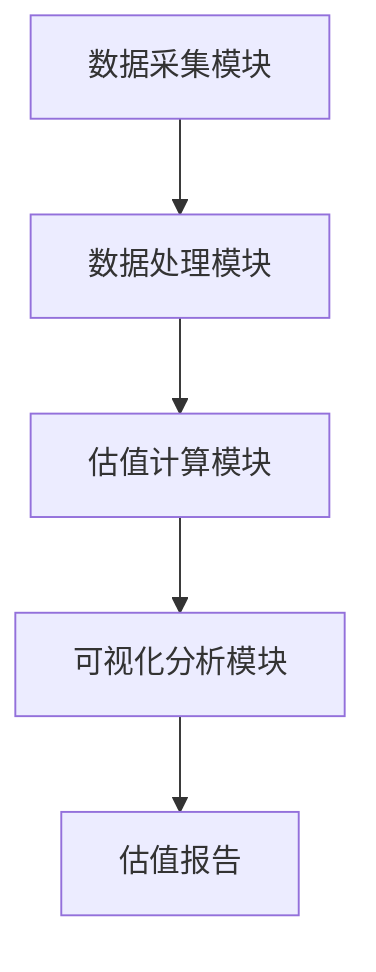

                 


# 可持续包装创新企业的市场估值方法

> 关键词：可持续包装、创新企业、市场估值、DCF模型、相对估值法、ESG因素、系统架构

> 摘要：本文系统地探讨了可持续包装创新企业的市场估值方法，从背景概念、核心理论到具体实践，详细分析了如何在可持续包装领域中准确评估企业的市场价值。文章结合了多种估值方法，如DCF模型、相对估值法，并引入了ESG因素，通过实际案例分析和系统架构设计，为企业和投资者提供了全面的估值框架和实践指南。

---

## 第1章：可持续包装与创新企业的定义

### 1.1 可持续包装的核心概念

#### 1.1.1 可持续包装的定义与特征
可持续包装是指在设计、生产、使用和废弃处理的全生命周期中，尽量减少对环境的影响，同时具备可回收性、可降解性和资源高效利用的包装形式。其核心特征包括：
- **环境友好性**：减少资源消耗和污染物排放。
- **循环利用性**：包装材料可回收或降解，降低对自然资源的依赖。
- **技术创新性**：采用新型材料和工艺，提高包装效率。

#### 1.1.2 创新企业在可持续包装中的角色
创新企业是推动可持续包装技术进步和市场扩展的核心力量。它们通过技术创新、模式创新和管理创新，为行业注入新的活力。创新企业的特点包括：
- 技术驱动：依赖技术研发提升产品竞争力。
- 市场导向：以客户需求为导向，快速响应市场变化。
- 可持续发展：将环保理念融入企业战略和日常运营。

#### 1.1.3 可持续包装与传统包装的对比
| 对比维度 | 可持续包装 | 传统包装 |
|----------|------------|-----------|
| 材料选择 | 生态材料优先 | 常规材料为主 |
| 生命周期 | 全生命周期管理 | 仅关注使用阶段 |
| 环保目标 | 减少环境影响 | 无明确环保目标 |
| 成本 | 初期投入高，长期成本低 | 成本较低，但环境成本隐性 |

---

### 1.2 可持续包装的市场背景

#### 1.2.1 全球包装市场的现状与趋势
全球包装市场规模庞大，2022年已超过1万亿美元。随着消费者环保意识的增强和政策法规的趋严，可持续包装市场占比逐年上升，预计未来五年年均增长率将超过6%。

#### 1.2.2 可持续发展的需求驱动
消费者对环保产品的需求日益增长，企业为了满足市场需求，纷纷推出可持续包装解决方案。同时，政府通过立法和政策支持，推动企业向绿色包装转型。

#### 1.2.3 创新企业对市场的影响
创新企业通过技术突破和模式创新，重新定义了包装行业的价值创造方式。例如，某创新企业通过研发可降解材料，成功替代了传统塑料包装，显著降低了环境负担。

---

## 第2章：可持续包装创新企业的市场环境分析

### 2.1 市场环境的构成要素

#### 2.1.1 宏观经济环境
当前全球经济复苏乏力，但可持续包装市场因其符合环保趋势，仍保持较快增长。通货膨胀和能源价格波动对包装材料成本有一定影响，但环保政策的强化为企业提供了新的发展机遇。

#### 2.1.2 政策法规环境
全球范围内，越来越多的国家和地区出台了限制塑料使用和鼓励可降解包装的法规。例如，欧盟的“Single-Use Plastics Directive”要求企业减少一次性塑料包装的使用。

#### 2.1.3 行业竞争环境
可持续包装市场呈现出“马太效应”，头部企业通过技术壁垒和规模效应巩固市场地位，而小型企业则通过差异化竞争寻找 niche市场。

---

### 2.2 创新企业的竞争优势分析

#### 2.2.1 技术创新的核心作用
技术创新是创新企业的核心竞争优势。例如，某创新企业通过研发纳米级可降解材料，显著提高了包装的环保性能，同时降低了生产成本。

#### 2.2.2 市场定位与品牌价值
创新企业通过精准的市场定位和强大的品牌建设，赢得了消费者的信任。品牌价值的提升直接转化为企业的市场溢价能力。

#### 2.2.3 供应链管理的优化
创新企业通过优化供应链管理，实现了从原材料采购到生产交付的全链条绿色管理。例如，某企业通过建立循环经济模式，将包装废弃物转化为新的生产资源。

---

### 2.3 可持续包装的消费者认知与行为

#### 2.3.1 消费者对可持续包装的认知
消费者逐渐意识到包装对环境的影响，超过60%的消费者愿意为环保包装支付额外费用。然而，价格敏感型消费者仍然倾向于选择价格更低的传统包装。

#### 2.3.2 可持续包装对消费行为的影响
可持续包装增强了消费者的购买意愿，尤其是在高端市场和年轻消费群体中，环保包装已成为重要的购买决策因素。

#### 2.3.3 不同市场区域的消费差异
欧美市场对可持续包装的需求最为强烈，其次是亚洲市场。非洲和中东市场由于经济水平较低，对可持续包装的接受度相对较低。

---

## 第3章：可持续包装创新企业的市场估值方法

### 3.1 市场估值的核心概念与原理

#### 3.1.1 可持续包装创新企业的特殊性
可持续包装创新企业的估值需要考虑其技术优势、市场前景和环境效益。与传统企业相比，创新企业的估值更依赖于未来收益的预测和技术创新的可持续性。

#### 3.1.2 估值的基本假设与限制
- 假设企业的技术创新能够持续转化为市场收益。
- 假设政策环境和市场需求不会发生重大不利变化。
- 估值结果仅供参考，实际市场表现可能受多种因素影响。

---

### 3.2 可持续包装创新企业的估值模型

#### 3.2.1 DCF模型的原理与步骤
1. **预测未来现金流**：基于企业的历史业绩和市场前景，预测未来五年的自由现金流。
2. **确定折现率**：使用加权平均资本成本（WACC）作为折现率。
3. **计算终值**：假设永续年金的终值系数，计算终值。
4. **计算企业价值**：将未来现金流的现值和终值相加，减去净债务，得到企业股权价值。

#### 3.2.2 相对估值法的核心算法
相对估值法通过比较可比企业的市盈率、市净率等指标，估算目标企业的合理估值范围。公式为：
$$ 企业价值 = 可比企业平均市盈率 \times 目标企业净利润 $$

---

### 3.3 可持续包装创新企业的估值挑战

#### 3.3.1 技术风险
创新企业的技术优势可能被快速复制，导致竞争优势丧失。

#### 3.3.2 市场风险
市场需求的不确定性和政策变化可能对企业的未来收益产生重大影响。

#### 3.3.3 财务风险
创新企业的研发投入较高，短期内可能无法实现盈利，财务压力较大。

---

## 第4章：系统架构与项目实战

### 4.1 系统架构设计

#### 4.1.1 问题场景介绍
某可持续包装创新企业希望基于其财务数据和技术优势，构建一个动态的市场估值系统。

#### 4.1.2 系统功能设计
- 数据采集模块：收集企业的财务数据和市场数据。
- 估值计算模块：基于DCF模型和相对估值法计算企业价值。
- 可视化分析模块：生成估值报告和可视化图表。

#### 4.1.3 系统架构设计


---

### 4.2 项目实战：基于DCF模型的估值分析

#### 4.2.1 环境安装
需要安装Python和相关库（Pandas、NumPy、Matplotlib）。

#### 4.2.2 核心实现代码
```python
import pandas as pd
import numpy as np

# 假设财务数据存储在CSV文件中
data = pd.read_csv('financial_data.csv')

# 计算自由现金流
free_cash_flow = data['EBITDA'] - data['Capex']

# 计算加权平均资本成本（WACC）
wacc = 0.08  # 假设折现率为8%

# 预测未来五年的现金流
forecast_period = 5
future_cash_flows = [free_cash_flow.iloc[-1] * (1 + 0.1) for _ in range(forecast_period)]

# 计算终值
terminal_value = future_cash_flows[-1] / (0.1 - 0.05)

# 计算企业价值
enterprise_value = sum(future_cash_flows) / (1 + wacc)**i for i in range(forecast_period)) + terminal_value / (1 + wacc)**forecast_period
```

#### 4.2.3 结果解读
通过代码计算出的企业价值与可比企业的平均市盈率进行对比，得出目标企业的合理估值区间。

---

## 小结

本文系统地探讨了可持续包装创新企业的市场估值方法，从背景概念到具体实践，详细分析了如何在可持续包装领域中准确评估企业的市场价值。通过结合多种估值方法和实际案例分析，为读者提供了全面的估值框架和实践指南。

---

**作者：AI天才研究院/AI Genius Institute & 禅与计算机程序设计艺术 /Zen And The Art of Computer Programming**

---

希望这篇文章能够为您提供有价值的信息和启发！如果需要进一步的讨论或技术支持，请随时联系。

