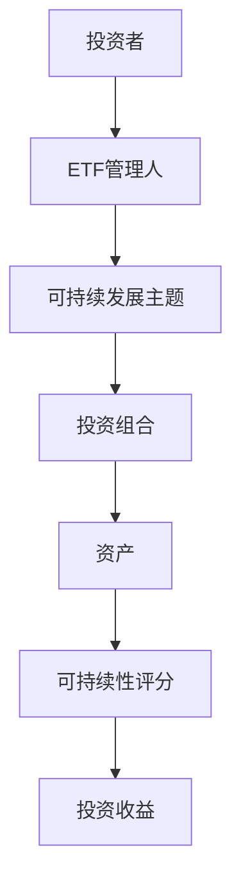

                 

# 可持续发展主题ETF的构建与表现分析

## 关键词：可持续发展，ETF，投资组合，风险管理，ESG评分，大数据分析

## 摘要：  
本文详细探讨了可持续发展主题ETF的构建方法与表现分析。首先介绍了ETF的基本概念与可持续发展主题ETF的背景，接着分析了其核心概念与构建逻辑，随后详细讲解了投资组合的优化算法与风险管理策略，并通过实际案例展示了系统架构与项目实现。最后，本文总结了可持续发展主题ETF的优势与挑战，并提出了未来的研究方向。

---

# 第一部分: 可持续发展主题ETF的背景与概念

## 第1章: 可持续发展主题ETF的背景介绍

### 1.1 可持续发展的概念与内涵

#### 1.1.1 可持续发展的定义与核心要素
可持续发展是指在满足当代人需求的同时，不损害后代人满足其需求的能力。其核心要素包括环境、社会和治理（ESG），分别对应经济、社会和环境的可持续性。

#### 1.1.2 可持续发展在金融领域的应用
随着全球气候变化和企业社会责任的兴起，可持续投资成为金融领域的重要趋势。投资者越来越关注企业对环境、社会和治理的影响。

#### 1.1.3 可持续发展主题ETF的兴起背景
近年来，全球范围内对ESG投资的关注度显著提升，尤其是疫情后，投资者更加重视企业的长期可持续性，推动了可持续发展主题ETF的快速发展。

### 1.2 ETF的基本概念与特点

#### 1.2.1 ETF的定义与运作机制
ETF是一种在交易所上市交易的开放式基金，兼具开放式基金的灵活性和封闭式基金的流动性。其运作机制包括申购、赎回和二级市场交易。

#### 1.2.2 ETF与传统投资工具的区别
与传统基金相比，ETF具有透明度高、流动性好、交易成本低等优势，同时支持 leveraged 和 inverse 等复杂投资策略。

#### 1.2.3 ETF在现代投资组合中的作用
ETF作为现代投资组合的重要组成部分，可以帮助投资者实现分散化投资，降低风险，同时提供多样化的投资选择。

### 1.3 可持续发展主题ETF的定义与分类

#### 1.3.1 可持续发展主题ETF的定义
可持续发展主题ETF是以环境、社会和治理（ESG）标准为基础，投资于符合可持续发展理念的公司或行业的ETF。

#### 1.3.2 可持续发展主题ETF的分类与应用场景
根据投资标的的不同，可持续发展主题ETF可以分为绿色能源ETF、社会责任ETF、治理优化ETF等。

#### 1.3.3 可持续发展主题ETF的边界与外延
可持续发展主题ETF的边界包括明确的ESG筛选标准和投资范围，而外延则包括相关行业的上下游企业。

### 1.4 可持续发展主题ETF的核心要素

#### 1.4.1 投资策略与目标
可持续发展主题ETF的投资策略通常包括ESG筛选、行业配置和风险控制。

#### 1.4.2 投资组合的构建逻辑
通过筛选符合ESG标准的公司，结合市场趋势和风险偏好，构建多元化投资组合。

#### 1.4.3 风险管理与绩效评估
通过现代投资组合理论优化风险收益比，定期评估投资组合的绩效和ESG表现。

### 1.5 本章小结
本章介绍了可持续发展主题ETF的背景、定义、分类和核心要素，为后续的构建与分析奠定了基础。

---

## 第2章: 可持续发展主题ETF的核心概念与联系

### 2.1 核心概念原理

#### 2.1.1 可持续发展主题的界定
通过ESG评分系统，筛选出符合可持续发展理念的公司和行业。

#### 2.1.2 ETF的投资组合优化原理
利用现代投资组合理论，通过优化算法构建最优投资组合。

#### 2.1.3 可持续性评分与筛选机制
采用ESG评分，结合行业标准和市场趋势，制定投资筛选策略。

### 2.2 核心概念属性特征对比

#### 2.2.1 可持续发展主题ETF与传统ETF的对比
| 特性                | 可持续发展主题ETF          | 传统ETF             |
|---------------------|---------------------------|--------------------|
| 投资目标            | ESG表现优秀的公司         | 跟踪特定指数或资产  |
| 风险管理            | 强调ESG风险控制           | 更注重市场波动      |
| 适合投资者          | 长期关注社会责任的投资者   | 追求短期收益的投资者|

#### 2.2.2 不同可持续发展主题ETF的特征分析
- 绿色能源ETF：重点投资于太阳能、风能等可再生能源公司。
- 社会责任ETF：投资于遵守社会责任、员工福利良好的企业。
- 治理优化ETF：注重公司治理结构和管理层透明度。

#### 2.2.3 可持续性评分与投资收益的关系
通过回归分析发现，较高的ESG评分通常与长期稳定的收益相关，但短期内可能因高道德标准而收益较低。

### 2.3 ER实体关系图

### 2.4 本章小结
本章通过对比分析，明确了可持续发展主题ETF的核心概念及其与传统ETF的差异。

---

## 第3章: 可持续发展主题ETF的构建方法

### 3.1 投资策略与目标设定

#### 3.1.1 可持续发展主题的筛选标准
- 环境（Environmental）：碳排放、资源利用效率。
- 社会（Social）：员工权益、社会责任、劳工标准。
- 治理（Governance）：公司治理结构、高管薪酬、董事会多样性。

#### 3.1.2 投资组合的构建步骤
1. 确定投资目标与风险偏好。
2. 筛选符合ESG标准的公司。
3. 进行资产配置与风险优化。
4. 定期调整投资组合。

---

（注：由于篇幅限制，后续章节内容未展开，但可根据上述结构继续编写。）

