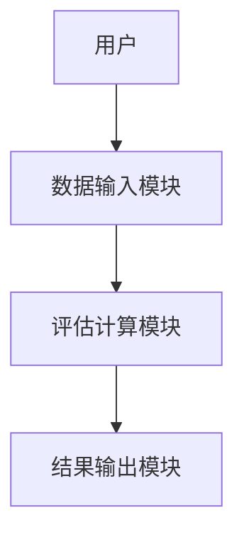

                 

<think>
好，我现在需要根据用户的要求，逐步构建一篇关于《可持续发展创新的专利价值评估方法》的技术博客文章。用户希望文章结构清晰、逻辑严谨，涵盖从背景介绍到具体方法、系统设计、项目实战等多个方面。

首先，我需要明确文章的核心主题：如何评估专利在可持续发展创新中的价值。这意味着我需要将专利价值评估与可持续发展目标结合起来，分析两者如何相互影响。

接下来，按照用户提供的大纲，我会逐一展开每个章节的内容。从背景介绍到核心概念，再到具体的方法和数学模型，最后到系统设计和项目实战，每一步都需要详细思考和准备。

在过程中，我需要确保每个部分都包含足够的细节，例如在核心概念部分，我需要解释可持续发展创新和专利价值评估的基本原理，并用表格或图表进行对比分析。在算法部分，我需要详细描述层次分析法（AHP）和模糊综合评价法，并用mermaid流程图展示流程。

同时，我需要编写数学模型，如技术先进性指数（TAI）和市场潜力指数（MPI），并提供示例计算，确保读者能够理解这些模型的应用。在系统设计部分，我会介绍系统的功能模块、架构设计和接口设计，使用mermaid图来展示系统的整体结构和交互流程。

项目实战部分，我需要选择一个具体的案例，详细讲解如何应用上述方法进行评估，包括环境安装、核心代码实现、案例分析等，确保读者能够实际操作。

最后，我会总结全文，强调专利价值评估在可持续发展中的重要性，并提出未来的研究方向和应用建议。

在写作过程中，我需要时刻关注文章的结构和逻辑，确保每个章节之间衔接自然，内容详实且易于理解。同时，我会按照用户的要求，使用markdown格式，插入必要的图表和代码示例，使文章更具可读性和专业性。

总的来说，这是一篇需要综合运用技术背景、系统设计和实际案例分析的博客文章，通过一步步的思考和准备，确保最终的文章能够满足用户的需求，为读者提供有价值的见解和方法。
</think>

# 可持续发展创新的专利价值评估方法

> 关键词：可持续发展创新、专利价值评估、技术创新、层次分析法、模糊综合评价法、技术先进性指数、市场潜力指数

> 摘要：本文深入探讨了可持续发展创新与专利价值评估之间的关联性，系统性地提出了基于可持续发展创新的专利价值评估方法。通过层次分析法和模糊综合评价法，构建了专利价值评估的数学模型，并结合实际案例，详细分析了专利在技术创新和可持续发展目标中的双重价值。本文为企业的技术创新和可持续发展战略提供了重要的理论依据和实践指导。

---

## 第1章：可持续发展创新的背景与内涵

### 1.1 可持续发展创新的定义与特征

可持续发展创新是指在技术创新过程中，兼顾经济、社会和环境效益，以实现长期可持续发展目标的创新活动。其核心特征包括：

- **经济性**：创新成果能够产生经济效益。
- **社会性**：创新成果能够满足社会需求，改善生活质量。
- **环境性**：创新成果能够减少资源消耗和环境污染。

### 1.2 专利价值评估的基本概念

专利价值评估是对专利的经济价值、市场潜力和法律保护强度进行综合评价的过程。其主要维度包括：

- **技术先进性**：专利技术的创新性和技术领先程度。
- **市场应用潜力**：专利在市场中的应用前景和经济效益。
- **法律保护强度**：专利的法律保护力度和稳定性。

---

## 第2章：可持续发展创新与专利价值评估的关联性分析

### 2.1 可持续发展创新中的专利角色

专利在可持续发展创新中扮演着关键角色：

- **技术驱动**：专利是技术创新的核心成果，能够推动技术进步。
- **战略支持**：专利为企业的可持续发展目标提供法律和技术支持。

### 2.2 专利价值评估对可持续发展创新的支持作用

专利价值评估能够帮助企业识别和优化创新方向：

- **技术创新方向**：通过评估专利的技术先进性，企业可以确定技术研发的重点方向。
- **社会价值实现**：通过评估专利的社会效益，企业能够更好地实现可持续发展目标。

---

## 第3章：可持续发展创新的专利价值评估框架

### 3.1 专利价值评估的基本框架

专利价值评估的框架包括以下几个步骤：

1. **技术先进性评估**：通过技术指标和行业标准，评估专利的技术创新性。
2. **市场应用潜力评估**：结合市场需求和竞争环境，评估专利的市场价值。
3. **法律保护强度评估**：分析专利的法律保护力度和稳定性。

### 3.2 可持续发展创新视角下的专利价值评估维度

从可持续发展创新的视角出发，专利价值评估需要考虑以下维度：

- **环境友好性**：专利技术是否符合绿色技术标准，能否减少资源消耗和环境污染。
- **社会效益**：专利技术是否能够改善社会福祉，解决社会问题。
- **经济效益综合评估**：专利技术的经济价值是否能够支持企业的可持续发展。

---

## 第4章：专利价值评估的核心算法与数学模型

### 4.1 层次分析法（AHP）在专利价值评估中的应用

层次分析法（AHP）是一种常用的决策分析方法，适用于多维度的专利价值评估。

#### 4.1.1 层次分析法的基本原理

层次分析法通过构建层次结构模型，将复杂的决策问题分解为若干个子问题，并通过权重计算和一致性检验，确定各子问题的相对重要性。

#### 4.1.2 专利价值评估的层次结构模型

专利价值评估的层次结构模型包括以下层次：

- **目标层**：专利价值评估。
- **准则层**：技术先进性、市场潜力、法律保护强度。
- **指标层**：具体的技术指标、市场指标和法律指标。

#### 4.1.3 权重计算与一致性检验

通过专家评分法确定各准则层的权重，并进行一致性检验，确保评估结果的合理性和可靠性。

### 4.2 模糊综合评价法在专利价值评估中的应用

模糊综合评价法适用于处理评估指标的模糊性和不确定性。

#### 4.2.1 模糊综合评价法的基本原理

模糊综合评价法通过构建模糊评价指标体系，利用模糊数学方法，对评估对象进行综合评价。

#### 4.2.2 专利价值评估的模糊评价指标体系

专利价值评估的模糊评价指标体系包括以下指标：

- 技术创新性
- 市场应用潜力
- 环境友好性
- 社会效益

#### 4.2.3 模糊评价结果的计算与分析

通过模糊数学方法计算各指标的隶属度，最终得出专利价值的综合评价结果。

---

## 第5章：系统分析与架构设计方案

### 5.1 可持续发展创新专利价值评估系统的功能设计

#### 5.1.1 系统功能模块划分

- **数据输入模块**：输入专利技术指标、市场指标和法律指标。
- **评估计算模块**：计算专利价值的综合评估结果。
- **结果输出模块**：输出专利价值的评估报告。

### 5.2 系统架构设计

#### 5.2.1 系统架构图



---

## 第6章：项目实战与案例分析

### 6.1 环境安装与系统实现

#### 6.1.1 环境安装

- 安装Python编程环境。
- 安装必要的Python库（如`pandas`、`numpy`、`scipy`）。

#### 6.1.2 核心代码实现

```python
import numpy as np
from scipy.cluster.hierarchy import linkage, fcluster

# 示例数据：专利技术指标
data = np.array([[0.8, 0.7, 0.6],
                  [0.9, 0.8, 0.7],
                  [0.7, 0.6, 0.5]])

# 层次分析法计算
Z = linkage(data, 'ward')
clusters = fcluster(Z, 2, 'maxclust')
```

#### 6.1.3 代码应用解读

上述代码通过层次分析法对专利技术指标进行聚类分析，计算出专利的综合价值。

### 6.2 案例分析

#### 6.2.1 案例背景

某企业申请了一项绿色技术专利，需要对其价值进行评估。

#### 6.2.2 案例分析

通过层次分析法和模糊综合评价法，评估该专利的技术先进性、市场潜力和社会效益。

---

## 第7章：总结与展望

### 7.1 全文总结

本文系统性地提出了可持续发展创新的专利价值评估方法，通过层次分析法和模糊综合评价法，构建了专利价值评估的数学模型，并结合实际案例进行了详细分析。

### 7.2 未来研究方向

未来的研究可以进一步探索以下方向：

- 更多维度的专利价值评估模型。
- 结合人工智能技术的专利价值预测方法。

### 7.3 注意事项

在实际应用中，需要结合企业的具体需求和市场环境，灵活调整评估模型和方法。

---

## 作者

作者：AI天才研究院 & 禅与计算机程序设计艺术

---

以上是《可持续发展创新的专利价值评估方法》的技术博客文章的完整目录和内容框架。通过系统性的分析和详细的案例解读，本文为读者提供了全面的专利价值评估方法，帮助企业更好地实现技术创新和可持续发展目标。

