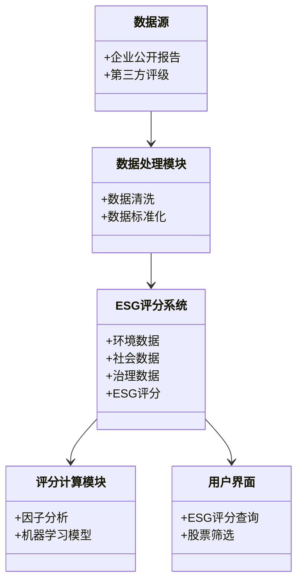
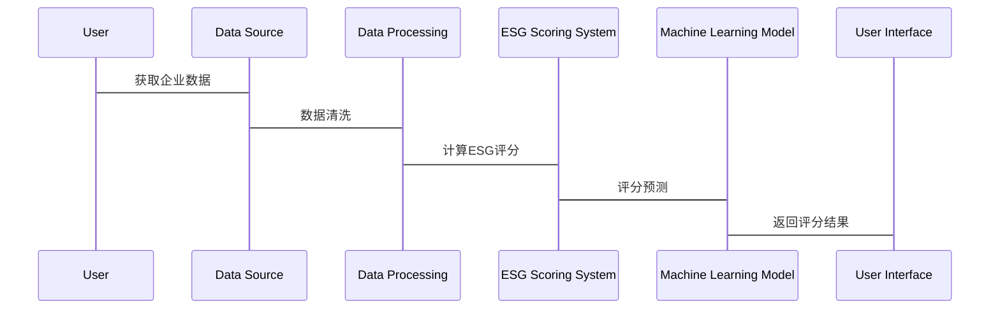

                 


# 可持续发展投资（ESG）：长期价值创造的新范式

> 关键词：可持续投资，ESG，环境，社会，治理，风险管理，价值创造

> 摘要：可持续发展投资（ESG）正逐渐成为全球投资领域的重要趋势。本文将从背景、核心概念、算法原理、系统架构、项目实战以及最佳实践等多个维度，全面解析ESG投资的理论与实践，探讨其如何引领长期价值创造的新范式。

---

## 第一部分：可持续发展投资（ESG）的背景与核心概念

### 第1章：可持续发展投资（ESG）的背景与定义

#### 1.1 可持续发展投资的定义与内涵

##### 1.1.1 可持续投资的定义
可持续投资（Sustainable Investment）是一种基于环境（Environmental）、社会（Social）和治理（Governance）三个维度的投资策略，旨在通过关注企业的长期价值创造，实现经济、社会和环境的综合效益。

##### 1.1.2 ESG的内涵与外延
- **环境（E）**：关注企业在资源利用、碳排放、污染治理等方面的实践。
- **社会（S）**：关注企业在员工权益、社会责任、公平就业等方面的实践。
- **治理（G）**：关注企业在公司治理、透明度、风险管理等方面的实践。

##### 1.1.3 可持续投资与传统投资的对比
- **传统投资**：主要关注财务回报，忽视企业非财务因素。
- **可持续投资**：兼顾财务回报与企业社会责任，注重长期价值创造。

#### 1.2 可持续发展投资的背景与发展趋势

##### 1.2.1 全球可持续发展背景
- 全球气候变化、资源枯竭、社会不平等等问题日益严重，推动投资者关注企业的可持续性。
- 联合国可持续发展目标（SDGs）为全球投资提供了方向。

##### 1.2.2 可持续投资的兴起
- 投资者意识到，企业社会责任（CSR）不仅影响企业声誉，还会影响企业的长期盈利能力。
- 多家国际机构（如联合国、世界银行）推动ESG投资的发展。

##### 1.2.3 可持续投资的未来趋势
- ESG投资将成为主流，越来越多的投资者将ESG因素纳入投资决策。
- 技术驱动的ESG数据分析将更加精准，推动ESG投资的智能化。

#### 1.3 ESG投资的核心理念与价值

##### 1.3.1 长期价值创造的理念
- ESG投资关注企业的可持续发展能力，而非短期财务表现。
- 企业只有在环境、社会和治理方面表现优异，才能实现长期价值。

##### 1.3.2 可持续投资的社会意义
- 通过投资推动企业改善环境、社会和治理表现。
- 助力全球可持续发展目标的实现。

##### 1.3.3 可持续投资的经济价值
- 企业ESG表现优异，通常具有更强的抗风险能力和更高的市场估值。
- ESG投资能够分散风险，提高投资组合的稳定性。

### 第2章：ESG投资的核心概念与框架

#### 2.1 环境（E）维度

##### 2.1.1 环境指标的核心要素
- **碳排放**：企业温室气体排放量。
- **资源利用效率**：单位产品能源消耗。
- **污染治理**：企业环保投入和污染处理效果。

##### 2.1.2 环境风险与机遇
- **环境风险**：气候变化对企业供应链、运营成本的影响。
- **环境机遇**：绿色能源、环保技术等领域的发展潜力。

##### 2.1.3 环境数据的收集与分析
- 数据来源：企业公开报告、第三方认证机构数据。
- 分析方法：碳足迹计算、环境影响评估。

#### 2.2 社会（S）维度

##### 2.2.1 社会责任的核心要素
- **员工权益**：公平薪酬、劳动条件。
- **社会责任**：公益活动、社区支持。
- **社会公平**：性别平等、 minority rights.

##### 2.2.2 社会公平与多样性
- **性别多样性**：董事会和管理层中的女性比例。
- **少数群体权益**：企业对LGBTQ+群体的支持。
- **员工满意度**：员工幸福感和忠诚度。

##### 2.2.3 社会数据的收集与分析
- 数据来源：企业社会责任报告、员工调查。
- 分析方法：社会影响评估、员工满意度分析。

#### 2.3 治理（G）维度

##### 2.3.1 公司治理的核心要素
- **董事会结构**：独立董事比例、董事会多样性。
- **透明度**：企业信息披露的及时性和完整性。
- **风险管理**：企业对风险的识别、评估和应对能力。

##### 2.3.2 治理风险与机遇
- **治理风险**：公司治理不善可能导致的财务损失或声誉损害。
- **治理机遇**：通过优化治理结构提升企业效率和抗风险能力。

##### 2.3.3 治理数据的收集与分析
- 数据来源：企业年报、治理评分机构报告。
- 分析方法：治理评分模型、风险评估模型。

#### 2.4 ESG评分与评估方法

##### 2.4.1 ESG评级的定义与分类
- **ESG评级**：根据企业环境、社会和治理表现给出的评分，通常分为AAA、AA、A、BBB、BB、B、CCC、CC、C、D等等级。
- **评级机构**：常见的ESG评级机构包括MSCI、Sustainalytics、晨星等。

##### 2.4.2 ESG评估的核心指标
- **环境指标**：碳排放强度、可再生能源使用比例。
- **社会指标**：员工满意度、社区参与度。
- **治理指标**：董事会多样性、独立董事比例。

##### 2.4.3 ESG数据来源与处理
- **数据来源**：企业公开报告、第三方认证、政府数据。
- **数据处理**：数据清洗、标准化、特征提取。

---

## 第二部分：ESG投资的算法与数学模型

### 第3章：ESG投资的算法与数学模型

#### 3.1 ESG评分的计算方法

##### 3.1.1 因子分析模型
- **因子分析**：通过提取环境、社会和治理三个维度的核心因子，计算企业的综合ESG评分。
- **公式**：
  $$
  \text{ESG评分} = \alpha \cdot E + \beta \cdot S + \gamma \cdot G
  $$
  其中，$\alpha$、$\beta$、$\gamma$为各维度的权重系数。

##### 3.1.2 机器学习模型
- **模型选择**：使用随机森林、支持向量机（SVM）等算法，对企业的ESG表现进行分类或回归预测。
- **特征工程**：将环境、社会和治理指标转化为模型可识别的特征向量。

##### 3.1.3 案例分析：因子分析与机器学习结合的ESG评分模型
- **数据准备**：收集企业环境、社会和治理数据，进行标准化处理。
- **模型构建**：使用因子分析提取主成分，再结合机器学习模型进行预测。
- **代码示例**：
  ```python
  import pandas as pd
  import numpy as np
  from sklearn.decomposition import PCA
  from sklearn.ensemble import RandomForestRegressor
  
  # 假设df为ESG数据，columns为各指标
  df = pd.DataFrame(...)
  
  # 标准化处理
  df_norm = (df - df.mean()) / df.std()
  
  # 因子分析
  pca = PCA(n_components=3)
  factors = pca.fit_transform(df_norm)
  
  # 机器学习模型
  model = RandomForestRegressor()
  model.fit(factors, df['ESG评分'])
  ```

---

## 第三部分：系统分析与架构设计

### 第4章：系统分析与架构设计方案

#### 4.1 问题场景介绍

##### 4.1.1 问题背景
- 投资者希望构建一个基于ESG的股票筛选系统，帮助他们识别出具有长期价值创造潜力的企业。

##### 4.1.2 项目介绍
- 项目目标：开发一个实时ESG评分系统，提供基于ESG指标的股票筛选功能。
- 项目范围：涵盖环境、社会和治理三个维度，支持多数据源接入。

#### 4.2 系统功能设计

##### 4.2.1 领域模型（Mermaid类图）


#### 4.3 系统架构设计（Mermaid架构图）

```mermaid
server
    data Source--> Data Processing--> ESG Scoring System
    ESG Scoring System --> Machine Learning Model
    User Interface <-- Data Visualization
```

#### 4.4 系统交互设计（Mermaid序列图）



---

## 第四部分：项目实战

### 第5章：项目实战：基于ESG的股票筛选系统

#### 5.1 环境搭建

##### 5.1.1 工具安装
- **Python**：安装Anaconda或Miniconda。
- **数据处理库**：安装pandas、numpy、scikit-learn。
- **可视化工具**：安装matplotlib、seaborn。

##### 5.1.2 数据来源
- 数据获取：从MSCI、Sustainalytics等机构获取ESG数据。
- 数据格式：CSV或Excel格式。

#### 5.2 系统核心实现

##### 5.2.1 数据清洗与预处理
- **代码示例**：
  ```python
  import pandas as pd
  df = pd.read_csv('esg_data.csv')
  df.dropna(inplace=True)
  df['年份'] = pd.to_datetime(df['年份'])
  ```

##### 5.2.2 ESG评分计算
- **代码示例**：
  ```python
  from sklearn.decomposition import PCA
  import numpy as np
  
  # 假设df为处理后的数据
  features = ['环境指标', '社会指标', '治理指标']
  df_factors = pd.DataFrame(PCA(n_components=3).fit_transform(df[features]), 
                            index=df.index, columns=['因子1', '因子2', '因子3'])
  
  # 使用随机森林回归模型预测ESG评分
  from sklearn.ensemble import RandomForestRegressor
  model = RandomForestRegressor()
  model.fit(df_factors, df['ESG评分'])
  ```

##### 5.2.3 系统交互设计
- **用户界面**：设计一个简单的Web界面，允许用户输入筛选条件（如行业、地理位置）并查看对应的ESG评分。
- **数据可视化**：使用图表展示企业的ESG表现，如柱状图、折线图等。

#### 5.3 实际案例分析

##### 5.3.1 案例背景
- 某清洁能源公司，环境表现优异，但治理结构存在问题。

##### 5.3.2 数据分析
- 计算该公司的ESG评分，发现其环境得分较高，治理得分较低。

##### 5.3.3 结果解读
- 该公司适合长期投资，但需要关注其治理结构的改进。

#### 5.4 项目小结
- 通过项目实战，我们掌握了ESG数据的处理方法，熟悉了ESG评分模型的构建过程。
- 同时，我们还了解了如何将技术应用于实际的ESG投资中，帮助投资者做出更明智的决策。

---

## 第五部分：最佳实践与小结

### 第6章：最佳实践与小结

#### 6.1 最佳实践

##### 6.1.1 数据质量控制
- 确保数据的完整性和准确性。
- 使用多种数据源交叉验证。

##### 6.1.2 模型优化
- 定期更新模型参数，适应市场变化。
- 引入新的ESG指标，提升模型的准确性。

##### 6.1.3 风险管理
- 定期评估投资组合的ESG风险。
- 设立风险预警机制，及时调整投资策略。

#### 6.2 小结

##### 6.2.1 ESG投资的核心价值
- ESG投资不仅关注企业的财务表现，还关注其环境、社会和治理表现。
- 通过ESG投资，我们可以推动企业的可持续发展，创造长期价值。

##### 6.2.2 ESG投资的未来展望
- 随着技术的进步，ESG投资将更加智能化、数据化。
- ESG投资将成为全球投资的主流，推动全球经济的可持续发展。

---

## 结语

可持续发展投资（ESG）正逐渐成为全球投资领域的重要趋势。通过本文的分析，我们不仅了解了ESG投资的背景与核心概念，还熟悉了其算法原理与系统架构设计。希望本文能够为投资者和技术人员提供有价值的参考，推动ESG投资的进一步发展。

---

## 作者：AI天才研究院/AI Genius Institute & 禅与计算机程序设计艺术 /Zen And The Art of Computer Programming

