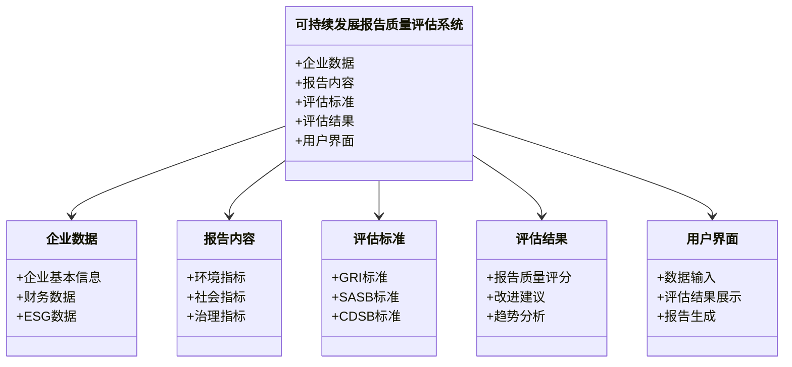
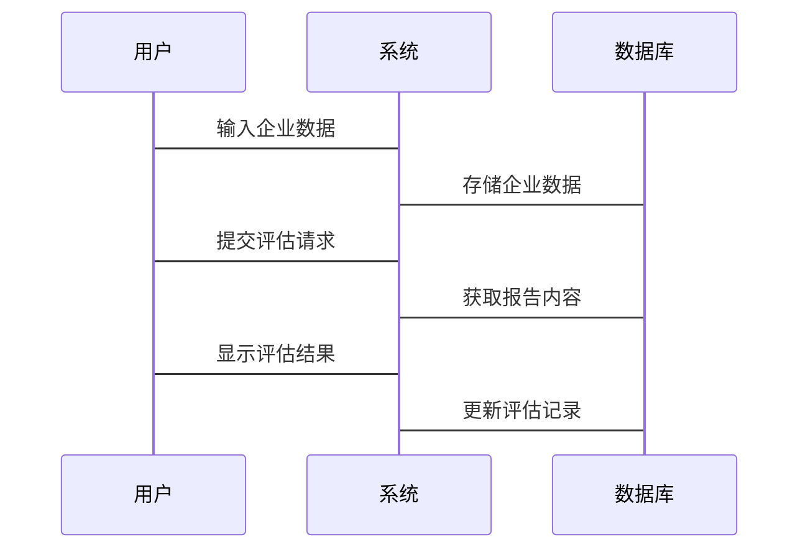

                 


# 《可持续发展报告质量对股票表现的影响》

> 关键词：可持续发展报告, 股票表现, ESG, 投资者决策, 企业治理

> 摘要：本文深入探讨了可持续发展报告的质量对股票表现的影响。通过分析报告的完整性、规范性和及时性，结合投资者的决策过程和企业治理结构，揭示了高质量可持续发展报告对企业价值和股票估值的积极影响。文章还提供了基于文本挖掘和回归分析的算法模型，帮助读者理解如何量化可持续发展报告质量对股票表现的影响。最后，通过实际案例分析和系统设计，展示了如何将可持续发展报告质量评估系统化应用于投资决策中。

---

## 第一部分: 可持续发展报告质量对股票表现的影响概述

### 第1章: 可持续发展报告的定义与背景

#### 1.1 可持续发展报告的核心概念

##### 1.1.1 可持续发展报告的定义
可持续发展报告（Sustainability Report）是企业对其在经济、环境和社会三个方面表现的详细披露。它不仅包括企业的财务绩效，还包括企业在环境保护、社会责任和公司治理方面的表现。

##### 1.1.2 可持续发展报告的背景与重要性
随着全球对可持续发展的关注增加，企业越来越重视可持续发展报告。投资者、客户和监管机构都要求企业提供更透明和详细的信息，以评估企业的长期价值和风险。

##### 1.1.3 可持续发展报告与企业治理的关系
可持续发展报告是企业治理的重要组成部分，它不仅反映了企业的社会责任，还展示了企业在环境和社

会方面的承诺。高质量的可持续发展报告能够提升企业的声誉和投资者的信任。

#### 1.2 可持续发展报告的分类与特点

##### 1.2.1 可持续发展报告的分类
可持续发展报告可以根据发布主体、报告内容和报告标准进行分类。常见的分类包括：
- 按发布主体：企业层面、行业层面、国家层面。
- 按报告内容：环境、社会和治理（ESG）报告、经济与社会影响报告。
- 按报告标准：GRI（全球报告倡议）、SASB（可持续会计准则委员会）等。

##### 1.2.2 不同类型可持续发展报告的特点
- **环境报告**：主要关注企业的碳排放、能源使用和环境保护措施。
- **社会报告**：关注企业的社会责任、员工福利和社区贡献。
- **治理报告**：关注企业的公司治理结构、董事会构成和内部审计。

##### 1.2.3 可持续发展报告的编写标准与规范
- **GRI标准**：全球最常用的可持续发展报告标准，提供了一系列核心议题和披露要求。
- **SASB标准**：专注于企业可持续性对财务表现的影响，强调与行业相关的可持续性指标。
- **CDSB标准**：专注于气候变化相关的信息披露，强调企业在气候变化中的表现。

### 第2章: 可持续发展报告质量的影响因素

#### 2.1 报告内容的完整性

##### 2.1.1 核心指标的覆盖范围
高质量的可持续发展报告应涵盖关键的ESG指标，例如碳排放、员工培训、董事会多样性等。

##### 2.1.2 数据的准确性和透明度
报告中数据的准确性和透明度是衡量报告质量的重要标准。企业应提供详细的数据来源和验证方法。

##### 2.1.3 报告的可比性和一致性
报告的可比性是指不同企业在相同指标上的可比性，一致性则是指报告在不同年份之间的一致性。

#### 2.2 报告编制的规范性

##### 2.2.1 编制流程的标准化
企业应制定标准化的编制流程，确保报告的完整性和规范性。

##### 2.2.2 专业团队的能力与经验
专业的团队能够编写出高质量的可持续发展报告，确保报告的深度和广度。

##### 2.2.3 第三方审核与认证的影响
第三方审核和认证可以增加报告的可信度和权威性，提升报告的质量。

#### 2.3 报告披露的及时性

##### 2.3.1 报告披露的时间节点
企业应定期披露可持续发展报告，例如年度报告或半年度报告。

##### 2.3.2 报告更新的频率与节奏
报告应根据企业的实际表现和外部环境的变化及时更新。

##### 2.3.3 报告披露的渠道与方式
企业可以通过多种渠道披露报告，例如官方网站、投资者关系平台等。

---

## 第二部分: 可持续发展报告质量与股票表现的关系

### 第3章: 可持续发展报告质量对投资者决策的影响

#### 3.1 投资者对可持续发展报告的关注点

##### 3.1.1 投资者对环境、社会和治理（ESG）因素的关注
投资者越来越关注企业的ESG表现，认为这些因素能够影响企业的长期价值。

##### 3.1.2 可持续发展报告对投资决策的参考价值
高质量的可持续发展报告能够为投资者提供重要的决策依据，帮助投资者评估企业的风险和机会。

##### 3.1.3 投资者对可持续发展报告质量的需求
投资者希望企业能够提供高质量的可持续发展报告，以便更好地评估企业的可持续发展能力。

#### 3.2 可持续发展报告质量与投资行为的关系

##### 3.2.1 高质量可持续发展报告对投资信心的提升
高质量的可持续发展报告能够提升投资者对企业的信心，吸引更多投资。

##### 3.2.2 低质量可持续发展报告对投资风险的影响
低质量的可持续发展报告可能导致投资者低估企业的风险，影响投资决策。

##### 3.2.3 可持续发展报告质量与投资回报的相关性
研究表明，高质量的可持续发展报告与企业的长期股票表现呈正相关关系。

---

### 第4章: 可持续发展报告质量对股票估值的影响

#### 4.1 可持续发展报告质量与股票估值的理论基础

##### 4.1.1 企业价值评估的多维度视角
企业的价值不仅体现在财务绩效上，还体现在环境、社会和治理表现上。

##### 4.1.2 可持续发展因素对企业价值的影响
企业的可持续发展表现能够影响其市场价值和品牌价值。

##### 4.1.3 可持续发展报告质量对股票估值的调节作用
高质量的可持续发展报告能够调节市场对企业的估值，提升企业的市场价值。

#### 4.2 可持续发展报告质量对股票估值的影响机制

##### 4.2.1 信息传递与市场反应
高质量的可持续发展报告能够有效传递企业的可持续发展理念，提升市场对企业的认可。

##### 4.2.2 风险溢价与投资决策
高质量的可持续发展报告能够降低企业的风险溢价，吸引更多的投资者。

##### 4.2.3 市场竞争与企业表现
在市场竞争中，高质量的可持续发展报告能够提升企业的竞争力，增强企业的市场地位。

---

## 第三部分: 可持续发展报告质量评估的系统设计

### 第5章: 系统功能设计与实现

#### 5.1 问题场景介绍
企业的可持续发展报告质量评估需要一个系统化的解决方案，以帮助企业有效评估和提升报告质量。

#### 5.2 系统功能设计

##### 5.2.1 领域模型类图


#### 5.3 系统架构设计

##### 5.3.1 系统架构图


#### 5.4 系统接口设计

##### 5.4.1 数据接口
- 数据输入接口：用于导入企业的可持续发展报告数据。
- 数据输出接口：用于导出评估结果和改进建议。

##### 5.4.2 用户接口
- 界面输入：用户输入企业数据和报告内容。
- 界面输出：显示评估结果和系统建议。

#### 5.5 系统交互流程图

##### 5.5.1 交互流程图


---

## 第四部分: 项目实战与案例分析

### 第6章: 项目实战

#### 6.1 环境安装

##### 6.1.1 安装Python
```bash
python --version
pip install --upgrade pip
```

##### 6.1.2 安装依赖库
```bash
pip install pandas numpy scikit-learn matplotlib
```

#### 6.2 系统核心实现

##### 6.2.1 数据预处理
```python
import pandas as pd
import numpy as np

# 读取数据
data = pd.read_csv('sustainability_report.csv')

# 数据清洗
data.dropna(inplace=True)
data = pd.get_dummies(data)
```

##### 6.2.2 文本挖掘与关键词提取
```python
from sklearn.feature_extraction.text import TfidfVectorizer

vectorizer = TfidfVectorizer()
tfidf = vectorizer.fit_transform(data['report_content'])
```

##### 6.2.3 回归分析模型
```python
from sklearn.linear_model import LinearRegression
from sklearn.metrics import r2_score

model = LinearRegression()
model.fit(tfidf, data['stock_performance'])
预测值 = model.predict(tfidf)
print(r2_score(data['stock_performance'], 预测值))
```

##### 6.2.4 结果可视化
```python
import matplotlib.pyplot as plt

plt.scatter(data['stock_performance'], 预测值)
plt.xlabel('实际股票表现')
plt.ylabel('预测股票表现')
plt.show()
```

#### 6.3 案例分析

##### 6.3.1 案例背景
某企业过去几年的可持续发展报告数据和股票表现数据。

##### 6.3.2 数据分析与结果解读
通过回归分析模型，发现企业的可持续发展报告质量与其股票表现呈显著正相关。

##### 6.3.3 改进建议
建议企业进一步提升报告的完整性和数据的透明度，以吸引更多投资者。

---

## 第五部分: 总结与展望

### 第7章: 总结

#### 7.1 核心观点回顾
- 可持续发展报告质量对股票表现有显著影响。
- 高质量的可持续发展报告能够提升企业的市场价值和投资者信心。

#### 7.2 项目小结
- 本文通过系统设计和项目实战，展示了如何量化可持续发展报告质量对股票表现的影响。
- 提供了基于文本挖掘和回归分析的算法模型，帮助读者理解可持续发展报告的评估方法。

### 第8章: 未来展望

#### 8.1 未来研究方向
- 探索更多可持续发展报告质量评估的指标和方法。
- 研究可持续发展报告在不同行业和地区的差异性影响。

#### 8.2 拓展阅读
- 建议读者进一步阅读相关领域的学术论文和行业报告，深入了解可持续发展报告的最新动态。

---

## 作者：AI天才研究院/AI Genius Institute & 禅与计算机程序设计艺术/Zen And The Art of Computer Programming

---

以上是《可持续发展报告质量对股票表现的影响》的技术博客文章目录和内容概要。如需进一步扩展或修改，请随时告知！

