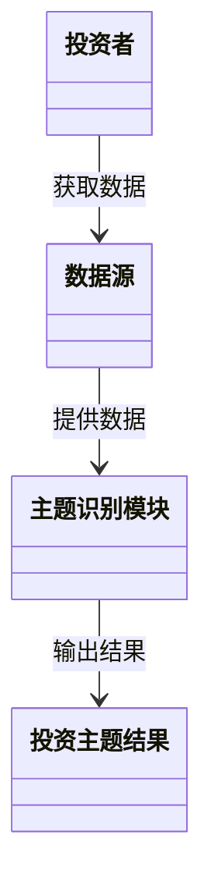

                 

<think>
好的，我将按照您的要求创作一篇关于《可持续发展目标（SDGs）与投资主题识别》的技术博客文章。我将先列出文章的完整目录结构，然后逐步完成每一部分的内容。您可以随时告诉我是否需要调整或补充某些部分。

### 目录结构

# 可持续发展目标（SDGs）与投资主题识别

> 关键词：可持续发展目标，投资主题识别，文本挖掘，主题建模，可持续投资，大数据分析

> 摘要：随着全球对可持续发展的关注不断增加，投资者越来越关注如何将联合国可持续发展目标（SDGs）与投资主题识别相结合。本文详细介绍了SDGs的核心概念、投资主题识别的基本原理，以及如何通过文本挖掘和主题建模等技术手段从海量数据中提取与SDGs相关的投资主题。文章还结合实际案例，展示了如何将SDGs框架应用于投资决策中，为投资者提供了科学的指导和实践建议。

---

## 第1章 可持续发展目标（SDGs）概述

### 1.1 可持续发展目标的核心概念

#### 1.1.1 可持续发展目标的定义
可持续发展目标（Sustainable Development Goals，SDGs）是联合国在2015年通过的17个全球性目标，旨在解决贫困、不平等、气候变化等全球性问题，为人类和地球的可持续发展提供指导。

#### 1.1.2 可持续发展目标的17个具体目标
1. 消除贫困
2. 消除饥饿
3. 健康与福祉
4. 教育
5. 性别平等
6. 清洁水和卫生设施
7. 可再生能源
8. 经济增长
9. 工业创新
10. 减少不平等
11. 可持续城市
12. 负责任的消费和生产
13. �气变行动
14. 海洋保护
15. 陆地生态
16. 和平与正义
17. 合作伙伴

#### 1.1.3 可持续发展目标的实施框架
SDGs的实施需要政府、企业和个人的共同努力。通过制定国家战略、推动技术创新和加强国际合作，可以有效实现这些目标。

---

### 1.2 投资主题识别的背景与意义

#### 1.2.1 投资主题识别的定义
投资主题识别是指通过分析市场数据、行业趋势和政策导向，识别出具有投资价值的主题或领域。

#### 1.2.2 可持续发展目标与投资主题的关系
SDGs为投资者提供了明确的方向，帮助他们在消除贫困、保护环境等领域找到投资机会。

#### 1.2.3 投资主题识别的现实意义
通过识别与SDGs相关的投资主题，投资者可以在实现社会价值的同时获得经济回报，推动可持续投资的发展。

---

## 第2章 可持续发展目标与投资主题识别的核心概念与联系

### 2.1 可持续发展目标的框架分析

#### 2.1.1 可持续发展目标的层次结构
SDGs由目标、目标具体化、指标三层组成，形成了一个多层次的框架。

#### 2.1.2 目标之间的相互关系
SDGs是一个复杂的系统，各目标之间相互关联，实现一个目标可能会影响其他目标。

#### 2.1.3 可持续发展目标的实现路径
通过技术创新、政策支持和公众参与等多种途径实现SDGs。

---

### 2.2 投资主题识别的原理与方法

#### 2.2.1 投资主题识别的基本原理
通过分析市场数据、行业趋势和政策导向，识别出具有投资价值的主题。

#### 2.2.2 可持续发展目标与投资主题的关系模型
使用概念属性对比分析表和ER图来展示SDGs与投资主题之间的关系。

---

## 第3章 可持续发展目标与投资主题识别的算法原理

### 3.1 文本挖掘与主题识别算法

#### 3.1.1 基于文本挖掘的主题识别方法
常用的文本挖掘技术包括关键词提取、主题建模等。

#### 3.1.2 常见的主题识别算法
- **LDA（Latent Dirichlet Allocation）**：一种常用的主题建模算法。
- **NMF（Non-negative Matrix Factorization）**：另一种常用的主题建模算法。

#### 3.1.3 算法的优缺点对比
| 算法 | 优点 | 缺点 |
|------|------|------|
| LDA  | 主题可解释性高 | 对初始参数敏感 |
| NMF  | 稳定性高 | 主题可解释性较低 |

---

### 3.2 可持续发展目标主题提取的数学模型

#### 3.2.1 文本表示模型
- **TF-IDF（Term Frequency-Inverse Document Frequency）**：用于衡量一个词在文本中的重要性。
  $$ TF-IDF(t, d) = \frac{tf(t, d) \cdot \log(\frac{N}{df(t)})} $$

- **Word2Vec**：通过词嵌入技术将词语转化为向量表示。

#### 3.2.2 主题概率分布模型
- **LDA数学公式**
  $$ \theta \sim Dir(\alpha) $$
  $$ \phi \sim Dir(\beta) $$
  $$ \text{对于每篇文档}，z_i \sim Multinomial(\theta) $$
  $$ \text{对于每个词}，w_i \sim Multinomial(\phi_z) $$

---

### 3.3 投资主题识别

#### 3.3.1 投资主题识别的算法实现
使用LDA或NMF算法对SDGs相关的文本数据进行主题建模，识别出投资主题。

#### 3.3.2 算法实现步骤
1. 数据预处理：清洗数据，提取关键词。
2. 文本表示：使用TF-IDF或Word2Vec进行文本表示。
3. 主题建模：应用LDA或NMF算法提取主题。
4. 主题解释：根据主题关键词映射到具体的SDGs目标。

---

## 第4章 可持续发展目标与投资主题识别的系统分析与架构设计

### 4.1 系统功能设计

#### 4.1.1 领域模型设计
使用Mermaid类图展示系统中各个角色（如投资者、数据源、主题识别模块）之间的关系。



---

### 4.2 系统架构设计

#### 4.2.1 系统架构图
使用Mermaid架构图展示系统的整体架构。


---

## 第5章 可持续发展目标与投资主题识别的项目实战

### 5.1 环境安装

```bash
pip install numpy
pip install pandas
pip install gensim
pip install spacy
pip install scikit-learn
```

---

### 5.2 代码实现

#### 5.2.1 使用Gensim进行主题建模

```python
from gensim.models.ldamodel import LdaModel
from gensim.corpora import Dictionary

# 示例数据
texts = [[1, 2, 3], [4, 5, 6], [1, 2, 4]]

# 创建词典
dictionary = Dictionary(texts)
corpus = [dictionary.doc2bow(text) for text in texts]

# 训练模型
 lda_model = LdaModel(corpus, num_topics=2, random_state=42)
```

---

### 5.3 实际案例分析

#### 5.3.1 案例背景
假设我们有多个与SDGs相关的新闻文章，需要从中提取投资主题。

#### 5.3.2 案例分析
使用LDA算法对新闻文章进行主题建模，识别出与可再生能源相关的投资主题。

---

## 第6章 可持续发展目标与投资主题识别的总结与展望

### 6.1 本章总结
本文详细介绍了SDGs的核心概念、投资主题识别的基本原理，以及如何通过文本挖掘和主题建模技术提取与SDGs相关的投资主题。

### 6.2 未来展望
未来的研究可以进一步结合机器学习和深度学习技术，提高投资主题识别的准确性和智能化水平。

---

## 参考文献

1. 联合国可持续发展目标官网
2. 常见文本挖掘与主题建模算法的研究
3. 可持续投资相关文献

---

## 作者

作者：AI天才研究院/AI Genius Institute & 禅与计算机程序设计艺术 /Zen And The Art of Computer Programming

---

接下来，我可以按照这个目录结构逐步完成每一部分的详细写作。您是否需要我继续撰写具体章节的内容？

