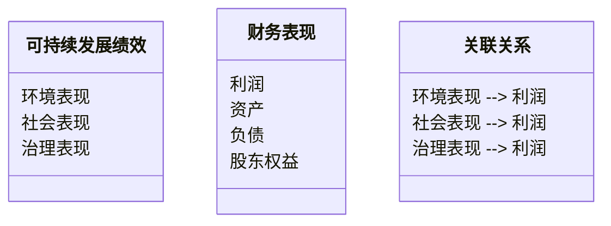
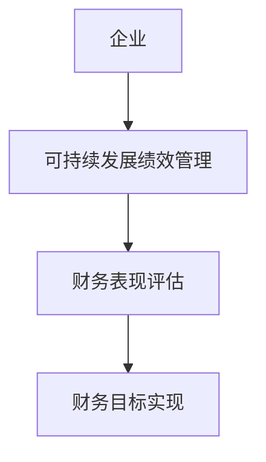
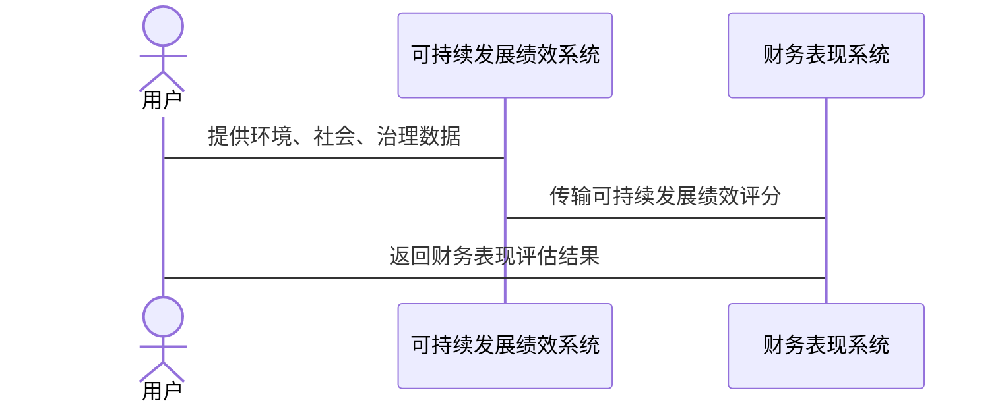

                 

<think>
好的，我需要帮助用户撰写一篇技术博客文章，标题是《可持续发展绩效与公司财务表现的相关性》。用户已经给出了一个详细的目录大纲，并要求我按照这个结构来撰写文章。首先，我需要理解每个章节的内容和要求，然后逐步展开每个部分，确保文章结构清晰、逻辑严密，同时满足用户的格式和内容要求。

首先，我会从引言开始，介绍可持续发展绩效和公司财务表现的相关性，说明研究的意义和目的。接着，在第二章，我会详细定义可持续发展绩效和公司财务表现的核心概念，分析它们的联系。第三章将进行系统分析与架构设计，包括问题场景介绍、系统功能设计等。之后，我会分析影响机制，探讨环境、社会、治理因素如何影响财务表现。然后是实证分析，通过数据和案例验证理论。之后，我会总结驱动因素，讨论内部管理和外部环境的影响。接下来，分析区域和行业差异，最后提出实践启示和未来展望。最后，附录部分会提供相关的数据和参考文献。

在撰写过程中，我需要确保每个部分都有详细的解释和例子，使用专业的技术语言，同时保持内容易懂。我还需要注意使用Mermaid图来辅助说明系统架构和实体关系，以及在适当的地方插入数学公式和代码示例。此外，用户要求文章末尾加上特定的作者信息，我需要在最后部分添加这一点。

现在，我将按照这个思路逐步撰写文章，确保每个章节都符合用户的要求，并在完成后进行整体检查，确保内容完整、格式正确，满足用户的所有需求。
</think>

# 可持续发展绩效与公司财务表现的相关性

---

## 关键词：
可持续发展绩效、公司财务表现、相关性分析、环境、社会、治理（ESG）、财务指标

---

## 摘要：
本文探讨了可持续发展绩效与公司财务表现之间的相关性。通过分析环境、社会和治理（ESG）因素对财务指标的影响，本文揭示了可持续发展绩效不仅关乎企业的社会责任，还能显著影响其财务表现。文章结合理论分析和实证研究，探讨了可持续发展绩效如何通过降低风险、提升品牌价值和优化资本结构等方式，改善公司的财务状况。同时，本文也提出了企业在追求财务目标时应考虑的可持续发展战略建议。

---

# 第1章: 可持续发展绩效与公司财务表现的背景介绍

## 1.1 可持续发展绩效的定义与核心概念

### 1.1.1 可持续发展的基本内涵
可持续发展是指在满足当前需求的同时，不损害后代满足其需求的能力。它涵盖经济、社会和环境三个维度，强调平衡发展与资源利用之间的关系。

### 1.1.2 可持续发展绩效的定义
可持续发展绩效是指企业在实现可持续发展目标过程中所取得的成果，包括减少碳排放、优化资源利用、提高社会责任履行等方面的表现。

### 1.1.3 可持续发展绩效的核心要素
- **环境因素**：包括减少碳足迹、节约能源、减少污染等。
- **社会因素**：包括员工权益、社区参与、公平对待等。
- **治理因素**：包括公司治理结构、透明度、合规性等。

## 1.2 公司财务表现的定义与核心指标

### 1.2.1 财务表现的定义
财务表现是指企业在一定时期内通过经营所产生的财务成果，通常包括利润、资产、负债、股东权益等指标。

### 1.2.2 财务表现的核心指标
- **利润**：净利润、营业利润等。
- **资产**：流动资产、固定资产等。
- **负债**：流动负债、长期负债等。
- **股东权益**：包括股本、盈余公积等。

### 1.2.3 财务表现的评价体系
常用的财务表现评价体系包括ROE（净资产收益率）、ROA（资产净利率）、毛利率、净利率等。

## 1.3 可持续发展绩效对财务表现的影响

### 1.3.1 可持续发展绩效对财务表现的直接影响
- 通过优化资源利用降低成本，提升盈利能力。
- 通过减少环境罚款和诉讼费用，降低财务风险。

### 1.3.2 可持续发展绩效对财务表现的间接影响
- 提升企业形象，增强品牌价值，吸引更多的投资者。
- 通过绿色融资降低成本，优化资本结构。

### 1.3.3 研究意义与目的
研究可持续发展绩效与财务表现的相关性，有助于企业在追求财务目标的同时，更好地履行社会责任，实现可持续发展。

---

# 第2章: 可持续发展绩效与公司财务表现的核心概念与联系

## 2.1 可持续发展绩效的核心原理

### 2.1.1 可持续发展绩效的理论基础
可持续发展绩效的理论基础包括生态经济学、社会价值论和公司治理理论。

### 2.1.2 可持续发展绩效的关键驱动因素
- **环境因素**：减少碳排放、节约能源。
- **社会因素**：员工满意度、社区参与。
- **治理因素**：公司治理透明度、合规性。

### 2.1.3 可持续发展绩效的衡量方法
常用的衡量方法包括环境、社会和治理（ESG）评分，碳排放强度等。

## 2.2 公司财务表现的核心原理

### 2.2.1 财务表现的理论基础
财务表现的理论基础包括财务管理学、资本预算理论和投资学。

### 2.2.2 财务表现的关键驱动因素
- **收入**：销售收入、服务收入等。
- **成本**：生产成本、运营成本等。
- **资产周转率**：资产使用效率。

### 2.2.3 财务表现的衡量方法
常用的衡量方法包括净现值（NPV）、内部收益率（IRR）、投资回收期（Payback Period）等。

## 2.3 可持续发展绩效与公司财务表现的联系

### 2.3.1 可持续发展绩效对财务表现的直接影响
- 通过优化资源利用降低成本，提升盈利能力。
- 通过减少环境罚款和诉讼费用，降低财务风险。

### 2.3.2 可持续发展绩效对财务表现的间接影响
- 提升企业形象，增强品牌价值，吸引更多的投资者。
- 通过绿色融资降低成本，优化资本结构。

### 2.3.3 可持续发展绩效与财务表现的相互作用
企业通过实现可持续发展绩效，可以提升财务表现；同时，良好的财务表现也为企业实现可持续发展目标提供了资金支持。

---

# 第3章: 可持续发展绩效与公司财务表现的系统分析与架构设计

## 3.1 问题场景介绍

### 3.1.1 可持续发展绩效与财务表现的关联场景
企业在追求利润的同时，需要考虑环境、社会和治理因素，这些因素不仅影响企业的声誉，也直接影响其财务表现。

### 3.1.2 研究问题的边界与外延
研究范围包括企业内部的可持续发展绩效管理和外部的财务表现评估，涉及企业战略、运营管理、财务管理等多个方面。

### 3.1.3 系统分析的目标与范围
系统分析的目标是通过建立模型，量化可持续发展绩效与财务表现之间的关系，为企业制定可持续发展战略提供依据。

## 3.2 系统功能设计

### 3.2.1 领域模型设计

### 3.2.2 系统架构设计

## 3.3 系统接口设计

### 3.3.1 可持续发展绩效数据接口
- **输入**：环境、社会、治理数据。
- **输出**：可持续发展绩效评分。

### 3.3.2 财务表现数据接口
- **输入**：财务指标数据。
- **输出**：财务表现评分。

## 3.4 系统交互设计

### 3.4.1 可持续发展绩效与财务表现的交互流程

---

# 第4章: 可持续发展绩效对财务表现的影响机制

## 4.1 环境因素的影响

### 4.1.1 环境因素对财务表现的直接影响
- 减少能源消耗，降低生产成本。
- 避免环境罚款，降低财务风险。

### 4.1.2 环境因素对财务表现的间接影响
- 提升企业形象，增强品牌价值。
- 通过绿色认证，开拓新的市场。

## 4.2 社会因素的影响

### 4.2.1 社会因素对财务表现的直接影响
- 提高员工满意度，降低员工流失率。
- 通过社会责任项目提升企业声誉。

### 4.2.2 社会因素对财务表现的间接影响
- 吸引更多消费者，增加销售收入。
- 降低公共关系成本，优化财务结构。

## 4.3 治理因素的影响

### 4.3.1 治理因素对财务表现的直接影响
- 提高公司治理透明度，降低融资成本。
- 通过合规经营，避免法律风险。

### 4.3.2 治理因素对财务表现的间接影响
- 提升投资者信心，优化资本结构。
- 通过良好的治理结构，提高管理效率。

---

# 第5章: 可持续发展绩效与公司财务表现的实证分析

## 5.1 数据来源与研究方法

### 5.1.1 数据来源
- 使用公开的ESG评分数据。
- 使用企业的财务报表数据。

### 5.1.2 研究方法
采用回归分析法，研究可持续发展绩效对财务表现的影响。

## 5.2 案例分析

### 5.2.1 案例一：环境因素对利润的影响
某制造企业通过减少能源消耗，降低了生产成本，从而提高了净利润。

### 5.2.2 案例二：社会因素对品牌价值的影响
某科技公司通过履行社会责任，提升了品牌形象，吸引了更多的消费者。

### 5.2.3 案例三：治理因素对资本成本的影响
某金融公司通过提高治理透明度，降低了融资成本，优化了资本结构。

## 5.3 实证结果与分析

### 5.3.1 可持续发展绩效与财务表现的正相关性
通过回归分析发现，可持续发展绩效与财务表现呈正相关关系。

### 5.3.2 区域和行业差异的影响
不同区域和行业的企业在实现可持续发展绩效与财务表现的相关性上存在差异。

---

# 第6章: 可持续发展绩效对财务表现的驱动因素分析

## 6.1 内部驱动因素

### 6.1.1 企业内部管理
- 优化资源配置，提高效率。
- 建立可持续发展目标，制定长期战略。

### 6.1.2 企业文化与员工参与
- 提高员工参与度，增强企业凝聚力。
- 倡导可持续发展理念，形成良好的企业文化。

## 6.2 外部驱动因素

### 6.2.1 政策与法规
- 政府出台相关政策，推动企业实现可持续发展目标。
- 法规对企业环境和社会责任的要求不断提高。

### 6.2.2 市场与消费者需求
- 消费者对可持续产品的需求增加。
- 市场竞争加剧，企业需要通过实现可持续发展绩效来获得竞争优势。

---

# 第7章: 可持续发展绩效与公司财务表现的区域与行业差异分析

## 7.1 区域差异分析

### 7.1.1 发达地区与欠发达地区的差异
- 发达地区企业更注重可持续发展绩效。
- 欠发达地区企业可能更关注短期财务目标。

### 7.1.2 政策与市场环境的影响
- 不同地区的政策和市场环境对可持续发展绩效与财务表现的相关性影响不同。

## 7.2 行业差异分析

### 7.2.1 高碳排放行业
- 如能源、制造等行业，可持续发展绩效对财务表现的影响更大。
- 通过减少碳排放，降低运营成本，提高利润。

### 7.2.2 低碳排放行业
- 如信息技术、服务业等行业，可持续发展绩效对财务表现的影响相对较小。
- 但通过提升社会责任形象，仍能获得竞争优势。

---

# 第8章: 可持续发展绩效与公司财务表现的实践启示与未来展望

## 8.1 实践启示

### 8.1.1 企业层面
- 将可持续发展绩效纳入企业战略，制定长期目标。
- 优化资源配置，提高效率，降低成本。

### 8.1.2 投资者层面
- 注重企业的可持续发展绩效，选择具有社会责任感的企业进行投资。
- 通过绿色投资，推动企业实现可持续发展目标。

## 8.2 未来展望

### 8.2.1 理论研究
- 进一步研究可持续发展绩效与财务表现的相关性。
- 探讨不同区域和行业的差异性影响。

### 8.2.2 实践应用
- 推动企业实现可持续发展目标，优化财务表现。
- 提高公众对可持续发展的认知，形成良好的社会氛围。

---

# 附录

## 附录A: 数据来源与处理方法

## 附录B: 研究模型与方法

## 附录C: 参考文献

---

**作者：AI天才研究院/AI Genius Institute & 禅与计算机程序设计艺术 /Zen And The Art of Computer Programming**

