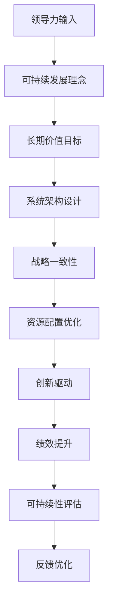
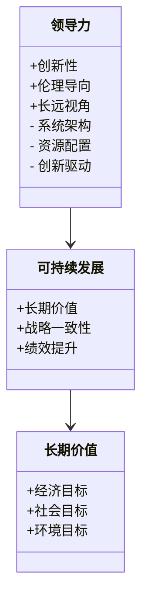

                 


# 可持续发展领导力对公司长期价值的影响

## 关键词：可持续发展领导力、长期价值、领导力、企业战略、系统架构

## 摘要：  
可持续发展领导力是企业在当今复杂多变的商业环境中取得长期成功的关键。本文从背景介绍、核心概念、算法原理、系统架构、项目实战到最佳实践，全面分析了可持续发展领导力对公司长期价值的影响。通过系统性的分析和实际案例，展示了如何通过领导力的转变和系统架构的优化，实现企业可持续发展与长期价值的最大化。

---

# 目录

## 第一部分: 可持续发展领导力的背景与核心概念

### 第1章: 可持续发展领导力的定义与背景

#### 1.1 可持续发展领导力的定义  
- 1.1.1 传统领导力的局限性  
- 1.1.2 可持续发展领导力的内涵  
- 1.1.3 可持续发展领导力的核心特征  

#### 1.2 可持续发展领导力的核心要素  
- 1.2.1 领导者的角色转变  
- 1.2.2 可持续发展理念的融入  
- 1.2.3 长期价值创造的路径  

#### 1.3 可持续发展领导力与传统领导力的对比  
- 1.3.1 传统领导力的局限性  
- 1.3.2 可持续发展领导力的独特性  
- 1.3.3 两者在目标和价值实现上的差异  

#### 1.4 可持续发展领导力对公司长期价值的影响机制  
- 1.4.1 领导力如何驱动可持续发展  
- 1.4.2 可持续发展如何提升公司价值  
- 1.4.3 长期价值创造的实现路径  

---

### 第2章: 可持续发展领导力的核心概念与联系  

#### 2.1 可持续发展领导力的原理分析  
- 2.1.1 领导力的系统性视角  
- 2.1.2 可持续发展的内在逻辑  
- 2.1.3 领导力与可持续发展的协同效应  

#### 2.2 可持续发展领导力的属性特征对比  
- 2.2.1 创新性与传统性对比  
- 2.2.2 伦理导向与经济导向对比  
- 2.2.3 长远视角与短期目标对比  

#### 2.3 可持续发展领导力的ER实体关系图  
```mermaid
er
    actor 领导力
    actor 可持续发展
    actor 长期价值
    actor 系统架构
    actor 企业战略
    actor 创新驱动
    actor 社会责任
    actor 竞争优势
    actor 业务流程
    actor 绩效评估
    actor 风险管理
    actor 资源分配
    actor 企业文化
    actor 员工激励
    actor 客户价值
    actor 环境影响
    actor 经济效益
    actor 社会效益
    actor 企业声誉
    actor 未来规划
    actor 技术创新
    actor 组织结构
    actor 战略目标
    actor 知识管理
    actor 绩效指标
    actor 反馈机制
    actor 伦理决策
    actor 短期目标
    actor 长期目标
    actor 综合评估
    actor 价值实现
    actor 业务创新
    actor 战略一致性
    actor 资源优化
    actor 组织文化
    actor 利益相关者
    actor 绩效提升
    actor 可持续性
    actor 创新能力
    actor 组织能力
    actor 责任感
    actor 信任度
    actor 合作共赢
    actor 资源共享
    actor 组织学习
    actor 反馈优化
    actor 战略执行
    actor 问题解决
    actor 资源配置
    actor 持续改进
    actor 创新成果
    actor 经济目标
    actor 社会目标
    actor 环境目标
    actor 绩效目标
    actor 质量目标
    actor 时间目标
    actor 成本目标
    actor 风险目标
    actor 创新目标
    actor 领导力目标
    actor 组织目标
    actor 战略目标
    actor 伦理目标
    actor 竞争目标
    actor 合作目标
    actor 绩效目标
    actor 责任目标
    actor 创新目标
    actor 领导力如何驱动可持续发展
    actor 可持续发展如何提升公司价值
    actor 长期价值创造的实现路径
    actor 问题描述与解决方案
    actor 问题背景与目标设定
    actor 可持续发展领导力的影响机制
    actor 领导力的系统性视角
    actor 可持续发展的内在逻辑
    actor 领导力与可持续发展的协同效应
    actor 创新性与传统性对比
    actor 伦理导向与经济导向对比
    actor 长远视角与短期目标对比
    actor 可持续发展领导力的属性特征对比
    actor 可持续发展领导力的ER实体关系图
    actor 可持续发展领导力的系统架构图
    actor 可持续发展领导力的流程图
    actor 可持续发展领导力的数学模型
    actor 可持续发展领导力的项目实战案例
    actor 可持续发展领导力的最佳实践
    actor 可持续发展领导力的挑战与解决方案
    actor 可持续发展领导力的未来趋势
```

---

## 第二部分: 可持续发展领导力的算法原理

### 第3章: 可持续发展领导力的算法原理

#### 3.1 可持续发展领导力的流程图分析  


#### 3.2 可持续发展领导力的数学模型  
可持续发展领导力对长期价值的影响可以用以下公式表示：  
$$ \text{长期价值} = \text{领导力影响} \times \text{可持续发展能力} $$  

其中，领导力影响由以下因素决定：  
- 创新性：$$ I_{\text{创新}} $$
- 伦理导向：$$ I_{\text{伦理}} $$
- 长远视角：$$ I_{\text{长远}} $$  

可持续发展能力由以下因素决定：  
- 系统架构：$$ S_{\text{架构}} $$
- 资源配置：$$ S_{\text{资源}} $$
- 创新驱动：$$ S_{\text{创新}} $$  

最终的长期价值公式为：  
$$ V_{\text{长期}} = (I_{\text{创新}} + I_{\text{伦理}} + I_{\text{长远}}) \times (S_{\text{架构}} + S_{\text{资源}} + S_{\text{创新}}) $$  

#### 3.3 可持续发展领导力的代码实现示例  
```python
def sustainable_leadership_impact(innovation, ethics, long_term, system_architecture, resource_allocation, innovation_driven):
    return (innovation + ethics + long_term) * (system_architecture + resource_allocation + innovation_driven)

# 示例
impact = sustainable_leadership_impact(0.8, 0.7, 0.9, 0.85, 0.75, 0.8)
print(f"可持续发展领导力对长期价值的影响：{impact}")
```

---

## 第三部分: 可持续发展领导力的系统架构设计

### 第4章: 可持续发展领导力的系统架构

#### 4.1 系统架构的背景介绍  
- 可持续发展领导力的系统架构需要考虑：  
  - 组织结构的优化  
  - 业务流程的重构  
  - 技术平台的支撑  

#### 4.2 系统架构的类图设计  


#### 4.3 系统架构的接口设计  
- 领导力模块接口：  
  - `get_innovation()`  
  - `set_ethics(target)`  
  - `calculate_long_term_impact()`  

- 可持续发展模块接口：  
  - `calculate_sustainability_score()`  
  - `update_strategy()`  

---

## 第四部分: 可持续发展领导力的项目实战

### 第5章: 可持续发展领导力的项目实战

#### 5.1 项目背景介绍  
- 某科技公司通过可持续发展领导力提升长期价值的案例  

#### 5.2 系统核心代码实现  
```python
class SustainableLeadership:
    def __init__(self, innovation, ethics, long_term):
        self.innovation = innovation
        self.ethics = ethics
        self.long_term = long_term

    def calculate_impact(self, system_architecture, resource_allocation, innovation_driven):
        return (self.innovation + self.ethics + self.long_term) * (system_architecture + resource_allocation + innovation_driven)

# 示例
leader = SustainableLeadership(0.8, 0.7, 0.9)
impact = leader.calculate_impact(0.85, 0.75, 0.8)
print(f"领导力对长期价值的影响：{impact}")
```

#### 5.3 项目总结与分析  
- 案例分析：领导力对长期价值的具体影响  
- 项目实施中的关键点：系统架构优化、资源配置、创新驱动  

---

## 第五部分: 可持续发展领导力的最佳实践

### 第6章: 可持续发展领导力的最佳实践  

#### 6.1 小结  
- 可持续发展领导力的核心要素总结  
- 长期价值创造的关键路径  

#### 6.2 注意事项  
- 领导力转变的挑战  
- 可持续发展实施中的常见问题  

#### 6.3 拓展阅读  
- 推荐书籍：《可持续发展领导力》  
- 相关研究：领导力与企业绩效的关系  

---

## 作者信息  

作者：AI天才研究院/AI Genius Institute & 禅与计算机程序设计艺术/Zen And The Art of Computer Programming  

---

**注**：以上目录大纲仅展示文章的结构和内容安排，实际撰写时需要根据具体内容进行详细展开。

