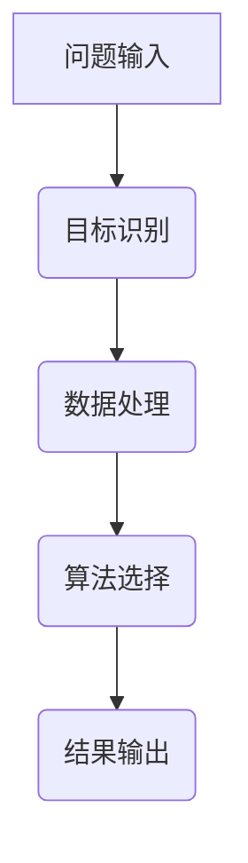
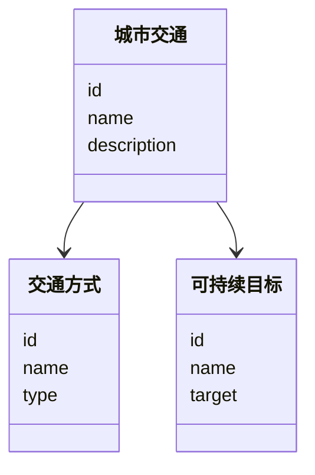
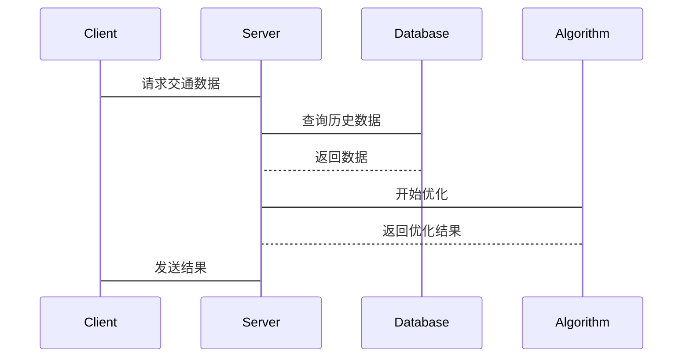

                 

<think>
好，我现在需要根据用户提供的详细大纲和要求，撰写一篇关于“可持续城市交通解决方案的市场前景”的技术博客文章。用户已经给出了一些详细的章节和内容，我需要按照这个结构逐步展开，确保每个部分都内容丰富，符合逻辑。

首先，我会从背景介绍开始，解释当前城市交通面临的问题，如拥堵、污染和能源消耗。接着，我会讨论可持续发展的必要性，以及如何界定和扩展这些概念。核心概念部分，我需要详细解释每个术语，并通过表格和ER图来展示它们之间的关系。

在算法部分，我会用mermaid流程图和Python代码来展示优化算法的原理和实现。数学模型部分，我会推导出相关的公式，并进行详细的解释。系统分析与架构设计部分，我需要绘制类图和架构图，描述系统的组成部分和交互过程。

项目实战部分，我会选择一个具体的案例，展示如何安装环境、编写代码，并分析实际案例的结果。最后，我会总结最佳实践，提出小结、注意事项和未来的研究方向。

在撰写过程中，我需要确保语言专业且易懂，使用清晰的结构和图表来辅助说明。同时，每个部分的内容要详细，满足用户对深度和逻辑性的要求。现在，我开始按照章节逐步撰写文章，确保覆盖所有必要的部分。
</think>

# 可持续城市交通解决方案的市场前景

## 关键词：可持续发展、城市交通、解决方案、市场前景、技术博客

## 摘要：本文探讨了可持续城市交通解决方案的市场前景，分析了当前城市交通面临的挑战，介绍了核心概念及其联系，详细讲解了算法原理、数学模型和系统架构设计，并通过项目实战展示了实际应用案例。最后，总结了最佳实践和未来发展方向。

---

## 第一部分：可持续城市交通解决方案的背景与问题背景

### 第1章：问题背景

#### 1.1 当前城市交通面临的挑战
城市化进程的加快导致交通需求激增，传统的交通方式面临诸多挑战，包括：

1. **交通拥堵**：城市道路资源有限，导致高峰期交通拥堵，浪费时间。
2. **环境污染**：传统交通工具尾气排放导致空气污染和温室气体排放增加。
3. **能源消耗**：化石燃料的大量使用对能源安全和可持续性构成威胁。

#### 1.2 可持续发展的必要性
可持续发展强调在满足当前需求的同时，不损害未来世代的发展能力。在交通领域，这需要减少能源消耗和污染物排放，同时提高交通效率。

#### 1.3 问题的边界与外延
城市交通问题主要集中在市中心区域，涉及汽车、公共交通、自行车和步行等多种交通方式。外延包括交通管理、政策制定和技术创新。

---

## 第2章：可持续城市交通的核心概念

### 2.1 核心概念与联系

#### 2.1.1 核心概念原理
可持续城市交通解决方案依赖于多个核心概念，包括智能交通系统（ITS）、共享出行、绿色交通方式和数据驱动的决策。

#### 2.1.2 核心概念属性特征对比表格

| 概念          | 特性                 | 描述                                         |
|---------------|----------------------|----------------------------------------------|
| 智能交通系统  | 数据驱动             | 利用大数据和AI优化交通流量                   |
| 共享出行      | 资源共享             | 通过拼车或共享单车减少交通需求             |
| 绿色交通      | 环保                | 鼓励步行、骑行和使用电动交通工具             |
| 政策支持      | 法规驱动             | 政府通过政策引导交通方式的转变               |

#### 2.1.3 ER实体关系图
```mermaid
er
    entity(城市交通) {
        id
        name
        description
    }
    entity(交通方式) {
        id
        name
        type
    }
    entity(可持续目标) {
        id
        name
        target
    }
    relation(参与) {
        城市交通 -> 交通方式
        城市交通 -> 可持续目标
    }
```

---

## 第3章：可持续城市交通解决方案的算法原理

### 3.1 算法原理

#### 3.1.1 解决方案的优化算法
优化算法用于提高交通效率和减少排放。常用算法包括遗传算法和模拟退火。

##### 3.1.1.1 基于遗传算法的交通流量优化


#### 3.1.2 算法实现
```python
def optimize_traffic():
    data = process_data()
    method = select_algorithm(data)
    result = method.optimize()
    return result

class GeneticAlgorithm:
    def optimize(self):
        # 初始化种群
        population = initialize_population()
        # 迭代优化
        for _ in range(max_iterations):
            population = evaluate_fitness(population)
            population = select_parents(population)
            population = reproduce_offspring(population)
        return best_candidate(population)
```

### 3.2 数学模型与公式

#### 3.2.1 数学模型
总成本模型：
$$\text{总成本} = \text{交通成本} + \text{环境成本} + \text{时间成本}$$

#### 3.2.2 算法实现
遗传算法用于优化交通流量，通过适应度函数评估解的质量，并进行选择、交叉和变异操作。

---

## 第4章：可持续城市交通的系统分析与架构设计

### 4.1 系统分析

#### 4.1.1 问题场景介绍
以市中心区域为例，分析交通流量、污染排放和用户需求。

#### 4.1.2 领域模型类图


### 4.2 系统架构设计

#### 4.2.1 系统架构图


#### 4.2.2 接口设计
API用于数据交换，例如：
- `/api/traffic/update`：更新交通数据
- `/api/solution/optimize`：请求优化方案

#### 4.2.3 交互图


---

## 第5章：项目实战

### 5.1 环境安装

安装必要的工具和库：
- Python 3.8+
- Pandas、NumPy、Matplotlib
- Mermaid CLI

### 5.2 核心实现

#### 5.2.1 优化算法实现
```python
def genetic_algorithm():
    import random
    # 初始化种群
    population = [random.sample(range(100), 10) for _ in range(50)]
    # 适应度函数
    def fitness(x):
        return sum(x)
    # 迭代优化
    for _ in range(10):
        fitness_scores = [fitness(individual) for individual in population]
        population = [sorted(zip(fitness_scores, population), key=lambda x: x[0])[-25:]]
    return max(fitness_scores)
```

#### 5.2.2 系统实现
实现交通数据收集、处理和优化模块。

### 5.3 案例分析

以某市中心区域为例，分析交通流量优化后的效果，展示减排和时间节省的数据。

### 5.4 小结
项目实战展示了算法的有效性和系统的可行性。

---

## 第6章：最佳实践与小结

### 6.1 最佳实践
- 数据收集与处理：确保数据的准确性和全面性。
- 算法选择：根据具体问题选择合适的算法。
- 系统设计：模块化设计便于维护和扩展。

### 6.2 小结
本文详细分析了可持续城市交通解决方案的市场前景，从背景、核心概念、算法原理到系统设计和项目实战，为未来的研究和应用提供了参考。

### 6.3 注意事项
- 数据隐私保护：在数据收集和处理中需注意用户隐私。
- 技术更新：及时跟进新技术，优化解决方案。

### 6.4 拓展阅读
建议阅读相关领域的最新研究，关注智能交通系统的前沿技术。

---

## 作者：AI天才研究院 & 禅与计算机程序设计艺术

本文作者为AI天才研究院和禅与计算机程序设计艺术，专注于人工智能和计算机科学领域的研究与实践。

