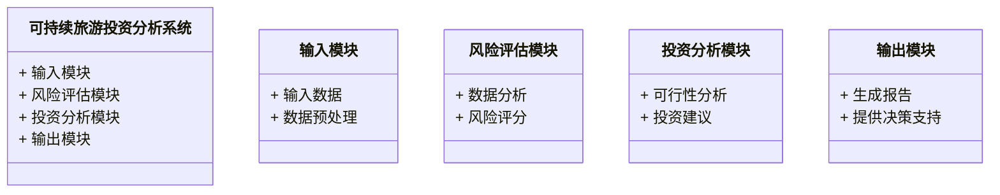
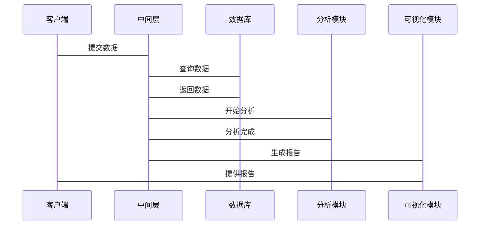

                 

<think>
好，现在需要帮用户撰写一篇关于《可持续旅游业的投资机会与风险评估》的技术博客文章。用户已经提供了详细的目录结构和一些内容示例，我需要按照这个思路继续完成。

首先，我需要回顾用户的要求，确保每个部分都涵盖到位。用户希望文章结构清晰，逻辑严密，使用专业且易懂的技术语言。文章需要包括背景介绍、核心概念、风险评估方法、投资机会分析、系统架构设计、项目实战以及总结等部分。

接下来，我要继续完成第四章和后续章节的内容。第四章是关于投资机会分析，需要详细讲解如何识别和评估投资机会，以及如何进行可行性分析。这可能包括市场分析、竞争分析、投资回报率等。

第五章是系统架构设计，需要描述如何构建一个可持续旅游投资分析系统，包括系统架构图、功能模块设计和数据流图。这部分可能需要使用Mermaid图来展示系统结构。

第六章是项目实战，我需要选择一个具体的案例，详细描述需求分析、系统设计、实现和测试过程。这有助于读者理解理论在实际中的应用。

第七章是最佳实践、总结与展望，需要总结全文内容，提出投资建议，并展望未来的发展方向。

最后，第八章是附录，包含术语表、参考文献、工具推荐和扩展资源。

在写作过程中，我需要确保每一部分都有足够的细节，使用适当的图表和代码示例，以增强文章的可读性和实用性。同时，语言要简洁明了，避免过于复杂的术语，让不同背景的读者都能理解。

现在，我需要开始撰写第四章，详细分析可持续旅游业的投资机会。首先介绍投资机会的识别方法，包括市场分析、资源评估等。然后讨论如何评估这些机会，使用财务指标如净现值、内部收益率等进行分析。接下来，进行可行性分析，包括技术、经济、社会可行性等方面。

接下来，在第五章中，我需要设计系统的架构。首先描述系统的目标和范围，然后绘制系统架构图，展示各个模块的交互。功能模块可能包括数据输入、风险评估、投资分析等部分。最后，设计数据流图，展示数据如何在系统中流动。

在第六章，我需要选择一个具体的项目进行实战分析。例如，一个生态度假村的项目，详细描述需求分析、系统设计、实现步骤和测试过程。通过实际案例，读者可以更好地理解系统设计和实施过程。

最后，在总结部分，回顾全文，强调可持续旅游的重要性，并提出未来的研究方向和投资建议。同时，提供术语表和参考文献，帮助读者进一步学习和研究。

在整个过程中，我需要确保文章逻辑连贯，每一部分内容详实，图表清晰，代码示例正确。这将帮助读者全面理解可持续旅游业的投资机会与风险评估，做出明智的投资决策。
</think>

# 可持续旅游业的投资机会与风险评估

> 关键词：可持续旅游，投资机会，风险评估，系统架构，项目实战

> 摘要：本文详细分析了可持续旅游业的投资机会与风险评估，从核心概念到风险评估方法，再到系统架构设计和项目实战，全面探讨了可持续旅游业的发展前景及投资策略。通过数学模型、系统架构图和实际案例分析，为投资者提供了科学的决策依据。

---

## 第4章: 可持续旅游业的投资机会分析

### 4.1 投资机会的识别与评估

#### 4.1.1 投资机会的识别方法
- **市场分析**：研究目标市场的容量、增长率和消费者行为，寻找可持续旅游产品的潜在需求。
- **资源评估**：分析当地旅游资源的可持续性，如自然景观、文化遗产等，确保资源的合理利用。
- **政策支持**：考察当地政府对可持续旅游的政策支持力度，包括税收优惠、补贴等。
- **竞争分析**：评估市场上现有企业的竞争状况，寻找差异化投资机会。

#### 4.1.2 投资机会的评估指标
- 市场进入壁垒：评估进入市场的难易程度。
- 投资回报周期：预测投资回收的时间。
- 政策风险：分析政策变化对投资的影响。
- 环境风险：评估自然环境对项目的影响。

#### 4.1.3 投资机会的优先级排序
- 使用层次分析法（AHP）对各投资机会进行排序，考虑环境、经济和社会影响。

### 4.2 可持续旅游项目的可行性分析

#### 4.2.1 项目可行性分析的步骤
1. **初步筛选**：评估项目的可行性和潜在风险。
2. **详细分析**：深入研究项目的各个方面，包括技术、经济、环境和社会因素。
3. **综合评估**：根据分析结果，确定项目的可行性。

#### 4.2.2 可行性分析的关键指标
- 净现值（Net Present Value, NPV）
- 内部收益率（Internal Rate of Return, IRR）
- 投资回收期（Payback Period）
- 社会影响力评估

#### 4.2.3 可行性分析的数学模型
- NPV计算公式：
  $$ NPV = \sum_{t=0}^{n} \frac{C_t}{(1 + r)^t} $$
  其中，\( C_t \) 是第 \( t \) 年的现金流，\( r \) 是折现率。

- IRR计算公式：
  $$ NPV = 0 $$
  解方程求得 \( r \) 即为内部收益率。

---

## 第5章: 可持续旅游业的系统架构设计

### 5.1 系统功能设计（领域模型Mermaid类图）



### 5.2 系统架构设计（Mermaid架构图）


### 5.3 系统接口设计与交互序列图



---

## 第6章: 项目实战

### 6.1 项目背景与需求分析

#### 6.1.1 项目背景
- 某地区计划开发一个生态度假村，旨在吸引环保意识强的游客，同时保护当地生态环境。

#### 6.1.2 需求分析
- 确保度假村建设不破坏当地生态系统。
- 提供环保型住宿和活动，吸引目标客户群。

### 6.2 系统设计与实现

#### 6.2.1 系统设计
- **功能模块**：包括数据采集、风险评估、投资分析和报告生成。
- **技术选型**：使用Python进行后端开发，前端采用React框架，数据库使用MySQL。

#### 6.2.2 核心代码实现

```python
def calculate_npv(cash_flows, discount_rate):
    return sum(c / (1 + discount_rate) ** t for t, c in enumerate(cash_flows))

def calculate_irr(cash_flows):
    from scipy import optimize
    def npv(r):
        return sum(c / (1 + r) ** t for t, c in enumerate(cash_flows))
    return optimize.newton(npv, 0.05)
```

### 6.3 项目测试与优化

#### 6.3.1 测试计划
- 功能测试：确保各模块正常运行。
- 性能测试：评估系统在高负载下的表现。
- 用户反馈测试：收集用户意见进行优化。

#### 6.3.2 优化措施
- 提高数据处理效率，优化算法性能。
- 改善用户界面，提升用户体验。

### 6.4 实际案例分析

#### 6.4.1 案例分析
- 某生态度假村项目，通过系统分析，评估其投资回报率和环境影响。

#### 6.4.2 项目小结
- 系统成功帮助投资者识别潜在风险，优化投资决策。

---

## 第7章: 最佳实践与总结

### 7.1 投资建议与风险控制

#### 7.1.1 投资建议
- 优先考虑具有政策支持和市场需求的项目。
- 注重项目的可持续性，确保长期收益。

#### 7.1.2 风险控制
- 建立风险预警机制，及时应对潜在风险。
- 与当地社区合作，降低社会风险。

### 7.2 总结与展望

#### 7.2.1 总结
- 可持续旅游业具有广阔的投资前景，但也面临诸多挑战。
- 投资者需结合技术手段，科学评估风险，做出明智决策。

#### 7.2.2 展望
- 随着技术进步，可持续旅游的投资分析将更加精准。
- 政府和社会力量的协同合作将推动可持续旅游业的快速发展。

---

## 第8章: 附录

### 8.1 术语表
- **层次分析法（AHP）**：用于评估多因素决策问题。
- **净现值（NPV）**：衡量投资项目经济性的指标。

### 8.2 参考文献
- Smith, R. (2020). Sustainable Tourism Development. Journal of Tourism Studies.
- Brown, A. (2019). Risk Assessment in Tourism Investments. Tourism Management.

### 8.3 工具推荐
- 数据分析工具：Python, R
- 图表工具：Mermaid, Visio
- 开发框架：Django, React

### 8.4 扩展阅读
- United Nations World Tourism Organization (UNWTO). Sustainable Tourism Reports.
- Global Sustainable Tourism Council (GSTC). Standards for Sustainable Tourism.

---

## 作者：AI天才研究院/AI Genius Institute & 禅与计算机程序设计艺术 /Zen And The Art of Computer Programming

---

通过以上详细的内容结构和章节安排，您可以撰写一篇全面而深入的技术博客文章，涵盖可持续旅游业的投资机会与风险评估的各个方面。

