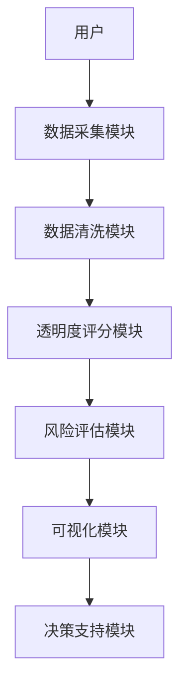

                 

# 可持续时尚供应链的透明度与投资风险

> 关键词：可持续时尚供应链, 供应链透明度, 投资风险, 可持续发展, 数字技术, 系统架构, 透明度评估

> 摘要：  
随着全球对可持续发展的关注日益增加，时尚供应链的透明度与投资风险成为行业焦点。本文从透明度的定义、核心要素及与投资风险的关系入手，结合算法、数学模型和系统架构设计，深入分析可持续时尚供应链的透明度对投资风险的影响。文章通过实际案例和系统设计，提出优化透明度的策略，为投资者和企业提供科学的决策依据。

---

## 第1章: 可持续时尚供应链的透明度与投资风险背景

### 1.1 可持续时尚供应链的背景

#### 1.1.1 传统供应链的局限性
传统供应链模式往往关注成本和效率，忽视环境和社会影响。例如，许多品牌依赖快速时尚模式，导致资源浪费和环境污染。这种模式不仅增加了企业的运营风险，还对社会和环境造成了负面影响。

#### 1.1.2 可持续发展的重要性
可持续发展已成为全球共识。时尚行业作为资源消耗大户，其供应链的透明度直接关系到企业社会责任的履行和品牌形象。消费者对环保和伦理的关注度不断提高，推动企业必须重新审视供应链的管理方式。

#### 1.1.3 时尚行业供应链的特点
时尚供应链具有链条长、参与者多、复杂性高等特点。从原材料采购、生产加工到物流配送，每个环节都可能涉及环境和社会风险。例如，棉花种植可能涉及水资源过度使用，制造过程可能产生大量碳排放。

---

### 1.2 透明度与投资风险的定义

#### 1.2.1 透明度的定义
供应链透明度是指企业能够清晰、准确地向利益相关者（如消费者、投资者、监管机构）展示供应链各环节的信息。透明度的核心要素包括信息的可追溯性、可验证性和可及性。

#### 1.2.2 投资风险的定义
投资风险是指由于供应链中的不确定性因素（如环境、社会和治理风险）导致的投资损失的可能性。在可持续供应链中，透明度的缺乏可能导致投资风险的增加，因为投资者无法充分评估企业的社会责任履行情况。

#### 1.2.3 可持续供应链的核心要素
可持续供应链的核心要素包括：
1. 环境因素：减少碳排放、资源浪费。
2. 社会因素：保障工人权益、避免童工和不公待遇。
3. 治理因素：企业合规性、道德经营。

---

### 1.3 可持续时尚供应链的挑战与机遇

#### 1.3.1 供应链透明度的挑战
- **信息孤岛**：供应链各环节数据分散，难以整合。
- **数据真实性**：企业可能隐瞒负面信息。
- **技术限制**：缺乏统一的数字化工具支持透明度管理。

#### 1.3.2 投资风险的影响因素
- **环境风险**：碳排放、资源浪费可能导致罚款或声誉损失。
- **社会风险**：劳动权益问题可能引发消费者抵制或法律风险。
- **治理风险**：企业合规性不足可能导致供应链中断。

#### 1.3.3 可持续供应链的未来趋势
- **数字化转型**：通过区块链、物联网等技术提高透明度。
- **消费者驱动**：消费者对可持续产品的偏好推动企业改进供应链。
- **政策监管**：政府出台更严格的环保和社会责任法规。

---

## 第2章: 供应链透明度的核心概念

### 2.1 供应链透明度的层次模型

透明度的层次模型包括以下三个层次：
1. **基础层**：供应链的基本信息，如供应商名单、生产地点。
2. **中间层**：环境和社会影响数据，如碳排放、劳动条件。
3. **顶层**：战略层，如企业的可持续发展目标和行动计划。

---

### 2.2 透明度与投资风险的关系

透明度越高，投资风险越低。以下是透明度如何降低投资风险的机制：
1. **提高可追溯性**：透明的供应链能够快速定位问题，减少潜在风险。
2. **增强信任**：透明度高的企业更容易获得投资者的信任和资金支持。
3. **降低合规风险**：透明的供应链更容易满足监管要求，减少法律风险。

---

## 第3章: 透明度评估的算法与数学模型

### 3.1 透明度评估的算法概述

透明度评估算法基于以下步骤：
1. **数据采集**：收集供应链各环节的数据。
2. **数据清洗**：去除噪声数据，确保数据准确性。
3. **评分计算**：根据透明度指标对供应商进行评分。
4. **风险分析**：结合评分和投资风险模型，评估潜在风险。

---

### 3.2 投资风险评估的数学模型

投资风险评估模型如下：

$$
\text{投资风险} = \alpha \times \text{环境风险} + \beta \times \text{社会风险} + \gamma \times \text{治理风险}
$$

其中，$\alpha$, $\beta$, $\gamma$ 是权重系数，$\alpha + \beta + \gamma = 1$。

---

## 第4章: 可持续时尚供应链透明度的系统设计

### 4.1 系统架构设计

透明度评估系统架构如下：

---

### 4.2 系统功能设计

1. **数据采集模块**：通过区块链技术记录供应链各环节的数据。
2. **数据清洗模块**：去除噪声数据，确保数据准确性。
3. **透明度评分模块**：根据透明度指标对供应商进行评分。
4. **风险评估模块**：结合评分和投资风险模型，评估潜在风险。
5. **可视化模块**：生成透明度报告和风险地图，便于用户查看。

---

## 第5章: 项目实战与案例分析

### 5.1 案例分析

以某快时尚品牌为例，分析其供应链透明度优化过程：

1. **问题识别**：发现部分供应商存在劳动权益问题。
2. **数据采集**：通过区块链技术记录供应商信息。
3. **评分计算**：对供应商进行透明度评分。
4. **风险评估**：识别高风险供应商并制定改进计划。
5. **优化措施**：与合规供应商合作，降低投资风险。

---

## 第6章: 总结与最佳实践

### 6.1 总结

可持续时尚供应链的透明度是降低投资风险的关键。通过数字化技术、透明度评估算法和系统架构设计，企业可以有效优化供应链管理，提升透明度，降低投资风险。

### 6.2 最佳实践

1. **采用数字技术**：利用区块链、物联网等技术提高透明度。
2. **加强多方合作**：与供应商、消费者和投资者共同推动透明供应链建设。
3. **定期评估与优化**：持续监控供应链透明度，及时调整策略。

---

## 作者：AI天才研究院/AI Genius Institute & 禅与计算机程序设计艺术 /Zen And The Art of Computer Programming

