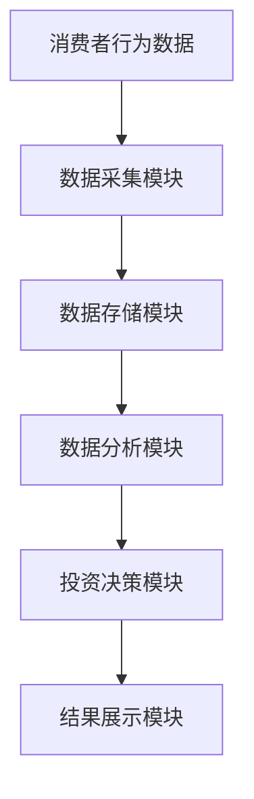
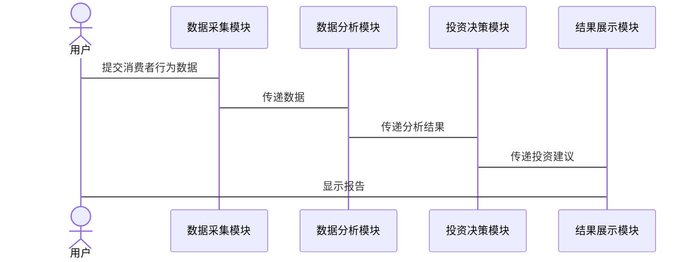

                 


# 可持续时尚品牌的消费者行为分析与投资

## 关键词：
可持续时尚、消费者行为分析、投资策略、数据驱动决策、人工智能辅助分析、ESG评分模型、品牌忠诚度

## 摘要：
随着全球对可持续发展的关注日益增加，可持续时尚品牌正逐渐成为消费者和投资者的焦点。本文通过分析消费者行为与可持续时尚品牌之间的关系，结合数据驱动的决策方法和人工智能技术，深入探讨如何利用消费者行为数据构建投资模型，以实现可持续时尚品牌的长期价值增长。文章内容涵盖从背景分析到投资策略的全过程，结合实际案例和数学模型，为投资者和企业提供实用的分析工具和决策支持。

---

# 正文

## 第一部分：可持续时尚品牌的背景与消费者行为概述

### 第1章：可持续时尚品牌的定义与背景

#### 1.1 可持续时尚的定义与核心要素
可持续时尚是指在整个生命周期内，从原材料采购、生产、消费到废弃处理，尽可能减少对环境和社会的负面影响，并实现经济的可持续性。其核心要素包括：
- **环境友好性**：减少资源消耗和污染。
- **社会责任性**：保障劳动者权益，避免剥削。
- **经济可持续性**：确保商业模式的长期盈利能力。

#### 1.2 消费者行为的定义与分类
消费者行为是指消费者在购买、使用和处置产品或服务时的决策过程和行为模式。根据行为特征，可持续消费行为可以分为：
- **理性型**：基于价格、质量等理性因素做出决策。
- **感性型**：受情感、价值观驱动，关注品牌的社会责任。
- **混合型**：综合考虑理性与感性因素。

#### 1.3 可持续时尚品牌的影响因素
- **环境因素**：消费者对气候变化、资源短缺的关注度提高。
- **社会因素**：消费者对社会责任和公平贸易的诉求增加。
- **经济因素**：可持续产品的溢价与消费者支付意愿的平衡。

#### 1.4 可持续时尚品牌的趋势分析
- **全球可持续消费趋势**：消费者越来越倾向于支持环保和公平的品牌。
- **可持续时尚品牌的崛起**：越来越多品牌推出环保系列或承诺可持续发展。
- **消费者认知变化**：消费者对可持续品牌的认知从“ niche”逐渐转向“主流”。

#### 1.5 本章小结
本章通过定义可持续时尚和消费者行为，分析了两者的核心要素和影响因素，并探讨了可持续时尚品牌的崛起趋势。这些分析为后续的消费者行为分析和投资策略奠定了基础。

---

### 第2章：消费者行为分析的核心概念与方法论

#### 2.1 消费者行为分析的理论基础
- **心理学基础**：消费者决策受到认知、情感和社会影响。
- **社会学基础**：社会规范和群体压力影响消费行为。
- **经济学基础**：消费者选择基于效用最大化原则。

#### 2.2 可持续消费行为的分析模型
- **动机-态度-行为模型**：消费者的行为由动机驱动，态度影响行为。
- **品牌忠诚度模型**：消费者对品牌的忠诚度影响其持续选择。

#### 2.3 数据采集与分析方法
- **定量数据分析**：通过问卷调查、销售数据等进行统计分析。
- **定性数据分析**：通过访谈、焦点小组等获取深度见解。
- **混合研究方法**：结合定量和定性数据，提高分析的全面性。

#### 2.4 消费者行为分析的工具与技术
- **数据挖掘技术**：使用关联规则挖掘、聚类分析等技术发现消费者行为模式。
- **机器学习算法**：如随机森林、支持向量机等，用于预测消费者行为。
- **自然语言处理技术**：分析消费者评论，提取情感倾向和关键词。

#### 2.5 本章小结
本章介绍了消费者行为分析的理论基础、模型和方法，强调了数据驱动和人工智能技术在分析中的应用。

---

### 第3章：可持续时尚品牌与消费者行为的关联性分析

#### 3.1 可持续时尚品牌对消费者行为的影响
- **消费者价值观的转变**：越来越多消费者重视品牌的社会责任。
- **消费行为的变化趋势**：从价格驱动转向价值驱动。
- **品牌忠诚度的提升**：可持续品牌更容易获得消费者的长期支持。

#### 3.2 消费者行为对可持续时尚品牌的影响
- **需求驱动作用**：消费者需求推动品牌创新和改进。
- **选择多样性**：消费者对可持续产品的多样化需求促进品牌多样性。
- **品牌创新的推动**：消费者反馈推动品牌优化产品和服务。

#### 3.3 可持续时尚品牌与消费者行为的互动关系
- **信息互动**：品牌通过透明化生产信息影响消费者决策。
- **消费者反馈**：消费者反馈推动品牌改进和创新。
- **品牌策略调整**：品牌根据消费者行为调整营销策略。

#### 3.4 实例分析：某可持续时尚品牌消费者行为研究
- **数据来源**：通过问卷调查收集消费者行为数据。
- **分析方法**：使用随机森林算法分析消费者行为的驱动因素。
- **结果解读**：消费者对品牌透明度和环保材质的关注度最高。

---

## 第二部分：可持续时尚品牌的消费者行为分析与投资策略

### 第4章：可持续时尚品牌的投资策略

#### 4.1 可持续时尚品牌的评估指标
- **环境指标**：碳排放、资源利用率。
- **社会指标**：劳动条件、社会责任。
- **经济指标**：盈利能力、成长潜力。

#### 4.2 投资模型构建
- **数据准备**：收集品牌历史数据、消费者行为数据。
- **模型选择**：使用线性回归或随机森林预测品牌价值。
- **模型验证**：通过交叉验证评估模型的准确性。

#### 4.3 投资风险与管理
- **市场风险**：消费者偏好变化可能导致投资波动。
- **运营风险**：生产过程中的环境问题可能影响品牌声誉。
- **管理策略**：分散投资、动态调整投资组合。

#### 4.4 案例分析：某可持续时尚品牌投资评估
- **数据来源**：品牌过去5年的财务数据、消费者满意度评分。
- **分析方法**：构建多元回归模型预测品牌未来表现。
- **结果解读**：品牌具有较高的成长潜力，但需要关注市场竞争风险。

---

### 第5章：系统分析与架构设计方案

#### 5.1 问题场景介绍
- **目标**：构建一个消费者行为分析与投资决策支持系统。
- **项目介绍**：系统将整合消费者数据、品牌数据和市场数据。

#### 5.2 系统功能设计
- **数据采集模块**：采集消费者行为数据、品牌数据。
- **数据分析模块**：包括数据清洗、特征提取和模型训练。
- **结果展示模块**：生成可视化报告和投资建议。

#### 5.3 系统架构设计


#### 5.4 系统接口设计
- **输入接口**：消费者行为数据、品牌数据。
- **输出接口**：可视化报告、投资建议。

#### 5.5 系统交互设计


---

### 第6章：项目实战

#### 6.1 环境安装
- **工具安装**：安装Python、Pandas、Scikit-learn、Matplotlib。
- **数据源**：获取消费者行为数据和品牌数据。

#### 6.2 核心实现源代码
```python
import pandas as pd
from sklearn.ensemble import RandomForestRegressor
from sklearn.metrics import mean_squared_error

# 数据加载
data = pd.read_csv('consumer_behavior.csv')

# 特征工程
features = data.drop('target', axis=1)
target = data['target']

# 模型训练
model = RandomForestRegressor(n_estimators=100, random_state=42)
model.fit(features, target)

# 预测与评估
predictions = model.predict(features)
mse = mean_squared_error(target, predictions)
print(f'MSE: {mse}')
print(f'R²: {model.score(features, target)}')
```

#### 6.3 代码实现解读
- **数据加载**：从CSV文件读取数据。
- **特征工程**：提取特征并分离目标变量。
- **模型训练**：使用随机森林回归模型进行训练。
- **预测与评估**：计算均方误差和R²值，评估模型性能。

#### 6.4 实际案例分析
- **案例选择**：选择一家中等规模的可持续时尚品牌。
- **数据分析**：分析消费者行为数据，生成投资建议。
- **结果解读**：评估品牌的投资价值和风险。

#### 6.5 项目小结
通过实际案例分析，验证了模型的有效性和实用性，为投资者提供了科学的决策支持。

---

## 第三部分：总结与展望

### 7.1 总结
本文通过分析可持续时尚品牌的消费者行为，结合数据驱动和人工智能技术，构建了投资模型，并提出了系统设计方案。研究结果表明，可持续时尚品牌具有较高的投资价值，但也需要关注市场风险和运营风险。

### 7.2 注意事项
- **数据质量**：确保数据的准确性和完整性。
- **模型局限性**：随机森林模型对数据特征的依赖性强，需谨慎选择特征。
- **动态调整**：市场环境变化需要及时调整投资策略。

### 7.3 拓展阅读
- 推荐阅读《可持续发展与消费行为》、《人工智能在金融投资中的应用》等书籍，深入理解相关领域的知识。

---

## 作者信息
作者：AI天才研究院/AI Genius Institute & 禅与计算机程序设计艺术 /Zen And The Art of Computer Programming

---

通过以上结构化的内容，您可以根据需要进一步扩展每个部分的具体内容，以完成一篇完整的、有深度的博客文章。

