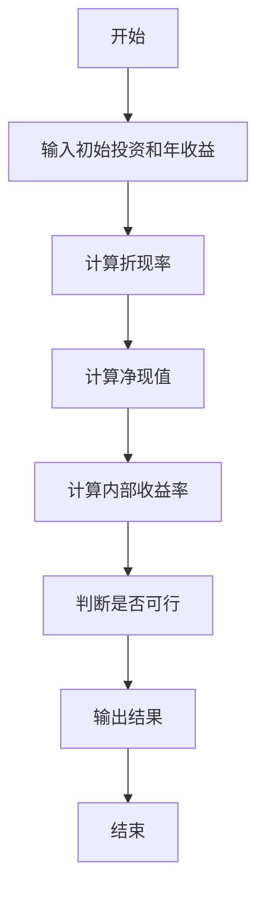
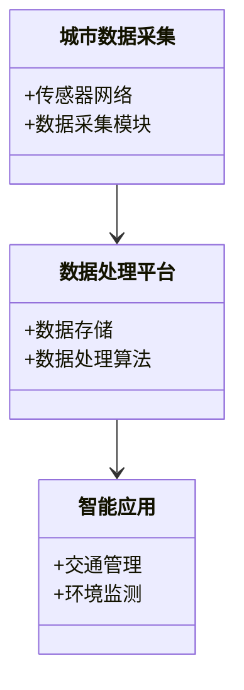
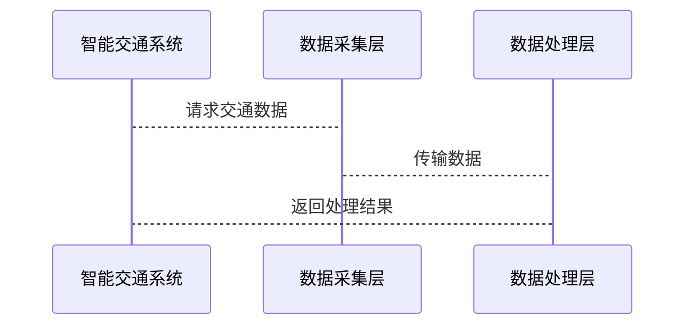

                 

<think>
嗯，我现在需要帮用户撰写一篇关于《可持续智慧城市解决方案的投资回报分析》的技术博客文章。用户已经提供了一个详细的目录大纲，所以我需要根据这个大纲来逐步完成内容。

首先，我需要理解每个章节的内容。文章的结构从背景介绍开始，然后是核心概念，接着是投资回报分析的方法，算法原理，系统架构，项目实战，最后是最佳实践。每个部分都需要详细展开，确保内容全面且有深度。

在写背景介绍时，我需要先定义可持续智慧城市，并说明其关键组成部分。这部分需要简洁明了，让读者能够理解基本概念。然后，我需要讨论技术支撑，包括物联网、大数据和人工智能的作用，以及绿色能源和低碳技术的重要性。最后，说明投资回报分析的重要性，强调其在项目决策中的作用。

接下来是核心概念部分。我需要详细解释可持续智慧城市的关键要素，比如基础设施、数据平台和智能应用，同时对比分析技术与政策、短期与长期回报的关系。这部分可能需要制作一个对比分析表格，帮助读者更好地理解。

然后是投资回报分析的方法论。我需要介绍分析框架，说明如何从经济、社会和环境效益三个维度进行分析。同时，详细讲解定性和定量分析的方法，包括如何使用净现值和内部收益率等指标来评估项目的可行性。

在算法原理部分，我需要使用Mermaid流程图来展示投资回报分析的步骤，并提供Python代码示例。这部分需要解释如何计算净现值和内部收益率，以及如何判断项目是否可行。同时，用数学公式详细说明模型的原理，确保读者能够理解。

系统架构部分需要介绍智慧城市的整体架构，包括数据采集、平台处理和应用展示。这部分可能需要制作类图和架构图，展示系统的各个模块及其关系，帮助读者理解系统的结构。

项目实战部分需要选择一个具体案例，比如智能交通系统，详细描述项目背景、环境安装、核心代码实现、案例分析和小结。这部分需要提供实际的数据和计算结果，展示投资回报分析的实际应用。

最后是最佳实践部分，总结关键点，强调数据质量、长期视角、政策支持和技术创新的重要性。同时，给出一些注意事项，帮助读者在实际操作中避免常见错误。

在写作过程中，我需要确保每个部分都符合用户的要求，比如使用Mermaid图表、LaTeX公式，以及提供代码示例。同时，要保持语言简洁，逻辑清晰，让读者能够轻松理解内容。

现在，我需要开始撰写每个部分，按照目录大纲逐步展开，确保内容详实且有深度。同时，注意使用技术术语，保持专业性，同时让内容易于理解。
</think>

# 可持续智慧城市解决方案的投资回报分析

> **关键词**：可持续智慧城市、投资回报分析、智慧城市解决方案、技术支撑、净现值、内部收益率

> **摘要**：  
本文深入探讨了可持续智慧城市解决方案的投资回报分析方法，从背景、核心概念、分析框架到实际案例，系统阐述了如何通过技术手段实现智慧城市的可持续发展，并评估其经济效益。文章结合实际案例，通过算法和系统架构的设计，展示了如何在智慧城市建设中实现投资回报的最大化，同时兼顾环境保护与社会福祉。

---

## 第1章：可持续智慧城市解决方案的背景介绍

### 1.1 可持续智慧城市的核心概念

#### 1.1.1 可持续智慧城市的基本定义  
可持续智慧城市是指通过技术手段优化城市资源利用、提升居民生活质量并减少环境影响的城市发展模式。其核心在于整合物联网、大数据、人工智能等技术，实现城市运行的智能化和绿色化。

#### 1.1.2 智慧城市的关键组成部分  
- **基础设施**：包括智能交通系统、智能电网和物联网设备。  
- **数据平台**：用于整合和分析城市数据，支持决策。  
- **智能应用**：如智能交通管理、环境监测和能源管理。  
- **绿色能源**：太阳能、风能等可再生能源的使用。  

#### 1.1.3 可持续发展的目标与意义  
目标：减少碳排放，提高资源利用效率，改善居民生活质量。  
意义：通过技术手段实现城市与自然的和谐共生，推动经济可持续发展。

---

### 1.2 可持续智慧城市的技术支撑

#### 1.2.1 物联网技术在智慧城市中的应用  
物联网（IoT）通过传感器和智能设备实时监测城市运行状态，为城市管理提供数据支持。

#### 1.2.2 大数据与人工智能的支撑作用  
大数据技术用于整合城市数据，人工智能算法用于优化资源配置和预测城市运行趋势。

#### 1.2.3 绿色能源与低碳技术的融合  
通过绿色能源技术减少城市碳排放，推动可持续发展。

---

### 1.3 投资回报分析的重要性

#### 1.3.1 投资回报分析的基本概念  
投资回报分析是评估项目经济效益的重要方法，用于判断项目是否值得投资。

#### 1.3.2 可持续智慧城市项目的特点  
- 投资周期长，回报周期较长。  
- 社会效益显著，但经济效益可能不易量化。  
- 技术创新是核心驱动力。  

#### 1.3.3 投资回报分析的必要性  
通过分析经济、社会和环境效益，确保项目在可持续发展和经济效益之间取得平衡。

---

## 第2章：可持续智慧城市解决方案的核心概念与联系

### 2.1 核心概念的原理

#### 2.1.1 可持续智慧城市的关键要素  
- **基础设施**：城市运行的基础，如交通、能源和通信网络。  
- **数据平台**：整合和分析城市数据，支持智能决策。  
- **智能应用**：实现城市功能的智能化，如交通管理和环境监测。  
- **绿色能源**：减少碳排放，推动可持续发展。  
- **政策支持**：政府政策是推动智慧城市建设的重要力量。  

#### 2.1.2 智慧城市解决方案的系统性  
可持续智慧城市是一个复杂的系统工程，需要多部门协同合作。

#### 2.1.3 投资回报分析的逻辑框架  
通过分析经济、社会和环境效益，综合评估项目的可行性和回报潜力。

---

### 2.2 核心概念的对比分析

#### 2.2.1 可持续性与经济性的对比  
| 属性       | 可持续性         | 经济性           |
|------------|-----------------|-----------------|
| 关注点     | 环境保护与资源利用 | 经济效益最大化    |
| 时间维度   | 长期            | 短期与长期结合    |
| 重点技术   | 绿色能源、低碳技术 | 经济模型、优化算法 |

#### 2.2.2 技术与政策的相互作用  
技术推动城市发展，政策为技术应用提供支持和规范。

#### 2.2.3 短期与长期回报的平衡  
短期回报可能较低，但长期来看，可持续发展项目具有更高的社会和环境效益。

---

## 第3章：可持续智慧城市解决方案的投资回报分析方法论

### 3.1 投资回报分析框架

#### 3.1.1 经济效益分析  
- 计算项目的净现值（Net Present Value，NPV）和内部收益率（Internal Rate of Return，IRR）。  
- 通过成本-收益分析，评估项目的经济可行性。  

#### 3.1.2 社会效益分析  
- 提升居民生活质量：智能交通减少拥堵，智能安防提高安全性。  
- 促进社会公平：技术普及带来的资源均衡分配。  

#### 3.1.3 环境效益分析  
- 减少碳排放：绿色能源和智能能源管理的应用。  
- 资源节约：智能废物管理和水资源管理。  

---

### 3.2 定性与定量分析结合

#### 3.2.1 定性分析  
- 项目目标与城市发展的契合度。  
- 社会影响和公众接受度。  

#### 3.2.2 定量分析  
- 计算投资回收期：通过公式 \( \text{回收期} = \frac{\text{初始投资}}{\text{年收益}} \)。  
- 净现值公式：\( \text{NPV} = \sum_{t=0}^{n} \frac{\text{现金流}}{(1 + r)^t} \)，其中 \( r \) 为折现率。  
- 内部收益率公式：通过迭代计算使 NPV=0 的利率。  

---

## 第4章：可持续智慧城市解决方案的投资回报分析算法原理

### 4.1 投资回报分析算法流程图



---

### 4.2 投资回报分析的数学模型与公式

#### 4.2.1 净现值公式  
$$ \text{NPV} = \sum_{t=0}^{n} \frac{\text{现金流}_t}{(1 + r)^t} $$  

#### 4.2.2 内部收益率公式  
通过试算法求解满足 \( \text{NPV} = 0 \) 的 \( r \)：  
$$ 0 = \sum_{t=0}^{n} \frac{\text{现金流}_t}{(1 + r)^t} $$  

---

## 第5章：可持续智慧城市解决方案的系统架构设计

### 5.1 系统架构概述

#### 5.1.1 系统功能设计  
- 数据采集层：通过传感器和智能设备采集城市运行数据。  
- 数据处理层：整合和分析数据，支持决策。  
- 应用层：提供智能应用服务，如交通管理和环境监测。  

#### 5.1.2 系统架构图  


---

### 5.2 系统接口设计

#### 5.2.1 数据采集接口  
- 传感器数据接口：接收环境和交通数据。  
- 数据处理接口：将数据传输到处理平台。  

#### 5.2.2 应用接口  
- API接口：供第三方应用调用。  
- 用户界面：提供可视化操作。  

---

### 5.3 系统交互流程图



---

## 第6章：可持续智慧城市解决方案的投资回报分析项目实战

### 6.1 智能交通系统案例分析

#### 6.1.1 项目背景  
智能交通系统（ITS）通过优化交通流量减少拥堵，提升交通效率。

#### 6.1.2 环境安装  
- 数据采集设备：安装在主要交通路口。  
- 数据处理平台：搭建云端数据处理系统。  

#### 6.1.3 核心代码实现  
```python
import numpy as np
import pandas as pd

# 计算净现值
def calculate_npv(cash_flows, discount_rate):
    return np.npv(discount_rate, *cash_flows)

# 计算内部收益率
def calculate_irr(cash_flows):
    return np.irr(cash_flows)

# 示例数据
cash_flows = [-100, 40, 40, 40]
discount_rate = 0.1

npv = calculate_npv(cash_flows, discount_rate)
irr = calculate_irr(cash_flows)

print(f"净现值：{npv:.2f}")
print(f"内部收益率：{irr:.2%}")
```

#### 6.1.4 案例分析  
通过计算净现值和内部收益率，评估智能交通系统的经济效益。

#### 6.1.5 小结  
智能交通系统的实施能够显著提升交通效率，具有较高的投资回报。

---

## 第7章：可持续智慧城市解决方案的投资回报分析最佳实践

### 7.1 关键成功要素

#### 7.1.1 数据质量的重要性  
高质量的数据是准确分析的基础。  

#### 7.1.2 长期视角的应用  
可持续项目需要长期观察和评估。  

#### 7.1.3 政策与技术的结合  
政府政策支持是推动技术应用的关键。  

#### 7.1.4 技术创新的持续性  
通过技术创新不断优化系统性能。  

---

### 7.2 注意事项

- 确保数据的准确性和实时性。  
- 项目实施过程中注意风险控制。  
- 定期评估项目效益，及时调整策略。  

---

### 7.3 拓展阅读

- 《智慧城市的投资回报分析》  
- 《绿色技术与可持续发展》  
- 《人工智能在城市管理中的应用》  

---

## 作者简介

作者：AI天才研究院/AI Genius Institute  
联系邮箱：contact@ai-genius.org  
官方网站：https://www.ai-genius.org  

---

通过以上分析，我们可以看到，可持续智慧城市解决方案的投资回报分析是一个复杂但重要的课题。通过技术手段优化城市资源利用，同时兼顾经济效益和社会效益，是实现可持续发展的关键。

