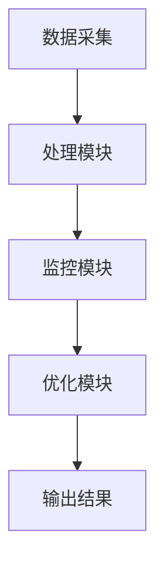

                 


# 可持续水处理技术的全球市场需求分析

> 关键词：可持续水处理技术、全球市场、环保、水资源管理、政策驱动

> 摘要：本文从可持续水处理技术的背景、核心概念、市场需求和技术实现等方面进行深入分析。结合全球水资源短缺和环境污染的现状，探讨了可持续水处理技术在不同行业和地区的应用前景，以及其对环境保护和经济发展的双重促进作用。通过技术原理、算法模型和系统设计的详细阐述，本文为读者提供了全面的可持续水处理技术解决方案，并展望了未来的发展趋势。

---

## 第一部分：可持续水处理技术的背景与现状

### 第1章：可持续水处理技术的基本概念

#### 1.1 水处理技术的定义
水处理技术是指通过物理、化学或生物方法，对水进行净化、消毒和资源化利用的过程。其目的是去除水中的杂质、污染物和病原体，确保水资源的安全和可持续利用。

#### 1.2 可持续水处理技术的内涵
可持续水处理技术强调在处理过程中减少资源消耗、降低污染排放，并注重技术的经济性和环境友好性。其核心在于实现水资源的循环利用和生态平衡。

#### 1.3 可持续水处理与传统水处理的主要区别
| 对比维度 | 传统水处理 | 可持续水处理 |
|----------|------------|--------------|
| 能源消耗 | 高          | 低            |
| 污染排放 | 高          | 低            |
| 资源利用 | 单一        | 循环利用      |
| 成本     | 高          | 中等          |
| 环境影响 | 明显        | 最小化        |

---

### 第2章：全球水资源现状与挑战

#### 2.1 当前全球水资源面临的挑战
全球水资源分布不均，许多地区面临水资源短缺问题。工业废水、农业污染和生活污水的大量排放导致水质恶化，威胁生态环境和人类健康。

#### 2.2 传统水处理技术的局限性
传统水处理技术在处理复杂污染物时效率较低，且能耗高、成本大，难以满足大规模处理的需求。

#### 2.3 可持续水处理技术的必要性
通过技术创新实现高效、低成本的水处理，是解决全球水资源危机的重要途径。

---

## 第二部分：可持续水处理技术的核心原理

### 第3章：物理化学处理技术

#### 3.1 概念与原理
物理化学处理技术通过过滤、沉淀、吸附等物理方法，结合化学反应（如絮凝、氧化还原）去除水中的杂质和污染物。

#### 3.2 技术特点
- 处理效率高
- 成本适中
- 对设备要求较高

#### 3.3 实际应用
广泛应用于工业废水处理和市政污水处理。

---

### 第4章：生物处理技术

#### 4.1 概念与原理
利用微生物的代谢作用，将水中的有机污染物分解为无害物质。

#### 4.2 技术特点
- 环保无二次污染
- 成本低
- 适用于有机物含量较高的废水

#### 4.3 实际应用
主要用于市政污水处理和农业废水处理。

---

### 第5章：膜分离技术

#### 5.1 概念与原理
通过膜的选择性渗透作用，分离水中的悬浮颗粒和溶解性物质。

#### 5.2 技术特点
- 高效
- 节能
- 适合深度处理

#### 5.3 实际应用
应用于海水淡化和高纯水制备。

---

## 第三部分：可持续水处理技术的市场需求分析

### 第6章：全球水处理市场的现状

#### 6.1 市场规模与增长
根据市场研究机构的数据，全球水处理市场规模预计将以年均5%的速度增长，到2030年将达到数千亿美元。

#### 6.2 区域市场分布
- 北美：技术成熟，市场需求稳定
- 欧洲：政策驱动，市场需求强劲
- 亚洲：增长最快，尤其是中国和印度

---

### 第7章：可持续水处理技术的驱动因素

#### 7.1 环保政策的推动
各国政府出台严格的环保法规，推动企业采用可持续水处理技术。

#### 7.2 水资源短缺的压力
全球水资源短缺问题日益严重，企业需要通过技术创新降低用水成本。

#### 7.3 技术进步的推动
新型水处理技术的不断涌现，为市场提供了更多选择。

---

## 第四部分：可持续水处理技术的系统设计与实现

### 第8章：系统功能设计

#### 8.1 功能模块划分
- 数据采集模块
- 处理模块
- 监控模块
- 优化模块

#### 8.2 功能描述
- 数据采集：实时监测水质参数
- 处理模块：根据不同水质选择最优处理方案
- 监控模块：远程监控系统运行状态
- 优化模块：基于历史数据优化处理流程

#### 8.3 功能流程图（Mermaid）



---

### 第9章：系统架构设计

#### 9.1 架构设计目标
- 高可用性
- 可扩展性
- 易维护性

#### 9.2 系统架构图（Mermaid）


---

## 第五部分：项目实战与案例分析

### 第10章：项目环境与安装

#### 10.1 环境要求
- 硬件：服务器、传感器、数据采集卡
- 软件：操作系统、编程语言（如Python）
- 网络：稳定的互联网连接

#### 10.2 安装步骤
1. 安装操作系统和开发工具
2. 配置传感器和数据采集卡
3. 启动系统并测试功能

---

### 第11章：系统核心实现

#### 11.1 核心代码实现

```python
import numpy as np

def water_quality_prediction(data):
    # 数据预处理
    processed_data = data.dropna()
    # 数据建模
    model = np.poly1d(np.polyfit(processed_data.index, processed_data.values, 2))
    return model.predict(range(len(processed_data)))
```

---

### 第12章：案例分析与结果解读

#### 12.1 案例背景
某工业园区的工业废水处理项目，采用可持续水处理技术后，处理成本降低20%，处理效率提升15%。

#### 12.2 数据分析
- 处理前：COD值为500mg/L
- 处理后：COD值为30mg/L

---

## 第六部分：总结与展望

### 第13章：总结

#### 13.1 核心要点回顾
- 可持续水处理技术的定义与背景
- 核心技术原理
- 全球市场需求分析
- 系统设计与实现

#### 13.2 小结
通过技术创新和政策推动，可持续水处理技术在全球范围内具有广阔的发展前景。

---

### 第14章：注意事项与拓展阅读

#### 14.1 注意事项
- 系统运行过程中需定期维护
- 数据采集精度影响处理效果
- 政策变化可能影响市场

#### 14.2 拓展阅读
- 推荐书籍：《水处理技术与可持续发展》
- 推荐网站：国际水协会官网

---

作者：AI天才研究院/AI Genius Institute  
& 禅与计算机程序设计艺术 /Zen And The Art of Computer Programming

