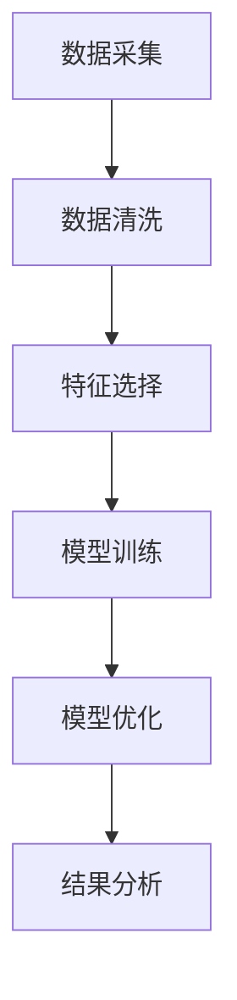
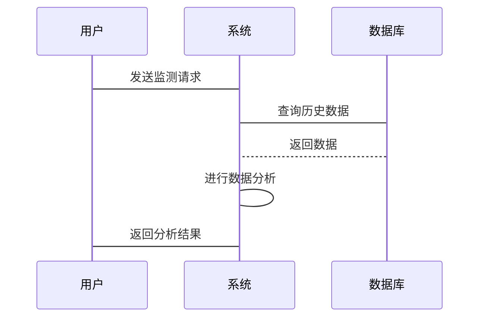

                 


# 可持续水资源管理技术的市场需求分析

## 关键词：
可持续水资源管理，市场需求，智能监测，数据驱动优化，循环经济，机器学习算法，系统架构设计

## 摘要：
随着全球水资源短缺问题的加剧，可持续水资源管理技术的需求日益增长。本文深入分析了该领域的市场需求，探讨了智能监测、数据驱动优化和循环经济模式等核心技术的应用。通过机器学习算法和系统架构设计，本文展示了如何利用先进技术实现水资源的有效管理和优化利用。文章还结合实际案例，详细阐述了技术实现过程，并总结了最佳实践和未来发展方向。

---

## 正文：

## 第一部分：可持续水资源管理的背景与概念

### 第1章：可持续水资源管理概述

#### 1.1 可持续水资源管理的定义与核心概念
- **1.1.1 可持续水资源管理的定义**  
  可持续水资源管理是指在满足当前需求的同时，确保水资源的长期可用性和生态健康。它强调高效利用、减少浪费和保护水质。

- **1.1.2 可持续水资源管理的核心要素**  
  - 水资源保护：防止污染和过度消耗。
  - 高效利用：优化水资源分配，提高利用率。
  - 循环经济：促进水资源的循环利用。

- **1.1.3 可持续水资源管理的目标与原则**  
  - 目标：实现水资源的可持续利用，保障生态平衡。
  - 原则：公平性、效率性、预防性。

#### 1.2 水资源管理的现状与挑战
- **1.2.1 当前水资源管理的主要问题**  
  - 水资源短缺：全球多个地区面临水资源不足的问题。
  - 污染严重：工业废水、农业污染导致水质下降。
  - 管理低效：传统管理方式效率低下，缺乏智能化手段。

- **1.2.2 水资源短缺与污染的现状**  
  根据联合国数据，全球约8.84亿人缺乏安全饮用水，24亿人缺乏基本卫生设施。同时，每年有数百万吨塑料垃圾进入水体，加剧污染问题。

- **1.2.3 可持续水资源管理的必要性**  
  面对水资源危机，采用可持续管理技术是解决水资源短缺和污染问题的关键。

#### 1.3 可持续水资源管理的市场需求
- **1.3.1 市场需求的驱动因素**  
  - 环保政策：各国政府出台法规，推动可持续发展。
  - 技术进步：智能监测和数据分析技术的应用日益广泛。
  - 消费者意识：公众环保意识的提升推动市场需求。

- **1.3.2 用户群体与应用场景**  
  - 用户群体：政府机构、企业、农业合作社、居民社区。
  - 应用场景：城市供水、农业灌溉、工业用水管理、废水处理等。

- **1.3.3 市场规模与增长趋势**  
  根据市场研究，全球可持续水资源管理市场规模预计将以年均8%的速度增长，到2030年达到数千亿美元。

---

## 第二部分：可持续水资源管理技术的核心概念

### 第2章：智能监测与数据采集技术

#### 2.1 智能监测技术的原理与应用
- **2.1.1 智能传感器的工作原理**  
  智能传感器能够实时监测水位、流量、水质等参数，并通过无线通信技术将数据传输到中央控制系统。

- **2.1.2 数据采集的实现方法**  
  使用物联网（IoT）技术，传感器节点将数据发送到云端，进行存储和分析。

- **2.1.3 监测数据的处理与分析**  
  数据经过清洗、转换和存储后，通过机器学习算法进行预测和优化。

#### 2.2 数据驱动的优化方法
- **2.2.1 数据分析的基本流程**  
  数据采集 → 数据清洗 → 数据建模 → 数据可视化。

- **2.2.2 优化算法的实现步骤**  
  - 数据预处理：去除噪声数据。
  - 模型训练：使用回归或分类算法。
  - 结果分析：评估模型性能，优化参数。

- **2.2.3 数据驱动优化的案例分析**  
  某城市通过数据分析优化供水调度，节约了15%的用水量。

#### 2.3 循环经济模式下的技术应用
- **2.3.1 循环经济的基本概念**  
  循环经济强调资源的循环利用，减少废弃物产生。

- **2.3.2 技术在水资源循环利用中的作用**  
  - 中水回用：将处理后的废水用于灌溉或工业冷却。
  - 再生水利用：经过深度处理后用于补充地下水。

- **2.3.3 循环经济模式下的技术优势**  
  - 节约成本：减少新水资源的开发。
  - 保护环境：降低污染风险。
  - 提高效率：循环利用提高水资源利用率。

---

## 第三部分：可持续水资源管理的算法原理

### 第3章：基于机器学习的水资源优化模型

#### 3.1 机器学习模型的构建与训练
- **3.1.1 数据预处理与特征选择**  
  数据清洗：处理缺失值和异常值。特征选择：提取关键变量，如水位、流量、水质参数。

- **3.1.2 模型训练与参数调优**  
  使用随机森林或支持向量机（SVM）进行训练，调整参数如学习率、树深度等。

- **3.1.3 模型评估与优化**  
  使用准确率、召回率等指标评估模型性能，进行交叉验证优化。

#### 3.2 算法流程图


#### 3.3 Python代码实现
```python
import pandas as pd
from sklearn.ensemble import RandomForestRegressor
from sklearn.metrics import mean_absolute_error

# 数据加载
data = pd.read_csv('water_data.csv')

# 特征选择
features = ['water_level', 'flow_rate', 'quality']
target = 'demand_prediction'

# 数据分割
X = data[features]
y = data[target]

# 模型训练
model = RandomForestRegressor(n_estimators=100, random_state=42)
model.fit(X, y)

# 预测与评估
y_pred = model.predict(X)
print('预测误差:', mean_absolute_error(y, y_pred))
```

#### 3.4 数学模型与公式
- **线性回归模型**：  
  $$ y = \beta_0 + \beta_1x_1 + \beta_2x_2 + ... + \beta_nx_n $$
  其中，$y$为目标变量，$x_i$为特征变量，$\beta_i$为回归系数。

---

## 第四部分：系统分析与架构设计

### 第4章：系统功能与架构设计

#### 4.1 系统功能模块设计
- **4.1.1 水资源监测模块**  
  实时监测水位、流量、水质等参数。

- **4.1.2 数据分析模块**  
  对监测数据进行清洗、建模和可视化。

- **4.1.3 优化决策模块**  
  基于模型预测结果，制定最优水资源分配方案。

- **4.1.4 系统管理模块**  
  管理用户权限、系统配置和日志记录。

#### 4.2 系统架构设计


#### 4.3 系统接口设计
- RESTful API：提供数据接口，方便与其他系统集成。
- 数据库接口：支持MySQL或MongoDB，存储监测数据和模型结果。

#### 4.4 系统交互流程


---

## 第五部分：项目实战

### 第5章：智能灌溉系统案例分析

#### 5.1 项目背景与目标
- 背景：农业用水占全球淡水使用量的70%，智能灌溉可节省30%的用水量。
- 目标：实现精准灌溉，提高水资源利用效率。

#### 5.2 系统实现
- 硬件部分：部署土壤湿度传感器和智能喷头。
- 软件部分：开发基于机器学习的灌溉优化算法。

#### 5.3 系统功能与效果
- 功能：实时监测土壤湿度，自动启动喷灌系统。
- 效果：节水30%，提高农作物产量15%。

#### 5.4 实际案例分析
- 某农场实施智能灌溉系统后，年节水成本降低20万元，作物产量提升显著。

---

## 第六部分：最佳实践与总结

### 第6章：最佳实践与注意事项

#### 6.1 关键成功因素
- 技术选型：选择适合的传感器和算法。
- 数据质量：确保数据的准确性和完整性。
- 用户参与：培训用户正确使用系统。

#### 6.2 注意事项
- 数据隐私：确保监测数据的安全性。
- 系统维护：定期更新软件，维护硬件设备。
- 成本控制：合理分配预算，避免过度投入。

#### 6.3 未来研究方向
- 智能化：结合AI技术，实现自适应优化。
- 标准化：制定统一的技术标准，促进协同发展。
- 全球化：加强国际合作，推广可持续水资源管理技术。

---

## 结语

可持续水资源管理是解决全球水资源危机的关键。通过智能监测、数据驱动优化和循环经济模式，我们可以更高效地利用水资源。未来，随着技术的进步和政策的支持，可持续水资源管理将发挥更大的作用，为社会和环境带来双重效益。

---

## 作者

作者：AI天才研究院/AI Genius Institute & 禅与计算机程序设计艺术 /Zen And The Art of Computer Programming

