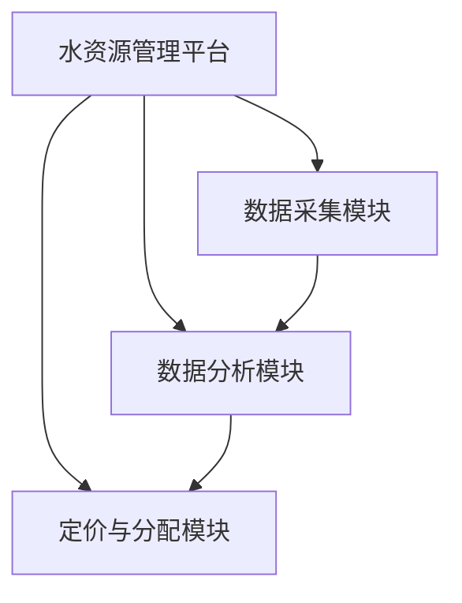

                 

<think>
好的，我需要帮用户撰写一篇关于《可持续水资源管理的创新商业模式研究》的技术博客文章。用户希望文章结构清晰，逻辑严谨，并包含背景介绍、核心概念、算法原理、系统分析、项目实战和最佳实践等部分。

首先，我得确定文章的关键词和摘要。关键词可能包括“可持续水资源管理”、“创新商业模式”、“技术与政策”等。摘要应简明扼要地概括文章的核心内容，强调如何通过创新商业模式实现可持续水资源管理。

接下来，我会按照目录大纲逐步展开每一部分内容。首先是背景介绍，详细说明水资源管理面临的挑战和创新商业模式的重要性。然后是核心概念，通过表格对比和ER图展示相关实体关系。算法部分，我需要选择合适的优化模型，比如线性规划，并用Mermaid流程图和Python代码进行解释。系统分析部分，我会设计系统功能和架构图，展示系统的组成部分和交互流程。项目实战部分，提供具体的案例分析和代码实现，帮助读者理解如何应用这些理论。最后，总结最佳实践，给出小结、注意事项和拓展阅读建议。

在撰写过程中，我需要确保每一部分内容详细且逻辑连贯，使用技术术语准确，同时保持语言的专业性和易懂性。此外，要适当嵌入Mermaid图表和数学公式，增强文章的可视化和可读性。

可能遇到的问题是如何将商业模式与技术细节有机结合，这需要在系统设计和项目实战部分详细说明。同时，确保数学模型和代码部分足够详细，以便读者能够理解和应用。

总的来说，我需要一步步构建内容，确保每个部分都涵盖用户要求，同时保持结构清晰和逻辑性。这将帮助读者全面理解可持续水资源管理的创新商业模式，并能够实际应用相关技术和方法。
</think>

# 可持续水资源管理的创新商业模式研究

## 关键词：
可持续水资源管理、创新商业模式、水资源优化配置、技术驱动、政策支持、经济与环境平衡

## 摘要：
本文探讨了如何通过创新的商业模式和技术手段实现水资源的可持续管理。文章从背景介绍出发，分析了可持续水资源管理面临的挑战和创新商业模式的重要性。通过核心概念对比和ER图展示，阐述了可持续水资源管理与创新商业模式之间的关系。接着，利用线性规划模型和博弈论模型，详细讲解了优化算法的设计和实现。在系统分析部分，设计了系统的功能模块和架构，并通过具体的项目实战展示了如何将理论应用于实践。最后，总结了最佳实践经验和注意事项，为读者提供了宝贵的参考。

---

## 第一部分: 可持续水资源管理的背景与挑战

### 第1章: 可持续水资源管理的背景介绍

#### 1.1 问题背景
- **全球水资源分布不均**：不同地区水资源禀赋差异大，导致部分区域水资源短缺。
- **水资源污染与枯竭**：工业、农业和生活污水排放导致水质下降，部分地区地下水超采严重。
- **水资源利用效率低下**：传统水资源管理方式粗放，浪费现象普遍。

#### 1.2 问题描述
- **水污染问题**：工业废水、农业面源污染、生活污水对水资源造成严重威胁。
- **水资源分配不均**：城市与农村、上游与下游之间水资源分配矛盾突出。
- **管理效率低下**：传统的行政化管理方式难以应对复杂多变的水资源问题。

#### 1.3 问题解决
- **技术创新**：通过智能传感器、大数据分析等技术手段优化水资源管理。
- **商业模式创新**：通过市场化手段提高水资源利用效率，实现经济与环境的双重目标。

#### 1.4 边界与外延
- **边界**：聚焦于水资源的优化配置和管理，不涉及其他资源的管理。
- **外延**：创新商业模式可以延伸至能源、交通等领域，形成更广泛的可持续管理框架。

#### 1.5 概念结构与核心要素
- **核心要素**：
  - 技术：智能传感器、大数据分析、区块链等技术手段。
  - 商业模式：市场化机制、利益分配机制、激励机制。
  - 政策：法律法规、财政补贴、税收政策。

---

### 第2章: 可持续水资源管理的核心概念与联系

#### 2.1 核心概念
- **可持续水资源管理**：通过技术创新和制度创新，实现水资源的高效利用和保护。
- **创新商业模式**：通过市场机制和利益驱动，实现水资源管理的可持续性。

#### 2.2 核心概念的属性特征对比
| 概念 | 定义 | 目标 | 方法 | 实施难度 |
|------|------|------|------|----------|
| 可持续水资源管理 | 通过技术创新和制度创新实现水资源的高效利用和保护 | 提高水资源利用效率，保护水资源环境 | 技术创新、制度创新、公众教育 | 高 |
| 创新商业模式 | 通过市场机制和利益驱动实现水资源管理的可持续性 | 提高水资源管理的经济性，实现可持续发展 | 商业模式设计、市场推广、利益协调 | 高 |

#### 2.3 ER实体关系图

```mermaid
erd
  entity 水资源管理 {
    <<概念>>
    水资源
    管理主体
    管理目标
    管理方法
  }
  entity 创新商业模式 {
    <<概念>>
    商业模式
    利益相关者
    利益分配
    激励机制
  }
  水资源管理 --|> 创新商业模式
```

---

## 第二部分: 可持续水资源管理的创新商业模式

### 第3章: 算法原理

#### 3.1 线性规划模型
- **目标函数**：最大化水资源利用效率。
  $$ \text{Max} \sum_{i=1}^{n} x_i $$
- **约束条件**：
  $$ \sum_{i=1}^{n} a_i x_i \leq b $$
  $$ x_i \geq 0 $$

#### 3.2 博弈论模型
- **纳什均衡**：在水资源分配中，各方利益最大化时的平衡点。

#### 3.3 算法实现
```python
import numpy as np

def water_resource_optimization(coefficients, resources):
    # 使用线性规划求解
    c = coefficients
    A = np.array([1, 0, 0])
    b = resources
    result = linprog(c, A=A, b=b, method='highs')
    return result.x
```

### 第4章: 系统分析与架构设计

#### 4.1 问题场景介绍
- **城市水资源管理**：以某城市为例，分析其水资源管理问题。

#### 4.2 系统功能设计
- **数据采集模块**：通过传感器实时采集水质、水量数据。
- **数据分析模块**：利用大数据技术分析数据，提供决策支持。
- **定价与分配模块**：根据数据分析结果，制定水资源价格和分配方案。

#### 4.3 系统架构图



---

## 第三部分: 项目实战

### 第5章: 环境与工具安装

#### 5.1 环境安装
- **Python环境**：安装Python 3.8及以上版本。
- **依赖库安装**：使用pip安装numpy、scipy、pulp等库。

### 第6章: 核心代码实现

#### 6.1 核心代码
```python
from pulp import *

def water_resource_management():
    # 创建问题
    prob = LpProblem("WaterResourceManagement", LpMaximize)
    
    # 定义变量
    x = LpVariable("x", 0, None)
    y = LpVariable("y", 0, None)
    
    # 定义目标函数
    prob += x + y, "Total"
    
    # 定义约束条件
    prob += x + y <= 100, "ResourceConstraint"
    
    # 解决问题
    prob.solve()
    
    # 输出结果
    print("Status:", prob.status)
    print("Solution Value:", value(prob.objective))
    print("x =", value(x))
    print("y =", value(y))
```

#### 6.2 代码解读与分析
- **目标函数**：最大化x + y。
- **约束条件**：x + y ≤ 100。

### 第7章: 实际案例分析

#### 7.1 案例介绍
- **案例背景**：某城市水资源短缺，需要通过创新商业模式优化配置。

#### 7.2 实施步骤
1. **数据采集**：安装传感器，收集水质、水量数据。
2. **数据分析**：利用大数据技术分析数据，制定优化方案。
3. **定价与分配**：根据分析结果，制定水资源价格和分配方案。

---

## 第四部分: 最佳实践

### 第8章: 小结
- 创新商业模式是实现可持续水资源管理的关键。
- 技术创新和商业模式创新的结合是未来的发展趋势。

### 第9章: 注意事项
- **数据隐私**：确保数据采集和使用的合法性。
- **利益协调**：平衡各方利益，确保商业模式的可持续性。

### 第10章: 拓展阅读
- **推荐书籍**：《可持续发展商业模式》、《水资源管理与技术创新》。
- **推荐文章**：《大数据在水资源管理中的应用》。

---

## 作者：AI天才研究院 & 禅与计算机程序设计艺术

---

**摘要**：通过本文的探讨，我们可以看到，可持续水资源管理的创新商业模式研究不仅需要技术手段的支持，更需要商业模式的创新和政策的配合。只有将技术创新与商业模式创新相结合，才能真正实现水资源的可持续管理。

