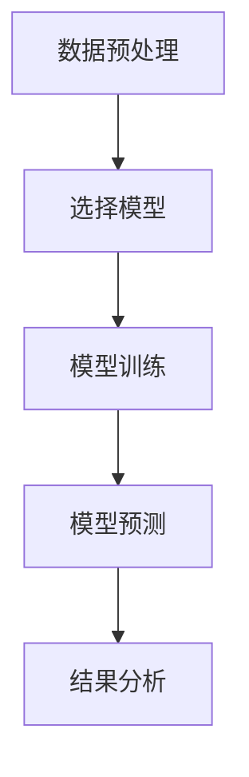
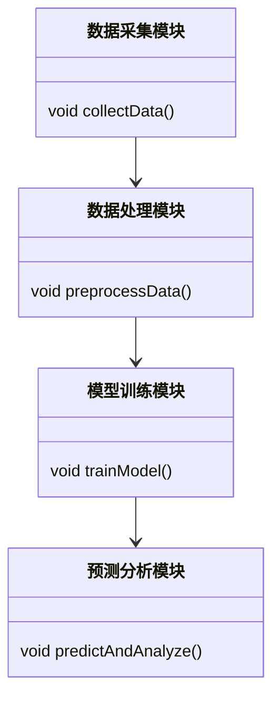
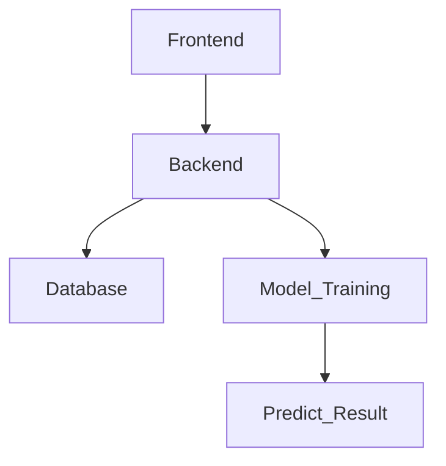

                 

# 可持续能源存储技术的市场渗透率预测

---

## 关键词

可持续能源存储技术、市场渗透率、预测模型、时间序列分析、机器学习、能源转型

---

## 摘要

随着全球能源结构向可再生能源转型，可持续能源存储技术的重要性日益凸显。本文通过分析可持续能源存储技术的市场渗透率，结合时间序列分析、机器学习算法和综合评价模型，预测未来市场发展趋势。文章详细探讨了数据收集与特征工程、算法实现、系统架构设计及实际案例分析，为相关领域的研究和决策提供参考。

---

## 第一部分: 可持续能源存储技术的市场渗透率预测背景介绍

### 第1章: 可持续能源存储技术概述

#### 1.1 可持续能源存储技术的基本概念

可持续能源存储技术是指通过物理、化学或信息技术手段，将可再生能源（如风能、太阳能）转化为能量存储形式（如电能、氢能、热能）的技术。这些技术包括电池存储、氢气存储、超级电容器和热储能等。

- **定义**: 可持续能源存储技术是实现可再生能源高效利用的关键手段，能够解决能源供应不稳定的问题。
- **核心要素**:
  - **能量转换效率**: 存储和释放过程中能量的损失程度。
  - **存储容量**: 存储设备的最大容量。
  - **响应时间**: 存储系统对能量需求的响应速度。

#### 1.2 可持续能源存储技术的市场背景

全球能源结构转型背景下，可再生能源占比逐步增加，但其间歇性特点导致对存储技术的需求急剧上升。

- **驱动因素**:
  - **政策支持**: 各国政府通过补贴、税收优惠等方式推动可再生能源发展。
  - **技术进步**: 锂离子电池、固态电池等技术的突破降低了存储成本。
  - **环保需求**: 减少碳排放是全球共识，推动了对清洁存储技术的需求。

- **挑战**:
  - **技术瓶颈**: 如电池寿命、储能效率等问题。
  - **成本问题**: 高昂的初始投资限制了市场渗透率。
  - **安全性问题**: 储存设施可能引发火灾或爆炸风险。

### 第2章: 市场渗透率预测的核心概念

#### 2.1 市场渗透率的基本定义

市场渗透率是指某一产品或技术在目标市场中的普及程度，通常以市场份额占比表示。

- **数学定义**: 市场渗透率 = (目标市场中的产品/技术采用数量) / (目标市场的潜在需求总量) × 100%。

#### 2.2 可持续能源存储技术的市场渗透率特征

- **技术成熟度与市场渗透率的关系**:
  - 初期阶段：技术创新快，市场渗透率低。
  - 成熟阶段：技术稳定，市场渗透率稳步上升。

- **市场渗透率的空间分布特征**:
  - 发达国家市场渗透率较高，发展中国家市场渗透率较低。

- **市场渗透率的时间演变特征**:
  - 短期波动：受政策、经济周期影响。
  - 长期趋势：受技术进步和成本下降驱动。

---

## 第二部分: 可持续能源存储技术市场渗透率预测的理论基础

### 第3章: 可持续能源存储技术市场渗透率预测的理论模型

#### 3.1 市场渗透率预测的基本理论

- **模型分类**:
  - **时间序列分析模型**: 如ARIMA、VAR。
  - **机器学习模型**: 如随机森林、XGBoost。
  - **综合评价模型**: 如模糊综合评价。

- **输入变量与输出变量**:
  - 输入变量: 历史销售数据、技术性能数据、市场环境数据。
  - 输出变量: 市场渗透率预测值。

- **假设条件**:
  - 数据的完整性和代表性。
  - 模型的适用性和可解释性。

#### 3.2 可持续能源存储技术市场渗透率预测的数学模型

- **时间序列分析模型**:
  - **ARIMA模型**:
    $$ ARIMA(p, d, q) $$
    其中，p为自回归阶数，d为差分阶数，q为移动平均阶数。

  - **VAR模型**:
    $$ VAR(k) $$
    其中，k为变量个数。

- **机器学习算法模型**:
  - **随机森林**:
    $$ RF(X, y) $$
    其中，X为输入特征矩阵，y为目标变量。

  - **XGBoost**:
    $$ XGBoost(X, y) $$

- **综合评价模型**:
  - **模糊综合评价**:
    通过模糊集理论对多个指标进行加权评分，得出综合渗透率。

### 第4章: 数据收集与特征工程

#### 4.1 数据收集方法

- **历史销售数据**:
  - 数据来源: 市场报告、行业数据库。
  - 数据清洗: 处理缺失值、异常值。

- **技术性能数据**:
  - 数据来源: 实验室测试、技术文献。
  - 数据特征: 能量密度、循环寿命、成本。

- **市场环境数据**:
  - 数据来源: 政策文件、宏观经济指标。
  - 数据特征: 政策补贴、电价波动。

#### 4.2 数据预处理与特征提取

- **数据清洗与标准化**:
  - 删除重复数据。
  - 标准化处理：如归一化、z-score标准化。

- **特征选择与降维**:
  - 使用相关性分析选择关键特征。
  - 应用PCA（主成分分析）降维。

- **时间序列数据的特征工程**:
  - 滞后特征: 如滞后1期、滞后2期。
  - 趋势特征: 如移动平均、指数平滑。

---

## 第三部分: 可持续能源存储技术市场渗透率预测的算法原理

### 第5章: 时间序列预测模型

#### 5.1 时间序列预测的基本原理

时间序列预测通过分析历史数据的模式和趋势，预测未来的市场渗透率。

- **分解方法**:
  - **趋势**: 长期变化趋势。
  - **周期性**: 季节性波动。
  - **随机性**: 不可预测的噪声。

- **流程图**:

#### 5.2 机器学习模型的实现

- **随机森林**:
  - 优势: 抗过拟合能力强，适合特征工程。
  - 实现步骤:
    1. 数据分割：训练集、测试集。
    2. 特征选择：提取关键特征。
    3. 模型训练：随机森林算法。
    4. 模型预测：输出渗透率预测值。

- **XGBoost**:
  - 优势: 高效处理大数据，提升预测精度。
  - 实现步骤:
    1. 数据预处理：清洗、标准化。
    2. 模型训练：XGBoost算法。
    3. 调参优化：如学习率、树深度。
    4. 模型预测：输出预测结果。

---

## 第四部分: 可持续能源存储技术市场渗透率预测的系统架构设计

### 第6章: 系统功能设计

- **系统功能模块**:
  - 数据采集模块：收集市场数据。
  - 数据处理模块：清洗、特征提取。
  - 模型训练模块：选择算法、训练模型。
  - 预测分析模块：输出预测结果。

- **领域模型**:

### 第7章: 系统架构设计

- **系统架构**:
  - 前端：用户界面，展示预测结果。
  - 后端：处理数据、训练模型。
  - 数据库：存储原始数据和预测结果。

- **架构图**:

---

## 第五部分: 可持续能源存储技术市场渗透率预测的项目实战

### 第8章: 实际案例分析

#### 8.1 锂离子电池的市场渗透率预测

- **案例背景**: 锂离子电池在电动汽车领域的应用广泛。
- **数据来源**: 近五年电池销售数据、政策补贴数据。
- **预测结果**: 预测未来五年渗透率年均增长15%。

#### 8.2 氢能存储技术的市场渗透率预测

- **案例背景**: 氢能作为清洁燃料，应用场景多样。
- **数据来源**: 氢能生产设备数据、政府补贴政策。
- **预测结果**: 预测未来十年渗透率年均增长10%。

---

## 第六部分: 可持续能源存储技术市场渗透率预测的结论与展望

### 第9章: 结论与展望

- **研究结论**:
  - 时间序列分析和机器学习算法在市场渗透率预测中表现优异。
  - 技术进步和政策支持是影响市场渗透率的关键因素。

- **未来展望**:
  - 提高模型的泛化能力，引入更多特征变量。
  - 结合地理信息系统（GIS），进行区域市场渗透率预测。

---

## 作者信息

作者：AI天才研究院/AI Genius Institute & 禅与计算机程序设计艺术 /Zen And The Art of Computer Programming

---

以上是《可持续能源存储技术的市场渗透率预测》的技术博客文章的完整内容。希望对您有所帮助！

