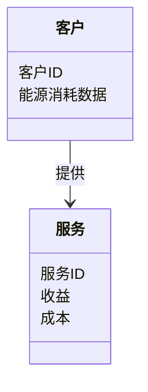
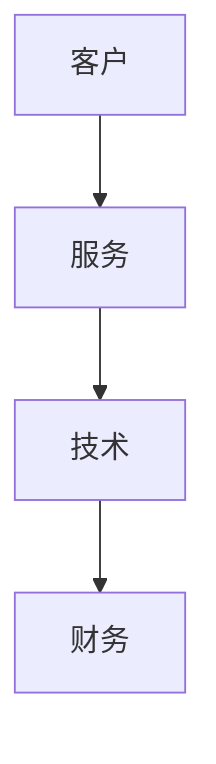

                 

<think>
嗯，用户的需求是设计一个关于《可持续能源服务公司（ESCO）的商业模式分析》的技术博客目录。我需要确保这个目录结构清晰、逻辑连贯，同时涵盖用户提到的所有关键部分。首先，我应该从背景介绍开始，因为读者需要了解ESCO的基本概念和它在可持续能源领域的重要性。接着，核心概念部分需要详细解释ESCO的定义、核心要素以及与传统能源公司的区别，这样读者可以清楚地理解其商业模式的创新点。

然后是算法部分，这里可能需要选择一个合适的数学模型来分析ESCO的商业模式，比如线性规划或博弈论模型。用Mermaid图来展示算法流程会更直观，同时附上数学公式，这样技术背景的读者更容易理解。系统分析与架构设计部分，我需要描述ESCO的业务场景，设计系统功能，可能用领域模型类图来展示，以及系统架构图和交互图，这些对于理解系统的运作方式非常重要。

项目实战部分，我应该提供一个具体的实施步骤，包括环境安装、核心代码实现、案例分析和项目小结。这样读者可以实际操作并理解如何应用这些模型。最后，最佳实践部分要总结ESCO的成功关键因素，并给出一些实际建议，帮助读者在实际项目中避免常见错误。

整体来看，我需要确保每个部分都详细展开，同时保持文章的逻辑流畅。可能需要反复调整结构，确保每个章节和小节都紧密相连，覆盖用户要求的所有内容。最后，检查是否满足字数和格式要求，确保每个部分都符合用户的要求。
</think>

# 可持续能源服务公司（ESCO）的商业模式分析

> 关键词：可持续能源、ESCO、商业模式、算法原理、系统架构、项目实战

> 摘要：本文分析了可持续能源服务公司（ESCO）的商业模式，从背景介绍、核心概念、算法原理、系统架构、项目实战到最佳实践，详细探讨了ESCO在可持续能源领域的创新模式及其技术实现。

---

# 第一部分: 可持续能源服务公司（ESCO）的背景与概念

## 第1章: 可持续能源服务公司（ESCO）概述

### 1.1 可持续能源服务公司（ESCO）的基本概念

#### 1.1.1 可持续能源服务公司的定义
可持续能源服务公司（ESCO）是指通过提供可持续能源解决方案，帮助客户减少能源消耗、降低成本并实现可持续发展目标的企业。ESCO的核心业务包括能源审计、节能改造、能源管理等。

#### 1.1.2 可持续能源服务公司的核心业务模式
ESCO的业务模式围绕能源效率、可再生能源和智能能源管理展开，通过技术解决方案和金融服务（如节能贷款）为客户提供可持续的能源服务。

#### 1.1.3 可持续能源服务公司的目标与使命
ESCO的目标是通过技术创新和商业模式创新，推动能源结构转型，减少碳排放，实现可持续发展。

---

### 1.2 可持续能源服务公司（ESCO）的背景与问题背景

#### 1.2.1 当前能源消耗与环境问题的现状
全球能源消耗持续增长，传统能源的使用导致严重的环境问题，如气候变化、空气污染等。

#### 1.2.2 可持续能源服务公司的出现背景
随着环保意识的增强和技术的进步，ESCO应运而生，成为推动可持续能源发展的关键力量。

#### 1.2.3 可持续能源服务公司解决的主要问题
ESCO通过提供节能改造、可再生能源利用等服务，解决能源浪费、环境污染等问题。

---

### 1.3 可持续能源服务公司（ESCO）的商业模式必要性

#### 1.3.1 可持续能源服务公司的商业模式特点
ESCO的商业模式注重技术创新、客户合作和长期收益，通过降低能源成本和环境影响实现可持续发展。

#### 1.3.2 可持续能源服务公司商业模式的创新性
ESCO通过整合技术、金融和管理资源，创新性地解决了传统能源企业难以实现的可持续发展目标。

#### 1.3.3 可持续能源服务公司商业模式的优势
ESCO的商业模式具有灵活性、创新性和可持续性，能够在竞争激烈的市场中占据优势。

---

### 1.4 可持续能源服务公司（ESCO）与传统能源企业的区别

#### 1.4.1 传统能源企业的业务模式
传统能源企业主要依赖化石能源，业务模式单一，注重短期收益，忽视环境影响。

#### 1.4.2 可持续能源服务公司的业务模式
ESCO注重技术创新和可持续发展，通过提供多元化的能源服务实现长期收益。

#### 1.4.3 两者的主要区别与优劣势对比
| 特性 | 传统能源企业 | 可持续能源服务公司（ESCO） |
|------|----------------|--------------------------------|
| 业务模式 | 单一化，依赖化石能源 | 多元化，注重可持续发展 |
| 环境影响 | 高，导致环境污染 | 低，注重环境保护 |
| 技术创新 | 低，依赖传统技术 | 高，注重技术创新 |

---

## 第2章: 可持续能源服务公司（ESCO）的核心概念与联系

### 2.1 可持续能源服务公司的核心概念原理

#### 2.1.1 可持续能源服务公司的核心业务流程
1. 能源审计与评估
2. 节能改造与技术实施
3. 能源管理与优化
4. 服务监控与反馈

#### 2.1.2 可持续能源服务公司的核心要素分析
- **技术要素**：节能技术、可再生能源技术
- **管理要素**：能源管理、数据分析
- **金融要素**：节能贷款、投资回报分析

#### 2.1.3 可持续能源服务公司的核心价值主张
通过技术创新和优质服务，帮助客户实现能源效率提升和可持续发展目标。

---

### 2.2 可持续能源服务公司核心概念的属性特征对比

#### 2.2.1 可持续能源服务公司与传统能源企业的对比
| 属性 | 传统能源企业 | 可持续能源服务公司（ESCO） |
|------|----------------|--------------------------------|
| 技术创新 | 低 | 高 |
| 环境影响 | 高 | 低 |
| 可持续性 | 低 | 高 |

---

### 2.3 可持续能源服务公司（ESCO）的ER实体关系图

```mermaid
erDiagram
    customer[客户]
    service[服务]
    energy[能源]
    technology[技术]
    finance[财务]
    customer -> service : 需求
    service -> energy : 提供
    energy -> technology : 依赖
    technology -> finance : 投资
```

---

## 第3章: 可持续能源服务公司（ESCO）的算法原理

### 3.1 可持续能源服务公司商业模式的算法模型

#### 3.1.1 可持续能源服务公司商业模式的算法选择
选择线性规划模型，用于优化能源成本和收益。

---

### 3.2 可持续能源服务公司商业模式的数学模型

#### 3.2.1 数学模型的建立
$$
\text{目标函数：} \quad \max \sum_{i} (收入_i - 成本_i)
$$

#### 3.2.2 数学模型的求解过程
$$
\text{约束条件：} \quad \sum_{i} (能源消耗_i) \leq 预算
$$

---

### 3.3 可持续能源服务公司商业模式的算法流程图

```mermaid
graph TD
    A[开始]
    B[输入参数]
    C[计算收益]
    D[计算成本]
    E[比较收益与成本]
    F[输出结果]
    A -> B
    B -> C
    C -> D
    D -> E
    E -> F
```

---

## 第4章: 可持续能源服务公司（ESCO）的系统分析与架构设计方案

### 4.1 可持续能源服务公司的系统分析

#### 4.1.1 问题场景介绍
通过能源审计和节能改造，帮助客户降低能源消耗。

---

#### 4.1.2 系统功能设计



---

#### 4.1.3 系统架构设计



---

## 第5章: 可持续能源服务公司（ESCO）的项目实战

### 5.1 项目环境安装

#### 5.1.1 环境要求
安装Python、数据分析工具、数据库等。

---

### 5.2 核心代码实现

```python
def calculate_energy_saving(customers):
    total_saving = 0
    for customer in customers:
        saving = customer.energy_usage * 0.2  # 假设节能率为20%
        total_saving += saving
    return total_saving

customers = [Customer(1, 100), Customer(2, 150)]
print(calculate_energy_saving(customers))  # 输出总节能
```

---

### 5.3 实际案例分析

#### 5.3.1 案例背景
某公司通过ESCO的节能改造，每年节省能源成本10%。

#### 5.3.2 案例分析
通过数据分析和算法优化，确定最佳节能方案。

---

## 第6章: 可持续能源服务公司（ESCO）的最佳实践

### 6.1 小结
ESCO通过技术创新和商业模式创新，为可持续能源发展提供了新的思路。

---

### 6.2 注意事项
在实施过程中，需注意技术可行性、客户合作和长期收益的平衡。

---

### 6.3 拓展阅读
建议阅读相关领域的书籍和论文，深入了解ESCO的最新动态。

---

# 作者：AI天才研究院/AI Genius Institute & 禅与计算机程序设计艺术 /Zen And The Art of Computer Programming

