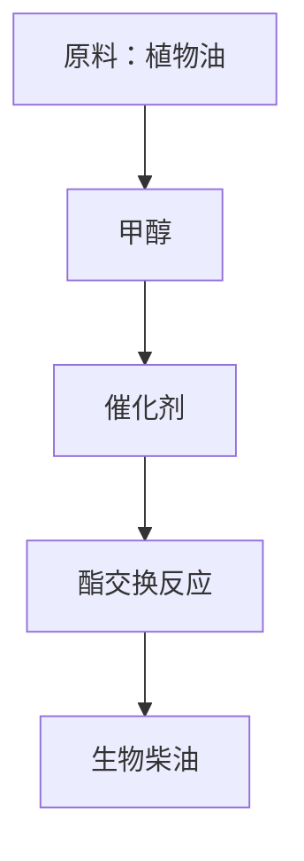
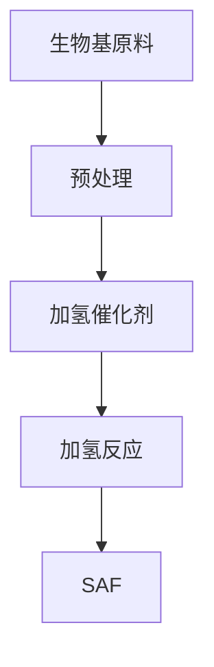

                 

# 可持续航空燃料产业的发展前景与挑战

> **关键词**：可持续航空燃料、环保、技术创新、行业挑战、市场分析、政策支持

> **摘要**：  
可持续航空燃料（Sustainable Aviation Fuel，SAF）作为一种替代传统化石燃料的环保型燃料，正在成为航空业减少碳排放和推动可持续发展的重要解决方案。本文将从技术、市场、政策等多维度分析SAF的发展现状、面临的挑战以及未来的发展前景。通过详细的技术原理、生产工艺、商业模式和未来趋势的探讨，本文旨在为行业从业者、政策制定者和研究人员提供有价值的参考。

---

## 第一部分：可持续航空燃料的背景与发展

### 第1章：可持续航空燃料的定义与背景

#### 1.1 可持续航空燃料的定义
可持续航空燃料（SAF）是指通过可再生资源（如植物、动物脂肪、废油脂、藻类等）或低碳排放的工艺生产的一种替代传统化石燃料的航空燃料。SAF的核心目标是减少航空业的碳排放，同时实现资源的可持续利用。

#### 1.2 可持续航空燃料的重要性
航空业是全球碳排放的主要来源之一，约占全球碳排放总量的2.5%。为了应对气候变化，全球多个国家和地区已经制定了航空业碳中和的目标，SAF成为实现这一目标的关键技术之一。

#### 1.3 全球能源转型趋势
随着全球能源结构向低碳和可再生能源转型，SAF作为航空燃料的替代品，正在受到越来越多的关注。各国政府和企业也在通过政策支持和技术创新推动SAF的商业化进程。

---

## 第二部分：可持续航空燃料的技术基础

### 第2章：可持续航空燃料的技术基础

#### 2.1 可持续航空燃料的原料来源
SAF的原料主要分为两类：生物基原料和石油基原料。

##### 2.1.1 生物基原料
- **植物油**：如大豆油、菜籽油等，是目前最常见的生物基原料。
- **动物脂肪**：如猪油、牛油等，适合用于生产SAF。
- **废油脂**：如餐饮废油（UCO），可以有效利用资源，降低成本。

##### 2.1.2 石油基原料
- **煤油**：通过加氢处理转化为SAF。
- **天然气**：通过合成工艺生产SAF。

##### 2.1.3 其他创新原料
- **藻类**：藻类生长速度快，适合用于生产生物柴油。
- **纤维素**：通过酶解和发酵工艺生产SAF。

#### 2.2 可持续航空燃料的生产工艺

##### 2.2.1 生物柴油制备工艺
生物柴油的制备通常采用酯交换反应（酯交换法）或微生物发酵法。以下是酯交换法的工艺流程图：

##### 2.2.2 航空燃料合成工艺
SAF的合成通常采用加氢处理工艺，以下是流程图：

##### 2.2.3 生物基燃料的认证标准
为了确保SAF的质量和安全性，国际上已经制定了多项认证标准，如 ASTM D758-18 和 ISO 9616-1。以下是主要认证标准对比表：

| **标准**       | **认证内容**               | **适用范围**               |
|----------------|--------------------------|---------------------------|
| ASTM D758-18  | 生物柴油的性能测试       | 生物柴油                   |
| ISO 9616-1    | 可再生燃料的兼容性测试   | 各类生物基燃料             |
| UL 1691-18    | 可再生燃料的环境影响评估   | 可再生燃料                 |

---

## 第三部分：可持续航空燃料的市场现状与发展趋势

### 第3章：全球可持续航空燃料的市场现状

#### 3.1 当前市场现状
- **生产规模**：目前，全球SAF的年产量约为数百万吨，主要集中在欧洲和北美地区。
- **市场需求**：航空业对SAF的需求正在快速增长，预计到2030年，SAF的需求量将超过传统航空燃料的50%。
- **主要生产企业**：如道达尔能源、壳牌、BP等国际能源巨头已经在SAF领域进行了大规模投资。

#### 3.2 未来发展趋势
- **技术创新**：新型原料和工艺的开发将进一步降低SAF的成本。
- **政策支持**：各国政府将继续通过补贴、税收优惠等政策推动SAF的商业化。
- **国际合作**：全球范围内的合作将加速SAF的生产和应用。

---

## 第四部分：可持续航空燃料产业面临的挑战

### 第4章：可持续航空燃料产业的挑战

#### 4.1 技术挑战
- **生产工艺优化**：如何进一步提高SAF的生产效率并降低成本。
- **原料供应稳定性**：如何确保原料的可持续供应。
- **技术创新**：如何开发更高效、更环保的生产工艺。

#### 4.2 市场挑战
- **成本问题**：目前SAF的生产成本仍然高于传统航空燃料。
- **市场接受度**：航空公司和消费者对SAF的接受度需要进一步提升。
- **供应链构建**：如何构建完整的SAF供应链。

---

## 第五部分：可持续航空燃料的关键技术与创新

### 第5章：可持续航空燃料的关键技术

#### 5.1 原料处理技术
- **生物基原料的预处理**：通过酶解、蒸馏等工艺提高原料的利用率。
- **废油脂的处理**：通过脱氧、脱色等工艺提高废油脂的质量。

#### 5.2 催化剂开发
- **高效催化剂**：开发新型催化剂可以显著提高反应效率并降低生产成本。
- **催化剂回收**：通过回收催化剂减少资源浪费。

#### 5.3 生产工艺优化
- **连续生产技术**：通过连续生产技术提高生产效率。
- **智能化生产**：利用人工智能技术优化生产过程。

---

## 第六部分：可持续航空燃料的商业模式与商业化路径

### 第6章：可持续航空燃料的商业模式

#### 6.1 政府支持
- **补贴政策**：政府通过补贴支持SAF的生产。
- **税收优惠**：政府提供税收优惠鼓励企业投资SAF。

#### 6.2 企业合作
- **产业链合作**：航空公司、能源企业、技术公司之间的合作可以实现资源共享。
- **联合研发**：企业之间通过联合研发降低技术开发成本。

#### 6.3 商业化路径
- **规模化生产**：通过规模化生产降低成本。
- **品牌建设**：通过品牌建设提高市场竞争力。

---

## 第七部分：可持续航空燃料的未来发展趋势

### 第7章：可持续航空燃料的未来展望

#### 7.1 技术创新
- **新型原料**：开发更多新型原料以降低生产成本。
- **高效工艺**：进一步优化生产工艺提高效率。

#### 7.2 市场扩展
- **新兴市场**：发展中国家将成为SAF的重要市场。
- **航空业转型**：航空业将全面转向使用SAF。

#### 7.3 国际合作
- **全球标准**：制定全球统一的SAF认证标准。
- **国际项目**：通过国际合作推动SAF的商业化。

---

## 第八部分：总结与展望

### 第8章：总结与未来研究方向

#### 8.1 总结
可持续航空燃料作为航空业实现碳中和的重要技术，正在迎来快速发展的机遇。通过技术创新、政策支持和国际合作，SAF的商业化进程将不断加速。

#### 8.2 未来研究方向
- **新型原料开发**：探索更多可再生资源用于SAF生产。
- **工艺优化**：进一步提高生产效率并降低成本。
- **市场拓展**：扩大SAF的市场应用范围。

---

## 作者：AI天才研究院/AI Genius Institute & 禅与计算机程序设计艺术 /Zen And The Art of Computer Programming

---

通过以上结构和内容安排，本文旨在全面分析可持续航空燃料产业的发展前景与挑战，为行业提供有价值的参考。

