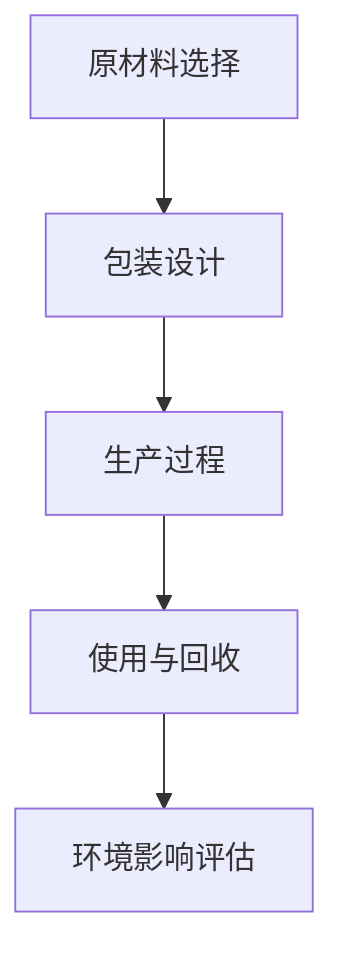
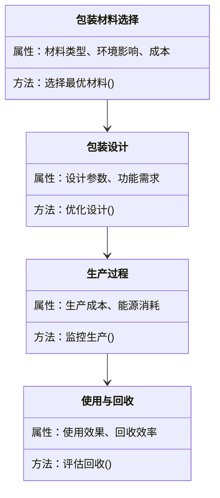
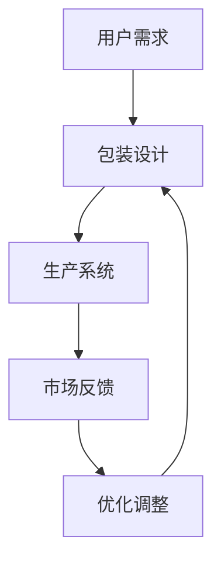

                 

<think>
好的，我现在需要帮用户设计一个详细的目录大纲，以《可持续食品包装创新的市场接受度研究》为题。用户的要求非常具体，他们希望内容涵盖背景、技术、市场分析、消费者行为、系统架构等多个方面，并且每个部分都要有图表、代码示例等技术元素。

首先，我应该明确文章的核心内容：可持续包装的创新以及它们在市场上的接受度。这意味着我需要从多个角度切入，包括技术、消费者行为、市场趋势等。接下来，我需要确保目录结构逻辑清晰，每个章节都有足够的深度，同时保持整体的连贯性。

开始思考，第一部分是背景与核心概念。这部分需要介绍可持续包装的定义、重要性，以及它与食品行业的关系。我应该包括可降解材料、活性包装等技术的介绍，以及它们的优势和挑战。同时，可能需要一些图表来展示不同材料的对比，比如生命周期分析图。

接下来，第二部分是技术创新与系统架构。这里需要详细讲解各种新技术，如可降解材料、智能包装等，分析它们的工作原理和应用。同时，系统架构设计部分可能需要一个Mermaid图来展示整个系统的结构，这有助于读者理解不同模块之间的关系。

然后，第三部分是市场接受度分析，这部分要从消费者和企业的角度探讨市场接受度。我需要分析消费者的行为、态度，以及企业的策略，可能需要引用调查数据和案例来支持论点。此外，区域差异也是一个重要点，比如发达国家和发展中国家的接受度不同。

第四部分是消费者认知与态度。这部分需要深入分析消费者对可持续包装的认知程度，他们的态度如何影响购买决策，以及文化、经济等因素的作用。可能需要一个结构图来展示影响因素之间的关系。

第五部分讨论包装创新与市场趋势，结合全球趋势和区域差异，分析未来的发展方向。这部分可能需要一些预测图表或趋势分析，帮助读者理解未来的变化。

最后，第六部分是案例分析和最佳实践，通过实际案例展示成功经验，并总结经验教训。这部分可能需要引用企业的实例，分析他们的策略和效果。

整个思考过程中，我需要确保每个章节都包含足够的技术细节，同时保持内容的易读性。此外，图表和代码示例的使用必须恰到好处，帮助读者更好地理解内容。最后，检查是否所有要求都被涵盖，确保目录的完整性和实用性。
</think>

# 可持续食品包装创新的市场接受度研究

> 关键词：可持续包装，食品包装创新，市场接受度，消费者行为，包装技术，环保材料，包装设计

> 摘要：本文探讨了可持续食品包装创新的市场接受度，从技术、消费者行为、市场趋势等多角度进行分析。通过背景介绍、技术创新、系统架构设计、消费者认知与态度分析，结合实际案例，得出可持续包装在市场中的潜力与挑战，并提出优化建议。

---

# 第一部分：可持续食品包装创新的背景与核心概念

## 第1章：可持续食品包装创新的背景与问题背景

### 1.1 可持续包装的定义与内涵
- **包装的定义与历史演变**：从传统包装到现代包装的演变，包装的多样化与功能化。
- **可持续包装的核心内涵**：环保性、可降解性、可回收性、低资源消耗。
- **可持续包装与食品行业的关系**：食品行业对包装的依赖性，包装对食品保鲜和运输的影响。

### 1.2 食品包装创新的必要性
- **现有食品包装的问题与挑战**：传统包装材料的环境问题，如塑料污染、资源浪费。
- **可持续发展的需求与趋势**：全球环保意识的提升，消费者对环保产品的需求增加。
- **创新在食品包装中的作用**：通过技术创新解决环境问题，提升包装功能。

### 1.3 本章小结
- 总结可持续包装的重要性，强调创新的必要性。

---

## 第2章：可持续食品包装创新的核心概念与联系

### 2.1 可持续包装的核心要素
- **环保材料的选择与应用**：可降解材料（如淀粉基材料）、可再生材料（如竹纤维）。
- **包装功能的优化与创新**：活性包装（如防氧化包装）、智能包装（如温敏变色包装）。
- **可持续包装的生命周期分析**：从原材料选择到生产、使用、回收的全生命周期评估。

### 2.2 可持续包装与食品包装创新的关系
- **可持续包装的技术特征**：环保性、功能性、经济性。
- **食品包装创新的模式与路径**：材料创新、结构创新、功能创新。
- **可持续包装对食品行业的影响**：提升品牌形象，满足消费者需求。

### 2.3 可持续包装的系统架构
- **系统架构图（Mermaid流程图）**：

### 2.4 本章小结
- 强调可持续包装的核心要素，明确创新的方向。

---

# 第二部分：可持续食品包装创新的技术与系统分析

## 第3章：可持续食品包装创新的数学模型与分析

### 3.1 可持续包装的评价指标
- **环境影响评估指标**：碳排放、能源消耗。
- **经济成本评估指标**：生产成本、回收成本。
- **社会接受度评估指标**：消费者满意度、品牌忠诚度。

### 3.2 数学模型的构建
- **环境影响模型**：
$$ E = \sum_{i=1}^{n} w_i \cdot x_i $$
其中，$E$ 表示环境影响，$w_i$ 表示各因素的权重，$x_i$ 表示各因素的指标值。

### 3.3 案例分析与模型应用
- **案例分析**：某可降解材料的环境影响评估。
- **模型验证与优化**：通过实际数据验证模型准确性。

### 3.4 本章小结
- 总结数学模型的应用价值。

---

## 第4章：可持续食品包装创新的系统分析与架构设计

### 4.1 问题场景介绍
- **问题场景**：传统包装材料的环境问题，消费者对环保包装的需求增加。
- **技术挑战**：如何平衡包装的环保性与功能性。

### 4.2 系统功能设计
- **领域模型（Mermaid类图）**：

### 4.3 系统架构设计
- **系统架构图（Mermaid架构图）**：

### 4.4 本章小结
- 总结系统架构设计的意义。

---

# 第三部分：可持续食品包装创新的市场接受度分析

## 第5章：可持续食品包装创新的市场接受度分析

### 5.1 市场接受度的影响因素
- **消费者行为分析**：价格敏感性、品牌忠诚度、环保意识。
- **企业策略分析**：市场定位、推广策略、成本控制。

### 5.2 消费者认知与态度
- **消费者对可持续包装的认知程度**：调查结果与分析。
- **消费者态度对购买决策的影响**：态度与行为的相关性。

### 5.3 区域差异与文化影响
- **发达国家与发展中国家的市场差异**。
- **文化因素对接受度的影响**。

### 5.4 本章小结
- 总结市场接受度的关键影响因素。

---

## 第6章：包装创新与市场趋势

### 6.1 全球市场趋势分析
- **可持续包装的市场增长率**：数据与预测。
- **主要市场的政策支持**：各国政府对可持续包装的政策推动。

### 6.2 区域差异与未来预测
- **欧洲、北美、亚洲市场的对比**。
- **未来五年市场趋势预测**。

### 6.3 本章小结
- 总结市场趋势对包装创新的启示。

---

# 第四部分：案例分析与最佳实践

## 第7章：可持续食品包装创新的案例分析

### 7.1 成功案例分析
- **案例一**：某品牌可降解包装的成功经验。
- **案例二**：智能包装在食品保鲜中的应用。

### 7.2 案例分析总结
- **成功经验**：技术创新、市场定位准确。
- **失败教训**：忽视消费者认知、成本过高。

### 7.3 本章小结
- 总结案例分析的启示。

---

## 第8章：最佳实践与优化建议

### 8.1 最佳实践总结
- **材料选择**：优先选择可降解材料。
- **设计优化**：结合功能与环保性。
- **市场推广**：强化消费者教育，提升品牌信任度。

### 8.2 优化建议
- **技术创新**：加大研发投入，突破技术瓶颈。
- **政策支持**：政府提供补贴与税收优惠。
- **消费者教育**：通过宣传提升消费者环保意识。

### 8.3 本章小结
- 总结优化建议的核心内容。

---

# 第五部分：结论与展望

## 第9章：结论与展望

### 9.1 研究总结
- **研究发现**：可持续包装的市场潜力巨大，但面临技术和成本挑战。
- **研究意义**：为食品行业提供环保解决方案。

### 9.2 未来展望
- **技术创新**：新型环保材料的研发。
- **市场拓展**：扩大可持续包装的应用范围。
- **政策推动**：政府与企业的协同合作。

### 9.3 本章小结
- 总结全文，展望未来。

---

# 作者：AI天才研究院/AI Genius Institute & 禅与计算机程序设计艺术 /Zen And The Art of Computer Programming

