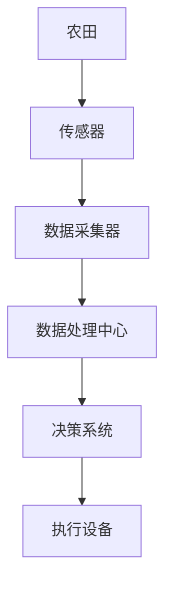
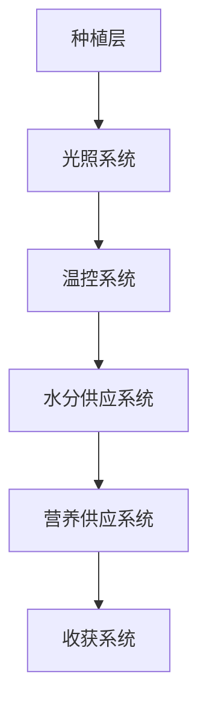
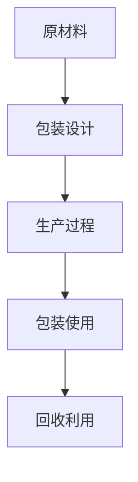
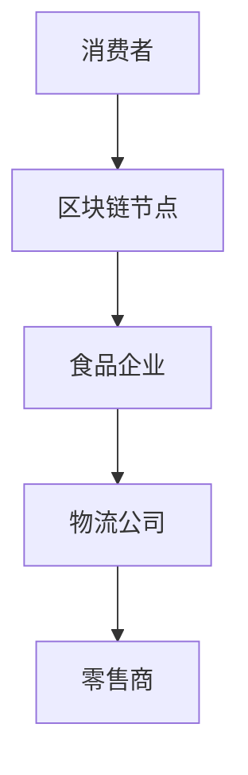
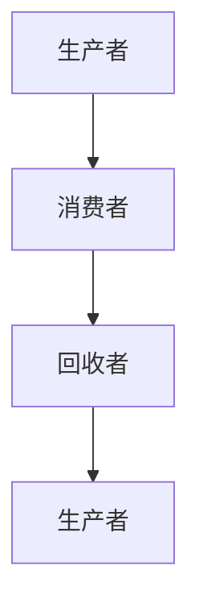

                 

# 可持续食品系统的创新与投资机会

---

## 关键词：
可持续食品系统、农业技术创新、智能供应链、替代蛋白生产、投资机会、循环经济

---

## 摘要：
随着全球人口增长和环境问题的加剧，传统的食品系统面临资源消耗过大、环境污染和食品安全等问题。本篇文章深入探讨了可持续食品系统的核心概念、技术创新以及投资机会。通过分析农业技术、食品加工、包装创新、智能供应链和循环经济等领域的最新进展，结合实际案例和系统架构设计，为读者提供了全面的视角。同时，文章还探讨了新兴技术如人工智能、大数据和区块链在食品系统中的应用，为投资者提供了具有潜力的方向。

---

## 第1章：可持续食品系统的背景与挑战

### 1.1 可持续食品系统的定义与核心概念

#### 1.1.1 可持续发展的基本概念
可持续发展是指在满足当前需求的同时，不损害后代满足其需求的能力。在食品系统中，这意味着从生产、加工、运输到消费的每一个环节都需考虑环境、社会和经济的平衡。

#### 1.1.2 可持续食品系统的定义
可持续食品系统是指通过高效利用资源、减少污染、保护生态和促进社会公平的方式，从农田到餐桌的整个食品供应链。

#### 1.1.3 可持续食品系统的三个维度：环境、社会、经济
- **环境**：减少资源消耗、降低碳排放、减少污染。
- **社会**：确保食品安全、提高农民收入、促进社会公平。
- **经济**：降低成本、提高效率、创造经济价值。

### 1.2 当前食品系统面临的问题

#### 1.2.1 环境问题：资源消耗、污染
- **资源消耗**：传统农业大量使用化肥和水资源，导致资源枯竭。
- **污染**：农药和化肥的过度使用导致土壤和水体污染。

#### 1.2.2 社会问题：食品安全、营养不均衡
- **食品安全**：农药残留、重金属超标等问题威胁公众健康。
- **营养不均衡**：加工食品普及导致营养失衡。

#### 1.2.3 经济问题：成本高、供应链效率低
- **成本高**：传统农业依赖大量劳动力和资源，成本难以降低。
- **供应链效率低**：信息不对称、物流复杂导致供应链效率低下。

### 1.3 可持续食品系统的重要性

#### 1.3.1 对环境保护的意义
减少资源消耗和污染，保护生态系统，缓解气候变化。

#### 1.3.2 对社会福祉的影响
确保食品安全，提高农民收入，促进社会公平。

#### 1.3.3 对经济发展的推动作用
通过技术创新和高效管理，降低成本，提高经济效益。

---

## 第2章：农业技术创新与可持续发展

### 2.1 精准农业与智慧农业

#### 2.1.1 精准农业的概念与技术应用
- **精准农业**：通过精确测量和分析，优化资源使用，提高产量。
- **技术应用**：
  - GPS定位：精确测量土地，进行精准播种和施肥。
  - 感知技术：使用传感器监测土壤湿度、温度和空气质量。
  - 数据分析：通过大数据分析优化农业决策。

#### 2.1.2 智慧农业的实现方式
- **物联网（IoT）**：通过传感器和网络实现农业生产过程的智能化。
- **人工智能（AI）**：利用AI算法预测天气、病虫害和作物生长情况。
- **区块链**：用于食品溯源，确保食品的安全性和透明性。

#### 2.1.3 精准农业与智慧农业的对比分析
| 特性         | 精准农业             | 智慧农业               |
|--------------|----------------------|------------------------|
| 定义         | 精确测量与优化       | 智能化与自动化         |
| 技术应用     | GPS、传感器          | 物联网、AI、区块链     |
| 优势         | 提高效率、降低成本   | 高度智能化、数据驱动   |

#### 2.1.4 精准农业与智慧农业的系统架构

### 2.2 垂直农业与室内种植

#### 2.2.1 垂直农业的定义与发展
- **垂直农业**：在垂直空间中进行植物种植，通常使用人工光源和垂直层架。
- **发展**：近年来，随着城市化和资源短缺，垂直农业逐渐兴起。

#### 2.2.2 室内种植的优势与挑战
- **优势**：
  - 节省土地：垂直种植可以在有限的土地上提高产量。
  - 环境控制：可以通过调节温湿度、光照等条件，提高作物生长效率。
- **挑战**：
  - 成本高：建设和运营成本较高。
  - 技术复杂：需要精确控制环境参数。

#### 2.2.3 垂直农业与传统农业的对比
| 特性         | 垂直农业             | 传统农业               |
|--------------|----------------------|------------------------|
| 土地利用     | 高效                 | 低效                   |
| 环境控制     | 完全可控             | 不可控                 |
| 产量         | 高                   | 低                     |
| 投资成本     | 高                   | 低                     |

#### 2.2.4 垂直农业的系统架构

---

## 第3章：食品加工与包装的创新

### 3.1 食品加工技术的优化

#### 3.1.1 食品加工的流程优化
- **流程优化**：通过优化加工流程，减少资源浪费。
- **技术应用**：
  - 高压灭菌：延长食品保质期。
  - 冷链技术：保持食品新鲜度。

#### 3.1.2 食品加工中的节能技术
- **节能技术**：
  - 蒸汽回收：减少能源浪费。
  - 循环水利用：减少水资源消耗。

#### 3.1.3 食品加工中的环保材料应用
- **环保材料**：
  - 可生物降解的加工材料。
  - 环保催化剂：减少化学污染。

#### 3.1.4 食品加工中的数学模型
- **模型**：通过数学模型优化加工流程。
  $$ C = \min_{x} \sum_{i=1}^{n} (x_i \cdot c_i) $$
  其中，\( C \) 是总成本，\( x_i \) 是加工步骤，\( c_i \) 是每步成本。

### 3.2 可持续包装技术

#### 3.2.1 可降解包装材料的发展
- **材料**：
  - 可降解塑料：如聚乳酸（PLA）。
  - 天然材料：如淀粉基包装材料。

#### 3.2.2 包装设计的创新
- **设计**：
  - 减量设计：减少包装材料用量。
  - 可回收设计：方便回收利用。

#### 3.2.3 可持续包装的成本与效益分析
- **成本**：可降解材料初期成本高。
- **效益**：长期来看，减少环境污染，提升品牌形象。

#### 3.2.4 可持续包装的系统架构

---

## 第4章：新兴技术在食品系统中的应用

### 4.1 人工智能与大数据在农业中的应用

#### 4.1.1 AI在农业中的应用场景
- **预测模型**：通过AI预测天气、病虫害和作物产量。
- **图像识别**：识别作物生长状况和病虫害。

#### 4.1.2 大数据技术在食品供应链中的应用
- **数据收集**：收集供应链中的温度、湿度、运输时间等数据。
- **数据分析**：分析数据以优化供应链效率。

#### 4.1.3 AI与大数据的结合对食品系统的影响
- **影响**：
  - 提高供应链透明度。
  - 优化资源分配。
  - 提高食品质量。

#### 4.1.4 AI在农业中的数学模型
- **模型**：
  $$ P = f(x_1, x_2, ..., x_n) $$
  其中，\( P \) 是预测结果，\( x_i \) 是输入特征。

### 4.2 区块链技术在食品溯源中的应用

#### 4.2.1 区块链技术的基本原理
- **区块链**：分布式账本，确保数据不可篡改。
- **去中心化**：数据存储在多个节点，防止数据被篡改。

#### 4.2.2 区块链在食品溯源中的应用
- **应用**：
  - 追踪食品来源。
  - 验证食品真实性。
  - 提高消费者信任。

#### 4.2.3 区块链技术对食品供应链的信任机制提升
- **提升**：
  - 消费者可以追溯食品的整个供应链。
  - 企业可以提高供应链透明度。

#### 4.2.4 区块链在食品溯源中的系统架构

---

## 第5章：可持续食品系统的商业模式创新

### 5.1 共享经济模式在食品系统中的应用

#### 5.1.1 共享农业模式
- **模式**：
  - 农民共享土地和设备。
  - 消费者参与种植，共享收益。

#### 5.1.2 共享食品配送模式
- **模式**：
  - 共享配送车辆和司机。
  - 提高配送效率，降低成本。

#### 5.1.3 共享经济对食品系统的影响
- **影响**：
  - 提高资源利用率。
  - 降低运营成本。
  - 提高消费者参与度。

### 5.2 循环经济模式在食品系统中的实践

#### 5.2.1 循环经济的基本概念
- **循环经济**：通过设计产品生命周期，减少资源消耗和环境污染。

#### 5.2.2 循环经济在食品系统中的实践
- **实践**：
  - 食物残渣转化为肥料或能源。
  - 包装材料循环利用。

#### 5.2.3 循环经济模式的成本与效益分析
- **成本**：
  - 初始投资高。
- **效益**：
  - 长期降低成本。
  - 提高资源利用率。

#### 5.2.4 循环经济模式的系统架构

---

## 第6章：可持续食品系统的投资机会与总结

### 6.1 可持续食品系统的投资机会

#### 6.1.1 农业技术创新
- **机会**：
  - 投资精准农业和智慧农业技术。
  - 投资垂直农业和室内种植。

#### 6.1.2 食品加工与包装创新
- **机会**：
  - 投资环保包装材料。
  - 投资食品加工技术优化。

#### 6.1.3 新兴技术应用
- **机会**：
  - 投资AI和大数据在农业中的应用。
  - 投资区块链在食品溯源中的应用。

### 6.2 可持续食品系统的总结与展望

#### 6.2.1 总结
- 可持续食品系统是未来发展的必然趋势。
- 农业技术创新和新兴技术应用是实现可持续发展的关键。
- 共享经济和循环经济模式将为食品系统带来新的机遇。

#### 6.2.2 展望
- 随着技术进步和政策支持，可持续食品系统将得到更广泛的应用。
- 投资者应抓住新兴技术带来的机会，推动食品系统的可持续发展。

---

## 作者：AI天才研究院/AI Genius Institute & 禅与计算机程序设计艺术 /Zen And The Art of Computer Programming

---

这篇博客文章详细探讨了可持续食品系统的背景、技术创新、投资机会以及商业模式创新。通过分析农业技术、食品加工、包装创新、智能供应链和循环经济等领域的最新进展，结合实际案例和系统架构设计，为读者提供了全面的视角。同时，文章还探讨了新兴技术如人工智能、大数据和区块链在食品系统中的应用，为投资者提供了具有潜力的方向。

