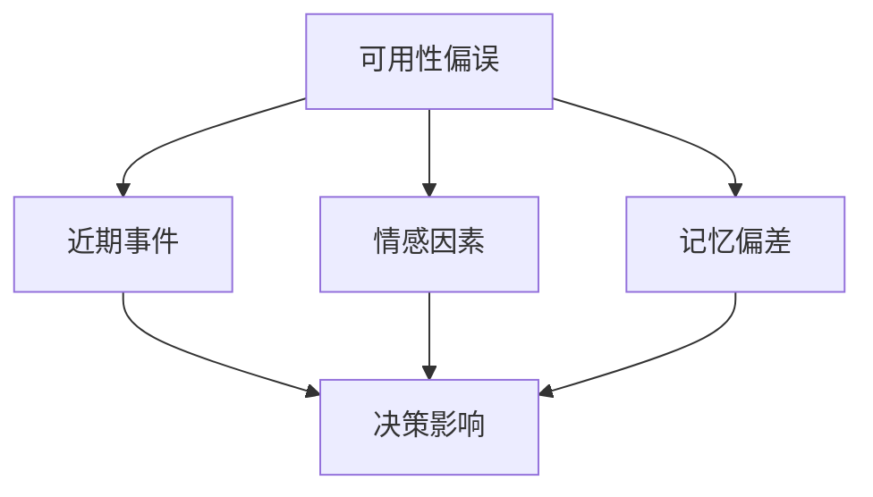
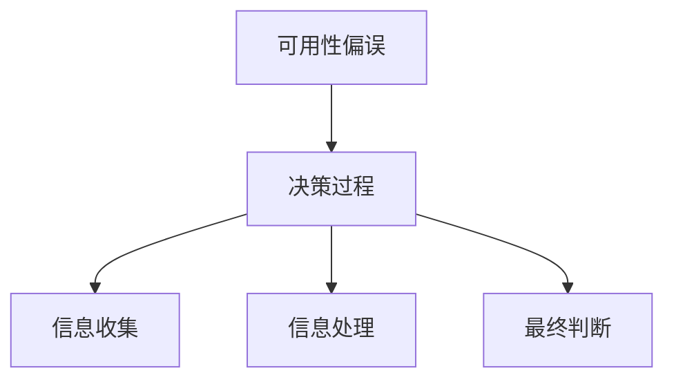
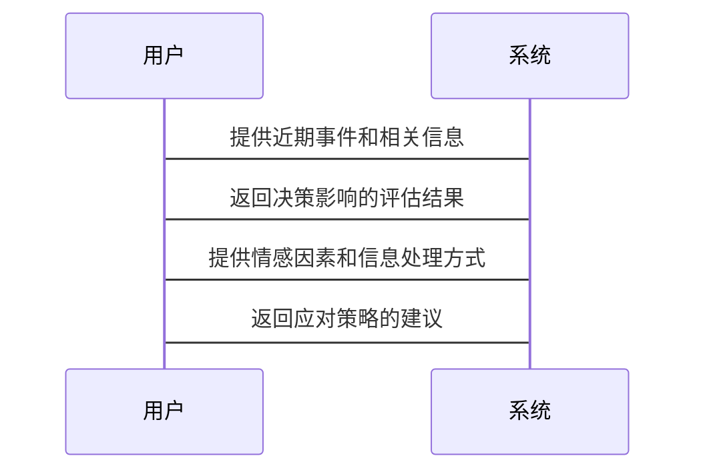

                 


# 可用性偏误：近期事件如何过度影响决策

## 关键词
可用性偏误, 决策偏差, 记忆偏差, 情感因素, 信息处理方式, 数学模型, 实际案例

## 摘要
可用性偏误是一种常见的认知偏差，指人们在做决策时，过于依赖近期发生的事件或易于回忆的信息，从而影响判断。本文从背景、成因、数学模型、系统分析和实际案例等多个维度，深入探讨可用性偏误的形成机制及其在不同领域的影响，并提出应对策略。通过详细分析，帮助读者更好地理解这一偏误的本质，并在实际决策中加以应用。

---

# 第一部分：可用性偏误的背景与核心概念

## 第1章：可用性偏误的基本概念

### 1.1 可用性偏误的定义与表现形式

#### 1.1.1 可用性偏误的定义
可用性偏误（Availability Bias）是指人们在决策过程中，由于近期发生的事件或易于回忆的信息更容易被想到，从而过度影响判断的现象。这种偏误源于人类记忆的不完美性和信息处理的简化性。

#### 1.1.2 可用性偏误的表现形式
- **近期事件优先**：人们更容易根据最近发生的事件来做决策，而忽视其他重要但不那么显眼的信息。
- **情感强烈事件主导**：具有强烈情感色彩的事件更容易被记住，从而在决策中占据主导地位。
- **简单信息优先**：人们倾向于根据简单、易记的信息来做判断，而忽略复杂或不易处理的数据。

#### 1.1.3 可用性偏误的典型案例
例如，在投资决策中，投资者可能会因为近期市场波动（如某只股票近期上涨）而高估其长期增长潜力，忽略长期趋势和基本面分析。

### 1.2 可用性偏误的成因分析

#### 1.2.1 记忆偏差的影响
人类记忆并非完美，近期事件更容易被记住，而久远的事件则容易被遗忘。这种记忆偏差导致人们在决策时过度依赖近期信息。

#### 1.2.2 情感因素的作用
具有强烈情感色彩的事件更容易被记住，因为情感会增强记忆的强度。例如，负面新闻更容易引起公众的关注，从而影响公众的判断。

#### 1.2.3 信息处理方式的局限性
人们在处理信息时，倾向于选择简单、快速的方式，而不是进行详尽的数据分析。这种简化处理方式容易导致可用性偏误。

### 1.3 可用性偏误的边界与外延

#### 1.3.1 偏误的适用范围
可用性偏误不仅影响个人决策，还影响集体决策和组织行为。例如，在公司战略制定中，管理者可能因为近期市场变化而忽视长期规划。

#### 1.3.2 可用性偏误与其他认知偏差的关系
可用性偏误与其他认知偏差（如确认偏误、代表性偏误）密切相关。例如，可用性偏误可能导致人们在面对新信息时，更容易接受与已有记忆一致的信息。

#### 1.3.3 偏误的潜在影响与后果
可用性偏误可能导致决策失误，影响个人和组织的长期利益。例如，在医疗决策中，医生可能因为近期类似病例的影响，而忽视患者的个体差异。

### 1.4 核心概念与联系

#### 1.4.1 核心概念的原理
可用性偏误的核心在于人类记忆的不完美性和信息处理的简化性。人们倾向于根据容易回忆的信息来做决策，而不是全面分析所有相关信息。

#### 1.4.2 概念属性特征对比表格

| 概念      | 属性          | 特征                                                                 |
|-----------|---------------|----------------------------------------------------------------------|
| 可用性偏误 | 记忆偏差       | 近期事件更容易被记住                                             |
|           | 情感因素       | 情感强烈事件更容易被记住                                         |
|           | 信息处理方式   | 简单信息更容易被处理                                             |

#### 1.4.3 ER实体关系图架构的 Mermaid 流程图



---

## 第2章：可用性偏误的核心概念与联系

### 2.1 可用性偏误的核心原理

#### 2.1.1 记忆偏差的机制
人类记忆是不完美的，近期发生的事件更容易被编码和回忆。例如，人们更容易记住最近一次与同事的冲突，而不是很久以前的类似事件。

#### 2.1.2 情感因素的作用机制
情感因素通过增强记忆的强度和信息的突出性，影响人们在决策时的选择。例如，负面事件更容易被记住，并在决策中占据主导地位。

#### 2.1.3 信息处理方式的局限性
人们倾向于使用简单、快速的决策方式，而不是进行复杂的分析。这种简化处理方式容易导致可用性偏误。

### 2.2 可用性偏误与决策过程的关系

#### 2.2.1 决策过程的阶段分析
决策过程通常包括信息收集、信息处理和最终判断三个阶段。在每个阶段，可用性偏误都可能产生影响。

#### 2.2.2 可用性偏误在决策中的具体表现
- **信息收集阶段**：人们倾向于收集容易回忆的信息，而不是全面的数据。
- **信息处理阶段**：人们倾向于根据容易记住的信息来做判断。
- **最终判断阶段**：人们可能高估近期事件的重要性，而低估其他信息的价值。

### 2.3 可用性偏误的数学模型与公式

#### 2.3.1 记忆偏差的数学模型
$$ P(E) = \frac{N(E)}{N} $$

其中，\( N(E) \) 表示近期事件的数量，\( N \) 表示总事件数量。

#### 2.3.2 情感因素的数学模型
$$ S = \sum_{i=1}^{n} w_i \cdot E_i $$

其中，\( w_i \) 表示情感因素的权重，\( E_i \) 表示事件的情感强度。

---

## 第3章：可用性偏误的算法原理与数学模型

### 3.1 可用性偏误的算法原理

#### 3.1.1 信息处理的简化性
人们倾向于使用简化的方式处理信息，例如根据容易回忆的信息来做判断，而不是进行复杂的分析。

#### 3.1.2 决策过程的启发式方法
人们在决策时，通常使用启发式方法，例如根据近期事件或简单信息来做判断。

### 3.2 可用性偏误的数学模型

#### 3.2.1 决策偏差的数学公式
$$ P(E) = \frac{N(E)}{N} $$

其中，\( N(E) \) 表示近期事件的数量，\( N \) 表示总事件数量。

#### 3.2.2 情感因素的数学模型
$$ S = \sum_{i=1}^{n} w_i \cdot E_i $$

其中，\( w_i \) 表示情感因素的权重，\( E_i \) 表示事件的情感强度。

---

## 第4章：可用性偏误的系统分析与架构设计

### 4.1 问题场景介绍

#### 4.1.1 投资决策中的可用性偏误
投资者可能因为近期市场波动而高估某只股票的长期潜力，忽视长期趋势和基本面分析。

#### 4.1.2 医疗决策中的可用性偏误
医生可能因为近期类似病例的影响，而忽视患者的个体差异。

### 4.2 系统功能设计

#### 4.2.1 领域模型的 Mermaid 类图


### 4.3 系统架构设计

#### 4.3.1 系统架构的 Mermaid 图


### 4.4 系统接口设计

#### 4.4.1 输入接口
- 收集近期事件和相关信息。
- 收集情感因素和信息处理方式。

#### 4.4.2 输出接口
- 提供决策影响的评估结果。
- 提供应对策略的建议。

### 4.5 系统交互的 Mermaid 序列图



---

## 第5章：可用性偏误的项目实战

### 5.1 环境安装

#### 5.1.1 系统要求
- 操作系统：Windows 10 或更高版本，macOS 10.15 或更高版本，Linux（推荐 Ubuntu 20.04 或更高版本）。
- 开发工具：建议使用 PyCharm 或 VS Code。
- 依赖库：安装 Python 3.8 或更高版本，安装 NumPy、Pandas、Matplotlib 等数据分析库。

### 5.2 系统核心实现源代码

#### 5.2.1 核心算法实现
```python
def availability_bias_analysis(data, weights):
    # 计算情感因素的加权和
    emotional_impact = sum([weight * event for weight, event in zip(weights, data)])
    return emotional_impact
```

#### 5.2.2 数据分析与可视化
```python
import matplotlib.pyplot as plt

def plot_impact(data, labels):
    plt.bar(labels, data)
    plt.xticks(rotation=45)
    plt.ylabel('Impact')
    plt.title('可用性偏误分析')
    plt.show()
```

### 5.3 代码应用解读与分析

#### 5.3.1 核心算法实现
上述代码实现了一个简单的可用性偏误分析函数，计算情感因素的加权和。用户可以根据实际需求调整权重和数据。

#### 5.3.2 数据分析与可视化
上述代码用于将分析结果可视化，帮助用户更好地理解可用性偏误的影响。

### 5.4 实际案例分析与详细讲解剖析

#### 5.4.1 投资决策中的可用性偏误
假设某投资者最近经历了几次短期市场波动，他可能高估某只股票的长期潜力，而忽视了长期趋势和基本面分析。

#### 5.4.2 医疗决策中的可用性偏误
假设某医生最近处理了多例类似病例，他可能在面对新患者时，过度依赖这些经验，而忽视了患者的个体差异。

### 5.5 项目小结

#### 5.5.1 核心代码的功能与作用
上述代码实现了可用性偏误的分析和可视化，帮助用户更好地理解偏误的影响。

#### 5.5.2 应用场景与实际意义
可用性偏误分析可以应用于投资、医疗、司法等多个领域，帮助决策者更好地理解偏误的影响，并采取相应的应对策略。

---

## 第6章：总结与展望

### 6.1 全文总结

#### 6.1.1 可用性偏误的核心概念
可用性偏误是指人们在决策时，由于近期事件或易于回忆的信息影响，导致判断失误的现象。

#### 6.1.2 可用性偏误的成因分析
包括记忆偏差、情感因素和信息处理方式的局限性。

#### 6.1.3 可用性偏误的数学模型与公式
通过数学模型和公式，我们可以更好地理解偏误的内在机制。

### 6.2 未来展望

#### 6.2.1 研究方向
未来的研究可以进一步探讨可用性偏误与其他认知偏差的关系，以及如何通过技术手段减少偏误的影响。

#### 6.2.2 技术应用
随着人工智能和大数据技术的发展，我们可以开发更多的工具和方法，帮助人们更好地识别和应对可用性偏误。

---

## 第7章：最佳实践 tips、小结、注意事项、拓展阅读

### 7.1 最佳实践 tips

- 在决策时，尽量全面收集和分析相关信息，而不仅仅是依赖近期事件。
- 使用数据分析工具和方法，帮助识别和应对可用性偏误。
- 定期回顾和反思决策过程，识别可能的偏误。

### 7.2 小结

可用性偏误是一种常见的认知偏差，影响人们的决策过程。通过理解其成因和机制，我们可以更好地识别和应对偏误，做出更合理的决策。

### 7.3 注意事项

- 避免过度依赖近期事件或易于回忆的信息。
- 在决策过程中，尽量保持客观和理性。
- 定期回顾和反思决策过程，识别可能的偏误。

### 7.4 拓展阅读

- "Thinking, Fast and Slow" by Daniel Kahneman
- "The Art of Decision-Making" by John G. Neef

---

## 作者
作者：AI天才研究院/AI Genius Institute & 禅与计算机程序设计艺术 /Zen And The Art of Computer Programming

---

通过以上结构，我们可以系统地探讨可用性偏误的核心概念、成因、数学模型和实际应用，帮助读者更好地理解这一偏误，并在实际决策中加以应用。

