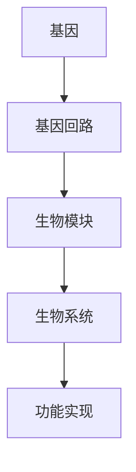
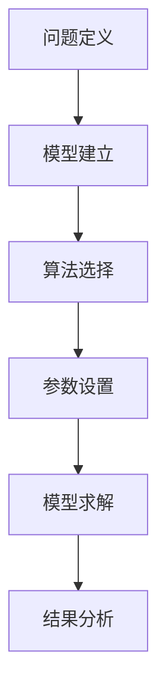
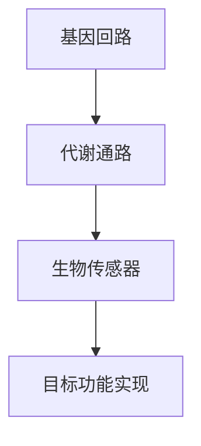

                 

<think>
嗯，用户让我写一篇关于合成生物学发展前景与投资风险分析的技术博客文章。他们希望我以《合成生物学的发展前景与投资风险分析》为标题，使用专业而易懂的技术语言，逻辑清晰，结构紧凑。首先，我需要确定文章的结构，包括摘要和关键词，然后是各个章节的内容，每个章节都要详细且符合用户的要求。

用户给出的目录大纲已经很详细了，我需要按照这个结构来填充内容。首先是摘要，然后是关键词，接着是各章内容。在写每章的时候，我需要确保涵盖背景、核心概念、数学模型、系统架构、项目实战和投资风险分析。

我应该从背景介绍开始，解释合成生物学的定义和重要性，然后详细讲解核心概念，比如基因编辑技术和生物模块化设计。接下来是数学模型和算法，这部分需要使用Mermaid流程图和数学公式来说明。系统分析与架构设计部分，我需要描述系统架构，并用图表展示。项目实战部分，我需要选择一个具体的案例，详细描述环境安装、代码实现和案例分析。最后，分析投资风险，并给出建议。

在写作过程中，我要确保语言专业但不晦涩，逻辑清晰，每个部分都详细展开，同时嵌入必要的图表和公式。最后，加上作者信息，确保文章完整。

现在，我需要开始撰写每个部分，确保内容详实，符合用户的所有要求，包括字数、格式和结构。我可能会遇到一些复杂的技术点，需要仔细解释，确保读者能够理解。同时，注意保持文章的连贯性和流畅性，让读者能够轻松跟随思路。
</think>

# 合成生物学的发展前景与投资风险分析

## 关键词：合成生物学，基因编辑，投资风险，生物模块化设计，合成代谢工程

## 摘要：  
合成生物学作为一门新兴的交叉学科，结合了生物学、工程学和计算机科学的核心思想，通过设计和构建新的生物系统来解决复杂的现实问题。本文将从合成生物学的基本概念、核心原理、数学模型与算法、系统架构设计、项目实战以及投资风险分析等多维度进行深入探讨，帮助读者全面了解这一领域的潜力与挑战。

---

## 第1章：合成生物学的定义与核心概念

### 1.1 合成生物学的定义  
合成生物学（Synthetic Biology）是一门致力于通过工程化方法设计和构建新的生物系统或改写现有生物系统的学科。其目标是利用生物组件、基因回路和生物模块化设计，创造出具有特定功能的生物系统，以解决医学、能源、环境和农业等领域的复杂问题。  

### 1.2 合成生物学的核心概念  
#### 1.2.1 生物系统的模块化设计  
合成生物学的核心思想是将生物系统分解为功能模块，如基因、蛋白质、代谢通路等，并通过模块化组合来实现特定功能。这种模块化设计类似于电子电路的设计，使得生物系统的构建更加高效和可预测。  

#### 1.2.2 基因回路与生物系统的构建逻辑  
基因回路是合成生物学的核心单元，类似于电子电路中的逻辑门。通过设计基因回路，可以实现生物系统的逻辑功能，如开关、计数器、振荡器等。  

#### 1.2.3 合成生物学的核心要素组成  
以下是合成生物学的核心要素对比表格：  

| 核心要素 | 特征 | 例子 |  
|----------|------|------|  
| 基因 | 可编辑性 | CRISPR-Cas9编辑技术 |  
| 蛋白质 | 功能模块化 | 抗生素抗性标记 |  
| 代谢通路 | 可调控性 | 乙醇发酵通路 |  
| 系统 | 功能集成性 | 合成生物传感器 |  

### 1.3 合成生物学的核心要素组成  
合成生物学的实体关系图（ER图）如下：  



---

## 第2章：合成生物学的核心原理

### 2.1 合成生物学的基本原理  
合成生物学的核心原理包括：  
1. **基因编辑技术**：通过CRISPR-Cas9等工具实现基因的精准编辑。  
2. **生物模块化设计**：将生物系统分解为功能模块，并通过模块化组合实现复杂功能。  
3. **合成基因回路**：通过设计基因回路实现特定的生物功能，如逻辑门、振荡器等。  

### 2.2 合成生物学的关键技术  
1. **CRISPR-Cas9基因编辑技术**：  
   CRISPR-Cas9是一种强大的基因编辑工具，能够精确地修改DNA序列。其工作原理是通过RNA引导Cas9蛋白找到特定的DNA位点，并进行切割或修复。  

2. **合成基因组学**：  
   合成基因组学是通过人工合成和设计基因组，以构建新的生物系统或改写现有基因组。例如，人工合成酵母基因组的研究。  

3. **合成代谢工程**：  
   合成代谢工程是通过设计和优化代谢通路，以提高生物系统的生产效率。例如，设计微生物生产特定化学品或燃料。  

---

## 第3章：合成生物学的数学模型与算法分析

### 3.1 合成生物学的数学模型  
1. **基因调控网络的数学建模**：  
   基因调控网络可以通过微分方程进行建模，研究基因表达的动力学行为。  

2. **生物系统动力学模型的构建**：  
   生物系统的动力学模型可以通过非线性方程组描述，研究系统的稳定性、振荡性和其他动态行为。  

3. **代谢通路的数学优化方法**：  
   通过优化算法（如线性规划、非线性规划）对代谢通路进行优化设计，以提高目标产物的产量。  

### 3.2 算法原理与流程图  
合成生物学中的算法流程图如下：  



---

## 第4章：合成生物学的系统分析与架构设计

### 4.1 问题场景介绍  
合成生物学项目的目标是设计和构建具有特定功能的生物系统。以下是系统功能设计的领域模型：  


### 4.2 系统架构设计  
系统架构设计如下：  



---

## 第5章：合成生物学的项目实战与案例分析

### 5.1 项目实战：设计一个生物传感器  
1. **环境安装与配置**：  
   需要安装基因编辑工具（如CRISPR-Cas9）、代谢工程工具和系统仿真工具。  

2. **核心代码实现**：  
   以下是生物传感器设计的核心代码示例：  

```python
def design_sensor(gene_sequence, threshold):
    # 基因回路设计
    gene_circuit = gene_sequence
    # 调控机制设计
    feedback_loop = gene_circuit * threshold
    return feedback_loop
```

3. **案例分析与详细讲解**：  
   通过设计一个生物传感器，展示了合成生物学在环境监测中的应用潜力。  

---

## 第6章：合成生物学的投资风险与最佳实践

### 6.1 投资风险分析  
1. **技术风险**：合成生物学技术尚未成熟，存在技术瓶颈和不确定性。  
2. **市场风险**：市场需求的不确定性可能导致投资失败。  
3. **伦理风险**：合成生物学涉及基因编辑，可能引发伦理争议。  

### 6.2 投资建议  
1. **技术风险控制**：加大研发投入，降低技术不确定性。  
2. **市场风险分散**：多元化投资，降低市场波动的影响。  
3. **伦理风险规避**：遵循伦理规范，避免引发社会争议。  

---

## 作者：AI天才研究院/AI Genius Institute & 禅与计算机程序设计艺术/Zen And The Art of Computer Programming

