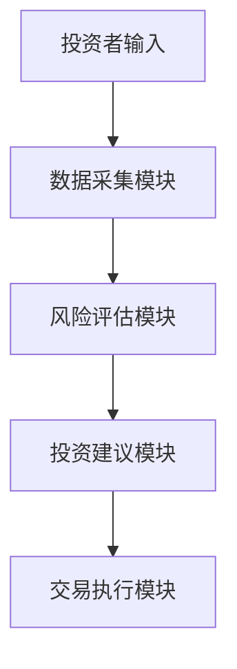

                 


# 商品投资策略：分散化和通胀对冲

## 关键词：商品投资，分散化，通胀对冲，投资组合，风险管理，数学模型

## 摘要：  
商品投资是一种重要的资产配置方式，其核心在于通过分散化和通胀对冲来优化投资组合的风险与收益。本文从商品投资的基本原理出发，深入探讨分散化和通胀对冲的策略，结合数学模型和系统架构，分析商品投资组合的构建与优化方法。同时，本文通过实际案例展示如何在不同市场环境下应用这些策略，并提供最佳实践和风险管理的建议。

---

## 第一部分: 商品投资策略基础

### 第1章: 商品投资概述

#### 1.1 商品投资的基本概念
##### 1.1.1 商品投资的定义
商品投资是指通过购买实物商品（如黄金、原油、农产品等）或相关金融衍生品（如期货、期权）进行投资，以实现资本增值或对冲通胀风险的投资行为。

##### 1.1.2 商品投资的核心要素
商品投资的核心要素包括商品的种类、价格波动性、市场流动性、供需关系以及宏观经济环境。投资者需要关注这些要素以制定有效的投资策略。

##### 1.1.3 商品投资的分类与特点
商品可以分为能源类（如原油）、金属类（如黄金、白银）、农产品类（如小麦、大豆）以及工业原料类（如铜）。每类商品具有不同的市场特性和价格波动规律。

---

#### 1.2 分散化投资的重要性
##### 1.2.1 分散化的定义与作用
分散化是指通过投资多种不同的资产或商品来降低整体投资组合的风险。其作用在于避免因单一资产价格波动而带来的重大损失。

##### 1.2.2 分散化在商品投资中的应用
在商品投资中，分散化可以通过投资不同种类的商品或同一类别中的多种商品来实现。例如，同时投资原油、黄金和农产品可以有效降低组合风险。

##### 1.2.3 分散化与风险控制的关系
分散化通过降低特定风险（如市场风险）来优化投资组合的风险收益比。然而，分散化并不能完全消除系统性风险，因此需要结合其他策略（如通胀对冲）进一步优化。

---

## 第2章: 通胀对冲的基本原理

### 2.1 通胀的定义与影响
#### 2.1.1 通胀的定义
通胀是指物价水平在一段时间内持续上涨，导致货币购买力下降的经济现象。通胀对冲是指通过投资能够抵抗通胀的资产来保护投资价值。

#### 2.1.2 通胀对经济和投资的影响
通胀会导致货币贬值，影响企业和个人的购买力。在投资领域，通胀可能导致固定收益资产的实际回报下降，因此需要寻找能够抵御通胀的资产。

#### 2.1.3 商品在通胀对冲中的角色
商品作为实物资产，其价格通常与通胀密切相关。在通胀上升时，商品价格往往会上涨，从而帮助投资者对冲通胀风险。

---

### 2.2 商品作为通胀对冲工具的优势
#### 2.2.1 商品价格与通胀的关系
商品价格通常与通胀呈正相关。例如，原油价格上涨可能导致运输成本增加，从而推动整体物价上涨。

#### 2.2.2 商品市场的流动性与透明度
商品市场通常具有较高的流动性和价格透明度，使得投资者能够方便地买卖商品或相关衍生品。

#### 2.2.3 商品投资的长期稳定性
商品投资具有较长的历史数据和相对稳定的市场机制，使其成为一种可靠的通胀对冲工具。

---

## 第3章: 商品投资策略的核心概念

### 3.1 分散化与通胀对冲的结合
#### 3.1.1 分散化如何降低通胀风险
通过投资多种商品，投资者可以避免因某一种商品价格波动带来的重大损失，从而降低通胀风险。

#### 3.1.2 通胀对冲中的资产配置策略
投资者可以通过调整商品在投资组合中的比例，优化资产配置。例如，在通胀预期上升时，增加商品的配置比例。

#### 3.1.3 分散化与通胀对冲的协同效应
分散化与通胀对冲的结合可以同时降低风险和提高收益。通过分散化降低特定风险，通过通胀对冲提高对冲通胀的能力。

---

## 第4章: 商品投资组合的构建与优化

### 4.1 投资组合构建的基本原则
#### 4.1.1 资产配置的重要性
资产配置是投资组合构建的核心，需要根据投资者的风险承受能力、收益目标和市场环境进行调整。

#### 4.1.2 商品选择的标准与方法
选择商品时需要考虑其波动性、流动性、供需关系以及与宏观经济指标的相关性。例如，黄金通常被视为避险资产，而原油则与能源需求密切相关。

#### 4.1.3 组合构建的步骤与流程
1. 确定投资目标和风险承受能力。
2. 根据目标选择合适的商品种类。
3. 分配各商品在组合中的权重。
4. 定期调整组合以应对市场变化。

---

### 4.2 现代投资组合理论在商品投资中的应用

#### 4.2.1 现代投资组合理论概述
现代投资组合理论（MPT）强调通过分散化投资来优化风险与收益比。该理论在商品投资中同样适用。

#### 4.2.2 商品投资中的风险调整收益模型
投资者需要根据商品的历史价格数据和相关性分析，构建风险调整收益模型。例如，可以使用夏普比率来评估投资组合的收益风险比。

#### 4.2.3 数学模型与公式解析

##### 4.2.3.1 商品组合的预期收益计算
假设投资者投资三种商品，权重分别为 $w_1$、$w_2$、$w_3$，则组合的预期收益为：
$$ E(R_p) = w_1E(R_1) + w_2E(R_2) + w_3E(R_3) $$

##### 4.2.3.2 商品组合的风险（方差）计算
组合的方差为：
$$ Var(R_p) = w_1^2Var(R_1) + w_2^2Var(R_2) + w_3^2Var(R_3) + 2w_1w_2Cov(R_1, R_2) + 2w_1w_3Cov(R_1, R_3) + 2w_2w_3Cov(R_2, R_3) $$

---

## 第5章: 系统分析与架构设计

### 5.1 商品投资系统的功能设计

#### 5.1.1 系统功能模块划分
- 数据采集模块：获取商品价格、宏观经济数据等。
- 风险评估模块：计算商品组合的风险和收益。
- 投资建议模块：根据市场变化提供投资建议。
- 交易执行模块：执行买入或卖出指令。

#### 5.1.2 系统功能流程图



---

## 第6章: 项目实战与案例分析

### 6.1 环境安装与数据准备

#### 6.1.1 环境安装
安装Python和相关库（如Pandas、NumPy、Matplotlib）。

#### 6.1.2 数据准备
从数据源（如Yahoo Finance）获取商品价格数据。

---

### 6.2 系统核心实现源代码

#### 6.2.1 数据处理代码
```python
import pandas as pd
import numpy as np

# 假设df为商品价格数据
df = pd.read_csv('commodity_prices.csv')
```

#### 6.2.2 风险评估代码
```python
def calculate_variance(weights, returns):
    return np.dot(weights.T, np.dot(returns.cov(), weights))
```

---

### 6.3 实际案例分析

#### 6.3.1 案例背景
假设投资者希望构建一个包含黄金、原油和大豆的投资组合。

#### 6.3.2 投资组合优化
使用优化算法（如均值-方差优化）确定最优权重。

#### 6.3.3 风险与收益分析
计算组合的预期收益和风险（方差），并与单一商品投资进行对比。

---

## 第7章: 最佳实践与总结

### 7.1 最佳实践 tips
- 定期调整投资组合以应对市场变化。
- 结合宏观经济分析优化投资策略。
- 风险管理是商品投资成功的关键。

### 7.2 小结
商品投资通过分散化和通胀对冲可以有效优化投资组合的风险与收益。投资者需要结合理论与实践，制定适合自己的投资策略。

### 7.3 注意事项
- 商品投资具有较高的市场风险，需谨慎操作。
- 避免过度分散化，以免增加交易成本和复杂性。

### 7.4 拓展阅读
- 《投资学》
- 《商品期货交易策略》

---

## 作者：AI天才研究院/AI Genius Institute & 禅与计算机程序设计艺术 /Zen And The Art of Computer Programming

---

**版权声明：** 本文版权归作者所有，未经授权，不得转载。

