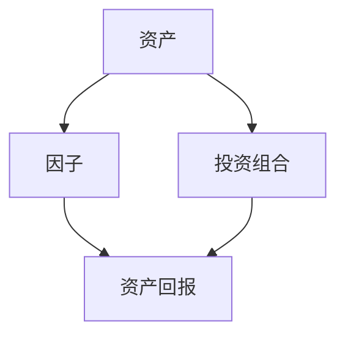
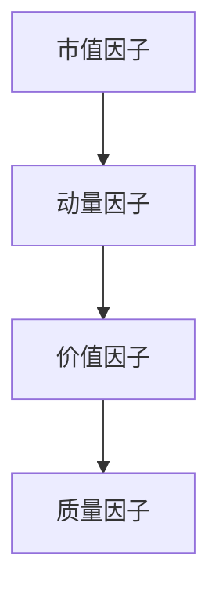
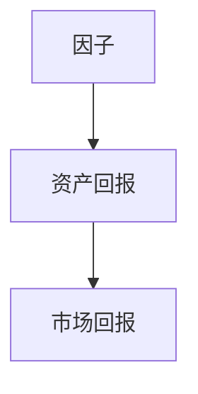
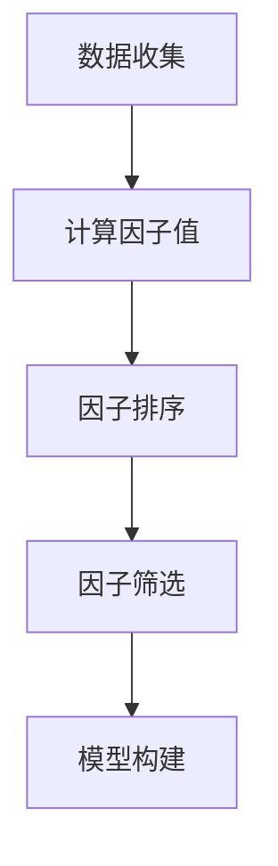
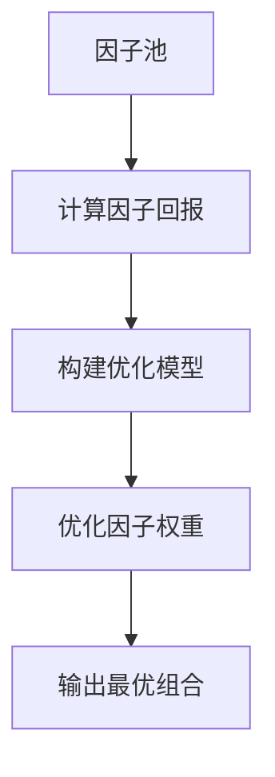
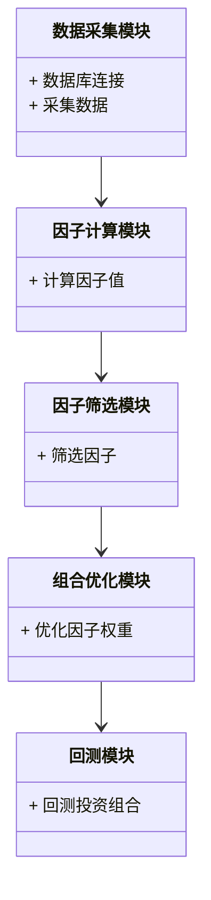
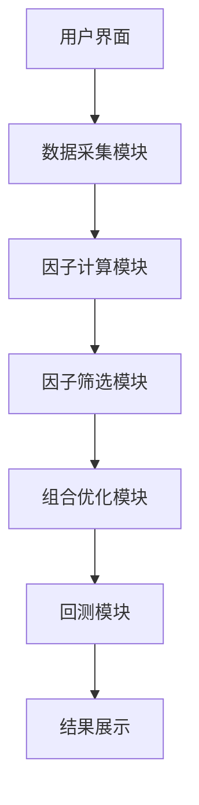

                 

<think>
好的，我现在要帮助用户撰写一篇关于《因子投资：捕捉市场异常回报的系统方法》的技术博客文章。用户提供了详细的结构要求，我需要按照这个结构逐步完成。

首先，我需要理解用户的需求。用户希望文章结构清晰，逻辑严密，语言专业，同时涵盖因子投资的各个方面，包括背景、核心概念、数学模型、系统架构、项目实战和最佳实践等。用户还特别指出，每个部分都需要详细讲解，并使用Mermaid图和Python代码示例。

接下来，我会按照用户提供的大纲开始撰写。首先是标题和摘要部分，这部分需要简洁明了，概括整篇文章的核心内容。然后是关键词，选择5-7个最能代表文章主题的关键词，方便读者快速理解文章主题。

在撰写正文部分时，我需要确保每个章节都深入浅出，内容详实。例如，在第1章，我会详细解释因子投资的基本概念，包括其背景、意义、核心概念和主要流派，以及与传统投资的区别。这部分需要使用对比表格和Mermaid图来帮助读者理解。

第2章将深入探讨因子的核心概念，包括因子的定义、属性、相互关系，以及因子与市场回报的关系。我需要使用Mermaid流程图来展示因子之间的关系和它们如何影响市场回报。

第3章是数学模型与算法原理部分，这里需要详细讲解因子投资的数学模型，如单因子模型、多因子模型和因子组合优化模型。同时，我需要提供Python代码示例，展示如何实现因子筛选和组合优化，使用Mermaid流程图来说明算法步骤。

第4章是系统分析与架构设计，这部分需要介绍如何构建因子投资系统，包括功能模块设计、系统架构图和接口设计。我将使用Mermaid的类图和架构图来展示系统的各个部分。

第5章是项目实战，我会指导读者如何安装环境，实现核心功能，并通过案例分析来展示实际应用。这部分需要详细的代码和案例分析，帮助读者实际操作。

最后是第6章的最佳实践，总结经验和注意事项，并提供小结和拓展阅读，帮助读者巩固知识，并进一步深入学习。

在整个写作过程中，我需要确保语言专业，逻辑清晰，结构紧凑。同时，要使用Mermaid图和Python代码示例，使内容更加生动直观。最后，我会在文章末尾添加作者信息，按照用户的要求署名。

现在，我可以开始按照这个思考过程逐步撰写文章了。
</think>

# 因子投资：捕捉市场异常回报的系统方法

> 关键词：因子投资，市场回报，投资策略，数学模型，Python代码

> 摘要：本文系统地介绍因子投资的核心概念、数学模型、算法原理、系统架构以及实际应用。通过详细讲解因子投资的背景、核心概念、数学模型、系统设计、项目实战和最佳实践，帮助读者掌握捕捉市场异常回报的系统方法。

---

# 第1章: 因子投资的核心概念

## 1.1 因子投资的背景与意义

### 1.1.1 传统投资方法的局限性
传统投资方法依赖于基本面分析或技术分析，但这些方法在面对市场波动和复杂性时往往显得力不从心。因子投资通过系统化的方法，捕捉市场中的异常回报，为投资者提供了更科学的投资策略。

### 1.1.2 因子投资的起源与发展
因子投资起源于20世纪70年代，以Fama-French三因子模型为代表。随着金融市场的不断发展，因子投资逐渐演变为一种系统化的投资方法，广泛应用于机构投资和个人理财。

### 1.1.3 因子投资在现代金融中的地位
因子投资通过分析多个因子（如市值、价值、动量等）来预测资产回报，已成为现代金融的重要组成部分。它结合了统计学和经济学的理论，为投资者提供了更精准的投资工具。

## 1.2 因子投资的基本概念

### 1.2.1 什么是因子
因子是指能够解释资产回报差异的变量。例如，市值（Size）、价值（Value）、动量（Momentum）等因子都是影响资产回报的重要因素。

### 1.2.2 因子的分类与特点
因子可以分为系统性因子和非系统性因子。系统性因子影响整个市场，如市值因子；非系统性因子则影响特定资产或行业，如动量因子。常见的因子包括：

- 市值（Size）：小盘股相对于大盘股的表现。
- 价值（Value）：低市盈率或低市净率的股票表现优于高市盈率或高市净率的股票。
- 动量（Momentum）：近期表现好的资产未来会继续表现良好。
- 质量（Quality）：高ROE、低负债的公司表现更优。
- 剩余（Residual）：无法用上述因子解释的部分。

### 1.2.3 因子投资的目标与优势
因子投资的目标是通过筛选具有超额回报潜力的因子，构建投资组合以捕捉市场异常回报。其优势包括：
1. 系统化：通过数学模型和算法筛选因子，减少人为干扰。
2. 多样性：结合多个因子，降低单一因子的风险。
3. 可扩展性：适用于大规模数据和复杂市场环境。

## 1.3 因子投资的主要流派

### 1.3.1 Fama-French三因子模型
Fama-French三因子模型包括市值、价值和动量因子，是因子投资的经典模型。其公式为：
$$ R_i = R_f + \beta_i (R_m - R_f) + 0.30SMB + 0.30HML + \epsilon_i $$
其中，SMB为小市值因子，HML为高价值因子。

### 1.3.2 其他常见因子模型
除了Fama-French模型，还包括多因子模型和风险因子模型。例如，APT模型（Arrow-Debreu Model）通过多个因子解释资产回报。

### 1.3.3 因子投资的最新发展
近年来，机器学习技术的应用使得因子投资更加智能化。通过大数据分析和深度学习模型，发现传统因子之外的新因子。

## 1.4 因子投资与传统投资的区别

### 1.4.1 投资理念的差异
因子投资基于统计和数学模型，而传统投资更多依赖经验和基本面分析。

### 1.4.2 投资策略的差异
因子投资通过因子筛选构建组合，传统投资则根据市场趋势或公司基本面选择个股。

### 1.4.3 风险管理的差异
因子投资通过分散化降低风险，传统投资则通过个股选择和行业分散化。

## 1.5 本章小结
本章详细介绍了因子投资的背景、核心概念和主要流派，为后续章节奠定了基础。因子投资通过系统化的方法，捕捉市场中的超额回报，成为现代投资的重要工具。

---

# 第2章: 因子投资的核心概念与联系

## 2.1 因子的定义与属性

### 2.1.1 因子的定义
因子是影响资产回报的系统化变量，通过量化分析可以捕捉市场中的异常回报。

### 2.1.2 因子的属性特征对比表格
以下是常见因子的属性对比：

| 因子类型 | 市值（Size） | 价值（Value） | 动量（Momentum） | 质量（Quality） |
|----------|--------------|---------------|------------------|----------------|
| 特性     | 小盘股表现好 | 低市盈率表现好 | 近期表现好的资产 | 高ROE公司表现好 |
| 计算方式 | 市值大小排序 | 市盈率/市净率 | 过去12个月收益 | ROE和负债率 |

### 2.1.3 因子的ER实体关系图
以下是因子与资产回报的实体关系图：



## 2.2 因子之间的关系

### 2.2.1 因子之间的相互作用
因子之间可能存在相关性，例如市值因子和动量因子可能在某些情况下表现出正相关。

### 2.2.2 因子关系的 mermaid 流程图
以下是因子之间关系的流程图：



### 2.2.3 因子关系的数学模型
因子之间的关系可以通过协方差矩阵表示：

$$ \text{Cov}(F_i, F_j) $$

其中，$F_i$和$F_j$分别为两个因子。

## 2.3 因子与市场回报的关系

### 2.3.1 因子对市场回报的影响
因子通过影响资产的风险和收益，进而影响整体市场的回报。

### 2.3.2 因子与市场回报的数学公式
资产回报模型可以表示为：

$$ R_i = \alpha + \beta_1 F_1 + \beta_2 F_2 + \epsilon_i $$

其中，$F_1$和$F_2$分别为两个因子，$\beta$为因子的权重，$\epsilon_i$为误差项。

### 2.3.3 因子与市场回报的 mermaid 流程图
以下是因子与市场回报的关系图：



## 2.4 本章小结
本章详细分析了因子的定义、属性以及因子之间的关系，为后续章节的数学模型和算法设计奠定了基础。

---

# 第3章: 因子投资的数学模型与算法原理

## 3.1 因子投资的数学模型

### 3.1.1 单因子模型
单因子模型假设资产回报仅受一个因子的影响：

$$ R_i = \alpha + \beta F + \epsilon $$

### 3.1.2 多因子模型
多因子模型考虑多个因子的影响：

$$ R_i = \alpha + \beta_1 F_1 + \beta_2 F_2 + \ldots + \beta_n F_n + \epsilon $$

### 3.1.3 因子组合优化模型
因子组合优化模型旨在找到最优因子组合以最大化回报：

$$ \max \mu \cdot w - \frac{1}{2} w^T \Sigma w $$
$$ \text{subject to} \quad 1^T w = 1 $$

其中，$\mu$为因子回报均值，$\Sigma$为因子协方差矩阵，$w$为因子权重。

## 3.2 因子筛选的算法原理

### 3.2.1 因子筛选的步骤
1. 数据收集：获取资产的历史数据。
2. 计算因子值：根据因子定义计算因子值。
3. 因子排序：对因子进行排序，筛选表现好的因子。
4. 模型构建：使用回归模型或因子组合模型。

### 3.2.2 因子筛选的 mermaid 流程图
以下是因子筛选流程图：



### 3.2.3 因子筛选的 Python 实现代码
以下是因子筛选的Python代码示例：

```python
import pandas as pd

# 假设data为包含资产数据的DataFrame
# 计算市值因子（小盘股为1，大盘股为0）
data['Size'] = data['Market Cap'].apply(lambda x: 1 if x < 500 else 0)

# 计算价值因子（低市盈率的股票为1，否则为0）
data['Value'] = data['PE'].apply(lambda x: 1 if x < 15 else 0)

# 计算动量因子（过去12个月收益）
data['Momentum'] = data['Return'].shift(12).apply(lambda x: 1 if x > 0.1 else 0)
```

## 3.3 因子组合优化的算法原理

### 3.3.1 因子组合优化的步骤
1. 确定因子池。
2. 计算因子回报。
3. 构建优化模型。
4. 优化因子权重。

### 3.3.2 因子组合优化的 mermaid 流程图
以下是因子组合优化流程图：



### 3.3.3 因子组合优化的 Python 实现代码
以下是因子组合优化的Python代码示例：

```python
import numpy as np
from sklearn.linear_model import Lasso

# 假设X为因子矩阵，y为资产回报
# 使用Lasso回归进行因子组合优化
model = Lasso(alpha=0.1)
model.fit(X, y)
weights = model.coef_
optimal_weights = weights / np.sum(weights)
```

## 3.4 本章小结
本章详细讲解了因子投资的数学模型和算法原理，通过Python代码示例展示了因子筛选和组合优化的过程。

---

# 第4章: 系统分析与架构设计

## 4.1 问题场景介绍
本章将从系统分析的角度，介绍如何构建一个基于因子投资的系统。

## 4.2 系统功能设计

### 4.2.1 功能模块设计
1. 数据采集模块：从数据库获取资产数据。
2. 因子计算模块：计算各因子值。
3. 因子筛选模块：筛选表现好的因子。
4. 组合优化模块：优化因子权重。
5. 回测模块：回测投资组合表现。

### 4.2.2 系统功能 mermaid 类图
以下是系统功能的类图：



## 4.3 系统架构设计

### 4.3.1 系统架构 mermaid 图
以下是系统架构图：



### 4.3.2 系统接口设计
系统主要接口包括：
1. 数据接口：与数据库交互。
2. 计算接口：计算因子值。
3. 优化接口：优化因子权重。

## 4.4 本章小结
本章从系统分析的角度，设计了一个基于因子投资的系统架构，为实际应用提供了参考。

---

# 第5章: 项目实战

## 5.1 环境安装与配置

### 5.1.1 安装Python环境
安装Python 3.8及以上版本，安装必要的库：

```bash
pip install numpy pandas scikit-learn
```

### 5.1.2 安装回测框架
安装Backtrader或Zipline进行回测。

## 5.2 核心实现

### 5.2.1 因子计算代码
以下是因子计算的Python代码示例：

```python
import pandas as pd

# 假设data为包含资产数据的DataFrame
# 计算市值因子（小盘股为1，大盘股为0）
data['Size'] = data['Market Cap'].apply(lambda x: 1 if x < 500 else 0)

# 计算价值因子（低市盈率的股票为1，否则为0）
data['Value'] = data['PE'].apply(lambda x: 1 if x < 15 else 0)

# 计算动量因子（过去12个月收益）
data['Momentum'] = data['Return'].shift(12).apply(lambda x: 1 if x > 0.1 else 0)
```

### 5.2.2 组合优化代码
以下是组合优化的Python代码示例：

```python
import numpy as np
from sklearn.linear_model import Lasso

# 假设X为因子矩阵，y为资产回报
# 使用Lasso回归进行因子组合优化
model = Lasso(alpha=0.1)
model.fit(X, y)
weights = model.coef_
optimal_weights = weights / np.sum(weights)
```

## 5.3 实际案例分析

### 5.3.1 案例背景
假设我们有100只股票，数据包括市值、市盈率、动量因子等。

### 5.3.2 案例分析
1. 数据清洗：处理缺失值和异常值。
2. 因子计算：计算各因子值。
3. 因子筛选：筛选表现好的因子。
4. 组合优化：优化因子权重。
5. 回测：回测投资组合的表现。

## 5.4 项目小结
本章通过实际案例展示了因子投资系统的实现过程，从数据获取到回测，详细讲解了每一步的操作。

---

# 第6章: 最佳实践与总结

## 6.1 最佳实践 tips

### 6.1.1 因子选择
选择因子时，要注意因子的独立性和相关性，避免因子冗余。

### 6.1.2 数据清洗
数据清洗是因子投资的关键步骤，确保数据的准确性和完整性。

### 6.1.3 回测分析
回测可以帮助验证投资策略的有效性，避免过度拟合。

## 6.2 本章小结
因子投资通过系统化的方法捕捉市场异常回报，但实际应用中需要注意因子选择、数据清洗和回测分析等关键点。

---

作者：AI天才研究院/AI Genius Institute & 禅与计算机程序设计艺术 /Zen And The Art of Computer Programming

