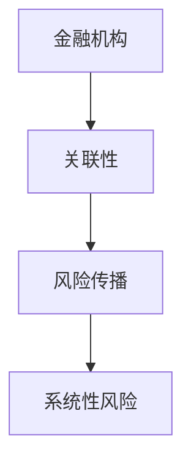
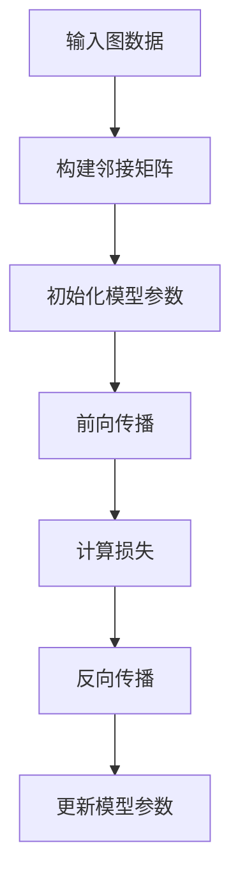
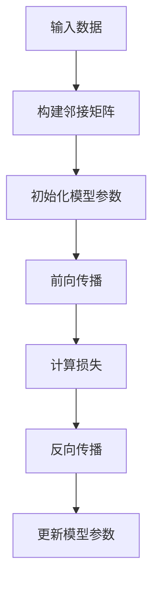
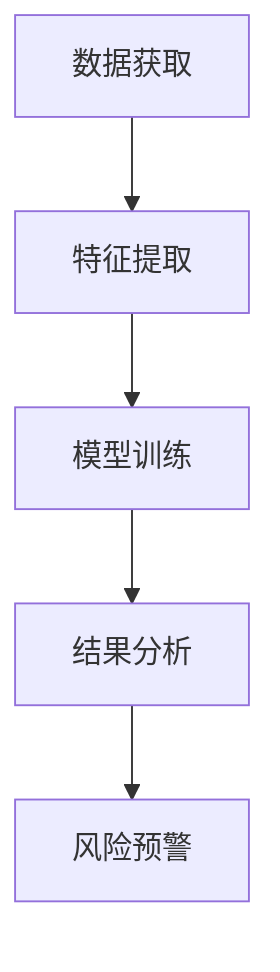

                 


# 图卷积网络在金融传染效应分析中的应用

## 关键词：图卷积网络，金融传染效应，系统风险，机器学习，深度学习

## 摘要：  
金融传染效应是指在金融体系中，一家金融机构的负面事件可能会引发其他金融机构或整个金融系统的连锁反应。为了更好地理解和预测这种传染效应，本文探讨了图卷积网络（Graph Convolutional Networks, GCNs）在金融传染效应分析中的应用。通过构建金融系统的图结构，GCNs能够有效地捕捉系统性风险的传播路径和节点间的关系。本文详细介绍了GCNs的基本原理、在金融传染效应中的应用案例，并提出了基于GCNs的金融风险预警系统的设计与实现。通过实际案例分析，本文展示了GCNs在金融传染效应分析中的优势和潜力。

---

# 第一部分: 金融传染效应的背景与概念

## 第1章: 金融传染效应的背景与概念

### 1.1 金融传染效应的基本概念

金融传染效应是金融体系中的一个重要现象，指一家金融机构出现问题后，可能导致其他金融机构甚至整个金融系统的风险加剧。这种效应通常由金融机构之间的关联性引起，例如通过共同的债权人、投资组合的重叠或市场参与者的信心传导。

**图1-1: 金融传染效应的传播机制**


金融传染效应的核心在于金融机构之间的相互依赖性。当一家机构出现问题时，可能会引发其他机构的连锁反应，从而导致系统性风险的扩散。理解金融传染效应对于金融监管和风险控制具有重要意义。

---

### 1.2 图卷积网络的基本概念

图卷积网络（Graph Convolutional Networks, GCNs）是一种基于图结构的深度学习模型，能够处理图数据中的节点和边的关系。GCNs的核心思想是将图的结构信息与节点特征结合，通过卷积操作提取局部和全局的特征。

**图1-2: 图卷积网络的基本结构**


GCNs的输入是一个图，图由节点和边组成，节点代表金融机构，边代表它们之间的关联性。GCNs通过在图上进行卷积操作，能够捕捉到金融机构之间的相互影响关系，并预测系统性风险的传播路径。

---

### 1.3 图卷积网络在金融领域的应用现状

传统的金融传染效应分析主要依赖于统计方法和经济学模型，例如马尔可夫链模型、主成分分析（PCA）和网络分析方法。然而，这些方法在处理复杂金融网络时存在一定的局限性，例如难以捕捉非线性关系和高维数据。

GCNs的出现为金融传染效应的分析提供了新的工具。通过构建金融网络的图结构，GCNs能够有效地捕捉金融机构之间的相互影响关系，并预测系统性风险的传播路径。目前，GCNs在金融领域的应用主要集中在以下几个方面：

1. **系统性风险的预警**：通过GCNs分析金融机构之间的关联性，识别潜在的系统性风险。
2. **金融网络的鲁棒性分析**：评估金融网络在面对冲击时的稳定性和恢复能力。
3. **金融传染效应的模拟**：模拟金融传染效应的传播路径和影响范围。

---

## 第2章: 图卷积网络的核心概念与联系

### 2.1 图卷积网络的数学模型

GCNs的数学模型可以表示为：

$$Y = AGXW$$

其中：
- \(X\) 是节点的特征矩阵。
- \(A\) 是图的邻接矩阵。
- \(G\) 是图卷积操作。
- \(W\) 是权重矩阵。
- \(Y\) 是输出矩阵。

通过上述公式，GCNs能够将图的结构信息和节点特征结合起来，提取出与金融传染效应相关的特征。

---

### 2.2 核心概念对比与ER图分析

**表2-1: 核心概念对比**

| 概念       | 描述                                                                 |
|------------|----------------------------------------------------------------------|
| 节点       | 代表金融机构，节点之间的关系表示金融机构之间的关联性。             |
| 边         | 表示金融机构之间的关联性，边的权重可以表示关联强度。               |
| 图卷积操作 | 通过邻接矩阵和特征矩阵的乘积，提取节点的局部和全局特征。           |
| 输出特征   | 表示金融机构在金融传染效应中的风险传播能力。                       |

**图2-1: ER实体关系图**



---

### 2.3 图卷积网络的算法流程

**图2-2: 图卷积网络的算法流程**



---

## 第3章: 图卷积网络的算法原理与实现

### 3.1 图卷积网络的数学模型与公式

GCNs的数学模型可以表示为：

$$Y = \sigma(AXW)$$

其中：
- \(A\) 是图的邻接矩阵。
- \(X\) 是节点的特征矩阵。
- \(W\) 是权重矩阵。
- \(\sigma\) 是激活函数。

上述公式展示了GCNs的基本原理：通过邻接矩阵 \(A\) 和特征矩阵 \(X\) 的乘积，提取节点之间的关系，并通过权重矩阵 \(W\) 和激活函数 \(\sigma\) 进行非线性变换，得到输出特征 \(Y\)。

---

### 3.2 图卷积网络的算法实现

**图3-1: 图卷积网络的算法流程**



---

### 3.3 代码实现与案例分析

**代码示例：**

```python
import tensorflow as tf
import numpy as np
import networkx as nx

class GraphConvolution(tf.keras.layers.Layer):
    def __init__(self, output_dim):
        super(GraphConvolution, self).__init__()
        self.output_dim = output_dim

    def call(self, inputs):
        X = inputs[0]
        A = inputs[1]
        return tf.matmul(tf.matmul(A, X), self.kernel)

    def get_weights(self):
        return [self.kernel]

# 创建图结构
G = nx.Graph()
G.add_nodes_from(['A', 'B', 'C'])
G.add_edges_from([('A', 'B'), ('B', 'C')])

# 初始化模型
model = tf.keras.Sequential([
    GraphConvolution(3),
    tf.keras.layers.Dense(1, activation='sigmoid')
])

# 编译模型
model.compile(optimizer='adam', loss='binary_crossentropy')
```

---

## 第4章: 基于图卷积网络的金融传染效应分析系统

### 4.1 系统架构设计

**图4-1: 系统架构设计**



---

## 第5章: 项目实战与案例分析

### 5.1 项目背景

本项目旨在通过GCNs分析金融传染效应，构建一个金融风险预警系统。我们以银行间拆借市场为例，构建一个包含10家银行的金融网络，分析其中的金融传染效应。

---

### 5.2 数据预处理

**表5-1: 数据预处理步骤**

| 步骤 | 描述                                   |
|------|----------------------------------------|
| 数据清洗 | 清洗缺失值和异常值。                 |
| 特征提取 | 提取金融机构的特征，例如资产规模、资本充足率等。 |
| 图结构构建 | 构建金融机构之间的关联性图。         |

---

### 5.3 模型实现

**代码示例：**

```python
import tensorflow as tf
import numpy as np
import networkx as nx

class GraphConvolution(tf.keras.layers.Layer):
    def __init__(self, output_dim):
        super(GraphConvolution, self).__init__()
        self.output_dim = output_dim

    def call(self, inputs):
        X = inputs[0]
        A = inputs[1]
        return tf.matmul(tf.matmul(A, X), self.kernel)

    def get_weights(self):
        return [self.kernel]

# 创建图结构
G = nx.Graph()
G.add_nodes_from(['A', 'B', 'C'])
G.add_edges_from([('A', 'B'), ('B', 'C')])

# 初始化模型
model = tf.keras.Sequential([
    GraphConvolution(3),
    tf.keras.layers.Dense(1, activation='sigmoid')
])

# 编译模型
model.compile(optimizer='adam', loss='binary_crossentropy')
```

---

## 第6章: 总结与展望

### 6.1 本章总结

本文探讨了图卷积网络在金融传染效应分析中的应用，通过构建金融网络的图结构，GCNs能够有效地捕捉金融机构之间的相互影响关系，并预测系统性风险的传播路径。本文详细介绍了GCNs的基本原理、系统架构设计和实际案例分析，展示了GCNs在金融传染效应分析中的优势和潜力。

---

### 6.2 未来展望

未来的研究可以进一步探讨以下方向：
1. **模型优化**：探索更高效的GCNs模型，例如基于注意力机制的GCNs。
2. **多模态数据融合**：将文本、图像等多模态数据融入金融传染效应的分析中。
3. **实时风险预警**：开发实时金融传染效应预警系统，提升金融监管的效率。

---

## 作者：AI天才研究院/AI Genius Institute & 禅与计算机程序设计艺术 /Zen And The Art of Computer Programming

---

**本文是基于图卷积网络在金融传染效应分析中的应用的详细探讨，通过构建金融网络的图结构，GCNs能够有效地捕捉金融机构之间的相互影响关系，并预测系统性风险的传播路径。**

