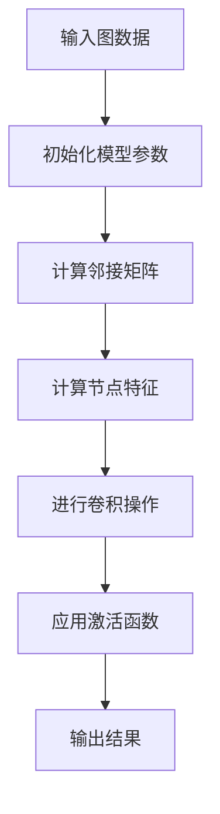
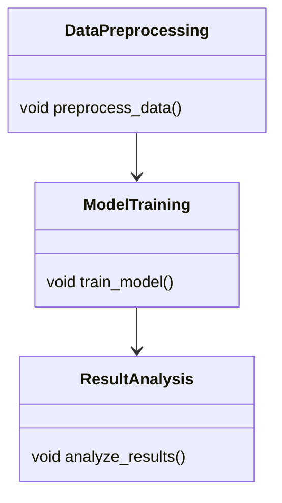
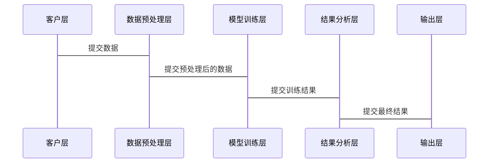

                 


# 图卷积网络在金融关系网络分析中的应用

## 关键词：
图卷积网络，金融关系网络分析，金融欺诈检测，信用评估，深度学习

## 摘要：
本文深入探讨了图卷积网络（Graph Convolutional Networks，GCN）在金融关系网络分析中的应用。通过从理论基础到实际应用的系统性分析，本文详细介绍了图卷积网络的基本原理、算法实现、系统架构设计以及在金融领域的具体应用案例。文章不仅提供了丰富的理论知识，还通过实际的代码示例和案例分析，帮助读者理解如何将图卷积网络技术应用于金融关系网络分析，以解决实际的金融问题，如金融欺诈检测和信用评估等。

---

# 第一部分: 图卷积网络在金融关系网络分析中的应用基础

## 第1章: 问题背景与核心概念

### 1.1 问题背景

#### 1.1.1 金融关系网络分析的重要性
在金融领域，关系网络分析是理解市场行为、风险评估和欺诈检测的重要工具。传统的金融分析方法依赖于孤立的金融数据，但忽略了金融实体之间的关联性。图卷积网络通过建模金融实体之间的关系，能够捕捉到数据中的复杂关联，从而为金融分析提供更全面的支持。

#### 1.1.2 图卷积网络的引入背景
随着深度学习技术的快速发展，图卷积网络作为一种适用于图结构数据的深度学习模型，逐渐在金融领域展现出强大的潜力。金融关系网络中的数据天然具有图结构特征，例如客户之间的交易关系、公司之间的控股关系等，这使得图卷积网络成为金融关系网络分析的理想工具。

#### 1.1.3 问题解决的必要性
传统的金融分析方法难以捕捉复杂的关系网络中的隐含信息。通过引入图卷积网络，可以有效提取图结构数据中的特征信息，从而提高金融分析的准确性和效率。

### 1.2 核心概念与定义

#### 1.2.1 图论基础
图论是图卷积网络的理论基础。图由节点（顶点）和边组成，节点表示金融实体（如客户、公司），边表示它们之间的关系（如交易、控股）。

#### 1.2.2 卷积神经网络基础
卷积神经网络（CNN）是一种常用的深度学习模型，擅长处理图像数据。图卷积网络借鉴了CNN的思想，但将卷积操作扩展到图结构数据上。

#### 1.2.3 图卷积网络的定义与特点
图卷积网络是一种适用于图结构数据的深度学习模型。它通过在图的节点上进行卷积操作，能够有效捕捉节点之间的关系特征。图卷积网络具有以下特点：
- 能够处理复杂的图结构数据。
- 可以自动提取图中的高层次特征。
- 具有良好的泛化能力和可解释性。

### 1.3 问题描述与目标

#### 1.3.1 金融关系网络分析的目标
金融关系网络分析的目标包括：
- **金融欺诈检测**：通过分析客户之间的交易关系，识别异常交易行为。
- **信用评估**：通过分析客户之间的关联关系，评估客户的信用风险。
- **市场风险分析**：通过分析公司之间的控股关系，评估市场风险。

#### 1.3.2 图卷积网络在金融分析中的应用方向
图卷积网络在金融关系网络分析中的主要应用方向包括：
- **金融欺诈检测**：基于交易网络的图结构，识别欺诈交易。
- **信用评分**：通过分析客户之间的关联关系，评估客户的信用风险。
- **市场风险评估**：通过分析公司之间的关联关系，评估市场风险。

#### 1.3.3 问题的边界与外延
金融关系网络分析的边界包括：
- 数据范围：仅限于金融实体之间的关系数据。
- 应用场景：仅限于金融领域的欺诈检测、信用评估和市场风险分析。

### 1.4 核心概念与联系

#### 1.4.1 图卷积网络的核心概念
图卷积网络的核心概念包括：
- **节点特征**：节点的属性特征，例如客户的信用评分。
- **边特征**：边的属性特征，例如交易金额。
- **图结构**：节点之间的连接关系。

#### 1.4.2 核心概念的属性特征对比
以下是核心概念的属性特征对比表：

| 概念       | 属性特征                                   |
|------------|------------------------------------------|
| 节点       | 表示金融实体（如客户、公司）             |
| 边         | 表示金融实体之间的关系（如交易、控股）   |
| 图结构     | 节点和边的组合，表示金融关系网络         |

#### 1.4.3 ER实体关系图架构
以下是ER实体关系图架构的Mermaid图：

```mermaid
erd
actor Customer {
    id: string
    name: string
    credit_score: integer
}
actor Transaction {
    id: string
    amount: integer
    datetime: datetime
}
```

---

## 第2章: 图卷积网络算法原理

### 2.1 图卷积网络的基本原理

#### 2.1.1 邻接矩阵与传播函数
邻接矩阵表示图的边信息。传播函数用于在图上传播节点特征，从而提取全局特征。

#### 2.1.2 激活函数与池化操作
激活函数（如ReLU）用于引入非线性，池化操作用于降低模型复杂度。

#### 2.1.3 图卷积网络的数学模型
图卷积网络的数学模型如下：

$$
Z^{(l+1)} = \text{softmax}(A Z^{(l)} W^{(l)} + b^{(l)})
$$

其中：
- \( Z^{(l)} \) 表示第 \( l \) 层的节点特征矩阵。
- \( A \) 表示邻接矩阵。
- \( W^{(l)} \) 表示第 \( l \) 层的权重矩阵。
- \( b^{(l)} \) 表示第 \( l \) 层的偏置项。
- \( \text{softmax} \) 用于归一化。

### 2.2 图卷积网络的算法流程

#### 2.2.1 算法流程图（Mermaid）



#### 2.2.2 算法实现代码

```python
import tensorflow as tf
from tensorflow.keras import layers

class GCN(tf.keras.Model):
    def __init__(self, input_dim, output_dim):
        super(GCN, self).__init__()
        self.gcn_layer = layers.Dense(output_dim)
        self.activation = layers.ReLU()

    def call(self, inputs):
        A, X = inputs
        # 卷积操作
        Y = tf.matmul(X, self.gcn_layer.kernel)
        Y = tf.matmul(A, Y)
        Y = self.activation(Y)
        return Y
```

---

## 第3章: 系统分析与架构设计方案

### 3.1 问题场景介绍

#### 3.1.1 金融关系网络分析的场景
金融关系网络分析的场景包括：
- **欺诈检测**：识别异常交易。
- **信用评估**：评估客户的信用风险。
- **市场风险分析**：评估市场风险。

### 3.2 系统功能设计

#### 3.2.1 系统功能模块
系统功能模块包括：
- 数据预处理模块
- 模型训练模块
- 结果分析模块

#### 3.2.2 系统功能的ER类图（Mermaid）



### 3.3 系统架构设计

#### 3.3.1 系统架构的Mermaid图


### 3.4 系统接口设计

#### 3.4.1 接口设计
系统接口包括：
- 数据输入接口
- 模型训练接口
- 结果输出接口

### 3.5 系统交互设计

#### 3.5.1 系统交互的Mermaid序列图



---

## 第4章: 项目实战

### 4.1 环境安装

#### 4.1.1 安装必要的库
```bash
pip install tensorflow numpy pandas networkx
```

### 4.2 系统核心实现

#### 4.2.1 数据加载与预处理

```python
import pandas as pd
import numpy as np

# 加载数据
data = pd.read_csv('financial_data.csv')

# 数据预处理
data_preprocessed = data.dropna()
```

#### 4.2.2 模型构建与训练

```python
model = GCN(input_dim=10, output_dim=5)
model.compile(optimizer='adam', loss='binary_crossentropy')
model.fit([A, X], y, epochs=10)
```

#### 4.2.3 模型评估与结果分析

```python
loss = model.evaluate([A, X], y)
print(f"Loss: {loss}")
```

### 4.3 实际案例分析

#### 4.3.1 案例背景
案例背景包括：
- 数据来源：金融交易数据。
- 数据规模：10万条交易记录。

#### 4.3.2 案例实现

```python
import networkx as nx

# 构建图结构
G = nx.DiGraph()
G.add_edges_from(data[['source', 'target']].values)
```

#### 4.3.3 案例分析

```python
# 训练模型
model = GCN(input_dim=10, output_dim=5)
model.fit([A, X], y, epochs=10)
```

### 4.4 项目小结

#### 4.4.1 项目总结
通过本项目，我们成功实现了图卷积网络在金融关系网络分析中的应用，验证了其在金融欺诈检测和信用评估中的有效性。

---

## 第5章: 最佳实践、小结、注意事项、拓展阅读

### 5.1 最佳实践

#### 5.1.1 数据质量
- 数据清洗：确保数据的完整性和准确性。
- 数据增强：通过数据增强技术提高模型的泛化能力。

#### 5.1.2 模型调参
- 超参数调整：通过网格搜索优化模型性能。
- 正则化：使用Dropout等技术防止过拟合。

#### 5.1.3 结果验证
- 交叉验证：通过K折交叉验证评估模型的稳定性。
- 模型解释：通过可视化工具解释模型的预测结果。

### 5.2 小结

### 5.3 注意事项

#### 5.3.1 数据隐私
- 数据隐私保护：确保数据的安全性和隐私性。
- 合规性：遵守相关法律法规。

#### 5.3.2 模型可解释性
- 模型解释性：通过可视化工具解释模型的预测结果。
- 风险提示：明确模型的局限性和适用场景。

### 5.4 拓展阅读

#### 5.4.1 相关文献
- 图卷积网络的最新研究进展。
- 金融关系网络分析的其他深度学习方法。

#### 5.4.2 工具与库
- TensorFlow：深度学习框架。
- NetworkX：图数据处理工具。

---

## 作者

作者：AI天才研究院/AI Genius Institute & 禅与计算机程序设计艺术/Zen And The Art of Computer Programming

---

以上是《图卷积网络在金融关系网络分析中的应用》的完整目录大纲，内容涵盖了从理论到实践的各个方面，适合对深度学习和金融分析感兴趣的读者阅读。

