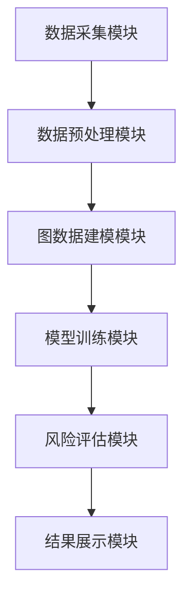
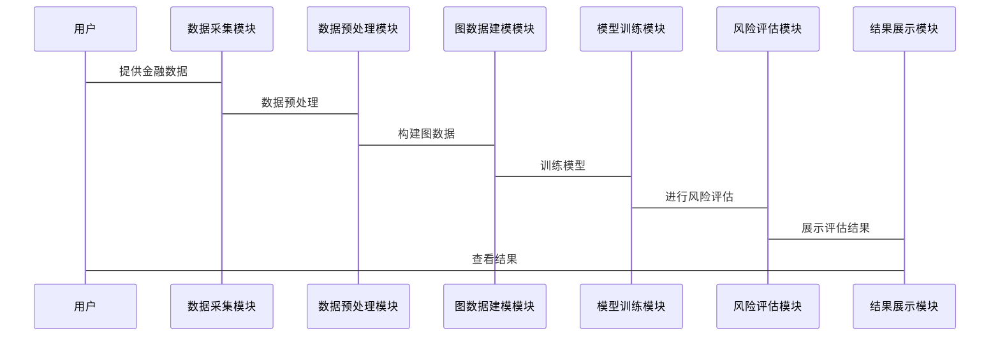

                 

<think>
好，我现在需要根据用户的要求，撰写一篇关于《图神经网络在系统性风险评估中的应用》的技术博客文章。用户希望文章结构清晰、内容详实，涵盖从背景介绍到实际应用的各个方面，并且使用专业的技术语言。

首先，我得明确文章的结构。用户已经提供了一个大纲，我需要按照这个大纲来展开每一部分的内容。文章分为七个主要章节，每个章节都有子部分，涉及背景、基础、图数据建模、算法实现、系统架构、项目实战和总结等。

在撰写过程中，我需要确保每个部分都涵盖用户提到的核心内容，比如系统性风险的定义、图神经网络的基本原理、图数据建模的方法、算法的具体实现步骤，以及系统架构的设计。同时，用户特别强调要使用Mermaid图表和数学公式，这部分需要仔细处理，确保图表和公式准确无误地嵌入文章中。

接下来，我会逐章节进行思考和撰写。首先，第一章是系统性风险评估的背景，我需要详细解释系统性风险的概念、传统方法的局限性以及图神经网络的优势。这部分需要语言简洁明了，适合技术读者理解。

第二章介绍图神经网络的基础知识，包括图数据的基本概念、核心原理和关键算法。这里需要使用数学公式和Mermaid图表来辅助说明，例如邻接矩阵和图卷积神经网络的结构。

第三章是系统性风险评估中的图数据建模，需要描述金融市场网络的构建和特征工程。这部分可能需要详细说明如何将金融市场数据转换为图结构，并展示相应的ER图。

第四章讨论图神经网络在系统性风险评估中的具体应用，比如系统性风险传播模型和异常检测。这部分需要结合实际案例，解释如何使用图神经网络进行风险评估。

第五章是算法实现，包括数据预处理、模型训练和评估。这里需要详细描述每一步骤，并给出代码示例，让读者能够理解并实现。

第六章是系统架构设计，涵盖系统设计、架构图、接口设计和交互流程。这部分需要使用Mermaid图表展示系统结构和交互过程。

最后一章是项目实战，展示如何在真实场景中应用图神经网络进行系统性风险评估。包括环境搭建、代码实现、案例分析和总结。

在写作过程中，我需要确保每一部分都详细具体，避免笼统的描述。同时，使用清晰的标题和小结，帮助读者理清思路。此外，注意使用适当的数学公式和图表，使内容更具专业性和可读性。

现在，我将开始逐章节撰写，确保每一部分都符合用户的要求，并详细展开每个主题，使整篇文章逻辑连贯、内容丰富。
</think>

# 图神经网络在系统性风险评估中的应用

> 关键词：图神经网络，系统性风险，金融市场，深度学习，系统性风险评估

> 摘要：系统性风险评估是金融领域的重要研究方向，传统的统计方法和网络模型在处理金融市场复杂关系时存在局限性。图神经网络（Graph Neural Networks, GNN）作为一种新兴的深度学习技术，能够有效地捕捉金融市场中的复杂关联关系，为系统性风险评估提供了新的解决方案。本文从系统性风险评估的基本概念出发，详细探讨了图神经网络的原理及其在系统性风险评估中的应用，包括图数据建模、算法实现、系统架构设计以及实际案例分析。

---

## 第1章 系统性风险评估的背景与挑战

### 1.1 系统性风险的基本概念

系统性风险是指由于金融系统中的某些重大事件或系统性因素导致整个金融体系发生崩溃或剧烈波动的风险。这种风险往往由系统中的相互关联和依赖关系引发，具有全局性和传染性的特点。

#### 1.1.1 系统性风险的定义

系统性风险可以理解为金融系统中由于个体机构的相互关联而导致的系统性崩溃的可能性。与个体风险不同，系统性风险影响整个金融系统的稳定性。

#### 1.1.2 系统性风险的特征

系统性风险具有以下特征：
1. **传染性**：一家金融机构的失败可能引发连锁反应，影响整个金融系统。
2. **全局性**：系统性风险影响整个金融体系，而不仅仅是单个机构。
3. **复杂性**：系统性风险的来源和传播机制复杂，涉及多个层级和多种因素。

#### 1.1.3 系统性风险的传播机制

系统性风险的传播机制主要包括直接传染、间接传染和市场传染三种类型。直接传染是指两个金融机构之间直接的债务关系；间接传染是指通过多个中间机构的传导；市场传染则是指市场恐慌导致的广泛抛售行为。

### 1.2 传统系统性风险评估方法

#### 1.2.1 VaR（Value at Risk）模型

VaR模型用于衡量投资组合在一定置信水平下的最大损失。然而，VaR模型无法捕捉资产之间的相互依赖关系，尤其是在极端情况下，系统性风险可能无法被准确捕捉。

#### 1.2.2 CVA（Credit Value Adjustment）模型

CVA模型用于评估信用衍生品的公允价值调整，考虑了交易对手的信用风险。然而，CVA模型主要针对单个金融工具的风险，难以评估整个金融系统的系统性风险。

#### 1.2.3 网络风险模型

网络风险模型通过构建金融机构之间的网络关系，分析系统性风险的传播路径。然而，传统的网络模型通常基于线性假设，难以捕捉复杂的非线性关系。

### 1.3 传统方法的局限性

#### 1.3.1 数据维度的局限

传统的系统性风险评估方法通常基于低维数据，难以捕捉金融市场中的高维复杂关系。

#### 1.3.2 模型复杂性的限制

传统模型通常假设线性关系，难以捕捉金融市场中的非线性相互作用，导致模型的准确性和鲁棒性有限。

#### 1.3.3 计算效率的问题

随着金融市场规模的不断扩大，传统的系统性风险评估方法在计算效率上面临挑战，难以实时处理海量数据。

### 1.4 图神经网络的优势

#### 1.4.1 图数据的天然适合性

金融市场中的机构之间存在复杂的相互关联关系，图数据能够有效地捕捉这些关系。

#### 1.4.2 非线性关系的捕捉能力

图神经网络能够捕捉节点之间的非线性关系，适用于复杂金融网络中的系统性风险评估。

#### 1.4.3 并行计算的优势

图神经网络可以通过并行计算加速模型训练和推理过程，适合处理大规模金融数据。

### 1.5 本章小结

系统性风险是金融体系中的重要问题，传统方法在捕捉复杂关系和计算效率上存在局限性。图神经网络作为一种新兴技术，能够有效地捕捉金融市场中的复杂关联关系，为系统性风险评估提供了新的解决方案。

---

## 第2章 图神经网络基础

### 2.1 图数据的基本概念

#### 2.1.1 图的定义与表示

图由节点（顶点）和边（弧）组成，节点表示金融机构，边表示金融机构之间的关联关系。

#### 2.1.2 节点、边、权重的定义

节点：金融机构；边：金融机构之间的关联关系；权重：关联关系的强度或概率。

#### 2.1.3 图的类型

- **有向图**：边有方向，表示单向的关联关系。
- **无向图**：边无方向，表示双向的关联关系。

### 2.2 图神经网络的核心原理

#### 2.2.1 图卷积神经网络（GCN）

图卷积神经网络通过在图结构上进行卷积操作，捕捉节点之间的局部和全局特征。

#### 2.2.2 图注意力网络（GAT）

图注意力网络通过注意力机制，捕捉节点之间的长距离依赖关系。

#### 2.2.3 图嵌入技术（如Node2Vec）

图嵌入技术将节点嵌入到低维空间中，便于后续的分析和处理。

### 2.3 图神经网络的关键算法

#### 2.3.1 邻接矩阵与传播规则

邻接矩阵表示图的结构，传播规则用于在图中传播信息。

$$ A_{i,j} = 1 \text{ 如果节点 } i \text{ 和 } j \text{ 之间有边，否则 } 0 $$

#### 2.3.2 节点表示的学习过程

节点表示的学习过程包括特征提取、图卷积操作和非线性变换。

#### 2.3.3 图池化与图分类

图池化操作用于将图数据降维，图分类用于对整个图进行分类。

### 2.4 图神经网络的数学模型

#### 2.4.1 邻接矩阵的表示

邻接矩阵表示图的结构：

$$ A = [a_{i,j}] \text{，其中 } a_{i,j} = 1 \text{ 如果节点 } i \text{ 和 } j \text{ 之间有边，否则 } 0 $$

#### 2.4.2 节点表示的更新公式

节点表示的更新公式：

$$ h_i^{(l+1)} = \sigma(\sum_{j} A_{i,j} h_j^{(l)}) $$

其中，$\sigma$ 是激活函数。

---

## 第3章 系统性风险评估中的图数据建模

### 3.1 金融市场网络的构建

#### 3.1.1 股票价格数据的获取与预处理

从数据源获取股票价格数据，并进行清洗和标准化处理。

#### 3.1.2 机构间关联关系的构建

基于股票价格数据，构建金融机构之间的关联关系网络。

#### 3.1.3 图数据的存储与管理

使用图数据库（如Neo4j）存储和管理图数据。

### 3.2 系统性风险评估的特征工程

#### 3.2.1 节点特征的提取

从股票价格数据中提取节点特征，例如波动率、交易量等。

#### 3.2.2 边特征的构建

基于节点特征和关联关系，构建边特征，例如相关系数、相似性指标等。

#### 3.2.3 图特征的整合

将节点特征和边特征进行整合，形成完整的图数据。

### 3.3 图数据建模的案例分析

以某金融市场的股票数据为例，展示如何构建金融市场网络，并提取相关特征。

---

## 第4章 图神经网络在系统性风险评估中的应用

### 4.1 系统性风险传播模型

#### 4.1.1 系统性风险传播的机制

通过图神经网络捕捉系统性风险的传播路径和传播概率。

#### 4.1.2 系统性风险传播的建模

基于图神经网络构建系统性风险传播模型，分析风险的传播过程。

#### 4.1.3 系统性风险传播的模拟与预测

通过模拟系统性风险传播过程，预测系统性风险的发生概率。

### 4.2 系统性风险异常检测

#### 4.2.1 异常检测的方法

使用图神经网络进行异常检测，发现系统性风险的早期信号。

#### 4.2.2 异常检测的实现

基于图神经网络构建异常检测模型，识别金融市场中的异常行为。

#### 4.2.3 异常检测的案例分析

以实际金融市场数据为例，展示如何使用图神经网络进行系统性风险的异常检测。

### 4.3 图神经网络在系统性风险评估中的优势

#### 4.3.1 非线性关系的捕捉能力

图神经网络能够捕捉金融市场中的非线性关系，提高系统性风险评估的准确性。

#### 4.3.2 高维数据的处理能力

图神经网络适用于处理高维数据，能够捕捉复杂的金融市场关系。

#### 4.3.3 实时计算的优势

图神经网络可以通过并行计算实现实时计算，适用于实时系统性风险评估。

---

## 第5章 系统性风险评估的算法实现

### 5.1 数据预处理

#### 5.1.1 数据清洗

清洗数据，去除噪声和缺失值。

#### 5.1.2 数据标准化

对数据进行标准化处理，确保模型输入的统一性。

#### 5.1.3 数据分割

将数据分为训练集、验证集和测试集。

### 5.2 模型训练

#### 5.2.1 模型参数的初始化

初始化图神经网络的参数，包括权重和偏置。

#### 5.2.2 模型的训练过程

通过反向传播算法训练模型，优化模型参数。

#### 5.2.3 模型的评估

使用验证集和测试集评估模型的性能，包括准确率、召回率等指标。

### 5.3 模型的优化与调参

#### 5.3.1 超参数的调整

调整学习率、批量大小等超参数，优化模型性能。

#### 5.3.2 模型的调优

通过网格搜索等方法，寻找最优的模型参数。

#### 5.3.3 模型的部署

将训练好的模型部署到实际应用中，进行实时系统性风险评估。

---

## 第6章 系统性风险评估的系统架构设计

### 6.1 系统设计

#### 6.1.1 系统目标

实现系统性风险评估的自动化和实时化。

#### 6.1.2 系统功能设计

系统功能包括数据采集、图数据建模、模型训练、风险评估和结果展示。

### 6.2 系统架构设计

#### 6.2.1 系统架构图

使用Mermaid绘制系统架构图，展示系统的各个模块及其交互关系。

#### 6.2.2 系统接口设计

系统接口包括数据输入接口、模型训练接口和结果输出接口。

#### 6.2.3 系统交互流程

使用Mermaid绘制系统交互流程图，展示用户与系统之间的交互过程。

---

## 第7章 项目实战与总结

### 7.1 项目实战

#### 7.1.1 环境搭建

安装必要的软件和库，包括Python、TensorFlow、PyTorch、NetworkX等。

#### 7.1.2 核心代码实现

实现图数据建模、模型训练和风险评估的核心代码。

#### 7.1.3 代码应用解读与分析

解读核心代码的功能和实现原理，分析代码的优缺点。

### 7.2 实际案例分析

#### 7.2.1 数据来源与预处理

从实际金融市场中获取数据，进行清洗和标准化处理。

#### 7.2.2 图数据建模

构建金融市场网络，提取节点和边特征。

#### 7.2.3 模型训练与评估

训练图神经网络模型，评估模型的性能。

#### 7.2.4 风险评估与结果展示

使用训练好的模型进行系统性风险评估，并展示评估结果。

### 7.3 项目总结

#### 7.3.1 项目成果

总结项目的主要成果，包括模型性能、准确率等。

#### 7.3.2 项目经验与教训

总结项目实施过程中的经验与教训，提出改进建议。

#### 7.3.3 未来展望

展望未来的研究方向和应用前景。

---

## 第8章 最佳实践与小结

### 8.1 最佳实践 tips

#### 8.1.1 数据质量的重要性

确保数据的准确性和完整性，提高模型的性能。

#### 8.1.2 模型选择的策略

根据实际问题选择合适的图神经网络模型，优化模型性能。

#### 8.1.3 系统设计的注意事项

在系统设计中，注重模块化和可扩展性，便于后续的优化和维护。

### 8.2 本章小结

图神经网络在系统性风险评估中的应用具有重要的理论意义和实际应用价值。通过图数据建模和深度学习技术，能够有效捕捉金融市场中的复杂关联关系，提高系统性风险评估的准确性和效率。

---

## 作者：AI天才研究院/AI Genius Institute & 禅与计算机程序设计艺术 /Zen And The Art of Computer Programming

---

以上是《图神经网络在系统性风险评估中的应用》的技术博客文章的完整大纲和内容。文章系统地介绍了系统性风险评估的背景、图神经网络的基本原理、图数据建模方法、算法实现、系统架构设计以及实际案例分析，为读者提供了全面的技术指导和实践参考。

