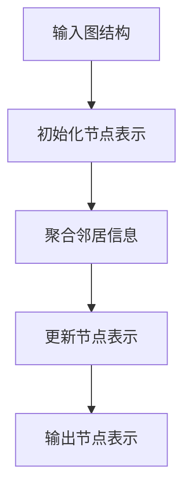
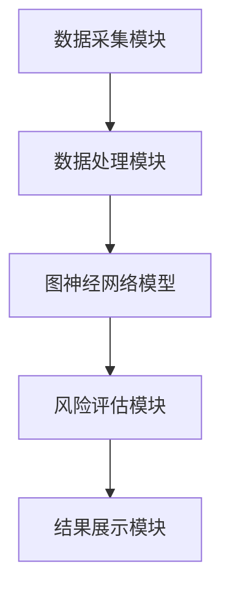

                 

<think>
嗯，我现在需要帮用户撰写一篇关于《图神经网络在金融网络风险传播中的应用》的技术博客文章。首先，我需要明确文章的结构和每个部分的内容，确保符合用户的要求。

用户希望文章有一个吸引人的标题，关键词和摘要部分，然后按照目录大纲展开。目录大纲已经给出，包括七大部分，每个部分都有详细的子章节。我需要逐一分析每个部分，确保内容完整，符合技术博客的要求。

首先，标题和关键词部分。标题是《图神经网络在金融网络风险传播中的应用》，关键词应该包括金融网络、风险传播、图神经网络、金融风险、风险预测、网络分析等。摘要部分需要简明扼�地总结文章的核心内容，说明图神经网络在金融风险传播中的应用价值和方法。

接下来是正文部分。第一部分是背景介绍，需要涵盖金融网络的基本概念、风险传播的机制，以及图神经网络的优势。这部分需要通俗易懂，让读者理解问题背景和意义。

第二部分是核心概念与联系，这部分需要详细解释图神经网络的基本原理，包括图的表示、节点和边的特征，以及如何将这些特征用于风险传播建模。可能需要使用对比表格和ER图来展示实体关系。

第三部分是算法原理讲解，需要详细阐述GCN和GAT算法的工作流程，使用流程图和数学公式来解释。这部分可能需要较多的数学推导，确保公式准确，并用代码示例帮助读者理解。

第四部分是数学模型与公式推导，这部分需要建立金融风险传播的数学框架，解释公式背后的逻辑，并通过实例分析来展示模型的应用。

第五部分是系统分析与架构设计，需要介绍项目背景，设计系统功能模块，包括数据采集、风险评估、结果展示等。使用类图和架构图展示系统结构，并说明各个模块的交互。

第六部分是项目实战，需要指导读者如何搭建环境，编写代码实现GNN模型，并通过案例分析展示模型的应用效果。这部分需要详细的代码示例和结果解读。

最后是小结与展望，总结全书内容，强调图神经网络的优势，并提出未来的研究方向和实践建议。

在撰写过程中，我需要确保每个部分的内容都详细且逻辑清晰，覆盖用户提到的所有要求，同时保持语言的专业性和可读性。此外，还要注意使用适当的图表和代码示例，帮助读者更好地理解和应用所学知识。

可能遇到的困难是如何将复杂的金融风险传播机制与图神经网络的原理结合起来，确保读者能够理解两者之间的联系。此外，如何用简洁的语言和图表来解释复杂的算法和模型，也是一个挑战。但通过分章节逐步深入，应该可以有效地解决这些问题。

总的来说，我需要按照用户的要求，将这本书的内容分成几个主要部分，每个部分下再细分章节，确保涵盖所有必要的知识点，并且结构合理，逻辑清晰。这样，读者才能系统地学习和应用图神经网络在金融风险传播中的应用。
</think>

# 图神经网络在金融网络风险传播中的应用

> **关键词**：金融网络、风险传播、图神经网络、金融风险、风险预测、网络分析

> **摘要**：本文探讨图神经网络（Graph Neural Networks, GNNs）在金融网络风险传播中的应用。通过分析金融网络的结构特征和风险传播机制，本文详细介绍了图神经网络的核心原理、算法实现、数学模型，并通过实际案例展示了如何利用图神经网络进行金融风险预测。文章旨在为金融领域的从业者和技术人员提供理论支持和实践指导，帮助他们更好地理解和应对金融网络中的风险传播问题。

---

## 第一部分: 背景介绍

### 第1章: 金融网络与风险传播概述

#### 1.1 金融网络的基本概念
金融网络是指由金融机构、投资者、企业等主体通过金融交易形成的网络结构。这些主体之间通过资金流动、资产持有等关系相互连接，形成复杂的网络结构。金融网络的特征包括节点多样性（如银行、保险公司、企业等）、网络复杂性（如多层嵌套关系）、以及动态性（如市场波动导致的网络结构变化）。

#### 1.2 风险传播机制
在金融网络中，风险通常通过直接连接和间接连接进行传播。例如，一家银行的违约可能会直接影响与其有直接贷款关系的客户，同时也可能通过供应链传导到其他相关企业。这种风险传播机制使得金融网络中的局部风险可能演变成系统性风险。

#### 1.3 图神经网络的优势
传统的金融风险分析方法通常基于统计模型或局部分析，难以捕捉复杂的网络结构信息。而图神经网络能够有效地处理图结构数据，通过聚合邻居节点的信息，可以更好地建模金融网络中的风险传播机制。

---

## 第二部分: 图神经网络的核心概念与联系

### 第2章: 图神经网络的核心原理

#### 2.1 图的表示与特征提取
图的表示通常包括节点和边的特征。节点特征可以是金融机构的资产规模、信用评级等，边特征可以是资金流动的金额、交易频率等。图神经网络通过聚合邻居节点的信息，能够提取节点的高层次特征。

#### 2.2 图神经网络的聚合与传播机制
聚合操作是指将节点及其邻居的特征信息进行融合，通常使用加权求和或注意力机制。传播机制是指通过迭代的方式，将聚合的信息传播到整个图中，从而更新节点的表示。

#### 2.3 图神经网络与传统神经网络的对比
与传统神经网络相比，图神经网络能够处理非结构化数据（如图结构数据），并且能够捕捉到数据之间的关系信息。例如，传统的卷积神经网络（CNN）无法处理图结构数据，而图神经网络可以。

#### 2.4 ER图: 金融网络中的实体关系
使用ER图展示金融网络中的实体关系，例如银行、企业、投资者之间的关系。

---

## 第三部分: 图神经网络的算法实现

### 第3章: 图卷积网络（GCN）算法

#### 3.1 GCN的数学模型与公式
GCN的数学模型可以表示为：
$$
h^{(l+1)} = \text{ReLU}(\sum_{j \in N_i} \frac{1}{d_i} W h^{(l)}_j)
$$
其中，$h^{(l+1)}$表示节点$i$的下一层表示，$N_i$表示节点$i$的邻居节点，$d_i$表示节点$i$的度数，$W$是权重矩阵。

#### 3.2 GCN的算法流程图
使用Mermaid绘制GCN的算法流程图：



#### 3.3 GCN的Python实现代码
以下是一个简单的GCN实现代码：

```python
import torch
from torch import nn
from torch.nn import init

class GCN(nn.Module):
    def __init__(self, input_dim, hidden_dim, output_dim):
        super(GCN, self).__init__()
        self.W = nn.Parameter(torch.randn(input_dim, hidden_dim))
        self.b = nn.Parameter(torch.randn(hidden_dim))
        self.output_layer = nn.Linear(hidden_dim, output_dim)
        
    def forward(self, x, adj):
        # x: [N, input_dim]
        # adj: [N, N]
        h = torch.mm(x, self.W) + self.b
        h = torch.relu(torch.mm(adj, h))
        output = self.output_layer(h)
        return output
```

---

## 第四部分: 数学模型与公式推导

### 第4章: 风险传播的数学模型

#### 4.1 风险传播的数学框架
风险传播可以表示为一个概率扩散过程。假设节点$i$的风险值为$r_i$，其邻居节点的风险值为$r_j$，则风险传播可以表示为：
$$
r_i^{(t+1)} = \sum_{j \in N_i} \alpha r_j^{(t)} + (1 - \alpha) r_i^{(t)}
$$
其中，$\alpha$是传播系数，$N_i$是节点$i$的邻居节点集合。

#### 4.2 风险传播的公式推导
通过迭代上述公式，可以得到节点$i$在$t$步后的风险值：
$$
r_i^{(t)} = \sum_{j \in N_i} \alpha^{t} r_j^{(0)} + (1 - \alpha)^{t} r_i^{(0)}
$$

---

## 第五部分: 系统分析与架构设计

### 第5章: 系统功能设计

#### 5.1 系统功能模块
系统功能模块包括：
- 数据采集模块：从金融数据库中获取金融机构的交易数据。
- 风险评估模块：基于图神经网络模型进行风险预测。
- 结果展示模块：以可视化的方式展示风险评估结果。

#### 5.2 系统架构设计
使用Mermaid绘制系统架构图：



---

## 第六部分: 项目实战

### 第6章: 图神经网络在金融风险预测中的应用

#### 6.1 环境搭建
需要安装以下Python库：
- `numpy`
- `pandas`
- `pytorch`
- `networkx`

#### 6.2 核心代码实现
以下是一个简单的金融风险预测代码：

```python
import torch
import torch.nn as nn
import torch.optim as optim
import numpy as np

# 定义图神经网络模型
class GNN(nn.Module):
    def __init__(self, input_dim, hidden_dim, output_dim):
        super(GNN, self).__init__()
        self.W = nn.Parameter(torch.randn(input_dim, hidden_dim))
        self.U = nn.Parameter(torch.randn(hidden_dim, output_dim))
        
    def forward(self, x, adj):
        h = torch.relu(torch.mm(x, self.W) + torch.mm(adj, h))
        output = torch.mm(h, self.U)
        return output

# 数据准备
N = 100  # 节点数
input_dim = 5  # 输入维度
hidden_dim = 10  # 隐藏层维度
output_dim = 1  # 输出维度

x = torch.randn(N, input_dim)
adj = torch.randn(N, N)

# 模型训练
model = GNN(input_dim, hidden_dim, output_dim)
criterion = nn.MSELoss()
optimizer = optim.Adam(model.parameters(), lr=0.01)

for epoch in range(100):
    outputs = model(x, adj)
    loss = criterion(outputs, torch.zeros_like(outputs))
    loss.backward()
    optimizer.step()

print("模型训练完成")
```

---

## 第七部分: 小结与展望

### 第7章: 小结与展望

#### 7.1 小结
本文详细介绍了图神经网络在金融网络风险传播中的应用，包括金融网络的基本概念、图神经网络的核心原理、算法实现以及系统设计等内容。通过实际案例展示了图神经网络在金融风险预测中的应用效果。

#### 7.2 展望
未来的研究方向可以包括：
- 更复杂的金融网络建模方法。
- 图神经网络在实时风险监测中的应用。
- 多模态数据融合的金融风险分析。

---

**作者：AI天才研究院/AI Genius Institute & 禅与计算机程序设计艺术 /Zen And The Art of Computer Programming**

