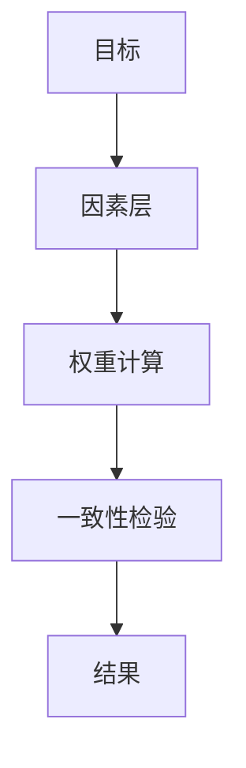
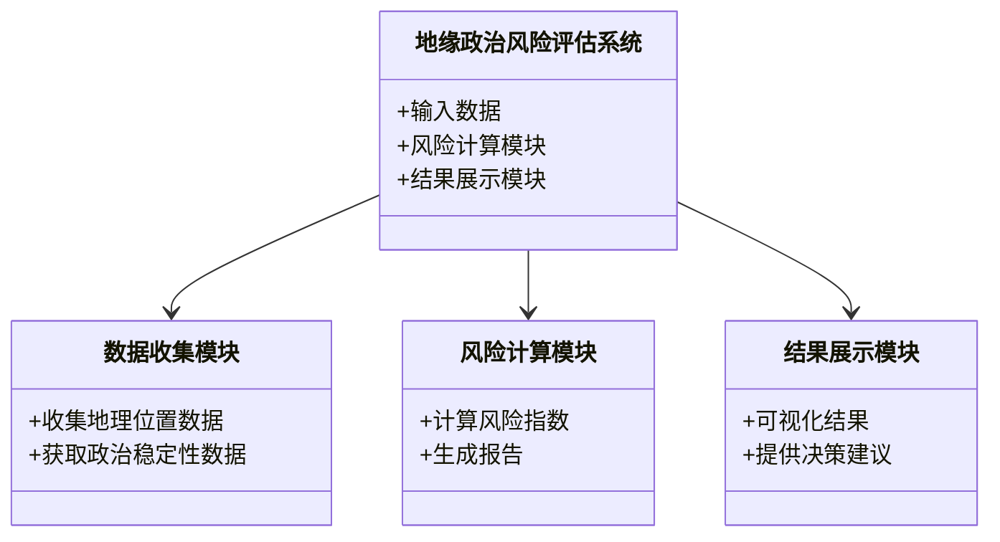

                 


# 地缘政治风险评估：全球投资的关键考量

> **关键词**：地缘政治风险，投资决策，风险评估，全球化，经济模型

> **摘要**：地缘政治风险是全球投资中不可忽视的重要因素。本文从地缘政治风险的基本概念出发，分析其核心构成要素，探讨其对投资决策的影响。通过系统化的评估方法，结合实际案例分析，本文旨在为投资者提供一套科学的评估体系，帮助其在全球化背景下做出更为明智的投资决策。文章还详细介绍了地缘政治风险评估的算法原理、系统架构设计以及项目实战，为读者提供了完整的解决方案。

---

## 第一部分：地缘政治风险评估的背景与核心概念

### 第1章：地缘政治风险评估的基本概念

#### 1.1 地缘政治风险的定义与内涵

地缘政治风险是指由于地理位置、政治体制、国际关系、文化冲突等因素引发的不确定性，可能对投资活动产生负面影响。这种风险不仅涉及国家之间的关系，还包括内部政治动荡、经济政策变化等复杂因素。

#### 1.2 地缘政治风险评估的重要性

在全球化背景下，跨国投资日益频繁，地缘政治风险对投资者的影响也越来越大。本文将从政治稳定性、经济政策、社会因素等方面分析地缘政治风险对投资决策的影响。

---

### 第2章：地缘政治风险评估的理论基础

#### 2.1 地缘政治学的基本理论

地缘政治学研究地理位置对政治和经济活动的影响。本文将从地缘政治学的核心理论框架出发，分析其与风险评估的结合。

#### 2.2 风险评估的基本方法

风险评估通常分为定性和定量两类。地缘政治风险评估需要结合两者的优点，构建一个综合评价模型。

---

## 第二部分：地缘政治风险评估的核心要素

### 第3章：地缘政治风险分析

#### 3.1 政治风险分析

政治稳定性是地缘政治风险评估的重要指标。本文将分析政治稳定性、政府政策连续性以及政治冲突对投资的影响。

#### 3.2 经济风险分析

经济政策的稳定性、经济结构的脆弱性以及经济制裁等因素对投资活动有重要影响。

#### 3.3 社会风险分析

社会动荡、文化冲突以及社会不平等等因素也是地缘政治风险的重要组成部分。

---

## 第三部分：地缘政治风险评估的数学模型与算法

### 第4章：地缘政治风险评估的数学模型

#### 4.1 层次分析法（AHP）

层次分析法是一种常用的多因素决策方法。本文将通过Mermaid流程图展示其应用步骤，并提供Python代码示例。



#### 4.2 风险指数计算公式

地缘政治风险指数可以通过以下公式计算：

$$
R = \sum_{i=1}^{n} w_i \cdot r_i
$$

其中，$w_i$ 是第i个因素的权重，$r_i$ 是风险评分。

---

## 第四部分：系统分析与架构设计

### 第5章：地缘政治风险评估系统

#### 5.1 系统功能设计

地缘政治风险评估系统需要包括数据收集、风险计算、结果展示等功能。

#### 5.2 系统架构设计

以下是系统架构的Mermaid图：



---

## 第五部分：项目实战

### 第6章：地缘政治风险评估的实战分析

#### 6.1 案例分析

以中东某国为例，分析其地缘政治风险。数据收集、模型应用和结果分析的具体步骤如下：

1. **数据收集**：获取该国的政治稳定性、经济政策等数据。
2. **模型应用**：使用层次分析法计算风险指数。
3. **结果分析**：根据风险指数提出投资建议。

#### 6.2 环境安装与代码实现

以下是Python代码示例：

```python
import numpy as np

# 示例数据
factors = ['政治稳定性', '经济政策', '社会因素']
weights = [0.4, 0.3, 0.3]

# 计算风险指数
risk_scores = np.array([0.7, 0.6, 0.5])
risk_index = np.dot(weights, risk_scores)

print(f"地缘政治风险指数为：{risk_index}")
```

---

## 第六部分：总结与展望

### 第7章：总结与最佳实践

地缘政治风险评估是全球投资的重要考量因素。本文通过理论分析、算法设计和实际案例，为投资者提供了一套完整的解决方案。未来的研究可以进一步优化模型，引入更多因素。

### 7.1 最佳实践 tips

- 投资者应定期评估地缘政治风险。
- 结合定量和定性分析，提高评估的准确性。

### 7.2 注意事项

- 数据的准确性和完整性对评估结果影响重大。
- 模型的应用需要结合实际情况进行调整。

---

## 作者信息

作者：AI天才研究院/AI Genius Institute & 禅与计算机程序设计艺术 /Zen And The Art of Computer Programming

---

以上是《地缘政治风险评估：全球投资的关键考量》的完整目录大纲和文章内容。

