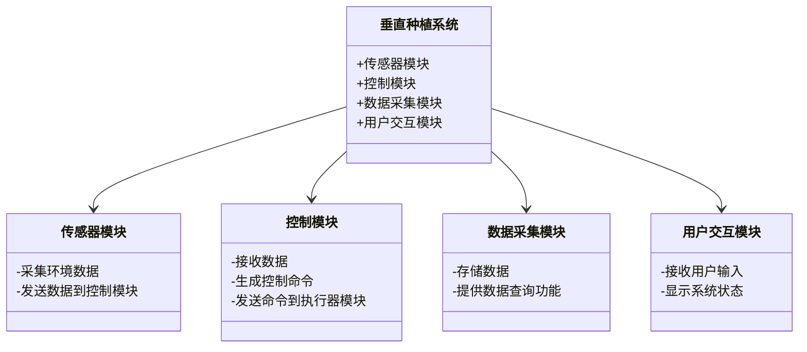

                 

<think>
嗯，我现在需要帮用户写一篇关于《垂直农业技术的发展与投资前景》的技术博客文章，按照用户的要求，结构要清晰，内容要专业，还要包含详细的算法、系统架构等部分。首先，我得先理解垂直农业的基本概念，然后逐步展开，确保每个部分都详细且符合逻辑。

首先，我得确定文章的结构。用户已经给出了一部分目录，包括背景、核心概念、数学模型、系统设计、项目实战、投资分析等。我需要按照这个结构一步步填充内容。

在背景部分，我需要介绍垂直农业的起源和发展，对比传统农业的不足，以及它如何解决这些问题。这部分要吸引读者，让他们了解为什么垂直农业是一个重要的领域。

接下来，核心概念和技术原理部分，我得详细讲解垂直农业的技术基础，比如垂直种植架、环境控制技术等。这部分需要使用表格和Mermaid图来对比不同技术的优缺点，帮助读者更好地理解。

数学模型和算法部分是关键。我得设计一个优化模型，比如最大化产量和资源利用率，然后用Python代码实现。这部分需要清晰的数学表达式和算法流程图，让读者能够理解如何实际应用这些模型。

系统分析与架构设计部分，我需要用Mermaid画出类图、架构图和序列图，展示系统的各个模块及其交互。这部分需要详细的功能模块划分和系统架构设计，确保系统的可扩展性和高效性。

项目实战部分，我需要提供环境搭建、核心代码实现和案例分析。这部分要具体，比如设计一个智能种植系统，用代码实现环境监测和控制，并分析实际案例的效果和优化点。

最后，投资分析与前景展望，我需要分析垂直农业的投资模式、风险和收益，以及未来的技术和市场发展趋势。这部分要给投资者提供有价值的建议，帮助他们做出决策。

在写作过程中，我需要注意语言的简洁和逻辑的清晰，确保每个部分都能深入浅出，既有理论又有实践。同时，要按照用户的要求，使用markdown格式，包含公式、图表和代码示例，让文章看起来专业且内容丰富。

总的来说，我需要一步步地填充每个部分，确保内容详实，结构合理，同时满足用户的所有要求。这将是一篇全面且有深度的技术博客文章，能够为读者和投资者提供有价值的信息。
</think>

# 垂直农业技术的发展与投资前景

---

## 关键词：  
垂直农业, 农业技术, 系统架构, 投资前景, 数学模型, 环境控制, 智能种植  

---

## 摘要：  
垂直农业是一种利用垂直空间进行高效种植的技术，通过智能化的环境控制和数学优化模型，能够在有限空间内实现高产量、低资源消耗的目标。本文从垂直农业的技术背景、核心概念、数学模型、系统架构、投资前景等多方面展开分析，深入探讨其技术原理和投资价值。文章还通过实际案例分析，展示了垂直农业在实际应用中的潜力，并提出了对未来发展的建议。

---

# 第1章: 垂直农业技术的背景与概念  

## 1.1 垂直农业的起源与发展  
### 1.1.1 垂直农业的起源  
垂直农业的概念起源于20世纪60年代，最初是为了应对城市化进程中土地资源不足的问题。通过利用垂直空间进行种植，可以在有限的面积内实现高效的农业生产。  

### 1.1.2 垂直农业的发展历程  
随着技术的进步，垂直农业从最初的简单的垂直种植架发展到如今的智能化控制系统。近年来，人工智能、物联网和大数据技术的引入，使得垂直农业的效率和产量进一步提升。  

### 1.1.3 垂直农业的定义与核心要素  
垂直农业是一种利用垂直空间进行种植的农业模式，核心要素包括垂直种植架、环境控制系统、光照系统和营养输送系统。  

## 1.2 垂直农业技术的背景与现状  
### 1.2.1 当前农业面临的挑战  
传统农业面临土地资源不足、水资源短缺、环境污染等问题，尤其是在城市化进程中，农业资源的紧张更加明显。  

### 1.2.2 垂直农业技术的兴起  
垂直农业技术的兴起是解决传统农业问题的重要途径，它通过高效利用空间和资源，实现了高产量、低能耗的目标。  

### 1.2.3 垂直农业在全球的分布与应用  
目前，垂直农业技术已经在发达国家得到广泛应用，尤其是在城市地区。中国也在积极探索垂直农业技术的应用，尤其是在一线城市如北京、上海等地。  

## 1.3 垂直农业技术的优势与局限  
### 1.3.1 垂直农业的技术优势  
垂直农业可以在有限的空间内实现高产量，同时减少资源消耗和环境污染。  

### 1.3.2 垂直农业的局限性  
垂直农业技术的初期投入较高，且对技术要求较高，需要依赖先进的传感器和控制系统。  

### 1.3.3 垂直农业与传统农业的对比  
通过对比垂直农业和传统农业的资源利用效率、产量、环境影响等方面，可以清晰看出垂直农业的优势和潜力。  

## 1.4 本章小结  
本章从垂直农业的起源、发展、定义以及优势和局限等方面进行了全面分析，为后续的技术探讨奠定了基础。  

---

# 第2章: 垂直农业技术的核心概念与原理  

## 2.1 垂直种植系统的技术基础  
### 2.1.1 垂直种植架的设计原理  
垂直种植架的设计需要考虑植物的生长周期、光照需求和空间利用效率。  

### 2.1.2 光照系统的技术实现  
光照系统是垂直农业的核心技术之一，通过LED灯实现精准的光照控制，确保植物的健康生长。  

### 2.1.3 营养输送系统的优化  
营养输送系统需要根据植物的生长阶段调整营养成分，确保植物的养分需求得到满足。  

## 2.2 环境控制技术的关键要素  
### 2.2.1 温度与湿度的智能控制  
通过传感器和控制系统实现温度和湿度的实时调节，为植物提供最佳的生长环境。  

### 2.2.2 光照强度的调节机制  
根据植物的生长阶段调整光照强度，确保植物的光合作用效率最大化。  

### 2.2.3 二氧化碳浓度的管理  
通过精确控制二氧化碳浓度，提高植物的光合作用效率，从而提高产量。  

## 2.3 垂直农业的核心算法与数学模型  
### 2.3.1 垂直种植空间的优化模型  
通过数学优化模型，最大化利用垂直空间，提高种植效率。  

### 2.3.2 环境参数的动态平衡算法  
通过动态平衡算法，实现温度、湿度、光照和二氧化碳浓度的最优组合。  

### 2.3.3 数学模型与实际应用的结合  
通过数学模型的验证和优化，确保算法在实际应用中的高效性和准确性。  

## 2.4 本章小结  
本章从垂直种植系统的技术基础、环境控制技术的关键要素以及核心算法与数学模型等方面进行了详细分析，为后续的系统设计和项目实现奠定了基础。  

---

# 第3章: 垂直农业技术的数学模型与算法  

## 3.1 垂直种植空间的优化模型  
### 3.1.1 优化目标的定义  
目标是最大化种植面积的利用率和产量，同时最小化资源消耗。  

### 3.1.2 约束条件的建立  
包括光照、温度、湿度、二氧化碳浓度等环境参数的限制。  

### 3.1.3 数学模型的构建与求解  
通过线性规划模型，建立目标函数和约束条件，求解最优解。  

## 3.2 环境参数的动态平衡算法  
### 3.2.1 算法原理与流程  
通过实时监测环境参数，动态调整光照、温度、湿度和二氧化碳浓度，实现环境参数的动态平衡。  

### 3.2.2 算法实现的步骤  
包括数据采集、参数分析、控制策略生成和执行反馈等步骤。  

### 3.2.3 算法的优化与改进  
通过引入机器学习算法，提高环境参数的预测和控制精度。  

## 3.3 数学模型与实际应用的结合  
### 3.3.1 模型在垂直种植中的应用  
通过数学模型优化种植空间的布局和资源分配。  

### 3.3.2 算法在环境控制中的应用  
通过动态平衡算法实现环境参数的实时优化控制。  

### 3.3.3 算法的验证与评估  
通过实验数据验证算法的有效性，并进行性能评估和优化。  

## 3.4 本章小结  
本章通过数学模型和算法的分析，展示了垂直农业技术在种植空间优化和环境控制中的重要性。  

---

# 第4章: 垂直农业技术的系统分析与架构设计  

## 4.1 系统功能设计  
### 4.1.1 系统功能模块划分  
包括种植系统、环境控制系统、数据采集系统和用户交互系统等模块。  

### 4.1.2 功能模块的交互设计  
通过模块之间的交互，实现系统的高效运行和优化控制。  

### 4.1.3 功能模块的实现方式  
通过软件和硬件的结合，实现功能模块的高效协同。  

## 4.2 系统架构设计  
### 4.2.1 系统架构的总体设计  
采用分层架构，包括数据采集层、控制层和用户交互层。  

### 4.2.2 各模块之间的关系  
通过模块之间的数据流和控制流，实现系统的整体协调。  

### 4.2.3 系统架构的优化与调整  
通过引入分布式架构和边缘计算技术，提高系统的扩展性和响应速度。  

## 4.3 系统接口设计  
### 4.3.1 系统接口的定义  
包括传感器接口、执行器接口和用户接口等。  

### 4.3.2 接口之间的交互设计  
通过接口协议实现模块之间的数据传递和控制命令的执行。  

### 4.3.3 接口实现的技术选型  
选择合适的通信协议和技术栈，确保接口的高效性和可靠性。  

## 4.4 系统交互设计  
### 4.4.1 系统交互流程的设计  
包括用户输入、数据采集、控制命令生成和执行反馈等流程。  

### 4.4.2 交互设计的优化  
通过用户友好的界面设计和流程优化，提高系统的易用性和效率。  

## 4.5 系统架构的Mermaid图  


## 4.6 本章小结  
本章通过系统分析和架构设计，展示了垂直农业技术在实际应用中的系统结构和实现方式。  

---

# 第5章: 垂直农业技术的项目实战  

## 5.1 环境搭建与技术选型  
### 5.1.1 环境搭建步骤  
包括硬件设备的安装、传感器的配置、控制系统的开发等。  

### 5.1.2 技术选型与工具链  
选择合适的开发框架、编程语言和工具链，确保项目的高效开发和运行。  

## 5.2 系统核心实现  
### 5.2.1 核心代码实现  
通过Python代码实现环境参数的采集、分析和控制。  

```python
# 环境参数采集代码
import sensor

temperature = sensor.get_temperature()
humidity = sensor.get_humidity()
light = sensor.get_light()
co2 = sensor.get_co2()

# 环境参数控制代码
def control_system(temperature, humidity, light, co2):
    if temperature > 25:
        fan_on()
    if humidity < 60:
        mist_on()
    if light < 500:
        led_on()
    if co2 > 1500:
        fan_on()

control_system(temperature, humidity, light, co2)
```

### 5.2.2 代码应用解读与分析  
通过代码实现环境参数的实时采集和动态控制，确保植物的健康生长。  

## 5.3 实际案例分析  
### 5.3.1 案例背景介绍  
介绍一个垂直农业项目的实际应用场景，如某城市屋顶种植项目。  

### 5.3.2 系统运行效果与优化  
通过实验数据展示系统的运行效果，并提出优化建议。  

### 5.3.3 项目经验总结  
总结项目实施中的经验教训，为后续项目提供参考。  

## 5.4 本章小结  
本章通过项目实战，展示了垂直农业技术在实际应用中的实现过程和效果，为后续的推广和优化提供了宝贵的经验。  

---

# 第6章: 垂直农业技术的投资分析与前景展望  

## 6.1 投资模式与风险分析  
### 6.1.1 垂直农业的投资模式  
包括政府投资、企业投资和私人投资等模式。  

### 6.1.2 投资风险与挑战  
包括技术风险、市场风险和运营风险等。  

## 6.2 投资收益与市场前景  
### 6.2.1 垂直农业的经济效益  
通过高效利用资源和提高产量，实现经济效益的最大化。  

### 6.2.2 市场需求与发展趋势  
随着城市化进程的加快，垂直农业市场需求将持续增长。  

## 6.3 投资建议与未来展望  
### 6.3.1 投资建议  
建议投资者关注技术创新、市场定位和运营效率。  

### 6.3.2 未来技术与市场发展趋势  
随着人工智能和物联网技术的进一步发展，垂直农业技术将更加智能化和高效化。  

## 6.4 本章小结  
本章从投资角度分析了垂直农业技术的潜力和挑战，为投资者提供了有价值的参考。  

---

# 第7章: 总结与展望  

## 7.1 全文总结  
通过对垂直农业技术的背景、核心概念、数学模型、系统架构和投资前景的全面分析，展示了其在农业领域的巨大潜力。  

## 7.2 未来展望  
随着技术的不断进步，垂直农业技术将更加智能化和高效化，未来有望成为农业发展的主流模式之一。  

---

# 作者：  
AI天才研究院/AI Genius Institute & 禅与计算机程序设计艺术/Zen And The Art of Computer Programming

