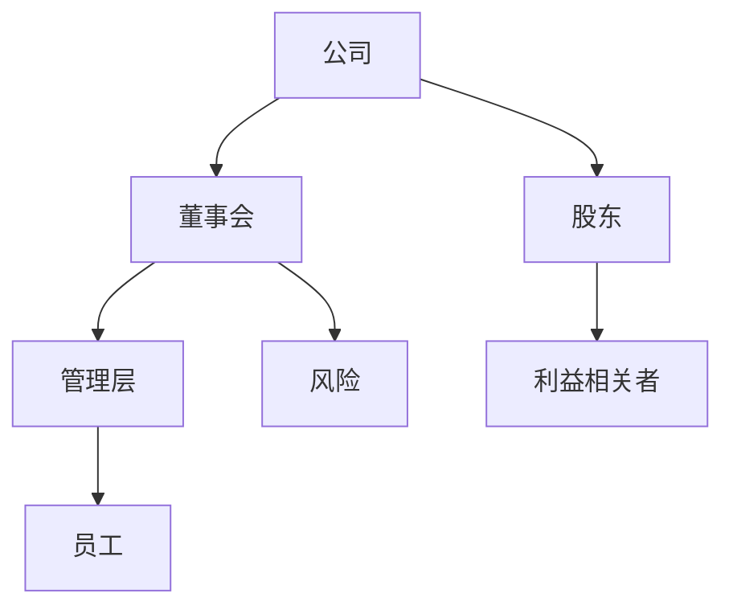
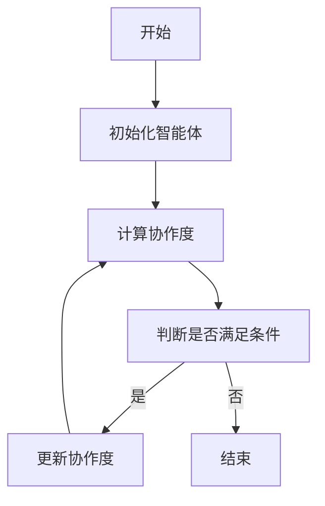
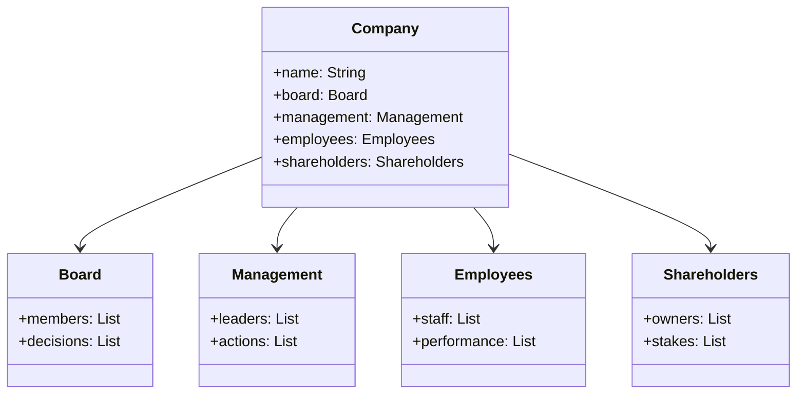

                 


# 基于多智能体的自动化公司治理风险评估

> 关键词：多智能体系统, 公司治理, 风险评估, 协作算法, 系统架构设计

> 摘要：随着公司治理复杂性的增加，传统的风险评估方法逐渐暴露出效率低下、准确性不足的问题。基于多智能体的自动化公司治理风险评估系统，通过多个智能体的协同工作，能够高效、准确地识别和评估公司治理中的潜在风险。本文从多智能体系统的原理出发，结合公司治理的实际情况，详细阐述了基于多智能体的公司治理风险评估的核心概念、算法原理、系统架构设计以及实际应用案例。

---

# 第1章: 多智能体系统与公司治理概述

## 1.1 多智能体系统的基本概念

### 1.1.1 多智能体系统的定义

多智能体系统（Multi-Agent System, 简称MAS）是由多个智能体（Agent）组成的分布式系统，这些智能体通过协作完成复杂的任务。每个智能体都有自己的目标、知识和行为规则，能够感知环境并采取行动。

### 1.1.2 多智能体系统的特征

多智能体系统具有分布式性、协作性、反应性和适应性等特征。分布式性指的是系统中的智能体分布在网络中，协作性是指多个智能体协同完成任务，反应性是指智能体能够实时感知环境并做出反应，适应性是指系统能够根据环境变化自适应调整。

### 1.1.3 多智能体系统与传统单智能体系统的区别

传统单智能体系统依赖于中心化的控制，而多智能体系统则是去中心化的，通过智能体之间的协作完成任务。多智能体系统能够更好地应对复杂问题，具有更强的扩展性和灵活性。

## 1.2 公司治理风险评估的基本概念

### 1.2.1 公司治理的定义

公司治理是指通过董事会和管理层对公司进行有效管理和监督，确保公司战略目标的实现和股东利益的最大化。

### 1.2.2 风险评估的定义

风险评估是指识别、分析和量化可能影响公司目标实现的各种风险，并制定相应的应对策略。

### 1.2.3 公司治理风险评估的必要性

公司治理风险评估是确保公司稳健运营的重要手段，能够帮助公司及时发现潜在风险，制定有效的风险管理策略。

## 1.3 多智能体系统在公司治理中的应用前景

### 1.3.1 多智能体系统在公司治理中的潜在应用领域

多智能体系统可以应用于公司治理的多个方面，例如董事会决策、风险管理、内部审计、合规性检查等。

### 1.3.2 多智能体系统在公司治理中的优势

多智能体系统能够提高公司治理的效率和准确性，通过智能体的协作实现风险的快速识别和评估。

### 1.3.3 多智能体系统在公司治理中的挑战与机遇

多智能体系统在公司治理中的应用面临通信延迟、数据隐私等问题，同时也带来了更高的自动化和智能化的可能性。

## 1.4 本章小结

本章介绍了多智能体系统的基本概念和公司治理风险评估的必要性，阐述了多智能体系统在公司治理中的应用前景。

---

# 第2章: 多智能体系统的核心概念与联系

## 2.1 多智能体系统的实体关系分析

### 2.1.1 实体关系图（ER图）

以下是一个公司治理中的实体关系图：



## 2.2 多智能体系统的协作机制

### 2.2.1 协作机制的定义

协作机制是指多个智能体之间通过某种方式协同工作，共同完成任务的方式。

### 2.2.2 协作机制的类型

协作机制可以分为基于规则的协作、基于目标的协作和基于市场的协作。

## 2.3 多智能体系统的通信协议

### 2.3.1 通信协议的定义

通信协议是指智能体之间进行信息交换时遵循的规则和格式。

### 2.3.2 常见的通信协议类型

常见的通信协议包括基于消息队列的通信和基于事件驱动的通信。

## 2.4 本章小结

本章详细介绍了多智能体系统的核心概念和协作机制，分析了多智能体系统中的实体关系。

---

# 第3章: 多智能体系统的核心原理与算法

## 3.1 多智能体系统的算法原理

### 3.1.1 分布式计算的基本原理

分布式计算是指在多个计算节点上协同完成任务的计算方式，其核心是任务的分解和节点间的协作。

### 3.1.2 多智能体系统中的协同算法

协同算法是多智能体系统中智能体协作完成任务的核心算法，常见的协同算法包括分布式一致性算法、分布式共识算法等。

## 3.2 多智能体系统中的数学模型

### 3.2.1 协作算法的数学表达式

以下是一个协作算法的数学表达式：

$$
\text{协作度} = \sum_{i=1}^{n} \frac{1}{d_i}
$$

其中，\(d_i\) 表示第 \(i\) 个智能体的距离。

### 3.2.2 协作算法的流程图

以下是一个协作算法的流程图：



## 3.3 多智能体系统中的通信协议实现

### 3.3.1 通信协议的设计原则

通信协议的设计原则包括可靠性、高效性、安全性和可扩展性。

### 3.3.2 通信协议的实现步骤

通信协议的实现步骤包括协议的设计、协议的实现和协议的测试。

## 3.4 本章小结

本章详细讲解了多智能体系统的核心原理与算法，分析了协作算法的数学模型和流程图。

---

# 第4章: 基于多智能体的公司治理风险评估系统架构设计

## 4.1 系统功能模块设计

### 4.1.1 系统功能模块

公司治理风险评估系统主要包括以下几个功能模块：数据采集模块、风险识别模块、风险评估模块和风险报告模块。

### 4.1.2 数据采集模块

数据采集模块负责从多个来源采集公司治理相关的数据，包括董事会决策、管理层行为、员工绩效等。

### 4.1.3 风险识别模块

风险识别模块通过分析采集到的数据，识别潜在的风险点。

### 4.1.4 风险评估模块

风险评估模块根据识别到的风险点，评估每个风险的影响程度和发生概率。

### 4.1.5 风险报告模块

风险报告模块生成风险评估报告，提供给公司管理层和董事会参考。

## 4.2 系统功能模块的类图

以下是一个公司治理风险评估系统的类图：



## 4.3 系统架构设计

### 4.3.1 系统架构的总体设计

公司治理风险评估系统的总体架构包括数据层、业务逻辑层和表示层。

### 4.3.2 数据层设计

数据层主要负责存储和管理公司治理相关的数据，包括董事会决策、管理层行为、员工绩效等。

### 4.3.3 业务逻辑层设计

业务逻辑层主要负责风险识别、风险评估和风险报告的生成。

### 4.3.4 表示层设计

表示层主要负责与用户的交互，展示风险评估的结果和生成风险报告。

## 4.4 本章小结

本章详细设计了基于多智能体的公司治理风险评估系统的架构，包括功能模块设计、类图设计和系统架构设计。

---

# 第5章: 基于多智能体的公司治理风险评估系统实现

## 5.1 系统环境搭建

### 5.1.1 系统环境要求

公司治理风险评估系统需要运行在支持多智能体系统的环境中，包括硬件和软件的要求。

### 5.1.2 系统依赖库安装

需要安装多智能体系统的相关依赖库，如分布式计算框架、通信协议库等。

## 5.2 系统核心功能实现

### 5.2.1 数据采集模块的实现

数据采集模块可以通过API接口从多个数据源采集公司治理相关数据。

### 5.2.2 风险识别模块的实现

风险识别模块可以通过机器学习算法对数据进行分析，识别潜在的风险点。

### 5.2.3 风险评估模块的实现

风险评估模块可以通过概率论和统计学方法对识别到的风险进行评估，确定每个风险的影响程度和发生概率。

### 5.2.4 风险报告模块的实现

风险报告模块可以根据评估结果生成风险报告，展示风险的详细信息和应对策略。

## 5.3 系统实现的代码示例

### 5.3.1 数据采集模块的代码示例

```python
import requests

def collect_data(url):
    try:
        response = requests.get(url)
        return response.json()
    except Exception as e:
        print(f"数据采集失败：{e}")
        return None
```

### 5.3.2 风险识别模块的代码示例

```python
from sklearn import svm

def detect_risk(data):
    model = svm.SVC()
    model.fit(data['training_set'], data['labels'])
    return model.predict(data['test_set'])
```

## 5.4 本章小结

本章详细讲解了基于多智能体的公司治理风险评估系统的实现过程，包括环境搭建、功能实现和代码示例。

---

# 第6章: 基于多智能体的公司治理风险评估系统应用案例

## 6.1 应用背景

### 6.1.1 案例背景介绍

某公司是一家跨国企业，面临复杂的公司治理风险，包括董事会决策风险、管理层行为风险、员工绩效风险等。

### 6.1.2 案例目标

通过基于多智能体的公司治理风险评估系统，帮助该公司识别和评估潜在的公司治理风险，制定有效的风险管理策略。

## 6.2 应用案例分析

### 6.2.1 数据采集与处理

从公司内部系统中采集董事会决策、管理层行为、员工绩效等数据，进行清洗和预处理。

### 6.2.2 风险识别与评估

利用多智能体系统中的协作算法，识别潜在风险点，并评估每个风险的影响程度和发生概率。

### 6.2.3 风险报告生成

根据评估结果生成风险报告，展示风险的详细信息和应对策略，供公司管理层和董事会参考。

## 6.3 应用案例的总结

通过基于多智能体的公司治理风险评估系统，该公司成功识别和评估了多个潜在的公司治理风险，制定了有效的风险管理策略，提升了公司治理的效率和准确性。

## 6.4 本章小结

本章通过一个实际案例，详细讲解了基于多智能体的公司治理风险评估系统的应用过程，展示了系统的实际价值和应用前景。

---

# 第7章: 总结与展望

## 7.1 总结

本文详细介绍了基于多智能体的公司治理风险评估系统的原理、架构和实现过程，展示了系统的实际应用价值。

## 7.2 展望

未来，随着多智能体技术的不断发展，公司治理风险评估系统将更加智能化和自动化。同时，多智能体系统在公司治理中的应用也将更加广泛，涵盖更多的领域和场景。

## 7.3 本章小结

本章总结了全文的主要内容，并展望了未来的发展方向。

---

# 作者

作者：AI天才研究院/AI Genius Institute & 禅与计算机程序设计艺术 /Zen And The Art of Computer Programming

